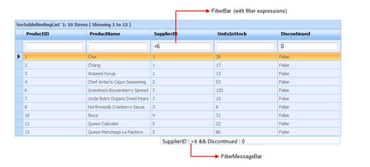

::: {style="DISPLAY: none"}
{#d2h_url_template}{#d2h_package_url style="WIDTH: 0px; DISPLAY: none; HEIGHT: 0px"}
:::

::::: {#nsbanner .d2h_main_nsbanner style="BORDER-BOTTOM: #999999 1px solid; POSITION: relative; PADDING-BOTTOM: 0px; BACKGROUND-COLOR: transparent; PADDING-LEFT: 0px; PADDING-RIGHT: 0px; DISPLAY: none; BORDER-TOP: #999999 1px solid; PADDING-TOP: 0px; LEFT: 0px"}
:::: {#TitleRow .d2h_main_titlerow style="PADDING-BOTTOM: 4px; BACKGROUND-COLOR: transparent; PADDING-LEFT: 22px; WIDTH: 100%; PADDING-RIGHT: 10px; DISPLAY: none; PADDING-TOP: 4px"}
::: {#ienav .d2h_main_ienav style="DISPLAY: none"}
{#D2HPrevious .D2HPreviousEnabled}  {#D2HNext .D2HNextEnabled}
:::
::::
:::::

:::: {#nstext .d2h_main_nstext style="PADDING-BOTTOM: 10px; BACKGROUND-COLOR: transparent; PADDING-LEFT: 22px; PADDING-RIGHT: 10px; HEIGHT: 100%; OVERFLOW: auto; PADDING-TOP: 5px" hasuserbackground="true" valign="bottom"}
::: {#d2h_breadcrumbs .d2h_breadcrumbs}
[Essential Studio User Guide Documentation](ms-xhelp:///?Id=12457748-09e3-4d74-a240-8e049cedf030){.d2h_breadcrumbsNormal}[ \> ]{.d2h_breadcrumbsLinkSeparator}[User Interface Edition](ms-xhelp:///?Id=c29296b7-531c-413b-a0ec-488ca1f7f669){.d2h_breadcrumbsNormal}[ \> ]{.d2h_breadcrumbsLinkSeparator}[Essential ASP.NET](ms-xhelp:///?Id=25c35330-c127-4dad-9a92-ed79dc7261a6){.d2h_breadcrumbsNormal}[ \> ]{.d2h_breadcrumbsLinkSeparator}[Essential Grid]{.d2h_breadcrumbsContentsOnly}[ \> ]{.d2h_breadcrumbsLinkSeparator}[Concepts and Features](ms-xhelp:///?Id=9e489974-524d-457c-9881-e458b1321685){.d2h_breadcrumbsNormal}[ \> ]{.d2h_breadcrumbsLinkSeparator}[Filtering](ms-xhelp:///?Id=4a29652f-c3a9-44a3-8f0f-b5e6051008e2){.d2h_breadcrumbsNormal}
:::

### The []{#p71}Expression Filter in ASP.NET {#the-expression-filter-in-asp.net style="tab-stops: 0pt"}

Expression filter feature allows grid to filter the records with different expressions depending upon the Column type.

This allows you to filter the values you want, with ease by manually entering data, using filter tokens unlike the combo and text filters.

The following figure gives you a basic idea of the appearance of the Filter Bar in ASP.NET Grid:

{border="0"}

Figure 84: Grid with FilterBar and Filter Status Message bar

 

The User can filter data quickly by entering the filter expressions manually in the Filter Bar.

This feature is very user-friendly especially for advanced users, as the below filter options will be available with this feature:

[·      ]{style="FONT-FAMILY: Symbol"}\"\<\", \"\>\", \"\>=\", \"\>=\", \"=\" for integer, double, decimal, date-time data columns.

[·      ]{style="FONT-FAMILY: Symbol"}\"\*value\"(Contains value), \"%value\"(Endswith value),\"value%\"(Beginswith value) for string data columns.

[·      ]{style="FONT-FAMILY: Symbol"}\"1\"(true), \"0\"(false) for Boolean data columns.

[·      ]{style="FONT-FAMILY: Symbol"}\"Expression1 and Expression2\", \"Expression1 or Expression2\" for all data columns.

 

More:

[ ]{#related-topics}

[{border="0" align="absMiddle"}Properties](ms-xhelp:///?Id=11a72dde-8d70-478d-8c0b-ef6e58cbb3c5){style="TEXT-DECORATION: none"}

[{border="0" align="absMiddle"}Filter Tokens](ms-xhelp:///?Id=c74a2615-4d4f-4d5f-8bd3-0425d58bd4bf){style="TEXT-DECORATION: none"}

[{border="0" align="absMiddle"}Adding FilterBar to a ASP.NET Grid](ms-xhelp:///?Id=8207d998-3ec7-4db1-a661-2638dc44ffbc){style="TEXT-DECORATION: none"}

[{border="0" align="absMiddle"}How to filter data using the filter expressions?](ms-xhelp:///?Id=922527c8-0ef3-40f9-8af9-db428ce5a34d){style="TEXT-DECORATION: none"}

[{border="0" align="absMiddle"}Where do I find Installed samples?](ms-xhelp:///?Id=749f28e7-f4ce-43f5-a3f7-7aabcc2cd3ff){style="TEXT-DECORATION: none"}
::::
