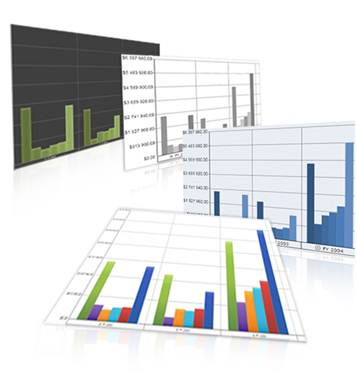
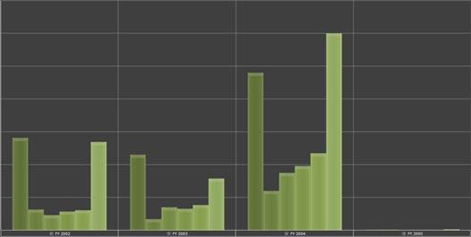

::: {style="DISPLAY: none"}
{#d2h_url_template}{#d2h_package_url style="WIDTH: 0px; DISPLAY: none; HEIGHT: 0px"}
:::

::::: {#nsbanner .d2h_main_nsbanner style="BORDER-BOTTOM: #999999 1px solid; POSITION: relative; PADDING-BOTTOM: 0px; BACKGROUND-COLOR: transparent; PADDING-LEFT: 0px; PADDING-RIGHT: 0px; DISPLAY: none; BORDER-TOP: #999999 1px solid; PADDING-TOP: 0px; LEFT: 0px"}
:::: {#TitleRow .d2h_main_titlerow style="PADDING-BOTTOM: 4px; BACKGROUND-COLOR: transparent; PADDING-LEFT: 22px; WIDTH: 100%; PADDING-RIGHT: 10px; DISPLAY: none; PADDING-TOP: 4px"}
::: {#ienav .d2h_main_ienav style="DISPLAY: none"}
{#D2HPrevious .D2HPreviousEnabled}  {#D2HNext .D2HNextEnabled}
:::
::::
:::::

::::: {#nstext .d2h_main_nstext style="PADDING-BOTTOM: 10px; BACKGROUND-COLOR: transparent; PADDING-LEFT: 22px; PADDING-RIGHT: 10px; HEIGHT: 100%; OVERFLOW: auto; PADDING-TOP: 5px" hasuserbackground="true" valign="bottom"}
::: {#d2h_breadcrumbs .d2h_breadcrumbs}
[Essential Studio User Guide Documentation](ms-xhelp:///?Id=12457748-09e3-4d74-a240-8e049cedf030){.d2h_breadcrumbsNormal}[ \> ]{.d2h_breadcrumbsLinkSeparator}[Business Intelligence Edition](ms-xhelp:///?Id=fdf33dd8-62b2-47b9-ad7b-fc50e590bca5){.d2h_breadcrumbsNormal}[ \> ]{.d2h_breadcrumbsLinkSeparator}[Essential BI Silverlight](ms-xhelp:///?Id=c006b39c-6aa2-4637-b7de-3e7b6cb3f9f9){.d2h_breadcrumbsNormal}[ \> ]{.d2h_breadcrumbsLinkSeparator}[Essential BI Chart]{.d2h_breadcrumbsContentsOnly}[ \> ]{.d2h_breadcrumbsLinkSeparator}[Concepts and Features](ms-xhelp:///?Id=372b5b83-fed0-46d4-831c-b84fe8c18abb){.d2h_breadcrumbsNormal}
:::

## Themes {#themes style="tab-stops: 0pt"}

Essential BI OLAP Chart for Silverlight supports a set of predefined themes, which can be applied to customize the Chart control.

Use Case Scenarios

Users can customize the look and feel of Charts by using themes. A theme can be selected from the 54 available themes and the users can define their customized styles.

::: {style="BORDER-BOTTOM: windowtext 1pt solid; BORDER-LEFT: medium none; PADDING-BOTTOM: 1pt; MARGIN-TOP: 9pt; PADDING-LEFT: 0pt; PADDING-RIGHT: 0pt; MARGIN-BOTTOM: 9pt; BORDER-TOP: windowtext 1pt solid; BORDER-RIGHT: medium none; PADDING-TOP: 1pt"}
 

{border="0"}Note:

If a default style is overridden by any customized style, the overridden style of the element will remain the same even if the theme is changed.
:::

{border="0"}

 

Figure 40: Sample Themes

Specifying a Theme for an OlapChart in an Application

 

OlapChart for Silverlight supports 54 default themes. The users can select a particular theme by using the ChartVisualStyle property.

 Applying a Theme

 

To apply a theme to an OlapChart:

1.   Create an instance of **OlapChart**.

2.   Set the **ChartVisualStyle** property, as shown in the following code snippets.

[]{style="FONT-FAMILY: 'Arial','sans-serif'"} 

+----------------------------------------------------------------------------------------------------------------------------------------------------------------------------------------------------------------------------------------------------------------------------------------------------------------------------------------------------------------------------------------------------------------+
| **[\[XAML\]]{style="FONT-FAMILY: 'Courier New'"}**                                                                                                                                                                                                                                                                                                                                                             |
|                                                                                                                                                                                                                                                                                                                                                                                                                |
| **[]{style="FONT-FAMILY: 'Courier New'"}**                                                                                                                                                                                                                                                                                                                                                                     |
|                                                                                                                                                                                                                                                                                                                                                                                                                |
| [\<]{style="FONT-FAMILY: 'Courier New'; COLOR: blue"}[sfchart]{style="FONT-FAMILY: 'Courier New'; COLOR: #a31515"}[:]{style="FONT-FAMILY: 'Courier New'; COLOR: blue"}[OlapChart]{style="FONT-FAMILY: 'Courier New'; COLOR: #a31515"}[ ChartVisualStyle]{style="FONT-FAMILY: 'Courier New'; COLOR: red"}[=\"GreenBlend\"/\>]{style="FONT-FAMILY: 'Courier New'; COLOR: blue"}[]{style="FONT-FAMILY: Consolas"} |
|                                                                                                                                                                                                                                                                                                                                                                                                                |
|                                                                                                                                                                                                                                                                                                                                                                                                                |
+----------------------------------------------------------------------------------------------------------------------------------------------------------------------------------------------------------------------------------------------------------------------------------------------------------------------------------------------------------------------------------------------------------------+

[]{style="FONT-FAMILY: 'Arial','sans-serif'"} 

+--------------------------------------------------------------------------------------------------------------------------------------------------------------------------------------+
| **[\[C#\]]{style="FONT-FAMILY: 'Courier New'"}**                                                                                                                                     |
|                                                                                                                                                                                      |
| **[]{style="FONT-FAMILY: 'Courier New'"}**                                                                                                                                           |
|                                                                                                                                                                                      |
| [OlapChart]{style="FONT-FAMILY: 'Courier New'; COLOR: #2b91af"}[ olapChart1 = [new]{style="COLOR: blue"} [OlapChart]{style="COLOR: #2b91af"}();]{style="FONT-FAMILY: 'Courier New'"} |
|                                                                                                                                                                                      |
| [this]{style="FONT-FAMILY: 'Courier New'; COLOR: blue"}[.olapChart1.ChartVisualStyle = [ChartStyles]{style="COLOR: #2b91af"}.GreenBlend;]{style="FONT-FAMILY: 'Courier New'"}        |
|                                                                                                                                                                                      |
|                                                                                                                                                                                      |
+--------------------------------------------------------------------------------------------------------------------------------------------------------------------------------------+

[]{style="FONT-FAMILY: 'Arial','sans-serif'"} 

+------------------------------------------------------------------------------------------------------------------------------------------------------------------------------------------------------------------------------------------------------------------------------------------------------------------------------------------------------------------------------+
| **[\[VB\]]{style="FONT-FAMILY: 'Courier New'"}**                                                                                                                                                                                                                                                                                                                             |
|                                                                                                                                                                                                                                                                                                                                                                              |
| **[]{style="FONT-FAMILY: 'Courier New'"}**                                                                                                                                                                                                                                                                                                                                   |
|                                                                                                                                                                                                                                                                                                                                                                              |
| [Dim]{style="FONT-FAMILY: 'Courier New'; COLOR: blue"}[ olapChart1 [As]{style="COLOR: blue"} ]{style="FONT-FAMILY: 'Courier New'"}[OlapChart]{style="FONT-FAMILY: 'Courier New'; COLOR: #2b91af"}[ = [New]{style="COLOR: blue"} ]{style="FONT-FAMILY: 'Courier New'"}[OlapChart]{style="FONT-FAMILY: 'Courier New'; COLOR: #2b91af"}[()]{style="FONT-FAMILY: 'Courier New'"} |
|                                                                                                                                                                                                                                                                                                                                                                              |
| [Me]{style="FONT-FAMILY: 'Courier New'; COLOR: blue"}[.olapChart1.ChartVisualStyle = ]{style="FONT-FAMILY: 'Courier New'"}[ChartStyles]{style="FONT-FAMILY: 'Courier New'; COLOR: #2b91af"}[.GreenBlend]{style="FONT-FAMILY: 'Courier New'"}                                                                                                                                 |
|                                                                                                                                                                                                                                                                                                                                                                              |
|                                                                                                                                                                                                                                                                                                                                                                              |
+------------------------------------------------------------------------------------------------------------------------------------------------------------------------------------------------------------------------------------------------------------------------------------------------------------------------------------------------------------------------------+

[]{style="FONT-FAMILY: 'Arial','sans-serif'"} 

3.   Create an **OlapReport**, as shown in the following code snippets.

[]{style="FONT-FAMILY: 'Trebuchet MS','sans-serif'; COLOR: #15428b; FONT-SIZE: 9pt"} 

+-------------------------------------------------------------------------------------------------------------------------------------------------------------------------------+
| **[\[C#\]]{style="FONT-FAMILY: 'Courier New'"}**                                                                                                                              |
|                                                                                                                                                                               |
| **[]{style="FONT-FAMILY: 'Courier New'"}**                                                                                                                                    |
|                                                                                                                                                                               |
| [private]{style="FONT-FAMILY: 'Courier New'; COLOR: blue"}[ [OlapReport]{style="COLOR: #2b91af"} SimpleDimensions()]{style="FONT-FAMILY: 'Courier New'"}                      |
|                                                                                                                                                                               |
| [{\                                                                                                                                                                           |
|       [OlapReport]{style="COLOR: #2b91af"} olapReport = [new]{style="COLOR: blue"} [OlapReport]{style="COLOR: #2b91af"}();\                                                   |
|       olapReport.CurrentCubeName = [\"Adventure Works\"]{style="COLOR: #a31515"};\                                                                                            |
|  \                                                                                                                                                                            |
|       [DimensionElement]{style="COLOR: #2b91af"} dimensionElementColumn = [new]{style="COLOR: blue"} [DimensionElement]{style="COLOR: #2b91af"}();\                           |
|            \                                                                                                                                                                  |
|       [//// Specifying the Name of the Dimension.]{style="COLOR: green"}\                                                                                                     |
|       dimensionElementColumn.Name = [\"Customer\"]{style="COLOR: #a31515"};\                                                                                                  |
|  \                                                                                                                                                                            |
|       dimensionElementColumn.HierarchyName = [\"Customer Geography\"]{style="COLOR: #a31515"};\                                                                               |
|  \                                                                                                                                                                            |
|       dimensionElementColumn.AddLevel([\"Customer Geography\"]{style="COLOR: #a31515"}, [\"Country\"]{style="COLOR: #a31515"});\                                              |
|  \                                                                                                                                                                            |
|  \                                                                                                                                                                            |
|       [MeasureElements]{style="COLOR: #2b91af"} measureElementColumn = [new]{style="COLOR: blue"} [MeasureElements]{style="COLOR: #2b91af"}();\                               |
|       measureElementColumn.Elements.Add([new]{style="COLOR: blue"} [MeasureElement]{style="COLOR: #2b91af"} { Name = [\"Internet Sales Amount\"]{style="COLOR: #a31515"} });\ |
|  \                                                                                                                                                                            |
|       [DimensionElement]{style="COLOR: #2b91af"} dimensionElementRow = [new]{style="COLOR: blue"} [DimensionElement]{style="COLOR: #2b91af"}();\                              |
|       [//// Specifying the Name of the Dimension.]{style="COLOR: green"}\                                                                                                     |
|       dimensionElementRow.Name = [\"Date\"]{style="COLOR: #a31515"};\                                                                                                         |
|       dimensionElementRow.AddLevel([\"Fiscal\"]{style="COLOR: #a31515"}, [\"Fiscal Year\"]{style="COLOR: #a31515"});\                                                         |
|  \                                                                                                                                                                            |
|       [//// Adding the MeasureElement.]{style="COLOR: green"}\                                                                                                                |
|       olapReport.CategoricalElements.Add([new]{style="COLOR: blue"} [Item]{style="COLOR: #2b91af"} { ElementValue = measureElementColumn });\                                 |
|  \                                                                                                                                                                            |
|       [//// Adding the ColumnMembers.]{style="COLOR: green"}\                                                                                                                 |
|       olapReport.CategoricalElements.Add([new]{style="COLOR: blue"} [Item]{style="COLOR: #2b91af"} { ElementValue = dimensionElementColumn });\                               |
|             \                                                                                                                                                                 |
|       [//// Adding the RowMembers.]{style="COLOR: green"}\                                                                                                                    |
|       olapReport.SeriesElements.Add([new]{style="COLOR: blue"} [Item]{style="COLOR: #2b91af"} { ElementValue = dimensionElementRow });\                                       |
|  \                                                                                                                                                                            |
|       [return]{style="COLOR: blue"} olapReport;\                                                                                                                              |
| }]{style="FONT-FAMILY: 'Courier New'"}                                                                                                                                        |
|                                                                                                                                                                               |
|                                                                                                                                                                               |
+-------------------------------------------------------------------------------------------------------------------------------------------------------------------------------+

[]{style="FONT-FAMILY: 'Arial','sans-serif'"} 

+----------------------------------------------------------------------------------------------------------------------------------------------------------------------------------------------------------------------------------------------------------------------------------------------------------------------------------------------------------------------------------+
| **[\[VB\]]{style="FONT-FAMILY: 'Courier New'"}**                                                                                                                                                                                                                                                                                                                                 |
|                                                                                                                                                                                                                                                                                                                                                                                  |
| []{style="FONT-FAMILY: 'Courier New'; COLOR: blue"}                                                                                                                                                                                                                                                                                                                              |
|                                                                                                                                                                                                                                                                                                                                                                                  |
| [Private]{style="FONT-FAMILY: 'Courier New'; COLOR: blue"}[ [Function]{style="COLOR: blue"} SimpleDimensions() [As]{style="COLOR: blue"} ]{style="FONT-FAMILY: 'Courier New'"}[OlapReport]{style="FONT-FAMILY: 'Courier New'; COLOR: #2b91af"}[]{style="FONT-FAMILY: 'Courier New'"}                                                                                             |
|                                                                                                                                                                                                                                                                                                                                                                                  |
| [      [Dim]{style="COLOR: blue"} olapReport [As]{style="COLOR: blue"} OlapReport = [New]{style="COLOR: blue"} ]{style="FONT-FAMILY: 'Courier New'"}[OlapReport]{style="FONT-FAMILY: 'Courier New'; COLOR: #2b91af"}[()]{style="FONT-FAMILY: 'Courier New'"}                                                                                                                     |
|                                                                                                                                                                                                                                                                                                                                                                                  |
| [      olapReport.CurrentCubeName = ]{style="FONT-FAMILY: 'Courier New'"}[\"Adventure Works\"]{style="FONT-FAMILY: 'Courier New'; COLOR: #a31515"}[]{style="FONT-FAMILY: 'Courier New'"}                                                                                                                                                                                         |
|                                                                                                                                                                                                                                                                                                                                                                                  |
| []{style="FONT-FAMILY: 'Courier New'"}                                                                                                                                                                                                                                                                                                                                           |
|                                                                                                                                                                                                                                                                                                                                                                                  |
| [      [Dim]{style="COLOR: blue"} dimensionElementColumn [As]{style="COLOR: blue"} ]{style="FONT-FAMILY: 'Courier New'"}[DimensionElement]{style="FONT-FAMILY: 'Courier New'; COLOR: #2b91af"}[ = [New]{style="COLOR: blue"} ]{style="FONT-FAMILY: 'Courier New'"}[DimensionElement]{style="FONT-FAMILY: 'Courier New'; COLOR: #2b91af"}[()]{style="FONT-FAMILY: 'Courier New'"} |
|                                                                                                                                                                                                                                                                                                                                                                                  |
| []{style="FONT-FAMILY: 'Courier New'"}                                                                                                                                                                                                                                                                                                                                           |
|                                                                                                                                                                                                                                                                                                                                                                                  |
| [      [\' Specifying the Name of the Dimension.]{style="COLOR: green"}]{style="FONT-FAMILY: 'Courier New'"}                                                                                                                                                                                                                                                                     |
|                                                                                                                                                                                                                                                                                                                                                                                  |
| [      dimensionElementColumn.Name = ]{style="FONT-FAMILY: 'Courier New'"}[\"Customer\"]{style="FONT-FAMILY: 'Courier New'; COLOR: #a31515"}[]{style="FONT-FAMILY: 'Courier New'"}                                                                                                                                                                                               |
|                                                                                                                                                                                                                                                                                                                                                                                  |
| []{style="FONT-FAMILY: 'Courier New'"}                                                                                                                                                                                                                                                                                                                                           |
|                                                                                                                                                                                                                                                                                                                                                                                  |
| [      dimensionElementColumn.HierarchyName = ]{style="FONT-FAMILY: 'Courier New'"}[\"Customer Geography\"]{style="FONT-FAMILY: 'Courier New'; COLOR: #a31515"}[]{style="FONT-FAMILY: 'Courier New'"}                                                                                                                                                                            |
|                                                                                                                                                                                                                                                                                                                                                                                  |
| []{style="FONT-FAMILY: 'Courier New'"}                                                                                                                                                                                                                                                                                                                                           |
|                                                                                                                                                                                                                                                                                                                                                                                  |
| [      dimensionElementColumn.AddLevel(]{style="FONT-FAMILY: 'Courier New'"}[\"Customer Geography\"]{style="FONT-FAMILY: 'Courier New'; COLOR: #a31515"}[, ]{style="FONT-FAMILY: 'Courier New'"}[\"Country\"]{style="FONT-FAMILY: 'Courier New'; COLOR: #a31515"}[)]{style="FONT-FAMILY: 'Courier New'"}                                                                         |
|                                                                                                                                                                                                                                                                                                                                                                                  |
| []{style="FONT-FAMILY: 'Courier New'"}                                                                                                                                                                                                                                                                                                                                           |
|                                                                                                                                                                                                                                                                                                                                                                                  |
| [      [Dim]{style="COLOR: blue"} measureElementColumn [As]{style="COLOR: blue"} ]{style="FONT-FAMILY: 'Courier New'"}[MeasureElements]{style="FONT-FAMILY: 'Courier New'; COLOR: #2b91af"}[ = [New]{style="COLOR: blue"} ]{style="FONT-FAMILY: 'Courier New'"}[MeasureElements]{style="FONT-FAMILY: 'Courier New'; COLOR: #2b91af"}[()]{style="FONT-FAMILY: 'Courier New'"}     |
|                                                                                                                                                                                                                                                                                                                                                                                  |
| [      measureElementColumn.Elements.Add([New]{style="COLOR: blue"} MeasureElement [With]{style="COLOR: blue"} {.Name = ]{style="FONT-FAMILY: 'Courier New'"}[\"Internet Sales Amount\"]{style="FONT-FAMILY: 'Courier New'; COLOR: #a31515"}[})]{style="FONT-FAMILY: 'Courier New'"}                                                                                             |
|                                                                                                                                                                                                                                                                                                                                                                                  |
| []{style="FONT-FAMILY: 'Courier New'"}                                                                                                                                                                                                                                                                                                                                           |
|                                                                                                                                                                                                                                                                                                                                                                                  |
| [      [Dim]{style="COLOR: blue"} dimensionElementRow [As]{style="COLOR: blue"} ]{style="FONT-FAMILY: 'Courier New'"}[DimensionElement]{style="FONT-FAMILY: 'Courier New'; COLOR: #2b91af"}[ = [New]{style="COLOR: blue"} ]{style="FONT-FAMILY: 'Courier New'"}[DimensionElement]{style="FONT-FAMILY: 'Courier New'; COLOR: #2b91af"}[()]{style="FONT-FAMILY: 'Courier New'"}    |
|                                                                                                                                                                                                                                                                                                                                                                                  |
| [      [\' Specifying the Name of the Dimension.]{style="COLOR: green"}]{style="FONT-FAMILY: 'Courier New'"}                                                                                                                                                                                                                                                                     |
|                                                                                                                                                                                                                                                                                                                                                                                  |
| [      dimensionElementRow.Name = ]{style="FONT-FAMILY: 'Courier New'"}[\"Date\"]{style="FONT-FAMILY: 'Courier New'; COLOR: #a31515"}[]{style="FONT-FAMILY: 'Courier New'"}                                                                                                                                                                                                      |
|                                                                                                                                                                                                                                                                                                                                                                                  |
| [      dimensionElementRow.AddLevel(]{style="FONT-FAMILY: 'Courier New'"}[\"Fiscal\"]{style="FONT-FAMILY: 'Courier New'; COLOR: #a31515"}[,]{style="FONT-FAMILY: 'Courier New'"}[ \"Fiscal Year\"]{style="FONT-FAMILY: 'Courier New'; COLOR: #a31515"}[)]{style="FONT-FAMILY: 'Courier New'"}                                                                                    |
|                                                                                                                                                                                                                                                                                                                                                                                  |
| []{style="FONT-FAMILY: 'Courier New'"}                                                                                                                                                                                                                                                                                                                                           |
|                                                                                                                                                                                                                                                                                                                                                                                  |
| [      [\' Adding the MeasureElement.]{style="COLOR: green"}]{style="FONT-FAMILY: 'Courier New'"}                                                                                                                                                                                                                                                                                |
|                                                                                                                                                                                                                                                                                                                                                                                  |
| [      olapReport.CategoricalElements.Add([New]{style="COLOR: blue"} Item [With]{style="COLOR: blue"} {.ElementValue = measureElementColumn})]{style="FONT-FAMILY: 'Courier New'"}                                                                                                                                                                                               |
|                                                                                                                                                                                                                                                                                                                                                                                  |
| []{style="FONT-FAMILY: 'Courier New'"}                                                                                                                                                                                                                                                                                                                                           |
|                                                                                                                                                                                                                                                                                                                                                                                  |
| [      [\' Adding the ColumnMembers.]{style="COLOR: green"}]{style="FONT-FAMILY: 'Courier New'"}                                                                                                                                                                                                                                                                                 |
|                                                                                                                                                                                                                                                                                                                                                                                  |
| [      olapReport.CategoricalElements.Add([New]{style="COLOR: blue"} Item [With]{style="COLOR: blue"} {.ElementValue = dimensionElementColumn})]{style="FONT-FAMILY: 'Courier New'"}                                                                                                                                                                                             |
|                                                                                                                                                                                                                                                                                                                                                                                  |
| []{style="FONT-FAMILY: 'Courier New'"}                                                                                                                                                                                                                                                                                                                                           |
|                                                                                                                                                                                                                                                                                                                                                                                  |
| [      [\' Adding the RowMembers.]{style="COLOR: green"}]{style="FONT-FAMILY: 'Courier New'"}                                                                                                                                                                                                                                                                                    |
|                                                                                                                                                                                                                                                                                                                                                                                  |
| [      olapReport.SeriesElements.Add([New]{style="COLOR: blue"} Item [With]{style="COLOR: blue"} {.ElementValue = dimensionElementRow})]{style="FONT-FAMILY: 'Courier New'"}                                                                                                                                                                                                     |
|                                                                                                                                                                                                                                                                                                                                                                                  |
| []{style="FONT-FAMILY: 'Courier New'"}                                                                                                                                                                                                                                                                                                                                           |
|                                                                                                                                                                                                                                                                                                                                                                                  |
| [      [Return]{style="COLOR: blue"} olapReport]{style="FONT-FAMILY: 'Courier New'"}                                                                                                                                                                                                                                                                                             |
|                                                                                                                                                                                                                                                                                                                                                                                  |
| [End]{style="FONT-FAMILY: 'Courier New'; COLOR: blue"}[ [Function]{style="COLOR: blue"}]{style="FONT-FAMILY: 'Courier New'"}                                                                                                                                                                                                                                                     |
|                                                                                                                                                                                                                                                                                                                                                                                  |
|                                                                                                                                                                                                                                                                                                                                                                                  |
+----------------------------------------------------------------------------------------------------------------------------------------------------------------------------------------------------------------------------------------------------------------------------------------------------------------------------------------------------------------------------------+

[]{style="FONT-FAMILY: 'Arial','sans-serif'"} 

4.   Add the **OlapReport** to **OlapDataManager**, and bind the report to the **OlapChart** control.

[]{style="FONT-FAMILY: 'Arial','sans-serif'"} 

+-----------------------------------------------------------------------------------------------------------------------------------------------------------------------+
| **[\[C#\]]{style="FONT-FAMILY: 'Courier New'"}**                                                                                                                      |
|                                                                                                                                                                       |
|                                                                                                                                                                       |
|                                                                                                                                                                       |
| [      [this]{style="COLOR: blue"}.olapDataManager.SetCurrentReport(]{style="FONT-FAMILY: 'Courier New'"}[SimpleDimensions]{style="FONT-FAMILY: 'Courier New'"}[());\ |
|       [this]{style="COLOR: blue"}.olapChart1.OlapDataManager = olapDataManager;]{style="FONT-FAMILY: 'Courier New'"}                                                  |
|                                                                                                                                                                       |
|                                                                                                                                                                       |
+-----------------------------------------------------------------------------------------------------------------------------------------------------------------------+

[]{style="FONT-FAMILY: 'Arial','sans-serif'"} 

+----------------------------------------------------------------------------------------------------------------------------+
| **[\[VB\]]{style="FONT-FAMILY: 'Courier New'"}**                                                                           |
|                                                                                                                            |
| []{style="FONT-FAMILY: 'Courier New'; COLOR: blue"}                                                                        |
|                                                                                                                            |
| [      [Me]{style="COLOR: blue"}.olapDataManager.SetCurrentReport(SimpleDimensions())]{style="FONT-FAMILY: 'Courier New'"} |
|                                                                                                                            |
| [      [Me]{style="COLOR: blue"}.olapChart1.OlapDataManager = olapDataManager]{style="FONT-FAMILY: 'Courier New'"}         |
|                                                                                                                            |
|                                                                                                                            |
+----------------------------------------------------------------------------------------------------------------------------+

[]{style="FONT-FAMILY: 'Arial','sans-serif'"} 

See Also:

For more information on how to create a simple working sample of an OlapChart refer:

[[Getting Started]{.UGHyperlink}](ms-xhelp:///?Id=ecc923f3-5552-498e-b06c-296a873aba68)[]{.UGHyperlink}

[]{style="FONT-FAMILY: 'Arial','sans-serif'"} 

The following screen shot shows the GreenBlend theme applied to an OlapChart for Silverlight:

[]{style="FONT-FAMILY: 'Arial','sans-serif'"} 

{border="0"}

 

Figure 41: GreenBlend Theme Applied to OlapChart

[]{#_Sample_Link}Sample Link

Chart Appearance Sample

To access a Chart Appearance sample:

1.   Open the Syncfusion Dashboard.

2.   Click **Business Intelligence**.

3.   Click the Silverlight drop-down list, and then select **Explore Samples**.

4.   Navigate to **Syncfusion.OlapChart.Silverlight.Samples** -\> **Syncfusion.OlapChart.Silverlight.Samples** -\> **Samples** -\> **AppearanceDemo**.

[]{style="FONT-FAMILY: 'Trebuchet MS','sans-serif'; COLOR: #15428b; FONT-SIZE: 9pt"} 

[]{#related-topics}
:::::
