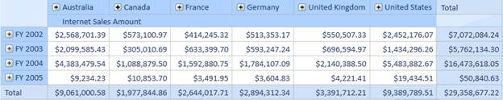
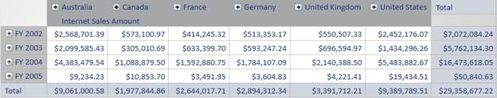
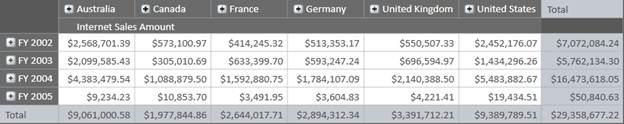
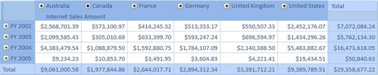
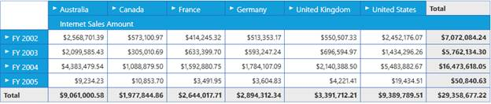

::: {style="DISPLAY: none"}
{#d2h_url_template} {#d2h_package_url style="WIDTH: 0px; DISPLAY: none; HEIGHT: 0px"}
:::

::::: {#nsbanner .d2h_main_nsbanner style="BORDER-BOTTOM: #999999 1px solid; POSITION: relative; PADDING-BOTTOM: 0px; BACKGROUND-COLOR: transparent; PADDING-LEFT: 0px; PADDING-RIGHT: 0px; DISPLAY: none; BORDER-TOP: #999999 1px solid; PADDING-TOP: 0px; LEFT: 0px"}
:::: {#TitleRow .d2h_main_titlerow style="PADDING-BOTTOM: 4px; BACKGROUND-COLOR: transparent; PADDING-LEFT: 22px; WIDTH: 100%; PADDING-RIGHT: 10px; DISPLAY: none; PADDING-TOP: 4px"}
::: {#ienav .d2h_main_ienav style="DISPLAY: none"}
{#D2HPrevious .D2HPreviousEnabled}  {#D2HNext .D2HNextEnabled}
:::
::::
:::::

:::: {#nstext .d2h_main_nstext style="PADDING-BOTTOM: 10px; BACKGROUND-COLOR: transparent; PADDING-LEFT: 22px; PADDING-RIGHT: 10px; HEIGHT: 100%; OVERFLOW: auto; PADDING-TOP: 5px" hasuserbackground="true" valign="bottom"}
::: {#d2h_breadcrumbs .d2h_breadcrumbs}
[Essential Studio User Guide Documentation](ms-xhelp:///?Id=12457748-09e3-4d74-a240-8e049cedf030){.d2h_breadcrumbsNormal} [ \> ]{.d2h_breadcrumbsLinkSeparator} [Business Intelligence Edition](ms-xhelp:///?Id=fdf33dd8-62b2-47b9-ad7b-fc50e590bca5){.d2h_breadcrumbsNormal} [ \> ]{.d2h_breadcrumbsLinkSeparator} [Essential BI WPF](ms-xhelp:///?Id=41e3d586-d922-4a01-8272-679fe4ae7343){.d2h_breadcrumbsNormal} [ \> ]{.d2h_breadcrumbsLinkSeparator} [Essential BI Grid]{.d2h_breadcrumbsContentsOnly} [ \> ]{.d2h_breadcrumbsLinkSeparator} [Concepts and Features](ms-xhelp:///?Id=ea758680-939d-4d65-8abe-8c3be198af29){.d2h_breadcrumbsNormal}
:::

## Themes {#themes style="tab-stops: 0pt"}

Different themes can be applied to OlapGrid using Syncfusion.Shared.Wpf assembly, which contains the basic data structures for applying a theme.

The following code snippet describes about applying theme to Grid.

 

+-------------------------------------------------------------------------------------------------------------------------------------------------------------------------------------------------------------------------------------------------------------------------------------------------------------------------------------------+
| **\[XAML\]**                                                                                                                                                                                                                                                                                                                              |
|                                                                                                                                                                                                                                                                                                                                           |
|                                                                                                                                                                                                                                                                                                                                           |
|                                                                                                                                                                                                                                                                                                                                           |
| [\<!---Shared WPF namespace should be included\--\>]{style="COLOR: green"}                                                                                                                                                                                                                                                                |
|                                                                                                                                                                                                                                                                                                                                           |
| [xmlns]{style="COLOR: red"} [:]{style="COLOR: blue"} [sfshared]{style="COLOR: red"} [=\"clr-namespace:Syncfusion.Windows.Shared;assembly=Syncfusion.Shared.WPF\"]{style="COLOR: blue"}                                                                                                                                                    |
|                                                                                                                                                                                                                                                                                                                                           |
|                                                                                                                                                                                                                                                                                                                                           |
|                                                                                                                                                                                                                                                                                                                                           |
| [\<]{style="COLOR: blue"} [ResourceDictionary]{style="COLOR: #a31515"} [\>]{style="COLOR: blue"}\                                                                                                                                                                                                                                         |
| [    ]{style="COLOR: #a31515"} [\<!\--Skin Manager for application\--\>]{style="COLOR: green"}\                                                                                                                                                                                                                                           |
| [    ]{style="COLOR: #a31515"} [\<]{style="COLOR: blue"} [ResourceDictionary.MergedDictionaries]{style="COLOR: #a31515"} [\>]{style="COLOR: blue"}\                                                                                                                                                                                       |
| [        ]{style="COLOR: #a31515"} [\<]{style="COLOR: blue"} [ResourceDictionary]{style="COLOR: #a31515"} [ Source]{style="COLOR: red"} [=\"/syncfusion.Shared.WPF;component/SkinManager/SkinManager.xaml\" /\>]{style="COLOR: blue"}\                                                                                                    |
| [    ]{style="COLOR: #a31515"} [\</]{style="COLOR: blue"} [ResourceDictionary.MergedDictionaries]{style="COLOR: #a31515"} [\>]{style="COLOR: blue"}\                                                                                                                                                                                      |
| [\</]{style="COLOR: blue"} [ResourceDictionary]{style="COLOR: #a31515"} [\>]{style="COLOR: blue"}                                                                                                                                                                                                                                         |
|                                                                                                                                                                                                                                                                                                                                           |
|                                                                                                                                                                                                                                                                                                                                           |
|                                                                                                                                                                                                                                                                                                                                           |
| [\<!\-- Applying theme to OlapGrid\--\>]{style="COLOR: green"}                                                                                                                                                                                                                                                                            |
|                                                                                                                                                                                                                                                                                                                                           |
| [\<]{style="COLOR: blue"} [syncfusion]{style="COLOR: #a31515"} [:]{style="COLOR: blue"} [OlapGrid]{style="COLOR: #a31515"} [ Name]{style="COLOR: red"} [=\"OlapGrid1\"]{style="COLOR: blue"} [ sfshared]{style="COLOR: red"} [:]{style="COLOR: blue"} [SkinStorage.VisualStyle]{style="COLOR: red"} [=\"Blend\" /\>]{style="COLOR: blue"} |
|                                                                                                                                                                                                                                                                                                                                           |
|                                                                                                                                                                                                                                                                                                                                           |
+-------------------------------------------------------------------------------------------------------------------------------------------------------------------------------------------------------------------------------------------------------------------------------------------------------------------------------------------+

[]{style="FONT-SIZE: 11pt"} 

-Or-

+-----------------------------------------------------------------------------------------------------------------------------------+
| \[C#\]                                                                                                                            |
|                                                                                                                                   |
|                                                                                                                                   |
|                                                                                                                                   |
| [// Shared WPF namespace]{style="COLOR: green"}                                                                                   |
|                                                                                                                                   |
| [using]{style="COLOR: blue"} Syncfusion.Windows.Shared;                                                                           |
|                                                                                                                                   |
|                                                                                                                                   |
|                                                                                                                                   |
| [// For applying blend theme]{style="COLOR: green"}                                                                               |
|                                                                                                                                   |
| [SkinStorage]{style="COLOR: #2b91af"}.SetVisualStyle([this]{style="COLOR: blue"}.OlapGrid1, [\"Blend\"]{style="COLOR: #a31515"}); |
|                                                                                                                                   |
|                                                                                                                                   |
+-----------------------------------------------------------------------------------------------------------------------------------+

[]{style="FONT-SIZE: 11pt"} 

+----------------------------------------------------------------------------+
| \[VB\]                                                                     |
|                                                                            |
|                                                                            |
|                                                                            |
| [\' Shared WPF namespace]{style="COLOR: green"}                            |
|                                                                            |
| [Imports]{style="COLOR: blue"} Syncfusion.Windows.Shared                   |
|                                                                            |
|                                                                            |
|                                                                            |
| [\' For applying blend theme]{style="COLOR: green"}                        |
|                                                                            |
| SkinStorage.SetVisualStyle([Me]{style="COLOR: blue"}.OlapGrid1, \"Blend\") |
|                                                                            |
|                                                                            |
+----------------------------------------------------------------------------+

[]{style="FONT-SIZE: 11pt"} 

[]{style="FONT-SIZE: 11pt"} 

{border="0"}

 

Figure 32: OlapGrid in Blue Theme

[]{style="FONT-SIZE: 11pt"} 

{border="0"}

Figure 33: OlapGrid in Silver Theme

[]{style="FONT-SIZE: 11pt"} 

{border="0"}

Figure 34: OlapGrid in Blend Theme

 

{border="0"}

Figure 35: OlapGrid in Office 2007 Theme

{border="0"}

Figure 35: Metro Theme

 

[]{#related-topics}
::::
