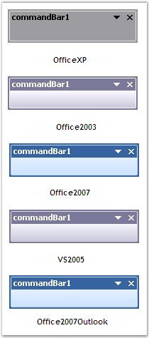
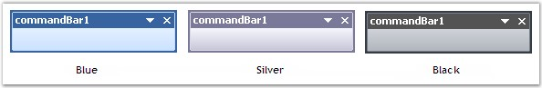

::: {style="DISPLAY: none"}
{#d2h_url_template}{#d2h_package_url style="WIDTH: 0px; DISPLAY: none; HEIGHT: 0px"}
:::

:::::::: {.d2h_secondary_topic style="PADDING-BOTTOM: 10pt; MARGIN: 0pt; PADDING-LEFT: 0pt; PADDING-RIGHT: 0pt; PADDING-TOP: 0pt"}
#### Themes And Visual Styles {#themes-and-visual-styles style="tab-stops: 0pt"}

[]{style="COLOR: #15428b"} 

This section discusses the themes and visual styles settings of the CommandBar control.

[]{style="COLOR: #15428b"} 

Themes

[]{style="COLOR: #15428b"} 

Themes define the look and feel of the CommandBar control. They can be set using the property given below.

[]{style="COLOR: #15428b"} 

::: {align="center"}
  ------------------------------- -----------------------------------------------------------------
  CommandBarController Property   Description
  ThemesEnabled                   Specifies whether XP themes should be used for the CommandBars.
  ------------------------------- -----------------------------------------------------------------
:::

**[]{style="COLOR: #15428b"}** 

+----------------------------------------------------------------------------------------------------------------------------------------------------------------+
| **[\[C#\]]{style="FONT-FAMILY: 'Courier New'; COLOR: black"}**                                                                                                 |
|                                                                                                                                                                |
| []{style="FONT-FAMILY: 'Courier New'"}                                                                                                                         |
|                                                                                                                                                                |
| [this]{style="FONT-FAMILY: 'Courier New'; COLOR: blue"}[.commandBarController1.ThemesEnabled=[true]{style="COLOR: blue"};]{style="FONT-FAMILY: 'Courier New'"} |
+----------------------------------------------------------------------------------------------------------------------------------------------------------------+

[]{style="COLOR: #15428b"} 

+-------------------------------------------------------------------------------------------------------------------------------------------------------------+
| **[\[VB.NET\]]{style="FONT-FAMILY: 'Courier New'; COLOR: black"}**                                                                                          |
|                                                                                                                                                             |
| []{style="FONT-FAMILY: 'Courier New'"}                                                                                                                      |
|                                                                                                                                                             |
| [Me]{style="FONT-FAMILY: 'Courier New'; COLOR: blue"}[.commandBarController1.ThemesEnabled=[True]{style="COLOR: blue"}]{style="FONT-FAMILY: 'Courier New'"} |
+-------------------------------------------------------------------------------------------------------------------------------------------------------------+

[]{style="COLOR: #15428b"} 

{border="0"}

[]{style="COLOR: #15428b"} 

Figure 31: Themed Appearance of CommandBar Control

[]{style="COLOR: #15428b"} 

Visual Styles

**[]{style="COLOR: #15428b"}** 

Visual Styles enhance the appearance of the CommandBar control and can be set using the property given below.

[]{style="COLOR: #15428b"} 

::: {align="center"}
+-----------------------------------+------------------------------------------------------------------------------------+
| CommandBarController Property     | Description                                                                        |
+-----------------------------------+------------------------------------------------------------------------------------+
| Style                             | Specifies the visual style of the CommandBar. It includes the options given below. |
|                                   |                                                                                    |
|                                   |                                                                                    |
|                                   |                                                                                    |
|                                   | *OfficeXP,*                                                                        |
|                                   |                                                                                    |
|                                   | *Office2003,*                                                                      |
|                                   |                                                                                    |
|                                   | *Office2007,*                                                                      |
|                                   |                                                                                    |
|                                   | *VS2005 and*                                                                       |
|                                   |                                                                                    |
|                                   | *Office2007Outlook.*                                                               |
+-----------------------------------+------------------------------------------------------------------------------------+
:::

[]{style="COLOR: #15428b"} 

+---------------------------------------------------------------------------------------------------------------------------------------------------------------------------------------------------+
| **[\[C#\]]{style="FONT-FAMILY: 'Courier New'; COLOR: black"}**                                                                                                                                    |
|                                                                                                                                                                                                   |
| []{style="FONT-FAMILY: 'Courier New'"}                                                                                                                                                            |
|                                                                                                                                                                                                   |
| [this]{style="FONT-FAMILY: 'Courier New'; COLOR: blue"}[.commandBarController1.ThemesEnabled = [true]{style="COLOR: blue"};]{style="FONT-FAMILY: 'Courier New'"}                                  |
|                                                                                                                                                                                                   |
| [this]{style="FONT-FAMILY: 'Courier New'; COLOR: blue"}[.commandBarController1.Style = Syncfusion.Windows.Forms.[VisualStyle]{style="COLOR: teal"}.OfficeXP;]{style="FONT-FAMILY: 'Courier New'"} |
+---------------------------------------------------------------------------------------------------------------------------------------------------------------------------------------------------+

[]{style="COLOR: #15428b"} 

+-------------------------------------------------------------------------------------------------------------------------------------------------------------------------+
| **[\[VB.NET\]]{style="FONT-FAMILY: 'Courier New'; COLOR: black"}**                                                                                                      |
|                                                                                                                                                                         |
| []{style="FONT-FAMILY: 'Courier New'"}                                                                                                                                  |
|                                                                                                                                                                         |
| [Me]{style="FONT-FAMILY: 'Courier New'; COLOR: blue"}[.commandBarController1.ThemesEnabled=[True]{style="COLOR: blue"}]{style="FONT-FAMILY: 'Courier New'"}             |
|                                                                                                                                                                         |
| [Me]{style="FONT-FAMILY: 'Courier New'; COLOR: blue"}[.commandBarController1.Style = Syncfusion.Windows.Forms.VisualStyle.OfficeXP]{style="FONT-FAMILY: 'Courier New'"} |
+-------------------------------------------------------------------------------------------------------------------------------------------------------------------------+

[]{style="COLOR: #15428b"} 

{border="0"}

[]{style="COLOR: #15428b"} 

Figure 32: Visual Styles

[]{style="COLOR: #15428b"} 

::: {style="BORDER-BOTTOM: windowtext 1pt solid; BORDER-LEFT: medium none; PADDING-BOTTOM: 1pt; MARGIN-TOP: 9pt; PADDING-LEFT: 0pt; PADDING-RIGHT: 0pt; MARGIN-BOTTOM: 9pt; BORDER-TOP: windowtext 1pt solid; BORDER-RIGHT: medium none; PADDING-TOP: 1pt"}
{border="0"} Note : For the Office2003 and VS2005 styles to take effect, the ThemesEnabled property should be set to \'False\'.
:::

[]{style="COLOR: #15428b"} 

Office 2007 Theme

[]{style="COLOR: #15428b"} 

CommandBarController provides the new Microsoft Office 2007 style in different color schemes, to enhance the appearance of the CommandBar control. Office 2007 color schemes can be enabled using the **Office2007Theme** property.

[]{style="COLOR: #15428b"} 

::: {align="center"}
+-----------------------------------+---------------------------------------------------------------------------------------------------+
| CommandBarController Property     | Description                                                                                       |
+-----------------------------------+---------------------------------------------------------------------------------------------------+
| Office2007Theme                   | Specifies the color scheme for the Office 2007 visual style. It includes the options given below. |
|                                   |                                                                                                   |
|                                   |                                                                                                   |
|                                   |                                                                                                   |
|                                   | *Blue,*                                                                                           |
|                                   |                                                                                                   |
|                                   | *Silver,*                                                                                         |
|                                   |                                                                                                   |
|                                   | *Black and*                                                                                       |
|                                   |                                                                                                   |
|                                   | *Managed.*                                                                                        |
+-----------------------------------+---------------------------------------------------------------------------------------------------+
:::

[]{style="COLOR: #15428b"} 

+-------------------------------------------------------------------------------------------------------------------------------------------------------------------------------------------------------------------+
| **[\[C#\]]{style="FONT-FAMILY: 'Courier New'; COLOR: black"}**                                                                                                                                                    |
|                                                                                                                                                                                                                   |
| []{style="FONT-FAMILY: 'Courier New'; COLOR: black"}                                                                                                                                                              |
|                                                                                                                                                                                                                   |
| [this]{style="FONT-FAMILY: 'Courier New'; COLOR: blue"}[.commandBarController1.Style = Syncfusion.Windows.Forms.[VisualStyle]{style="COLOR: teal"}.Office2007Outlook;]{style="FONT-FAMILY: 'Courier New'"}        |
|                                                                                                                                                                                                                   |
| [this]{style="FONT-FAMILY: 'Courier New'; COLOR: blue"}[.commandBarController1.Office2007Theme = Syncfusion.Windows.Forms.[Office2007ColorScheme]{style="COLOR: teal"}.Blue;]{style="FONT-FAMILY: 'Courier New'"} |
+-------------------------------------------------------------------------------------------------------------------------------------------------------------------------------------------------------------------+

[]{style="COLOR: #15428b"} 

+-----------------------------------------------------------------------------------------------------------------------------------------------------------------------------------------+
| **[\[VB.NET\]]{style="FONT-FAMILY: 'Courier New'; COLOR: black"}**                                                                                                                      |
|                                                                                                                                                                                         |
| []{style="FONT-FAMILY: 'Courier New'; COLOR: black"}                                                                                                                                    |
|                                                                                                                                                                                         |
| [Me]{style="FONT-FAMILY: 'Courier New'; COLOR: blue"}[.commandBarController1.Style = Syncfusion.Windows.Forms.VisualStyle.Office2007Outlook]{style="FONT-FAMILY: 'Courier New'"}        |
|                                                                                                                                                                                         |
| [Me]{style="FONT-FAMILY: 'Courier New'; COLOR: blue"}[.commandBarController1.Office2007Theme = Syncfusion.Windows.Forms.Office2007ColorScheme.Blue]{style="FONT-FAMILY: 'Courier New'"} |
+-----------------------------------------------------------------------------------------------------------------------------------------------------------------------------------------+

[]{style="COLOR: #15428b"} 

{border="0"}

[]{style="COLOR: #15428b"} 

Figure 33: Office 2007 Themes

[]{style="COLOR: #15428b"} 

::: {style="BORDER-BOTTOM: windowtext 1pt solid; BORDER-LEFT: medium none; PADDING-BOTTOM: 1pt; MARGIN-TOP: 9pt; PADDING-LEFT: 0pt; PADDING-RIGHT: 0pt; MARGIN-BOTTOM: 9pt; BORDER-TOP: windowtext 1pt solid; BORDER-RIGHT: medium none; PADDING-TOP: 1pt"}
{border="0"}Note:[ ]{style="COLOR: black; FONT-SIZE: 8pt"}The Style property must be set to \'Office2007\' or \'Office2007Outlook\' to get the Office 2007 theme effect.
:::

[]{#related-topics}
::::::::
