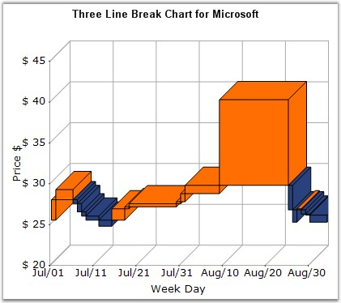

::: {style="DISPLAY: none"}
{#d2h_url_template}{#d2h_package_url style="WIDTH: 0px; DISPLAY: none; HEIGHT: 0px"}
:::

:::: {.d2h_secondary_topic style="PADDING-BOTTOM: 10pt; MARGIN: 0pt; PADDING-LEFT: 0pt; PADDING-RIGHT: 0pt; PADDING-TOP: 0pt"}
#### Three Line Break Chart {#three-line-break-chart style="tab-stops: 0pt"}

 

Three Line Break Chart is similar in concept to point and figure charts. The Three Line Break charting method is so-named because of the number of lines typically used. It displays a series of vertical boxes (\"lines\") that are based on changes in prices. It ignores the passage of time.

 

The three-line break chart looks like a series of rising and falling lines of varying heights. Each new line, like the X\'s and O\'s of a point and figure chart, occupies a new column. Based on closing prices (or highs and lows), a new rising line is drawn if the previous high is exceeded and a new falling line is drawn if the price hits a new low. Change in price trends are highlighted by changing colors. Use the **PriceUpColor** to indicate bullish trend and **PriceDownColor** to indicate bearish trend.

 

The **ReversalAmount** specifies the threshold amount by which the price should change to begin rendering a new vertical box in the appropriate direction.

 

{border="0"}

 

Figure 79: Chart displaying Three Line Break Series

 

**Chart Details**

 

::: {align="center"}
+-------------------------------------+-------------------------------------+
|                                                                           |
|                                                                           |
| Details                                                                   |
+-------------------------------------+-------------------------------------+
|                                     |                                     |
|                                     |                                     |
| **Number of Y values per point**    | 1                                   |
+-------------------------------------+-------------------------------------+
|                                     |                                     |
|                                     |                                     |
| **Number of Series         **       | One                                 |
+-------------------------------------+-------------------------------------+
|                                     |                                     |
|                                     |                                     |
| **Cannot be Combined with   **      | Pie, Bar                            |
+-------------------------------------+-------------------------------------+
:::

 

Three Line Break series can be added to the chart using the following code.

 

+----------------------------------------------------------------------------------------------------------------------------------------------------------------------------------------------------------------------------------------------------------------------+
| **[\[C#\]]{style="FONT-FAMILY: 'Courier New'; COLOR: black"}**                                                                                                                                                                                                       |
|                                                                                                                                                                                                                                                                      |
| []{style="COLOR: black; FONT-SIZE: 12pt"}                                                                                                                                                                                                                            |
|                                                                                                                                                                                                                                                                      |
| [// Create chart series and add data points into it.]{style="FONT-FAMILY: 'Courier New'; COLOR: green"}[  ]{style="COLOR: black; FONT-SIZE: 12pt"}[ ]{style="FONT-FAMILY: 'Courier New'; COLOR: green"}                                                              |
|                                                                                                                                                                                                                                                                      |
| [ChartSeries series = ]{style="FONT-FAMILY: 'Courier New'; COLOR: black"}[this]{style="FONT-FAMILY: 'Courier New'; COLOR: blue"}[.chartControl1.Model.NewSeries (\"Series Name\",ChartSeriesType.ThreeLineBreak);]{style="FONT-FAMILY: 'Courier New'; COLOR: black"} |
|                                                                                                                                                                                                                                                                      |
| [series.Points.Add (0, 1);]{style="FONT-FAMILY: 'Courier New'; COLOR: black"}                                                                                                                                                                                        |
|                                                                                                                                                                                                                                                                      |
| [series.Points.Add (1, 3);]{style="FONT-FAMILY: 'Courier New'; COLOR: black"}                                                                                                                                                                                        |
|                                                                                                                                                                                                                                                                      |
| [series.Points.Add (2, 4);]{style="FONT-FAMILY: 'Courier New'; COLOR: black"}                                                                                                                                                                                        |
|                                                                                                                                                                                                                                                                      |
| []{style="FONT-FAMILY: 'Courier New'; COLOR: black"}                                                                                                                                                                                                                 |
|                                                                                                                                                                                                                                                                      |
| [// Add series to the chart series collection.]{style="FONT-FAMILY: 'Courier New'; COLOR: green"}                                                                                                                                                                    |
|                                                                                                                                                                                                                                                                      |
| [this]{style="FONT-FAMILY: 'Courier New'; COLOR: blue"}[.chartControl1.Series.Add (series);]{style="FONT-FAMILY: 'Courier New'; COLOR: black"}                                                                                                                       |
+----------------------------------------------------------------------------------------------------------------------------------------------------------------------------------------------------------------------------------------------------------------------+

 

+-------------------------------------------------------------------------------------------------------------------------------------------------------------------------------------------------------------------------------------------------------------------------------------------------------------------------------------------------------------------------------------------------------------------------------------+
| **[\[VB.NET\]]{style="FONT-FAMILY: 'Courier New'; COLOR: black"}**                                                                                                                                                                                                                                                                                                                                                                  |
|                                                                                                                                                                                                                                                                                                                                                                                                                                     |
| []{style="COLOR: black; FONT-SIZE: 12pt"}                                                                                                                                                                                                                                                                                                                                                                                           |
|                                                                                                                                                                                                                                                                                                                                                                                                                                     |
| [\' Create chart series and add data points into it.]{style="FONT-FAMILY: 'Courier New'; COLOR: green"}[ ]{style="COLOR: black; FONT-SIZE: 12pt"}[  ]{style="FONT-FAMILY: 'Courier New'; COLOR: green"}                                                                                                                                                                                                                             |
|                                                                                                                                                                                                                                                                                                                                                                                                                                     |
| [Dim]{style="FONT-FAMILY: 'Courier New'; COLOR: blue"}[ series ]{style="FONT-FAMILY: 'Courier New'; COLOR: black"}[As]{style="FONT-FAMILY: 'Courier New'; COLOR: blue"}[ ChartSeries = ]{style="FONT-FAMILY: 'Courier New'; COLOR: black"}[Me]{style="FONT-FAMILY: 'Courier New'; COLOR: blue"}[.chartControl1.Model.NewSeries (\"Series Name\", ChartSeriesType.ThreeLineBreak)]{style="FONT-FAMILY: 'Courier New'; COLOR: black"} |
|                                                                                                                                                                                                                                                                                                                                                                                                                                     |
| [series.Points.Add (0, 1)]{style="FONT-FAMILY: 'Courier New'; COLOR: black"}                                                                                                                                                                                                                                                                                                                                                        |
|                                                                                                                                                                                                                                                                                                                                                                                                                                     |
| [series.Points.Add (1, 3)]{style="FONT-FAMILY: 'Courier New'; COLOR: black"}                                                                                                                                                                                                                                                                                                                                                        |
|                                                                                                                                                                                                                                                                                                                                                                                                                                     |
| [series.Points.Add (2, 4)]{style="FONT-FAMILY: 'Courier New'; COLOR: black"}                                                                                                                                                                                                                                                                                                                                                        |
|                                                                                                                                                                                                                                                                                                                                                                                                                                     |
| []{style="FONT-FAMILY: 'Courier New'; COLOR: black"}                                                                                                                                                                                                                                                                                                                                                                                |
|                                                                                                                                                                                                                                                                                                                                                                                                                                     |
| [\' Add series to the chart series collection.]{style="FONT-FAMILY: 'Courier New'; COLOR: green"}                                                                                                                                                                                                                                                                                                                                   |
|                                                                                                                                                                                                                                                                                                                                                                                                                                     |
| [Me]{style="FONT-FAMILY: 'Courier New'; COLOR: blue"}[.chartControl1.Series.Add (series)]{style="FONT-FAMILY: 'Courier New'; COLOR: black"}                                                                                                                                                                                                                                                                                         |
+-------------------------------------------------------------------------------------------------------------------------------------------------------------------------------------------------------------------------------------------------------------------------------------------------------------------------------------------------------------------------------------------------------------------------------------+

 

+---------------------------------------------------------------------------------------------------------------------------------------------+
| []{style="FONT-FAMILY: 'Segoe UI','sans-serif'; COLOR: black"}                                                                              |
|                                                                                                                                             |
| Customization Options                                                                                                                       |
+---------------------------------------------------------------------------------------------------------------------------------------------+
| DisplayShadow, DisplayText, DrawSeriesNameInDepth, ElementBorders, ImageIndex, Images, PriceDownColor, PriceUpColor, Spacing Between Series |
|                                                                                                                                             |
| ShadowInterior, ShadowOffset, FancyToolTip, Font, Interior, LegendItem, Name, PointsToolTipFormat, SmartLabels,                             |
|                                                                                                                                             |
| Summary, Text, TextColor, TextFormat, TextOffset, TextOrientation, Visible                                                                  |
+---------------------------------------------------------------------------------------------------------------------------------------------+

 

[]{#p65} 

 

[]{#related-topics}
::::
