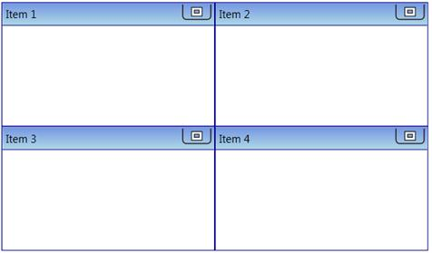

::: {style="DISPLAY: none"}
{#d2h_url_template}{#d2h_package_url style="WIDTH: 0px; DISPLAY: none; HEIGHT: 0px"}
:::

::: {.d2h_secondary_topic style="PADDING-BOTTOM: 10pt; MARGIN: 0pt; PADDING-LEFT: 0pt; PADDING-RIGHT: 0pt; PADDING-TOP: 0pt"}
##### Through C# {#through-c style="tab-stops: 0pt"}

To create the TileViewControl through C#, include the following namespace to the directives list.

 

+---------------------------------------------------------------------------------------------------------------------------+
| **[\[C#\]]{style="FONT-FAMILY: 'Courier New'"}**                                                                          |
|                                                                                                                           |
| [using]{style="FONT-FAMILY: 'Courier New'; COLOR: blue"}[ Syncfusion.Windows.Shared;]{style="FONT-FAMILY: 'Courier New'"} |
|                                                                                                                           |
| []{style="FONT-FAMILY: 'Courier New'"}                                                                                    |
+---------------------------------------------------------------------------------------------------------------------------+

 

Next, create the TileViewControl as follows.

 

+----------------------------------------------------------------------------------------------------------------------------------------------------------------------------------------------------------------------+
| **[\[C#\]]{style="FONT-FAMILY: 'Courier New'"}**                                                                                                                                                                     |
|                                                                                                                                                                                                                      |
| []{style="FONT-FAMILY: 'Courier New'"}                                                                                                                                                                               |
|                                                                                                                                                                                                                      |
| [       TileViewControl]{style="FONT-FAMILY: 'Courier New'; COLOR: #2b91af"}[ tvControl = [new]{style="COLOR: blue"} [TileViewControl]{style="COLOR: #2b91af"}();]{style="FONT-FAMILY: 'Courier New'"}               |
|                                                                                                                                                                                                                      |
| [       [TileViewItem]{style="COLOR: #2b91af"} tvitem1 = [new]{style="COLOR: blue"} [TileViewItem]{style="COLOR: #2b91af"}() { Header = [\"Item 1\"]{style="COLOR: #a31515"} };]{style="FONT-FAMILY: 'Courier New'"} |
|                                                                                                                                                                                                                      |
| [       [TileViewItem]{style="COLOR: #2b91af"} tvitem2 = [new]{style="COLOR: blue"} [TileViewItem]{style="COLOR: #2b91af"}() { Header = [\"Item 2\"]{style="COLOR: #a31515"} };]{style="FONT-FAMILY: 'Courier New'"} |
|                                                                                                                                                                                                                      |
| [       [TileViewItem]{style="COLOR: #2b91af"} tvitem3 = [new]{style="COLOR: blue"} [TileViewItem]{style="COLOR: #2b91af"}() { Header = [\"Item 3\"]{style="COLOR: #a31515"} };]{style="FONT-FAMILY: 'Courier New'"} |
|                                                                                                                                                                                                                      |
| [       [TileViewItem]{style="COLOR: #2b91af"} tvitem4 = [new]{style="COLOR: blue"} [TileViewItem]{style="COLOR: #2b91af"}() { Header = [\"Item 4\"]{style="COLOR: #a31515"} };]{style="FONT-FAMILY: 'Courier New'"} |
|                                                                                                                                                                                                                      |
| [       tvControl.Items.Add(tvitem1);]{style="FONT-FAMILY: 'Courier New'"}                                                                                                                                           |
|                                                                                                                                                                                                                      |
| [       tvControl.Items.Add(tvitem2);]{style="FONT-FAMILY: 'Courier New'"}                                                                                                                                           |
|                                                                                                                                                                                                                      |
| [       tvControl.Items.Add(tvitem3);]{style="FONT-FAMILY: 'Courier New'"}                                                                                                                                           |
|                                                                                                                                                                                                                      |
| [       tvControl.Items.Add(tvitem4);]{style="FONT-FAMILY: 'Courier New'"}                                                                                                                                           |
|                                                                                                                                                                                                                      |
| []{style="FONT-FAMILY: 'Courier New'"}                                                                                                                                                                               |
+----------------------------------------------------------------------------------------------------------------------------------------------------------------------------------------------------------------------+

 

This will generate the following TileViewControl.

{border="0"}

Figure 1064: TileViewControl

 

[]{#related-topics}
:::
