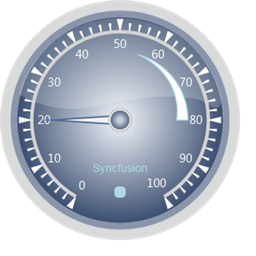

::: {style="DISPLAY: none"}
{#d2h_url_template}{#d2h_package_url style="WIDTH: 0px; DISPLAY: none; HEIGHT: 0px"}
:::

::::: {.d2h_secondary_topic style="PADDING-BOTTOM: 10pt; MARGIN: 0pt; PADDING-LEFT: 0pt; PADDING-RIGHT: 0pt; PADDING-TOP: 0pt"}
#### Through CircularGaugeModel {#through-circulargaugemodel style="tab-stops: 0pt"}

 

Step 1:

Add the below code in your aspx file.[ ]{style="BACKGROUND: yellow"}

[]{style="FONT-FAMILY: 'Calibri','sans-serif'; BACKGROUND: yellow"} 

+-------------------------------------------------------------------------------------------------------------------------------------------------------------------------------------------------------------------------------------------------------------------------------------------------------------------------------------------------------------------------------------------------------------------------------------------------------------------------------------+
| **[View\[ASPX\]]{style="FONT-FAMILY: 'Courier New'"}**                                                                                                                                                                                                                                                                                                                                                                                                                              |
|                                                                                                                                                                                                                                                                                                                                                                                                                                                                                     |
| []{style="FONT-FAMILY: 'Courier New'"}                                                                                                                                                                                                                                                                                                                                                                                                                                              |
|                                                                                                                                                                                                                                                                                                                                                                                                                                                                                     |
| [\<%]{style="FONT-FAMILY: 'Courier New'; BACKGROUND: yellow"}[@]{style="FONT-FAMILY: 'Courier New'; COLOR: blue"}[ [Page]{style="COLOR: maroon"} [Language]{style="COLOR: red"}[=\"C#\"]{style="COLOR: blue"} [MasterPageFile]{style="COLOR: red"}[=\"\~/Views/Shared/Site.Master\"]{style="COLOR: blue"} [Inherits]{style="COLOR: red"}[=\"System.Web.Mvc.ViewPage\"]{style="COLOR: blue"} [%\>]{style="BACKGROUND: yellow"}]{style="FONT-FAMILY: 'Courier New'"}                  |
|                                                                                                                                                                                                                                                                                                                                                                                                                                                                                     |
| [\<]{style="FONT-FAMILY: 'Courier New'; COLOR: blue"}[asp]{style="FONT-FAMILY: 'Courier New'; COLOR: maroon"}[:]{style="FONT-FAMILY: 'Courier New'; COLOR: blue"}[Content]{style="FONT-FAMILY: 'Courier New'; COLOR: maroon"}[ [ID]{style="COLOR: red"}[=\"Content1\"]{style="COLOR: blue"} [ContentPlaceHolderID]{style="COLOR: red"}[=\"TitleContent\"]{style="COLOR: blue"} [runat]{style="COLOR: red"}[=\"server\"\>]{style="COLOR: blue"}]{style="FONT-FAMILY: 'Courier New'"} |
|                                                                                                                                                                                                                                                                                                                                                                                                                                                                                     |
| [    Circular Gauge]{style="FONT-FAMILY: 'Courier New'"}                                                                                                                                                                                                                                                                                                                                                                                                                            |
|                                                                                                                                                                                                                                                                                                                                                                                                                                                                                     |
| [\</]{style="FONT-FAMILY: 'Courier New'; COLOR: blue"}[asp]{style="FONT-FAMILY: 'Courier New'; COLOR: maroon"}[:]{style="FONT-FAMILY: 'Courier New'; COLOR: blue"}[Content]{style="FONT-FAMILY: 'Courier New'; COLOR: maroon"}[\>]{style="FONT-FAMILY: 'Courier New'; COLOR: blue"}[]{style="FONT-FAMILY: 'Courier New'"}                                                                                                                                                           |
|                                                                                                                                                                                                                                                                                                                                                                                                                                                                                     |
| []{style="FONT-FAMILY: 'Courier New'"}                                                                                                                                                                                                                                                                                                                                                                                                                                              |
|                                                                                                                                                                                                                                                                                                                                                                                                                                                                                     |
| [\<]{style="FONT-FAMILY: 'Courier New'; COLOR: blue"}[asp]{style="FONT-FAMILY: 'Courier New'; COLOR: maroon"}[:]{style="FONT-FAMILY: 'Courier New'; COLOR: blue"}[Content]{style="FONT-FAMILY: 'Courier New'; COLOR: maroon"}[ [ID]{style="COLOR: red"}[=\"Content2\"]{style="COLOR: blue"} [ContentPlaceHolderID]{style="COLOR: red"}[=\"MainContent\"]{style="COLOR: blue"} [runat]{style="COLOR: red"}[=\"server\"\>]{style="COLOR: blue"}]{style="FONT-FAMILY: 'Courier New'"}  |
|                                                                                                                                                                                                                                                                                                                                                                                                                                                                                     |
| []{style="FONT-FAMILY: 'Courier New'; COLOR: blue"}                                                                                                                                                                                                                                                                                                                                                                                                                                 |
|                                                                                                                                                                                                                                                                                                                                                                                                                                                                                     |
| [\<%]{style="FONT-FAMILY: 'Courier New'; BACKGROUND: yellow"}[\--Rendering the Circular Gauge\--]{style="FONT-FAMILY: 'Courier New'; COLOR: darkgreen"}[%\>]{style="FONT-FAMILY: 'Courier New'; BACKGROUND: yellow"}[]{style="FONT-FAMILY: 'Courier New'"}                                                                                                                                                                                                                          |
|                                                                                                                                                                                                                                                                                                                                                                                                                                                                                     |
| [    [\<%]{style="BACKGROUND: yellow"}[=]{style="COLOR: blue"}Html.Syncfusion().CircularGauge([\"Gauge\"]{style="COLOR: #a31515"},([CircularGaugeModel]{style="COLOR: #2b91af"})ViewData\[[\"GaugeModel\"]{style="COLOR: #a31515"}\])[%\>]{style="BACKGROUND: yellow"}]{style="FONT-FAMILY: 'Courier New'"}                                                                                                                                                                         |
|                                                                                                                                                                                                                                                                                                                                                                                                                                                                                     |
| []{style="FONT-FAMILY: 'Courier New'"}                                                                                                                                                                                                                                                                                                                                                                                                                                              |
|                                                                                                                                                                                                                                                                                                                                                                                                                                                                                     |
| [\</]{style="FONT-FAMILY: 'Courier New'; COLOR: blue"}[asp]{style="FONT-FAMILY: 'Courier New'; COLOR: maroon"}[:]{style="FONT-FAMILY: 'Courier New'; COLOR: blue"}[Content]{style="FONT-FAMILY: 'Courier New'; COLOR: maroon"}[\>]{style="FONT-FAMILY: 'Courier New'; COLOR: blue"}[]{style="FONT-FAMILY: 'Courier New'"}                                                                                                                                                           |
+-------------------------------------------------------------------------------------------------------------------------------------------------------------------------------------------------------------------------------------------------------------------------------------------------------------------------------------------------------------------------------------------------------------------------------------------------------------------------------------+

[]{style="FONT-FAMILY: 'Calibri','sans-serif'"} 

 

+----------------------------------------------------------------------------------------------------------------------------------------------------------------------------------------------------------------------------------------------------------------------------------------------------+
| [View\[cshtml\]]{style="FONT-FAMILY: 'Courier New'"}                                                                                                                                                                                                                                               |
|                                                                                                                                                                                                                                                                                                    |
| []{style="FONT-FAMILY: 'Courier New'"}                                                                                                                                                                                                                                                             |
|                                                                                                                                                                                                                                                                                                    |
| [\@{]{style="FONT-FAMILY: 'Courier New'; BACKGROUND: yellow"}[ []{style="BACKGROUND: yellow"}]{style="FONT-FAMILY: 'Courier New'"}                                                                                                                                                                 |
|                                                                                                                                                                                                                                                                                                    |
| [Layout="\~/Views/Shared/\_Layout.cshtml";]{style="FONT-FAMILY: 'Courier New'"}                                                                                                                                                                                                                    |
|                                                                                                                                                                                                                                                                                                    |
| [ViewBag="Circular Gauge";[]{style="BACKGROUND: yellow"}]{style="FONT-FAMILY: 'Courier New'"}                                                                                                                                                                                                      |
|                                                                                                                                                                                                                                                                                                    |
| [}]{style="FONT-FAMILY: 'Courier New'; BACKGROUND: yellow"}[]{style="FONT-FAMILY: 'Courier New'; COLOR: blue"}                                                                                                                                                                                     |
|                                                                                                                                                                                                                                                                                                    |
| [\<]{style="FONT-FAMILY: 'Courier New'; COLOR: blue"}[div]{style="FONT-FAMILY: 'Courier New'; COLOR: #a31515"}[\>]{style="FONT-FAMILY: 'Courier New'; COLOR: blue"}                                                                                                                                |
|                                                                                                                                                                                                                                                                                                    |
| [@\*]{style="FONT-FAMILY: 'Courier New'; BACKGROUND: yellow"}[\--Rendering the Circular Gauge\--]{style="FONT-FAMILY: 'Courier New'; COLOR: green"}[\*@]{style="FONT-FAMILY: 'Courier New'; BACKGROUND: yellow"}                                                                                   |
|                                                                                                                                                                                                                                                                                                    |
| [@]{style="FONT-FAMILY: Consolas; BACKGROUND: yellow; FONT-SIZE: 9.5pt"}[Html.Syncfusion().CircularGauge([\"Gauge\"]{style="COLOR: #a31515"},([CircularGaugeModel]{style="COLOR: #2b91af"})ViewData\[[\"GaugeModel\"]{style="COLOR: #a31515"}\])]{style="FONT-FAMILY: Consolas; FONT-SIZE: 9.5pt"} |
|                                                                                                                                                                                                                                                                                                    |
| []{style="FONT-FAMILY: 'Courier New'"}                                                                                                                                                                                                                                                             |
|                                                                                                                                                                                                                                                                                                    |
| [\</]{style="FONT-FAMILY: 'Courier New'; COLOR: blue"}[div]{style="FONT-FAMILY: 'Courier New'; COLOR: #a31515"}[\>]{style="FONT-FAMILY: 'Courier New'; COLOR: blue"}                                                                                                                               |
+----------------------------------------------------------------------------------------------------------------------------------------------------------------------------------------------------------------------------------------------------------------------------------------------------+

[]{style="FONT-FAMILY: 'Calibri','sans-serif'"} 

Include the following namespaces in the HomeController.

[]{style="FONT-FAMILY: 'Calibri','sans-serif'"} 

[·      ]{style="FONT-FAMILY: Symbol"}Syncfusion.Mvc.Gauge

[·      ]{style="FONT-FAMILY: Symbol"}Syncfusion.Mvc.Shared

[·      ]{style="FONT-FAMILY: Symbol"}System.Windows.Media

[]{style="FONT-FAMILY: 'Calibri','sans-serif'"} 

 

Controller:

Step 2:

 

Add the following code in your controller.

 

+-----------------------------------------------------------------------------------------------------------------------------------------------------------------------------------------------+
| **[]{style="FONT-FAMILY: 'Calibri','sans-serif'"}**                                                                                                                                           |
|                                                                                                                                                                                               |
| [using]{style="FONT-FAMILY: 'Calibri','sans-serif'; COLOR: blue"}[ System;]{style="FONT-FAMILY: 'Calibri','sans-serif'"}                                                                      |
|                                                                                                                                                                                               |
| [using]{style="FONT-FAMILY: 'Calibri','sans-serif'; COLOR: blue"}[ System.Collections.Generic;]{style="FONT-FAMILY: 'Calibri','sans-serif'"}                                                  |
|                                                                                                                                                                                               |
| [using]{style="FONT-FAMILY: 'Calibri','sans-serif'; COLOR: blue"}[ System.Linq;]{style="FONT-FAMILY: 'Calibri','sans-serif'"}                                                                 |
|                                                                                                                                                                                               |
| [using]{style="FONT-FAMILY: 'Calibri','sans-serif'; COLOR: blue"}[ System.Web;]{style="FONT-FAMILY: 'Calibri','sans-serif'"}                                                                  |
|                                                                                                                                                                                               |
| [using]{style="FONT-FAMILY: 'Calibri','sans-serif'; COLOR: blue"}[ System.Web.Mvc;]{style="FONT-FAMILY: 'Calibri','sans-serif'"}                                                              |
|                                                                                                                                                                                               |
| **[using]{style="FONT-FAMILY: 'Calibri','sans-serif'; COLOR: blue"}[ Syncfusion.Mvc.Gauge;]{style="FONT-FAMILY: 'Calibri','sans-serif'"}**                                                    |
|                                                                                                                                                                                               |
| **[using]{style="FONT-FAMILY: 'Calibri','sans-serif'; COLOR: blue"}[ Syncfusion.Mvc.Shared;]{style="FONT-FAMILY: 'Calibri','sans-serif'"}**                                                   |
|                                                                                                                                                                                               |
| **[using]{style="FONT-FAMILY: 'Calibri','sans-serif'; COLOR: blue"}[ System.Windows.Media;]{style="FONT-FAMILY: 'Calibri','sans-serif'"}**                                                    |
|                                                                                                                                                                                               |
| []{style="FONT-FAMILY: 'Calibri','sans-serif'"}                                                                                                                                               |
|                                                                                                                                                                                               |
| [namespace]{style="FONT-FAMILY: 'Calibri','sans-serif'; COLOR: blue"}[ CircularGauge.Controllers]{style="FONT-FAMILY: 'Calibri','sans-serif'"}                                                |
|                                                                                                                                                                                               |
| [{]{style="FONT-FAMILY: 'Calibri','sans-serif'"}                                                                                                                                              |
|                                                                                                                                                                                               |
| [    \[[HandleError]{style="COLOR: #2b91af"}\]]{style="FONT-FAMILY: 'Calibri','sans-serif'"}                                                                                                  |
|                                                                                                                                                                                               |
| [    [public]{style="COLOR: blue"} [class]{style="COLOR: blue"} [HomeController]{style="COLOR: #2b91af"} : [Controller]{style="COLOR: #2b91af"}]{style="FONT-FAMILY: 'Calibri','sans-serif'"} |
|                                                                                                                                                                                               |
| [    {]{style="FONT-FAMILY: 'Calibri','sans-serif'"}                                                                                                                                          |
|                                                                                                                                                                                               |
| [        [public]{style="COLOR: blue"} [ActionResult]{style="COLOR: #2b91af"} Index()]{style="FONT-FAMILY: 'Calibri','sans-serif'"}                                                           |
|                                                                                                                                                                                               |
| [        {]{style="FONT-FAMILY: 'Calibri','sans-serif'"}                                                                                                                                      |
|                                                                                                                                                                                               |
| [            [//creating the circular gauge.]{style="COLOR: green"}]{style="FONT-FAMILY: 'Calibri','sans-serif'"}                                                                             |
|                                                                                                                                                                                               |
| [            [CircularGaugeModel]{style="COLOR: #2b91af"} model = [new]{style="COLOR: blue"} [CircularGaugeModel]{style="COLOR: #2b91af"}();]{style="FONT-FAMILY: 'Calibri','sans-serif'"}    |
|                                                                                                                                                                                               |
| [            [//Setting the radius of the circular gauge.]{style="COLOR: green"}]{style="FONT-FAMILY: 'Calibri','sans-serif'"}                                                                |
|                                                                                                                                                                                               |
| [            model.Radius = 160;]{style="FONT-FAMILY: 'Calibri','sans-serif'"}                                                                                                                |
|                                                                                                                                                                                               |
| [            model.GaugeSkins = [GaugeSkins]{style="COLOR: #2b91af"}.VS2010;]{style="FONT-FAMILY: 'Calibri','sans-serif'"}                                                                    |
|                                                                                                                                                                                               |
| [            model.FrameType = [GaugeFrameType]{style="COLOR: #2b91af"}.CircularWithInnerTopGradient;]{style="FONT-FAMILY: 'Calibri','sans-serif'"}                                           |
|                                                                                                                                                                                               |
| [            [//creating the scale element.]{style="COLOR: green"}]{style="FONT-FAMILY: 'Calibri','sans-serif'"}                                                                              |
|                                                                                                                                                                                               |
| [            [CircularScale]{style="COLOR: #2b91af"} c_Scale = [new]{style="COLOR: blue"} [CircularScale]{style="COLOR: #2b91af"}();]{style="FONT-FAMILY: 'Calibri','sans-serif'"}            |
|                                                                                                                                                                                               |
| [            c_Scale.Maximum = 100;]{style="FONT-FAMILY: 'Calibri','sans-serif'"}                                                                                                             |
|                                                                                                                                                                                               |
| [            c_Scale.Minimum = 0;]{style="FONT-FAMILY: 'Calibri','sans-serif'"}                                                                                                               |
|                                                                                                                                                                                               |
| [            c_Scale.MinorIntervalValue = 2;]{style="FONT-FAMILY: 'Calibri','sans-serif'"}                                                                                                    |
|                                                                                                                                                                                               |
| [            c_Scale.MajorIntervalValue = 10;]{style="FONT-FAMILY: 'Calibri','sans-serif'"}                                                                                                   |
|                                                                                                                                                                                               |
| [            c_Scale.GapSweepAngle = 300;]{style="FONT-FAMILY: 'Calibri','sans-serif'"}                                                                                                       |
|                                                                                                                                                                                               |
| [            c_Scale.Radius = 120;]{style="FONT-FAMILY: 'Calibri','sans-serif'"}                                                                                                              |
|                                                                                                                                                                                               |
| [            c_Scale.StartAngle = 120;]{style="FONT-FAMILY: 'Calibri','sans-serif'"}                                                                                                          |
|                                                                                                                                                                                               |
| [            c_Scale.ScaleBarSize = 4.5;]{style="FONT-FAMILY: 'Calibri','sans-serif'"}                                                                                                        |
|                                                                                                                                                                                               |
| [            c_Scale.PointerCapRadius = 8;]{style="FONT-FAMILY: 'Calibri','sans-serif'"}                                                                                                      |
|                                                                                                                                                                                               |
| [            c_Scale.BackgroundBrush = [Brushes]{style="COLOR: #2b91af"}.LightGray;]{style="FONT-FAMILY: 'Calibri','sans-serif'"}                                                             |
|                                                                                                                                                                                               |
| []{style="FONT-FAMILY: 'Calibri','sans-serif'"}                                                                                                                                               |
|                                                                                                                                                                                               |
| [            [//creating minor tick element.]{style="COLOR: green"}]{style="FONT-FAMILY: 'Calibri','sans-serif'"}                                                                             |
|                                                                                                                                                                                               |
| [            [TickMark]{style="COLOR: #2b91af"} \_minor = [new]{style="COLOR: blue"} [TickMark]{style="COLOR: #2b91af"}();]{style="FONT-FAMILY: 'Calibri','sans-serif'"}                      |
|                                                                                                                                                                                               |
| [            [//Specifying the height and width for the minor ticks.]{style="COLOR: green"}]{style="FONT-FAMILY: 'Calibri','sans-serif'"}                                                     |
|                                                                                                                                                                                               |
| [            \_minor.TickStyle = [TickStyle]{style="COLOR: #2b91af"}.MinorTick;]{style="FONT-FAMILY: 'Calibri','sans-serif'"}                                                                 |
|                                                                                                                                                                                               |
| [            \_minor.TickWidth = 2;]{style="FONT-FAMILY: 'Calibri','sans-serif'"}                                                                                                             |
|                                                                                                                                                                                               |
| [            \_minor.TickHeight = 9;]{style="FONT-FAMILY: 'Calibri','sans-serif'"}                                                                                                            |
|                                                                                                                                                                                               |
| [            [//Specifying the shape of the minor ticks.]{style="COLOR: green"}]{style="FONT-FAMILY: 'Calibri','sans-serif'"}                                                                 |
|                                                                                                                                                                                               |
| [            \_minor.TickShape = [TickShape]{style="COLOR: #2b91af"}.Triangle;]{style="FONT-FAMILY: 'Calibri','sans-serif'"}                                                                  |
|                                                                                                                                                                                               |
| [            [//Setting the position for the minor ticks.]{style="COLOR: green"}]{style="FONT-FAMILY: 'Calibri','sans-serif'"}                                                                |
|                                                                                                                                                                                               |
| [            \_minor.TickPlacement = [ScalePlacement]{style="COLOR: #2b91af"}.Outside;]{style="FONT-FAMILY: 'Calibri','sans-serif'"}                                                          |
|                                                                                                                                                                                               |
| [            \_minor.Angle = 0;]{style="FONT-FAMILY: 'Calibri','sans-serif'"}                                                                                                                 |
|                                                                                                                                                                                               |
| [            \_minor.BackgroundBrush = [Brushes]{style="COLOR: #2b91af"}.White;]{style="FONT-FAMILY: 'Calibri','sans-serif'"}                                                                 |
|                                                                                                                                                                                               |
| []{style="FONT-FAMILY: 'Calibri','sans-serif'"}                                                                                                                                               |
|                                                                                                                                                                                               |
| [            [//Creating major tick element.]{style="COLOR: green"}]{style="FONT-FAMILY: 'Calibri','sans-serif'"}                                                                             |
|                                                                                                                                                                                               |
| [            [TickMark]{style="COLOR: #2b91af"} \_major = [new]{style="COLOR: blue"} [TickMark]{style="COLOR: #2b91af"}();]{style="FONT-FAMILY: 'Calibri','sans-serif'"}                      |
|                                                                                                                                                                                               |
| [            \_major.TickStyle = [TickStyle]{style="COLOR: #2b91af"}.MajorTick;]{style="FONT-FAMILY: 'Calibri','sans-serif'"}                                                                 |
|                                                                                                                                                                                               |
| [            [//Specifying the height and width for the major ticks.]{style="COLOR: green"}]{style="FONT-FAMILY: 'Calibri','sans-serif'"}                                                     |
|                                                                                                                                                                                               |
| [            \_major.TickHeight = 14;]{style="FONT-FAMILY: 'Calibri','sans-serif'"}                                                                                                           |
|                                                                                                                                                                                               |
| [            \_major.TickWidth = 7;]{style="FONT-FAMILY: 'Calibri','sans-serif'"}                                                                                                             |
|                                                                                                                                                                                               |
| [            [//Specifying the shape of the major ticks.]{style="COLOR: green"}]{style="FONT-FAMILY: 'Calibri','sans-serif'"}                                                                 |
|                                                                                                                                                                                               |
| [            \_major.TickShape = [TickShape]{style="COLOR: #2b91af"}.Triangle;]{style="FONT-FAMILY: 'Calibri','sans-serif'"}                                                                  |
|                                                                                                                                                                                               |
| [            [//Setting the position for the major ticks.]{style="COLOR: green"}]{style="FONT-FAMILY: 'Calibri','sans-serif'"}                                                                |
|                                                                                                                                                                                               |
| [            \_major.TickPlacement = [ScalePlacement]{style="COLOR: #2b91af"}.Outside;]{style="FONT-FAMILY: 'Calibri','sans-serif'"}                                                          |
|                                                                                                                                                                                               |
| [            \_major.Angle = 0;]{style="FONT-FAMILY: 'Calibri','sans-serif'"}                                                                                                                 |
|                                                                                                                                                                                               |
| []{style="FONT-FAMILY: 'Calibri','sans-serif'"}                                                                                                                                               |
|                                                                                                                                                                                               |
| [            [//Creating label element.]{style="COLOR: green"}]{style="FONT-FAMILY: 'Calibri','sans-serif'"}                                                                                  |
|                                                                                                                                                                                               |
| [            [GaugeLabelTick]{style="COLOR: #2b91af"} c_LabelTick = [new]{style="COLOR: blue"} [GaugeLabelTick]{style="COLOR: #2b91af"}();]{style="FONT-FAMILY: 'Calibri','sans-serif'"}      |
|                                                                                                                                                                                               |
| [            [//Setting the labels for the major tick.]{style="COLOR: green"}]{style="FONT-FAMILY: 'Calibri','sans-serif'"}                                                                   |
|                                                                                                                                                                                               |
| [            c_LabelTick.TickStyle = [TickStyle]{style="COLOR: #2b91af"}.MajorTick;]{style="FONT-FAMILY: 'Calibri','sans-serif'"}                                                             |
|                                                                                                                                                                                               |
| [            [//Setting the font size for the labels.]{style="COLOR: green"}]{style="FONT-FAMILY: 'Calibri','sans-serif'"}                                                                    |
|                                                                                                                                                                                               |
| [            c_LabelTick.FontSize = 16;]{style="FONT-FAMILY: 'Calibri','sans-serif'"}                                                                                                         |
|                                                                                                                                                                                               |
| [            [//Setting the position of the labels.]{style="COLOR: green"}]{style="FONT-FAMILY: 'Calibri','sans-serif'"}                                                                      |
|                                                                                                                                                                                               |
| [            c_LabelTick.DistanceFromScale = 5;]{style="FONT-FAMILY: 'Calibri','sans-serif'"}                                                                                                 |
|                                                                                                                                                                                               |
| [            c_LabelTick.TickPlacement = [ScalePlacement]{style="COLOR: #2b91af"}.Inside;]{style="FONT-FAMILY: 'Calibri','sans-serif'"}                                                       |
|                                                                                                                                                                                               |
| [            c_LabelTick.Angle = 0;]{style="FONT-FAMILY: 'Calibri','sans-serif'"}                                                                                                             |
|                                                                                                                                                                                               |
| [            c_LabelTick.BackgroundBrush = [Brushes]{style="COLOR: #2b91af"}.White;]{style="FONT-FAMILY: 'Calibri','sans-serif'"}                                                             |
|                                                                                                                                                                                               |
| []{style="FONT-FAMILY: 'Calibri','sans-serif'"}                                                                                                                                               |
|                                                                                                                                                                                               |
| []{style="FONT-FAMILY: 'Calibri','sans-serif'"}                                                                                                                                               |
|                                                                                                                                                                                               |
| [            [//Creating the custom label element.]{style="COLOR: green"}]{style="FONT-FAMILY: 'Calibri','sans-serif'"}                                                                       |
|                                                                                                                                                                                               |
| [            [GaugeCustomLabel]{style="COLOR: #2b91af"} custom_Label = [new]{style="COLOR: blue"} [GaugeCustomLabel]{style="COLOR: #2b91af"}();]{style="FONT-FAMILY: 'Calibri','sans-serif'"} |
|                                                                                                                                                                                               |
| [            custom_Label.BackgroundBrush = [Brushes]{style="COLOR: #2b91af"}.LightBlue;]{style="FONT-FAMILY: 'Calibri','sans-serif'"}                                                        |
|                                                                                                                                                                                               |
| []{style="FONT-FAMILY: 'Calibri','sans-serif'"}                                                                                                                                               |
|                                                                                                                                                                                               |
| [            [//Specifying the font size for the label.]{style="COLOR: green"}]{style="FONT-FAMILY: 'Calibri','sans-serif'"}                                                                  |
|                                                                                                                                                                                               |
| [            custom_Label.FontSize = 15;]{style="FONT-FAMILY: 'Calibri','sans-serif'"}                                                                                                        |
|                                                                                                                                                                                               |
| []{style="FONT-FAMILY: 'Calibri','sans-serif'"}                                                                                                                                               |
|                                                                                                                                                                                               |
| [            [//Specifying the value for the custom label.]{style="COLOR: green"}]{style="FONT-FAMILY: 'Calibri','sans-serif'"}                                                               |
|                                                                                                                                                                                               |
| [            custom_Label.LabelValue = [\"Syncfusion\"]{style="COLOR: #a31515"};]{style="FONT-FAMILY: 'Calibri','sans-serif'"}                                                                |
|                                                                                                                                                                                               |
| []{style="FONT-FAMILY: 'Calibri','sans-serif'"}                                                                                                                                               |
|                                                                                                                                                                                               |
| [            [//Setting the location of the custom label.]{style="COLOR: green"}]{style="FONT-FAMILY: 'Calibri','sans-serif'"}                                                                |
|                                                                                                                                                                                               |
| [            custom_Label.Location = [new]{style="COLOR: blue"} System.Windows.[Point]{style="COLOR: #2b91af"}(50, 70);]{style="FONT-FAMILY: 'Calibri','sans-serif'"}                         |
|                                                                                                                                                                                               |
| []{style="FONT-FAMILY: 'Calibri','sans-serif'"}                                                                                                                                               |
|                                                                                                                                                                                               |
| []{style="FONT-FAMILY: 'Calibri','sans-serif'"}                                                                                                                                               |
|                                                                                                                                                                                               |
| [            [//Creating pointer element.]{style="COLOR: green"}]{style="FONT-FAMILY: 'Calibri','sans-serif'"}                                                                                |
|                                                                                                                                                                                               |
| [            [CircularPointer]{style="COLOR: #2b91af"} c_Pointer = [new]{style="COLOR: blue"} [CircularPointer]{style="COLOR: #2b91af"}();]{style="FONT-FAMILY: 'Calibri','sans-serif'"}      |
|                                                                                                                                                                                               |
| [            [//Specifying the length and width of the pointer.]{style="COLOR: green"}]{style="FONT-FAMILY: 'Calibri','sans-serif'"}                                                          |
|                                                                                                                                                                                               |
| [            c_Pointer.PointerLength = 90;]{style="FONT-FAMILY: 'Calibri','sans-serif'"}                                                                                                      |
|                                                                                                                                                                                               |
| [            c_Pointer.PointerWidth = 12;]{style="FONT-FAMILY: 'Calibri','sans-serif'"}                                                                                                       |
|                                                                                                                                                                                               |
| [            c_Pointer.BorderWidth = 2;]{style="FONT-FAMILY: 'Calibri','sans-serif'"}                                                                                                         |
|                                                                                                                                                                                               |
| [            [//Setting the pointer type to Needle.]{style="COLOR: green"}]{style="FONT-FAMILY: 'Calibri','sans-serif'"}                                                                      |
|                                                                                                                                                                                               |
| [            c_Pointer.PointerNeedleType = [PointerNeedleType]{style="COLOR: #2b91af"}.Needle;]{style="FONT-FAMILY: 'Calibri','sans-serif'"}                                                  |
|                                                                                                                                                                                               |
| [            [//Specifying the value for the pointer.]{style="COLOR: green"}]{style="FONT-FAMILY: 'Calibri','sans-serif'"}                                                                    |
|                                                                                                                                                                                               |
| [            c_Pointer.Value = 20;]{style="FONT-FAMILY: 'Calibri','sans-serif'"}                                                                                                              |
|                                                                                                                                                                                               |
| [            [//Setting the needle style.]{style="COLOR: green"}]{style="FONT-FAMILY: 'Calibri','sans-serif'"}                                                                                |
|                                                                                                                                                                                               |
| [            c_Pointer.NeedleStyle = [NeedleStyle]{style="COLOR: #2b91af"}.Triangle;]{style="FONT-FAMILY: 'Calibri','sans-serif'"}                                                            |
|                                                                                                                                                                                               |
| []{style="FONT-FAMILY: 'Calibri','sans-serif'"}                                                                                                                                               |
|                                                                                                                                                                                               |
| [            [//Creating range element.]{style="COLOR: green"}]{style="FONT-FAMILY: 'Calibri','sans-serif'"}                                                                                  |
|                                                                                                                                                                                               |
| [            [CircularRange]{style="COLOR: #2b91af"} c_Range = [new]{style="COLOR: blue"} [CircularRange]{style="COLOR: #2b91af"}();]{style="FONT-FAMILY: 'Calibri','sans-serif'"}            |
|                                                                                                                                                                                               |
| [            [//Specifying start value and end value for the range.]{style="COLOR: green"}]{style="FONT-FAMILY: 'Calibri','sans-serif'"}                                                      |
|                                                                                                                                                                                               |
| [            c_Range.StartValue = 55;]{style="FONT-FAMILY: 'Calibri','sans-serif'"}                                                                                                           |
|                                                                                                                                                                                               |
| [            c_Range.EndValue = 80;]{style="FONT-FAMILY: 'Calibri','sans-serif'"}                                                                                                             |
|                                                                                                                                                                                               |
| [            [//Specifying start width and end width for the range.]{style="COLOR: green"}]{style="FONT-FAMILY: 'Calibri','sans-serif'"}                                                      |
|                                                                                                                                                                                               |
| [            c_Range.StartWidth = 0;]{style="FONT-FAMILY: 'Calibri','sans-serif'"}                                                                                                            |
|                                                                                                                                                                                               |
| [            c_Range.EndWidth = 15;]{style="FONT-FAMILY: 'Calibri','sans-serif'"}                                                                                                             |
|                                                                                                                                                                                               |
| [            [//Setting BackgroundBrush and BorderBrush for the range.]{style="COLOR: green"}]{style="FONT-FAMILY: 'Calibri','sans-serif'"}                                                   |
|                                                                                                                                                                                               |
| [            c_Range.BorderBrush = [Brushes]{style="COLOR: #2b91af"}.LightBlue;]{style="FONT-FAMILY: 'Calibri','sans-serif'"}                                                                 |
|                                                                                                                                                                                               |
| [            c_Range.BackgroundBrush = [Brushes]{style="COLOR: #2b91af"}.White;]{style="FONT-FAMILY: 'Calibri','sans-serif'"}                                                                 |
|                                                                                                                                                                                               |
| [            [//Setting the position of the range.]{style="COLOR: green"}]{style="FONT-FAMILY: 'Calibri','sans-serif'"}                                                                       |
|                                                                                                                                                                                               |
| [            c_Range.RangePosition = [ScalePlacement]{style="COLOR: #2b91af"}.Inside;]{style="FONT-FAMILY: 'Calibri','sans-serif'"}                                                           |
|                                                                                                                                                                                               |
| [            c_Range.DistanceFromScale = 25;]{style="FONT-FAMILY: 'Calibri','sans-serif'"}                                                                                                    |
|                                                                                                                                                                                               |
| []{style="FONT-FAMILY: 'Calibri','sans-serif'"}                                                                                                                                               |
|                                                                                                                                                                                               |
| [            [//Creating indicator element.]{style="COLOR: green"}]{style="FONT-FAMILY: 'Calibri','sans-serif'"}                                                                              |
|                                                                                                                                                                                               |
| [            [StateIndicator]{style="COLOR: #2b91af"} s_Indicator = [new]{style="COLOR: blue"} [StateIndicator]{style="COLOR: #2b91af"}();]{style="FONT-FAMILY: 'Calibri','sans-serif'"}      |
|                                                                                                                                                                                               |
| [            [//Specifying the height and width for the state indicator.]{style="COLOR: green"}]{style="FONT-FAMILY: 'Calibri','sans-serif'"}                                                 |
|                                                                                                                                                                                               |
| [            s_Indicator.IndicatorHeight = 15;]{style="FONT-FAMILY: 'Calibri','sans-serif'"}                                                                                                  |
|                                                                                                                                                                                               |
| [            s_Indicator.IndicatorWidth = 15;]{style="FONT-FAMILY: 'Calibri','sans-serif'"}                                                                                                   |
|                                                                                                                                                                                               |
| [            [//Setting the style for the indicator.]{style="COLOR: green"}]{style="FONT-FAMILY: 'Calibri','sans-serif'"}                                                                     |
|                                                                                                                                                                                               |
| [            s_Indicator.IndicatorStyle = [IndicatorStyle]{style="COLOR: #2b91af"}.RoundedRectangularLED;]{style="FONT-FAMILY: 'Calibri','sans-serif'"}                                       |
|                                                                                                                                                                                               |
| [            [//Setting the location of the indicator.]{style="COLOR: green"}]{style="FONT-FAMILY: 'Calibri','sans-serif'"}                                                                   |
|                                                                                                                                                                                               |
| [            s_Indicator.Location = [new]{style="COLOR: blue"} System.Windows.[Point]{style="COLOR: #2b91af"}(50, 80);]{style="FONT-FAMILY: 'Calibri','sans-serif'"}                          |
|                                                                                                                                                                                               |
| [            s_Indicator.BackgroundBrush = [Brushes]{style="COLOR: #2b91af"}.LightBlue;]{style="FONT-FAMILY: 'Calibri','sans-serif'"}                                                         |
|                                                                                                                                                                                               |
| []{style="FONT-FAMILY: 'Calibri','sans-serif'"}                                                                                                                                               |
|                                                                                                                                                                                               |
| [            [//Adding the pointer element to the Circular Gauge.]{style="COLOR: green"}]{style="FONT-FAMILY: 'Calibri','sans-serif'"}                                                        |
|                                                                                                                                                                                               |
| [            c_Scale.Pointers.Add(c_Pointer);]{style="FONT-FAMILY: 'Calibri','sans-serif'"}                                                                                                   |
|                                                                                                                                                                                               |
| [            [// Adding major and Minor Tick elements.]{style="COLOR: green"}]{style="FONT-FAMILY: 'Calibri','sans-serif'"}                                                                   |
|                                                                                                                                                                                               |
| [            c_Scale.Ticks.Add(\_minor);]{style="FONT-FAMILY: 'Calibri','sans-serif'"}                                                                                                        |
|                                                                                                                                                                                               |
| [            c_Scale.Ticks.Add(\_major);]{style="FONT-FAMILY: 'Calibri','sans-serif'"}                                                                                                        |
|                                                                                                                                                                                               |
| [            [//Adding Labels for the Circular Scale.]{style="COLOR: green"}]{style="FONT-FAMILY: 'Calibri','sans-serif'"}                                                                    |
|                                                                                                                                                                                               |
| [            c_Scale.Labels.Add(c_LabelTick);]{style="FONT-FAMILY: 'Calibri','sans-serif'"}                                                                                                   |
|                                                                                                                                                                                               |
| [            [//Adding the Range into circular scale.]{style="COLOR: green"}]{style="FONT-FAMILY: 'Calibri','sans-serif'"}                                                                    |
|                                                                                                                                                                                               |
| [            c_Scale.Ranges.Add(c_Range);]{style="FONT-FAMILY: 'Calibri','sans-serif'"}                                                                                                       |
|                                                                                                                                                                                               |
| [            [//Adding the State Indicator in the Circular Gauge.]{style="COLOR: green"}]{style="FONT-FAMILY: 'Calibri','sans-serif'"}                                                        |
|                                                                                                                                                                                               |
| [            model.StateIndicators.Add(s_Indicator);]{style="FONT-FAMILY: 'Calibri','sans-serif'"}                                                                                            |
|                                                                                                                                                                                               |
| [            [//Adding the Scale element in Circular Gauge.]{style="COLOR: green"}]{style="FONT-FAMILY: 'Calibri','sans-serif'"}                                                              |
|                                                                                                                                                                                               |
| [            model.Scales.Add(c_Scale);]{style="FONT-FAMILY: 'Calibri','sans-serif'"}                                                                                                         |
|                                                                                                                                                                                               |
| [            model.CustomLabel.Add(custom_Label);]{style="FONT-FAMILY: 'Calibri','sans-serif'"}                                                                                               |
|                                                                                                                                                                                               |
| [            ViewData\[[\"GaugeModel\"]{style="COLOR: #a31515"}\] = model;]{style="FONT-FAMILY: 'Calibri','sans-serif'"}                                                                      |
|                                                                                                                                                                                               |
| [            [return]{style="COLOR: blue"} View();]{style="FONT-FAMILY: 'Calibri','sans-serif'"}                                                                                              |
|                                                                                                                                                                                               |
| [        }]{style="FONT-FAMILY: 'Calibri','sans-serif'"}                                                                                                                                      |
|                                                                                                                                                                                               |
| [    }]{style="FONT-FAMILY: 'Calibri','sans-serif'"}                                                                                                                                          |
|                                                                                                                                                                                               |
| [}]{style="FONT-FAMILY: 'Calibri','sans-serif'"}                                                                                                                                              |
+-----------------------------------------------------------------------------------------------------------------------------------------------------------------------------------------------+

[]{style="FONT-FAMILY: 'Calibri','sans-serif'"} 

::: {style="BORDER-BOTTOM: windowtext 1pt solid; BORDER-LEFT: medium none; PADDING-BOTTOM: 1pt; MARGIN-TOP: 9pt; PADDING-LEFT: 0pt; PADDING-RIGHT: 0pt; MARGIN-BOTTOM: 9pt; BORDER-TOP: windowtext 1pt solid; BORDER-RIGHT: medium none; PADDING-TOP: 1pt"}
{border="0"} Note:
:::

**[]{style="FONT-FAMILY: 'Calibri','sans-serif'"}** 

It is important that the Control ID(here control ID is [\"GaugeModel\"]{style="COLOR: #a31515"}) used in the Index.aspx file and in the HomeController.cs file should match to ensure binding of the properties to the control.

**[]{style="FONT-FAMILY: 'Calibri','sans-serif'"}** 

Step 3:

[]{style="FONT-FAMILY: 'Calibri','sans-serif'"} 

Run the code. It will generate the following output.

[]{style="FONT-FAMILY: 'Calibri','sans-serif'"} 

{border="0"}

Figure 51: Circular Gauge**[]{style="FONT-FAMILY: 'Calibri','sans-serif'"}**

**[]{style="FONT-FAMILY: 'Calibri','sans-serif'"}** 

A sample which demonstrates [a ]{style="COLOR: black"}Complete Circular Gauge control can be downloaded from the below mentioned link.

[]{style="FONT-FAMILY: 'Calibri','sans-serif'"} 

[Download Samples:]{style="FONT-FAMILY: 'Calibri','sans-serif'"}

::: {style="BORDER-BOTTOM: windowtext 1pt solid; BORDER-LEFT: medium none; PADDING-BOTTOM: 1pt; MARGIN-TOP: 9pt; PADDING-LEFT: 0pt; PADDING-RIGHT: 0pt; MARGIN-BOTTOM: 9pt; BORDER-TOP: windowtext 1pt solid; BORDER-RIGHT: medium none; PADDING-TOP: 1pt"}
[ASPX Application](http://files2.syncfusion.com/support/ASP%20MVC/UG/Gauge/ftp:/MVC@66.135.59.51/UG/Gauge/CircularGauge%20(ASPX).zip)

[Razor Application](http://files2.syncfusion.com/support/ASP%20MVC/UG/Gauge/CircularGauge%20(Razor).zip)

 

{border="0"} Note: The version number for the assemblies has been set to 9.4.0.62 in the Web.config file of the attached sample.

 
:::

[]{#related-topics}
:::::
