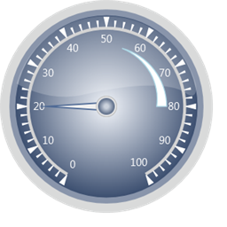

::: {style="DISPLAY: none"}
{#d2h_url_template}{#d2h_package_url style="WIDTH: 0px; DISPLAY: none; HEIGHT: 0px"}
:::

::: {.d2h_secondary_topic style="PADDING-BOTTOM: 10pt; MARGIN: 0pt; PADDING-LEFT: 0pt; PADDING-RIGHT: 0pt; PADDING-TOP: 0pt"}
##### Through CircularGaugeModel {#through-circulargaugemodel style="tab-stops: 0pt"}

 

Step 1:

View:

 

Add the below code in your aspx file.

 

+----------------------------------------------------------------------------------------------------------------------------------------------------------------------------------------------------------------------------------------------------------------------------------------------------------------------------------------------------------------------------------------------------------------------------------------------------------------------------------------------------------------------------------+
| [View\[ASPX\]]{style="FONT-FAMILY: 'Calibri','sans-serif'"}                                                                                                                                                                                                                                                                                                                                                                                                                                                                      |
|                                                                                                                                                                                                                                                                                                                                                                                                                                                                                                                                  |
| [\<%]{style="FONT-FAMILY: 'Calibri','sans-serif'; BACKGROUND: yellow"}[@]{style="FONT-FAMILY: 'Calibri','sans-serif'; COLOR: blue"}[ [Page]{style="COLOR: maroon"} [Language]{style="COLOR: red"}[=\"C#\"]{style="COLOR: blue"} [MasterPageFile]{style="COLOR: red"}[=\"\~/Views/Shared/Site.Master\"]{style="COLOR: blue"} [Inherits]{style="COLOR: red"}[=\"System.Web.Mvc.ViewPage\"]{style="COLOR: blue"} [%\>]{style="BACKGROUND: yellow"}]{style="FONT-FAMILY: 'Calibri','sans-serif'"}                                    |
|                                                                                                                                                                                                                                                                                                                                                                                                                                                                                                                                  |
| [\<]{style="FONT-FAMILY: 'Calibri','sans-serif'; COLOR: blue"}[asp]{style="FONT-FAMILY: 'Calibri','sans-serif'; COLOR: maroon"}[:]{style="FONT-FAMILY: 'Calibri','sans-serif'; COLOR: blue"}[Content]{style="FONT-FAMILY: 'Calibri','sans-serif'; COLOR: maroon"}[ [ID]{style="COLOR: red"}[=\"Content1\"]{style="COLOR: blue"} [ContentPlaceHolderID]{style="COLOR: red"}[=\"TitleContent\"]{style="COLOR: blue"} [runat]{style="COLOR: red"}[=\"server\"\>]{style="COLOR: blue"}]{style="FONT-FAMILY: 'Calibri','sans-serif'"} |
|                                                                                                                                                                                                                                                                                                                                                                                                                                                                                                                                  |
| [    Circular Gauge]{style="FONT-FAMILY: 'Calibri','sans-serif'"}                                                                                                                                                                                                                                                                                                                                                                                                                                                                |
|                                                                                                                                                                                                                                                                                                                                                                                                                                                                                                                                  |
| [\</]{style="FONT-FAMILY: 'Calibri','sans-serif'; COLOR: blue"}[asp]{style="FONT-FAMILY: 'Calibri','sans-serif'; COLOR: maroon"}[:]{style="FONT-FAMILY: 'Calibri','sans-serif'; COLOR: blue"}[Content]{style="FONT-FAMILY: 'Calibri','sans-serif'; COLOR: maroon"}[\>]{style="FONT-FAMILY: 'Calibri','sans-serif'; COLOR: blue"}[]{style="FONT-FAMILY: 'Calibri','sans-serif'"}                                                                                                                                                  |
|                                                                                                                                                                                                                                                                                                                                                                                                                                                                                                                                  |
| []{style="FONT-FAMILY: 'Calibri','sans-serif'"}                                                                                                                                                                                                                                                                                                                                                                                                                                                                                  |
|                                                                                                                                                                                                                                                                                                                                                                                                                                                                                                                                  |
| [\<]{style="FONT-FAMILY: 'Calibri','sans-serif'; COLOR: blue"}[asp]{style="FONT-FAMILY: 'Calibri','sans-serif'; COLOR: maroon"}[:]{style="FONT-FAMILY: 'Calibri','sans-serif'; COLOR: blue"}[Content]{style="FONT-FAMILY: 'Calibri','sans-serif'; COLOR: maroon"}[ [ID]{style="COLOR: red"}[=\"Content2\"]{style="COLOR: blue"} [ContentPlaceHolderID]{style="COLOR: red"}[=\"MainContent\"]{style="COLOR: blue"} [runat]{style="COLOR: red"}[=\"server\"\>]{style="COLOR: blue"}]{style="FONT-FAMILY: 'Calibri','sans-serif'"}  |
|                                                                                                                                                                                                                                                                                                                                                                                                                                                                                                                                  |
| []{style="FONT-FAMILY: 'Calibri','sans-serif'"}                                                                                                                                                                                                                                                                                                                                                                                                                                                                                  |
|                                                                                                                                                                                                                                                                                                                                                                                                                                                                                                                                  |
| [\<%]{style="FONT-FAMILY: 'Calibri','sans-serif'; BACKGROUND: yellow"}[\--Rendering the Circular Gauge\--]{style="FONT-FAMILY: 'Calibri','sans-serif'; COLOR: darkgreen"}[%\>]{style="FONT-FAMILY: 'Calibri','sans-serif'; BACKGROUND: yellow"}[]{style="FONT-FAMILY: 'Calibri','sans-serif'"}                                                                                                                                                                                                                                   |
|                                                                                                                                                                                                                                                                                                                                                                                                                                                                                                                                  |
| [    [\<%]{style="BACKGROUND: yellow"}[=]{style="COLOR: blue"}Html.Syncfusion().CircularGauge([\"Gauge\"]{style="COLOR: #a31515"},([CircularGaugeModel]{style="COLOR: #2b91af"})ViewData\[[\"GaugeModel\"]{style="COLOR: #a31515"}\])[%\>]{style="BACKGROUND: yellow"}]{style="FONT-FAMILY: 'Calibri','sans-serif'"}                                                                                                                                                                                                             |
|                                                                                                                                                                                                                                                                                                                                                                                                                                                                                                                                  |
| []{style="FONT-FAMILY: 'Calibri','sans-serif'"}                                                                                                                                                                                                                                                                                                                                                                                                                                                                                  |
|                                                                                                                                                                                                                                                                                                                                                                                                                                                                                                                                  |
| [\</]{style="FONT-FAMILY: 'Calibri','sans-serif'; COLOR: blue"}[asp]{style="FONT-FAMILY: 'Calibri','sans-serif'; COLOR: maroon"}[:]{style="FONT-FAMILY: 'Calibri','sans-serif'; COLOR: blue"}[Content]{style="FONT-FAMILY: 'Calibri','sans-serif'; COLOR: maroon"}[\>]{style="FONT-FAMILY: 'Calibri','sans-serif'; COLOR: blue"}[]{style="FONT-FAMILY: 'Calibri','sans-serif'"}                                                                                                                                                  |
+----------------------------------------------------------------------------------------------------------------------------------------------------------------------------------------------------------------------------------------------------------------------------------------------------------------------------------------------------------------------------------------------------------------------------------------------------------------------------------------------------------------------------------+

[]{style="FONT-FAMILY: 'Calibri','sans-serif'"} 

 

+----------------------------------------------------------------------------------------------------------------------------------------------------------------------------------------------------------------------------------------------------------------------------------------------------+
| [View\[cshtml\]]{style="FONT-FAMILY: 'Calibri','sans-serif'"}                                                                                                                                                                                                                                      |
|                                                                                                                                                                                                                                                                                                    |
| [\@{]{style="FONT-FAMILY: 'Calibri','sans-serif'; BACKGROUND: yellow"}                                                                                                                                                                                                                             |
|                                                                                                                                                                                                                                                                                                    |
| [Layout=[\"\~/Views/Shared/\_Layout.cshtml\"]{style="COLOR: #a31515"};      ]{style="FONT-FAMILY: Consolas; FONT-SIZE: 9.5pt"}                                                                                                                                                                     |
|                                                                                                                                                                                                                                                                                                    |
| []{style="FONT-FAMILY: 'Calibri','sans-serif'; BACKGROUND: yellow"}                                                                                                                                                                                                                                |
|                                                                                                                                                                                                                                                                                                    |
| [}]{style="FONT-FAMILY: 'Calibri','sans-serif'; BACKGROUND: yellow"}[    ]{style="FONT-FAMILY: 'Calibri','sans-serif'"}                                                                                                                                                                            |
|                                                                                                                                                                                                                                                                                                    |
| [\<]{style="FONT-FAMILY: 'Calibri','sans-serif'; COLOR: blue"}[div]{style="FONT-FAMILY: 'Calibri','sans-serif'; COLOR: maroon"}[\>]{style="FONT-FAMILY: 'Calibri','sans-serif'; COLOR: blue"}                                                                                                      |
|                                                                                                                                                                                                                                                                                                    |
| []{style="FONT-FAMILY: 'Calibri','sans-serif'"}                                                                                                                                                                                                                                                    |
|                                                                                                                                                                                                                                                                                                    |
| [@\*]{style="FONT-FAMILY: 'Calibri','sans-serif'; BACKGROUND: yellow"}[\--Rendering the Circular Gauge\--]{style="FONT-FAMILY: 'Calibri','sans-serif'; COLOR: darkgreen"}[\*@]{style="FONT-FAMILY: 'Calibri','sans-serif'; BACKGROUND: yellow"}[]{style="FONT-FAMILY: 'Calibri','sans-serif'"}     |
|                                                                                                                                                                                                                                                                                                    |
| []{style="FONT-FAMILY: 'Calibri','sans-serif'"}                                                                                                                                                                                                                                                    |
|                                                                                                                                                                                                                                                                                                    |
| [@]{style="FONT-FAMILY: Consolas; BACKGROUND: yellow; FONT-SIZE: 9.5pt"}[Html.Syncfusion().CircularGauge([\"Gauge\"]{style="COLOR: #a31515"},([CircularGaugeModel]{style="COLOR: #2b91af"})ViewData\[[\"GaugeModel\"]{style="COLOR: #a31515"}\])]{style="FONT-FAMILY: Consolas; FONT-SIZE: 9.5pt"} |
|                                                                                                                                                                                                                                                                                                    |
| []{style="FONT-FAMILY: 'Calibri','sans-serif'"}                                                                                                                                                                                                                                                    |
|                                                                                                                                                                                                                                                                                                    |
| [\</]{style="FONT-FAMILY: 'Calibri','sans-serif'; COLOR: blue"}[div]{style="FONT-FAMILY: 'Calibri','sans-serif'; COLOR: maroon"}[\>]{style="FONT-FAMILY: 'Calibri','sans-serif'; COLOR: blue"}[]{style="FONT-FAMILY: 'Calibri','sans-serif'"}                                                      |
+----------------------------------------------------------------------------------------------------------------------------------------------------------------------------------------------------------------------------------------------------------------------------------------------------+

[]{style="FONT-FAMILY: 'Calibri','sans-serif'"} 

Step 2:

Controller:

Add the below code in your controller. Using the **CircularRange** class, we can create the range elements.

And Using **Ranges** collection of **CircularScale** class, we can add the Range.

 

+--------------------------------------------------------------------------------------------------------------------------------------------------------------------------------------+
| []{style="FONT-FAMILY: 'Courier New'; COLOR: blue"}                                                                                                                                  |
|                                                                                                                                                                                      |
| [using]{style="FONT-FAMILY: 'Courier New'; COLOR: blue"}[ System;]{style="FONT-FAMILY: 'Courier New'"}                                                                               |
|                                                                                                                                                                                      |
| [using]{style="FONT-FAMILY: 'Courier New'; COLOR: blue"}[ System.Collections.Generic;]{style="FONT-FAMILY: 'Courier New'"}                                                           |
|                                                                                                                                                                                      |
| [using]{style="FONT-FAMILY: 'Courier New'; COLOR: blue"}[ System.Linq;]{style="FONT-FAMILY: 'Courier New'"}                                                                          |
|                                                                                                                                                                                      |
| [using]{style="FONT-FAMILY: 'Courier New'; COLOR: blue"}[ System.Web;]{style="FONT-FAMILY: 'Courier New'"}                                                                           |
|                                                                                                                                                                                      |
| [using]{style="FONT-FAMILY: 'Courier New'; COLOR: blue"}[ System.Web.Mvc;]{style="FONT-FAMILY: 'Courier New'"}                                                                       |
|                                                                                                                                                                                      |
| [using]{style="FONT-FAMILY: 'Courier New'; COLOR: blue"}[ Syncfusion.Mvc.Gauge;]{style="FONT-FAMILY: 'Courier New'"}                                                                 |
|                                                                                                                                                                                      |
| [using]{style="FONT-FAMILY: 'Courier New'; COLOR: blue"}[ Syncfusion.Mvc.Shared;]{style="FONT-FAMILY: 'Courier New'"}                                                                |
|                                                                                                                                                                                      |
| [using]{style="FONT-FAMILY: 'Courier New'; COLOR: blue"}[ System.Windows.Media;]{style="FONT-FAMILY: 'Courier New'"}                                                                 |
|                                                                                                                                                                                      |
| []{style="FONT-FAMILY: 'Courier New'"}                                                                                                                                               |
|                                                                                                                                                                                      |
| [namespace]{style="FONT-FAMILY: 'Courier New'; COLOR: blue"}[ CircularGauge.Controllers]{style="FONT-FAMILY: 'Courier New'"}                                                         |
|                                                                                                                                                                                      |
| [{]{style="FONT-FAMILY: 'Courier New'"}                                                                                                                                              |
|                                                                                                                                                                                      |
| [    \[[HandleError]{style="COLOR: #2b91af"}\]]{style="FONT-FAMILY: 'Courier New'"}                                                                                                  |
|                                                                                                                                                                                      |
| [    [public]{style="COLOR: blue"} [class]{style="COLOR: blue"} [HomeController]{style="COLOR: #2b91af"} : [Controller]{style="COLOR: #2b91af"}]{style="FONT-FAMILY: 'Courier New'"} |
|                                                                                                                                                                                      |
| [    {]{style="FONT-FAMILY: 'Courier New'"}                                                                                                                                          |
|                                                                                                                                                                                      |
| [        [public]{style="COLOR: blue"} [ActionResult]{style="COLOR: #2b91af"} Index()]{style="FONT-FAMILY: 'Courier New'"}                                                           |
|                                                                                                                                                                                      |
| [        {]{style="FONT-FAMILY: 'Courier New'"}                                                                                                                                      |
|                                                                                                                                                                                      |
| [            [CircularGaugeModel]{style="COLOR: #2b91af"} model = [new]{style="COLOR: blue"} [CircularGaugeModel]{style="COLOR: #2b91af"}();]{style="FONT-FAMILY: 'Courier New'"}    |
|                                                                                                                                                                                      |
| [            model.Radius = 160;]{style="FONT-FAMILY: 'Courier New'"}                                                                                                                |
|                                                                                                                                                                                      |
| [            model.GaugeSkins = [GaugeSkins]{style="COLOR: #2b91af"}.VS2010;]{style="FONT-FAMILY: 'Courier New'"}                                                                    |
|                                                                                                                                                                                      |
| [            model.FrameType = [GaugeFrameType]{style="COLOR: #2b91af"}.CircularWithInnerTopGradient;]{style="FONT-FAMILY: 'Courier New'"}                                           |
|                                                                                                                                                                                      |
| [            [CircularScale]{style="COLOR: #2b91af"} c_Scale = [new]{style="COLOR: blue"} [CircularScale]{style="COLOR: #2b91af"}();]{style="FONT-FAMILY: 'Courier New'"}            |
|                                                                                                                                                                                      |
| [            c_Scale.Maximum = 100;]{style="FONT-FAMILY: 'Courier New'"}                                                                                                             |
|                                                                                                                                                                                      |
| [            c_Scale.Minimum = 0;]{style="FONT-FAMILY: 'Courier New'"}                                                                                                               |
|                                                                                                                                                                                      |
| [            c_Scale.MinorIntervalValue = 2;]{style="FONT-FAMILY: 'Courier New'"}                                                                                                    |
|                                                                                                                                                                                      |
| [            c_Scale.MajorIntervalValue = 10;]{style="FONT-FAMILY: 'Courier New'"}                                                                                                   |
|                                                                                                                                                                                      |
| [            c_Scale.GapSweepAngle = 300;]{style="FONT-FAMILY: 'Courier New'"}                                                                                                       |
|                                                                                                                                                                                      |
| [            c_Scale.Radius = 120;]{style="FONT-FAMILY: 'Courier New'"}                                                                                                              |
|                                                                                                                                                                                      |
| [            c_Scale.StartAngle = 120;]{style="FONT-FAMILY: 'Courier New'"}                                                                                                          |
|                                                                                                                                                                                      |
| [            c_Scale.ScaleBarSize = 4.5;]{style="FONT-FAMILY: 'Courier New'"}                                                                                                        |
|                                                                                                                                                                                      |
| [            c_Scale.PointerCapRadius = 8;]{style="FONT-FAMILY: 'Courier New'"}                                                                                                      |
|                                                                                                                                                                                      |
| [            c_Scale.BackgroundBrush = [Brushes]{style="COLOR: #2b91af"}.LightGray;]{style="FONT-FAMILY: 'Courier New'"}                                                             |
|                                                                                                                                                                                      |
| []{style="FONT-FAMILY: 'Courier New'"}                                                                                                                                               |
|                                                                                                                                                                                      |
| []{style="FONT-FAMILY: 'Courier New'"}                                                                                                                                               |
|                                                                                                                                                                                      |
| [            [TickMark]{style="COLOR: #2b91af"} \_minor = [new]{style="COLOR: blue"} [TickMark]{style="COLOR: #2b91af"}();]{style="FONT-FAMILY: 'Courier New'"}                      |
|                                                                                                                                                                                      |
| [            \_minor.TickStyle = [TickStyle]{style="COLOR: #2b91af"}.MinorTick;]{style="FONT-FAMILY: 'Courier New'"}                                                                 |
|                                                                                                                                                                                      |
| [            \_minor.TickWidth = 2;]{style="FONT-FAMILY: 'Courier New'"}                                                                                                             |
|                                                                                                                                                                                      |
| [            \_minor.TickHeight = 9;]{style="FONT-FAMILY: 'Courier New'"}                                                                                                            |
|                                                                                                                                                                                      |
| [            \_minor.TickShape = [TickShape]{style="COLOR: #2b91af"}.Triangle;]{style="FONT-FAMILY: 'Courier New'"}                                                                  |
|                                                                                                                                                                                      |
| [            \_minor.TickPlacement = [ScalePlacement]{style="COLOR: #2b91af"}.Outside;]{style="FONT-FAMILY: 'Courier New'"}                                                          |
|                                                                                                                                                                                      |
| [            \_minor.Angle = 0;]{style="FONT-FAMILY: 'Courier New'"}                                                                                                                 |
|                                                                                                                                                                                      |
| [            \_minor.BackgroundBrush = [Brushes]{style="COLOR: #2b91af"}.White;]{style="FONT-FAMILY: 'Courier New'"}                                                                 |
|                                                                                                                                                                                      |
| []{style="FONT-FAMILY: 'Courier New'"}                                                                                                                                               |
|                                                                                                                                                                                      |
| [            [TickMark]{style="COLOR: #2b91af"} \_major = [new]{style="COLOR: blue"} [TickMark]{style="COLOR: #2b91af"}();]{style="FONT-FAMILY: 'Courier New'"}                      |
|                                                                                                                                                                                      |
| [            \_major.TickStyle = [TickStyle]{style="COLOR: #2b91af"}.MajorTick;]{style="FONT-FAMILY: 'Courier New'"}                                                                 |
|                                                                                                                                                                                      |
| [            \_major.TickWidth = 7;]{style="FONT-FAMILY: 'Courier New'"}                                                                                                             |
|                                                                                                                                                                                      |
| [            \_major.TickShape = [TickShape]{style="COLOR: #2b91af"}.Triangle;]{style="FONT-FAMILY: 'Courier New'"}                                                                  |
|                                                                                                                                                                                      |
| [            \_major.TickHeight = 14;]{style="FONT-FAMILY: 'Courier New'"}                                                                                                           |
|                                                                                                                                                                                      |
| [            \_major.TickPlacement = [ScalePlacement]{style="COLOR: #2b91af"}.Outside;]{style="FONT-FAMILY: 'Courier New'"}                                                          |
|                                                                                                                                                                                      |
| [            \_major.Angle = 0;]{style="FONT-FAMILY: 'Courier New'"}                                                                                                                 |
|                                                                                                                                                                                      |
| []{style="FONT-FAMILY: 'Courier New'"}                                                                                                                                               |
|                                                                                                                                                                                      |
| [            [GaugeLabelTick]{style="COLOR: #2b91af"} c_LabelTick = [new]{style="COLOR: blue"} [GaugeLabelTick]{style="COLOR: #2b91af"}();]{style="FONT-FAMILY: 'Courier New'"}      |
|                                                                                                                                                                                      |
| [            c_LabelTick.TickStyle = [TickStyle]{style="COLOR: #2b91af"}.MajorTick;]{style="FONT-FAMILY: 'Courier New'"}                                                             |
|                                                                                                                                                                                      |
| [            c_LabelTick.FontSize = 16;]{style="FONT-FAMILY: 'Courier New'"}                                                                                                         |
|                                                                                                                                                                                      |
| [            c_LabelTick.DistanceFromScale = 5;]{style="FONT-FAMILY: 'Courier New'"}                                                                                                 |
|                                                                                                                                                                                      |
| [            c_LabelTick.TickPlacement = [ScalePlacement]{style="COLOR: #2b91af"}.Inside;]{style="FONT-FAMILY: 'Courier New'"}                                                       |
|                                                                                                                                                                                      |
| [            c_LabelTick.Angle = 0;]{style="FONT-FAMILY: 'Courier New'"}                                                                                                             |
|                                                                                                                                                                                      |
| [            c_LabelTick.BackgroundBrush = [Brushes]{style="COLOR: #2b91af"}.White;]{style="FONT-FAMILY: 'Courier New'"}                                                             |
|                                                                                                                                                                                      |
| [            c_LabelTick.IncludeFirstValue = [true]{style="COLOR: blue"};]{style="FONT-FAMILY: 'Courier New'"}                                                                       |
|                                                                                                                                                                                      |
| []{style="FONT-FAMILY: 'Courier New'"}                                                                                                                                               |
|                                                                                                                                                                                      |
| [            [CircularPointer]{style="COLOR: #2b91af"} c_Pointer = [new]{style="COLOR: blue"} [CircularPointer]{style="COLOR: #2b91af"}();]{style="FONT-FAMILY: 'Courier New'"}      |
|                                                                                                                                                                                      |
| [            c_Pointer.PointerLength = 90;]{style="FONT-FAMILY: 'Courier New'"}                                                                                                      |
|                                                                                                                                                                                      |
| [            c_Pointer.PointerWidth = 12;]{style="FONT-FAMILY: 'Courier New'"}                                                                                                       |
|                                                                                                                                                                                      |
| [            c_Pointer.BorderWidth = 2;]{style="FONT-FAMILY: 'Courier New'"}                                                                                                         |
|                                                                                                                                                                                      |
| [            c_Pointer.PointerNeedleType = [PointerNeedleType]{style="COLOR: #2b91af"}.Needle;]{style="FONT-FAMILY: 'Courier New'"}                                                  |
|                                                                                                                                                                                      |
| [            c_Pointer.Value = 20;]{style="FONT-FAMILY: 'Courier New'"}                                                                                                              |
|                                                                                                                                                                                      |
| [            c_Pointer.NeedleStyle = [NeedleStyle]{style="COLOR: #2b91af"}.Triangle;]{style="FONT-FAMILY: 'Courier New'"}                                                            |
|                                                                                                                                                                                      |
| []{style="FONT-FAMILY: 'Courier New'"}                                                                                                                                               |
|                                                                                                                                                                                      |
| [            [//Creating Range element.]{style="COLOR: green"}]{style="FONT-FAMILY: 'Courier New'"}                                                                                  |
|                                                                                                                                                                                      |
| [            [CircularRange]{style="COLOR: #2b91af"} c_Range = [new]{style="COLOR: blue"} [CircularRange]{style="COLOR: #2b91af"}();]{style="FONT-FAMILY: 'Courier New'"}            |
|                                                                                                                                                                                      |
| [            [//Specifying start and end values for the range.]{style="COLOR: green"}]{style="FONT-FAMILY: 'Courier New'"}                                                           |
|                                                                                                                                                                                      |
| [            c_Range.StartValue = 55;]{style="FONT-FAMILY: 'Courier New'"}                                                                                                           |
|                                                                                                                                                                                      |
| [            c_Range.EndValue = 80;]{style="FONT-FAMILY: 'Courier New'"}                                                                                                             |
|                                                                                                                                                                                      |
| [            [//Specifying start and end widths for the range.]{style="COLOR: green"}]{style="FONT-FAMILY: 'Courier New'"}                                                           |
|                                                                                                                                                                                      |
| [            c_Range.StartWidth = 0;]{style="FONT-FAMILY: 'Courier New'"}                                                                                                            |
|                                                                                                                                                                                      |
| [            c_Range.BorderBrush = [Brushes]{style="COLOR: #2b91af"}.LightBlue;]{style="FONT-FAMILY: 'Courier New'"}                                                                 |
|                                                                                                                                                                                      |
| [            c_Range.BackgroundBrush = [Brushes]{style="COLOR: #2b91af"}.White;]{style="FONT-FAMILY: 'Courier New'"}                                                                 |
|                                                                                                                                                                                      |
| [            c_Range.EndWidth = 15;]{style="FONT-FAMILY: 'Courier New'"}                                                                                                             |
|                                                                                                                                                                                      |
| [            [//Setting the position of the range.]{style="COLOR: green"}]{style="FONT-FAMILY: 'Courier New'"}                                                                       |
|                                                                                                                                                                                      |
| [            c_Range.RangePosition = [ScalePlacement]{style="COLOR: #2b91af"}.Inside;]{style="FONT-FAMILY: 'Courier New'"}                                                           |
|                                                                                                                                                                                      |
| [            c_Range.DistanceFromScale = 25;]{style="FONT-FAMILY: 'Courier New'"}                                                                                                    |
|                                                                                                                                                                                      |
| []{style="FONT-FAMILY: 'Courier New'"}                                                                                                                                               |
|                                                                                                                                                                                      |
| [            c_Scale.Pointers.Add(c_Pointer);]{style="FONT-FAMILY: 'Courier New'"}                                                                                                   |
|                                                                                                                                                                                      |
| [            c_Scale.Ticks.Add(\_minor);]{style="FONT-FAMILY: 'Courier New'"}                                                                                                        |
|                                                                                                                                                                                      |
| [            c_Scale.Ticks.Add(\_major);]{style="FONT-FAMILY: 'Courier New'"}                                                                                                        |
|                                                                                                                                                                                      |
| [            c_Scale.Labels.Add(c_LabelTick);]{style="FONT-FAMILY: 'Courier New'"}                                                                                                   |
|                                                                                                                                                                                      |
| []{style="FONT-FAMILY: 'Courier New'"}                                                                                                                                               |
|                                                                                                                                                                                      |
| [            [//Adding the range into circular scale element.]{style="COLOR: green"}]{style="FONT-FAMILY: 'Courier New'"}                                                            |
|                                                                                                                                                                                      |
| [            c_Scale.Ranges.Add(c_Range);]{style="FONT-FAMILY: 'Courier New'"}                                                                                                       |
|                                                                                                                                                                                      |
| [            model.Scales.Add(c_Scale);]{style="FONT-FAMILY: 'Courier New'"}                                                                                                         |
|                                                                                                                                                                                      |
| [            ViewData\[[\"GaugeModel\"]{style="COLOR: #a31515"}\] = model;]{style="FONT-FAMILY: 'Courier New'"}                                                                      |
|                                                                                                                                                                                      |
| [            [return]{style="COLOR: blue"} View();]{style="FONT-FAMILY: 'Courier New'"}                                                                                              |
|                                                                                                                                                                                      |
| [        }]{style="FONT-FAMILY: 'Courier New'"}                                                                                                                                      |
|                                                                                                                                                                                      |
| []{style="FONT-FAMILY: 'Courier New'"}                                                                                                                                               |
|                                                                                                                                                                                      |
| []{style="FONT-FAMILY: 'Courier New'"}                                                                                                                                               |
|                                                                                                                                                                                      |
| [    }]{style="FONT-FAMILY: 'Courier New'"}                                                                                                                                          |
|                                                                                                                                                                                      |
| [}]{style="FONT-FAMILY: 'Courier New'"}                                                                                                                                              |
+--------------------------------------------------------------------------------------------------------------------------------------------------------------------------------------+

**[]{style="FONT-FAMILY: 'Calibri','sans-serif'"}** 

Step 3:

Run the Code. You will get the below output.

[]{style="FONT-FAMILY: 'Calibri','sans-serif'"} 

{border="0"}

Figure 70: Circular Gauge-Range

**[]{style="FONT-FAMILY: 'Calibri','sans-serif'"}** 

[]{#related-topics}
:::
