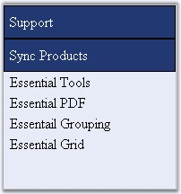

::: {style="DISPLAY: none"}
{#d2h_url_template}{#d2h_package_url style="WIDTH: 0px; DISPLAY: none; HEIGHT: 0px"}
:::

::: {.d2h_secondary_topic style="PADDING-BOTTOM: 10pt; MARGIN: 0pt; PADDING-LEFT: 0pt; PADDING-RIGHT: 0pt; PADDING-TOP: 0pt"}
##### Through Code {#through-code style="tab-stops: 0pt"}

[]{style="FONT-FAMILY: 'Trebuchet MS','sans-serif'; COLOR: #15428b; FONT-SIZE: 9pt"} 

[]{style="FONT-FAMILY: 'Trebuchet MS','sans-serif'; COLOR: #15428b; FONT-SIZE: 9pt"} 

The Groupbar structure can be created from XML file or by building the items in code. This procedure below shows how to add group bar items and to look for an item programmatically.

[]{style="FONT-FAMILY: 'Trebuchet MS','sans-serif'; COLOR: #15428b; FONT-SIZE: 9pt"} 

Creating GroupBar Structure Programmatically

[]{style="FONT-FAMILY: 'Trebuchet MS','sans-serif'; COLOR: #15428b; FONT-SIZE: 9pt"} 

1.   Open a Web application.

9.   In the design view, drag the Groupbar from the toolbox.

10.  Add the following sample code snippet to the code view of the project.

[]{style="FONT-FAMILY: 'Trebuchet MS','sans-serif'; COLOR: #15428b; FONT-SIZE: 9pt"} 

+-----------------------------------------------------------------------------------------------------------------------------------------------------------+
| **[\[C#\]]{style="FONT-FAMILY: 'Courier New'; FONT-SIZE: 9pt"}**                                                                                          |
|                                                                                                                                                           |
| []{style="FONT-FAMILY: 'Courier New'; COLOR: blue; FONT-SIZE: 9pt"}                                                                                       |
|                                                                                                                                                           |
| [if]{style="FONT-FAMILY: 'Courier New'; COLOR: blue; FONT-SIZE: 9pt"}[ (!IsPostBack)]{style="FONT-FAMILY: 'Courier New'; FONT-SIZE: 9pt"}                 |
|                                                                                                                                                           |
| [{]{style="FONT-FAMILY: 'Courier New'; FONT-SIZE: 9pt"}                                                                                                   |
|                                                                                                                                                           |
| [  Syncfusion.Web.UI.WebControls.Tools.GroupBar gbar = Groupbar1;]{style="FONT-FAMILY: 'Courier New'; FONT-SIZE: 9pt"}                                    |
|                                                                                                                                                           |
| []{style="FONT-FAMILY: 'Courier New'; FONT-SIZE: 9pt"}                                                                                                    |
|                                                                                                                                                           |
| [  gbar.Width = 175;]{style="FONT-FAMILY: 'Courier New'; FONT-SIZE: 9pt"}                                                                                 |
|                                                                                                                                                           |
| [  gbar.DefaultTopItemSpacing = 10;]{style="FONT-FAMILY: 'Courier New'; FONT-SIZE: 9pt"}                                                                  |
|                                                                                                                                                           |
| [  gbar.ControlRootCSSClass = [\"TopGroup\"]{style="COLOR: maroon"};]{style="FONT-FAMILY: 'Courier New'; FONT-SIZE: 9pt"}                                 |
|                                                                                                                                                           |
| [  gbar.ExpandSingleGroup = [true]{style="COLOR: blue"};]{style="FONT-FAMILY: 'Courier New'; FONT-SIZE: 9pt"}                                             |
|                                                                                                                                                           |
| []{style="FONT-FAMILY: 'Courier New'; FONT-SIZE: 9pt"}                                                                                                    |
|                                                                                                                                                           |
| [  [//create sub items look]{style="COLOR: green"}]{style="FONT-FAMILY: 'Courier New'; FONT-SIZE: 9pt"}                                                   |
|                                                                                                                                                           |
| [  GroupBarItemLook subPanel = [new]{style="COLOR: blue"} GroupBarItemLook();]{style="FONT-FAMILY: 'Courier New'; FONT-SIZE: 9pt"}                        |
|                                                                                                                                                           |
| [  subPanel.ID = [\"subPanelLook\"]{style="COLOR: maroon"};]{style="FONT-FAMILY: 'Courier New'; FONT-SIZE: 9pt"}                                          |
|                                                                                                                                                           |
| [  subPanel.TextPaddingLeft = 5;]{style="FONT-FAMILY: 'Courier New'; FONT-SIZE: 9pt"}                                                                     |
|                                                                                                                                                           |
| [  subPanel.ImageHeight = 16;]{style="FONT-FAMILY: 'Courier New'; FONT-SIZE: 9pt"}                                                                        |
|                                                                                                                                                           |
| [  subPanel.ImageWidth = 16;]{style="FONT-FAMILY: 'Courier New'; FONT-SIZE: 9pt"}                                                                         |
|                                                                                                                                                           |
| [  subPanel.StateDataDefault.ItemCSSClass = [\"DefChild_ItemCss\"]{style="COLOR: maroon"};]{style="FONT-FAMILY: 'Courier New'; FONT-SIZE: 9pt"}           |
|                                                                                                                                                           |
| [  subPanel.StateDataDefault.TextContainerCSSClass = [\"DefChild_TextCont\"]{style="COLOR: maroon"};]{style="FONT-FAMILY: 'Courier New'; FONT-SIZE: 9pt"} |
|                                                                                                                                                           |
| [  subPanel.StateDataHover.ItemCSSClass = [\"HovChild_ItemCss\"]{style="COLOR: maroon"};]{style="FONT-FAMILY: 'Courier New'; FONT-SIZE: 9pt"}             |
|                                                                                                                                                           |
| [  subPanel.StateDataHover.TextContainerCSSClass = [\"HovChild_TextCont\"]{style="COLOR: maroon"};]{style="FONT-FAMILY: 'Courier New'; FONT-SIZE: 9pt"}   |
|                                                                                                                                                           |
| []{style="FONT-FAMILY: 'Courier New'; FONT-SIZE: 9pt"}                                                                                                    |
|                                                                                                                                                           |
| [  [//create top items look]{style="COLOR: green"}]{style="FONT-FAMILY: 'Courier New'; FONT-SIZE: 9pt"}                                                   |
|                                                                                                                                                           |
| [  GroupBarItemLook topItem = [new]{style="COLOR: blue"} GroupBarItemLook();]{style="FONT-FAMILY: 'Courier New'; FONT-SIZE: 9pt"}                         |
|                                                                                                                                                           |
| [  topItem.ID = [\"topItemLook\"]{style="COLOR: maroon"};]{style="FONT-FAMILY: 'Courier New'; FONT-SIZE: 9pt"}                                            |
|                                                                                                                                                           |
| [  topItem.StateDataDefault.ItemCSSClass = [\"DefRoot_ItemCss\"]{style="COLOR: maroon"};]{style="FONT-FAMILY: 'Courier New'; FONT-SIZE: 9pt"}             |
|                                                                                                                                                           |
| [  topItem.StateDataDefault.TextContainerCSSClass = [\"DefRoot_TextCont\"]{style="COLOR: maroon"};]{style="FONT-FAMILY: 'Courier New'; FONT-SIZE: 9pt"}   |
|                                                                                                                                                           |
| [  topItem.StateDataHover.ItemCSSClass = [\"HovRoot_ItemCss\"]{style="COLOR: maroon"};]{style="FONT-FAMILY: 'Courier New'; FONT-SIZE: 9pt"}               |
|                                                                                                                                                           |
| [  topItem.StateDataHover.TextContainerCSSClass = [\"HovRoot_TextCont\"]{style="COLOR: maroon"};]{style="FONT-FAMILY: 'Courier New'; FONT-SIZE: 9pt"}     |
|                                                                                                                                                           |
| [  topItem.StateDataExpanded.ItemCSSClass = [\"DefRoot_ItemCss\"]{style="COLOR: maroon"};]{style="FONT-FAMILY: 'Courier New'; FONT-SIZE: 9pt"}            |
|                                                                                                                                                           |
| [  topItem.StateDataExpanded.TextContainerCSSClass = [\"DefRoot_TextCont\"]{style="COLOR: maroon"};]{style="FONT-FAMILY: 'Courier New'; FONT-SIZE: 9pt"}  |
|                                                                                                                                                           |
| []{style="FONT-FAMILY: 'Courier New'; FONT-SIZE: 9pt"}                                                                                                    |
|                                                                                                                                                           |
| [  [//add item looks to the groupbar]{style="COLOR: green"}]{style="FONT-FAMILY: 'Courier New'; FONT-SIZE: 9pt"}                                          |
|                                                                                                                                                           |
| [  gbar.ItemLooks.Add(subPanel);]{style="FONT-FAMILY: 'Courier New'; FONT-SIZE: 9pt"}                                                                     |
|                                                                                                                                                           |
| [  gbar.ItemLooks.Add(topItem);]{style="FONT-FAMILY: 'Courier New'; FONT-SIZE: 9pt"}                                                                      |
|                                                                                                                                                           |
| []{style="FONT-FAMILY: 'Courier New'; FONT-SIZE: 9pt"}                                                                                                    |
|                                                                                                                                                           |
| [  [//create groupbar items]{style="COLOR: green"}]{style="FONT-FAMILY: 'Courier New'; FONT-SIZE: 9pt"}                                                   |
|                                                                                                                                                           |
| [  GroupBarItem networkTasks = [new]{style="COLOR: blue"} GroupBarItem();]{style="FONT-FAMILY: 'Courier New'; FONT-SIZE: 9pt"}                            |
|                                                                                                                                                           |
| [  networkTasks.Expanded = [true]{style="COLOR: blue"};]{style="FONT-FAMILY: 'Courier New'; FONT-SIZE: 9pt"}                                              |
|                                                                                                                                                           |
| [  networkTasks.Text = [\"File and Folder Tasks\"]{style="COLOR: maroon"};]{style="FONT-FAMILY: 'Courier New'; FONT-SIZE: 9pt"}                           |
|                                                                                                                                                           |
| [  networkTasks.ControlSubPanelCSSClass = [\"Level2Group\"]{style="COLOR: maroon"};]{style="FONT-FAMILY: 'Courier New'; FONT-SIZE: 9pt"}                  |
|                                                                                                                                                           |
| [  networkTasks.Look = [\"topItemLook\"]{style="COLOR: maroon"};]{style="FONT-FAMILY: 'Courier New'; FONT-SIZE: 9pt"}                                     |
|                                                                                                                                                           |
| []{style="FONT-FAMILY: 'Courier New'; FONT-SIZE: 9pt"}                                                                                                    |
|                                                                                                                                                           |
| [  GroupBarItem networkPlace = [new]{style="COLOR: blue"} GroupBarItem();]{style="FONT-FAMILY: 'Courier New'; FONT-SIZE: 9pt"}                            |
|                                                                                                                                                           |
| [  networkPlace.Text = [\"Email this folder\'s file\"]{style="COLOR: maroon"};]{style="FONT-FAMILY: 'Courier New'; FONT-SIZE: 9pt"}                       |
|                                                                                                                                                           |
| [  networkPlace.Look = [\"subPanelLook\"]{style="COLOR: maroon"};]{style="FONT-FAMILY: 'Courier New'; FONT-SIZE: 9pt"}                                    |
|                                                                                                                                                           |
| [  networkPlace.ExpandImageURL = [\"email.gif\"]{style="COLOR: maroon"};]{style="FONT-FAMILY: 'Courier New'; FONT-SIZE: 9pt"}                             |
|                                                                                                                                                           |
| []{style="FONT-FAMILY: 'Courier New'; FONT-SIZE: 9pt"}                                                                                                    |
|                                                                                                                                                           |
| [  GroupBarItem viewConnection = [new]{style="COLOR: blue"} GroupBarItem();]{style="FONT-FAMILY: 'Courier New'; FONT-SIZE: 9pt"}                          |
|                                                                                                                                                           |
| [  viewConnection.Text = [\"View network \"]{style="COLOR: maroon"};]{style="FONT-FAMILY: 'Courier New'; FONT-SIZE: 9pt"}                                 |
|                                                                                                                                                           |
| [  viewConnection.Look = [\"subPanelLook\"]{style="COLOR: maroon"};]{style="FONT-FAMILY: 'Courier New'; FONT-SIZE: 9pt"}                                  |
|                                                                                                                                                           |
| [  viewConnection.ExpandImageURL = [\"publish.gif\"]{style="COLOR: maroon"};]{style="FONT-FAMILY: 'Courier New'; FONT-SIZE: 9pt"}                         |
|                                                                                                                                                           |
| [  gbar.Items.Add(networkTasks);]{style="FONT-FAMILY: 'Courier New'; FONT-SIZE: 9pt"}                                                                     |
|                                                                                                                                                           |
| [  networkTasks.Items.Add(networkPlace);]{style="FONT-FAMILY: 'Courier New'; FONT-SIZE: 9pt"}                                                             |
|                                                                                                                                                           |
| [  networkTasks.Items.Add(viewConnection);]{style="FONT-FAMILY: 'Courier New'; FONT-SIZE: 9pt"}                                                           |
|                                                                                                                                                           |
| [}]{style="FONT-FAMILY: 'Courier New'; FONT-SIZE: 9pt"}                                                                                                   |
+-----------------------------------------------------------------------------------------------------------------------------------------------------------+

[]{style="FONT-FAMILY: 'Trebuchet MS','sans-serif'; COLOR: #15428b; FONT-SIZE: 9pt"} 

+----------------------------------------------------------------------------------------------------------------------------------------------------------------------------------------------------------------------------------+
| **[\[VB\]]{style="FONT-FAMILY: 'Courier New'; FONT-SIZE: 9pt"}**                                                                                                                                                                 |
|                                                                                                                                                                                                                                  |
| []{style="FONT-FAMILY: 'Courier New'; COLOR: blue; FONT-SIZE: 9pt"}                                                                                                                                                              |
|                                                                                                                                                                                                                                  |
| [If]{style="FONT-FAMILY: 'Courier New'; COLOR: blue; FONT-SIZE: 9pt"}[ ([Not]{style="COLOR: blue"} IsPostBack) [Then]{style="COLOR: blue"}]{style="FONT-FAMILY: 'Courier New'; FONT-SIZE: 9pt"}                                  |
|                                                                                                                                                                                                                                  |
| [Dim]{style="FONT-FAMILY: 'Courier New'; COLOR: blue; FONT-SIZE: 9pt"}[ gbar [As]{style="COLOR: blue"} Syncfusion.Web.UI.WebControls.Tools.GroupBar = Groupbar1]{style="FONT-FAMILY: 'Courier New'; FONT-SIZE: 9pt"}             |
|                                                                                                                                                                                                                                  |
| []{style="FONT-FAMILY: 'Courier New'; FONT-SIZE: 9pt"}                                                                                                                                                                           |
|                                                                                                                                                                                                                                  |
| [  gbar.Width = 175]{style="FONT-FAMILY: 'Courier New'; FONT-SIZE: 9pt"}                                                                                                                                                         |
|                                                                                                                                                                                                                                  |
| [  gbar.DefaultTopItemSpacing = 10]{style="FONT-FAMILY: 'Courier New'; FONT-SIZE: 9pt"}                                                                                                                                          |
|                                                                                                                                                                                                                                  |
| [  gbar.ControlRootCSSClass = [\"TopGroup\"]{style="COLOR: maroon"}]{style="FONT-FAMILY: 'Courier New'; FONT-SIZE: 9pt"}                                                                                                         |
|                                                                                                                                                                                                                                  |
| [  gbar.ExpandSingleGroup = [True]{style="COLOR: blue"}]{style="FONT-FAMILY: 'Courier New'; FONT-SIZE: 9pt"}                                                                                                                     |
|                                                                                                                                                                                                                                  |
| []{style="FONT-FAMILY: 'Courier New'; COLOR: blue; FONT-SIZE: 9pt"}                                                                                                                                                              |
|                                                                                                                                                                                                                                  |
| [\'create sub items look]{style="FONT-FAMILY: 'Courier New'; COLOR: green; FONT-SIZE: 9pt"}                                                                                                                                      |
|                                                                                                                                                                                                                                  |
| [Dim]{style="FONT-FAMILY: 'Courier New'; COLOR: blue; FONT-SIZE: 9pt"}[ subPanel [As]{style="COLOR: blue"} GroupBarItemLook = [New]{style="COLOR: blue"} GroupBarItemLook()]{style="FONT-FAMILY: 'Courier New'; FONT-SIZE: 9pt"} |
|                                                                                                                                                                                                                                  |
| [  subPanel.ID = [\"subPanelLook\"]{style="COLOR: maroon"}]{style="FONT-FAMILY: 'Courier New'; FONT-SIZE: 9pt"}                                                                                                                  |
|                                                                                                                                                                                                                                  |
| [  subPanel.TextPaddingLeft = 5]{style="FONT-FAMILY: 'Courier New'; FONT-SIZE: 9pt"}                                                                                                                                             |
|                                                                                                                                                                                                                                  |
| [  subPanel.ImageHeight = 16]{style="FONT-FAMILY: 'Courier New'; FONT-SIZE: 9pt"}                                                                                                                                                |
|                                                                                                                                                                                                                                  |
| [  subPanel.ImageWidth = 16]{style="FONT-FAMILY: 'Courier New'; FONT-SIZE: 9pt"}                                                                                                                                                 |
|                                                                                                                                                                                                                                  |
| [  subPanel.StateDataDefault.ItemCSSClass = [\"DefChild_ItemCss\"]{style="COLOR: maroon"}]{style="FONT-FAMILY: 'Courier New'; FONT-SIZE: 9pt"}                                                                                   |
|                                                                                                                                                                                                                                  |
| [  subPanel.StateDataDefault.TextContainerCSSClass = [\"DefChild_TextCont\"]{style="COLOR: maroon"}]{style="FONT-FAMILY: 'Courier New'; FONT-SIZE: 9pt"}                                                                         |
|                                                                                                                                                                                                                                  |
| [  subPanel.StateDataHover.ItemCSSClass = [\"HovChild_ItemCss\"]{style="COLOR: maroon"}]{style="FONT-FAMILY: 'Courier New'; FONT-SIZE: 9pt"}                                                                                     |
|                                                                                                                                                                                                                                  |
| [  subPanel.StateDataHover.TextContainerCSSClass = [\"HovChild_TextCont\"]{style="COLOR: maroon"}]{style="FONT-FAMILY: 'Courier New'; FONT-SIZE: 9pt"}                                                                           |
|                                                                                                                                                                                                                                  |
| []{style="FONT-FAMILY: 'Courier New'; COLOR: maroon; FONT-SIZE: 9pt"}                                                                                                                                                            |
|                                                                                                                                                                                                                                  |
| [\'create top items look]{style="FONT-FAMILY: 'Courier New'; COLOR: green; FONT-SIZE: 9pt"}                                                                                                                                      |
|                                                                                                                                                                                                                                  |
| [Dim]{style="FONT-FAMILY: 'Courier New'; COLOR: blue; FONT-SIZE: 9pt"}[ topItem [As]{style="COLOR: blue"} GroupBarItemLook = [New]{style="COLOR: blue"} GroupBarItemLook()]{style="FONT-FAMILY: 'Courier New'; FONT-SIZE: 9pt"}  |
|                                                                                                                                                                                                                                  |
| [  topItem.ID = [\"topItemLook\"]{style="COLOR: maroon"}]{style="FONT-FAMILY: 'Courier New'; FONT-SIZE: 9pt"}                                                                                                                    |
|                                                                                                                                                                                                                                  |
| [  topItem.StateDataDefault.ItemCSSClass = [\"DefRoot_ItemCss\"]{style="COLOR: maroon"}]{style="FONT-FAMILY: 'Courier New'; FONT-SIZE: 9pt"}                                                                                     |
|                                                                                                                                                                                                                                  |
| [  topItem.StateDataDefault.TextContainerCSSClass = [\"DefRoot_TextCont\"]{style="COLOR: maroon"}]{style="FONT-FAMILY: 'Courier New'; FONT-SIZE: 9pt"}                                                                           |
|                                                                                                                                                                                                                                  |
| [  topItem.StateDataHover.ItemCSSClass = [\"HovRoot_ItemCss\"]{style="COLOR: maroon"}]{style="FONT-FAMILY: 'Courier New'; FONT-SIZE: 9pt"}                                                                                       |
|                                                                                                                                                                                                                                  |
| [  topItem.StateDataHover.TextContainerCSSClass = [\"HovRoot_TextCont\"]{style="COLOR: maroon"}]{style="FONT-FAMILY: 'Courier New'; FONT-SIZE: 9pt"}                                                                             |
|                                                                                                                                                                                                                                  |
| [  topItem.StateDataExpanded.ItemCSSClass = [\"DefRoot_ItemCss\"]{style="COLOR: maroon"}]{style="FONT-FAMILY: 'Courier New'; FONT-SIZE: 9pt"}                                                                                    |
|                                                                                                                                                                                                                                  |
| [  topItem.StateDataExpanded.TextContainerCSSClass = [\"DefRoot_TextCont\"]{style="COLOR: maroon"}]{style="FONT-FAMILY: 'Courier New'; FONT-SIZE: 9pt"}                                                                          |
|                                                                                                                                                                                                                                  |
| []{style="FONT-FAMILY: 'Courier New'; COLOR: maroon; FONT-SIZE: 9pt"}                                                                                                                                                            |
|                                                                                                                                                                                                                                  |
| [\'add item looks to the groupbar]{style="FONT-FAMILY: 'Courier New'; COLOR: green; FONT-SIZE: 9pt"}                                                                                                                             |
|                                                                                                                                                                                                                                  |
| [  gbar.ItemLooks.Add(subPanel)]{style="FONT-FAMILY: 'Courier New'; FONT-SIZE: 9pt"}                                                                                                                                             |
|                                                                                                                                                                                                                                  |
| [  gbar.ItemLooks.Add(topItem)]{style="FONT-FAMILY: 'Courier New'; FONT-SIZE: 9pt"}                                                                                                                                              |
|                                                                                                                                                                                                                                  |
| []{style="FONT-FAMILY: 'Courier New'; FONT-SIZE: 9pt"}                                                                                                                                                                           |
|                                                                                                                                                                                                                                  |
| [\'create groupbar items]{style="FONT-FAMILY: 'Courier New'; COLOR: green; FONT-SIZE: 9pt"}                                                                                                                                      |
|                                                                                                                                                                                                                                  |
| [Dim]{style="FONT-FAMILY: 'Courier New'; COLOR: blue; FONT-SIZE: 9pt"}[ networkTasks [As]{style="COLOR: blue"} GroupBarItem = [New]{style="COLOR: blue"} GroupBarItem()]{style="FONT-FAMILY: 'Courier New'; FONT-SIZE: 9pt"}     |
|                                                                                                                                                                                                                                  |
| [  networkTasks.Expanded = [True]{style="COLOR: blue"}]{style="FONT-FAMILY: 'Courier New'; FONT-SIZE: 9pt"}                                                                                                                      |
|                                                                                                                                                                                                                                  |
| [  networkTasks.Text = [\"File and Folder Tasks\"]{style="COLOR: maroon"}]{style="FONT-FAMILY: 'Courier New'; FONT-SIZE: 9pt"}                                                                                                   |
|                                                                                                                                                                                                                                  |
| [  networkTasks.ControlSubPanelCSSClass = [\"Level2Group\"]{style="COLOR: maroon"}]{style="FONT-FAMILY: 'Courier New'; FONT-SIZE: 9pt"}                                                                                          |
|                                                                                                                                                                                                                                  |
| [  networkTasks.Look = [\"topItemLook\"]{style="COLOR: maroon"}]{style="FONT-FAMILY: 'Courier New'; FONT-SIZE: 9pt"}                                                                                                             |
|                                                                                                                                                                                                                                  |
| []{style="FONT-FAMILY: 'Courier New'; COLOR: maroon; FONT-SIZE: 9pt"}                                                                                                                                                            |
|                                                                                                                                                                                                                                  |
| [Dim]{style="FONT-FAMILY: 'Courier New'; COLOR: blue; FONT-SIZE: 9pt"}[ networkPlace [As]{style="COLOR: blue"} GroupBarItem = [New]{style="COLOR: blue"} GroupBarItem()]{style="FONT-FAMILY: 'Courier New'; FONT-SIZE: 9pt"}     |
|                                                                                                                                                                                                                                  |
| [  networkPlace.Text = [\"Email this folder\'s file\"]{style="COLOR: maroon"}]{style="FONT-FAMILY: 'Courier New'; FONT-SIZE: 9pt"}                                                                                               |
|                                                                                                                                                                                                                                  |
| [  networkPlace.Look = [\"subPanelLook\"]{style="COLOR: maroon"}]{style="FONT-FAMILY: 'Courier New'; FONT-SIZE: 9pt"}                                                                                                            |
|                                                                                                                                                                                                                                  |
| [  networkPlace.ExpandImageURL = [\"email.gif\"]{style="COLOR: maroon"}]{style="FONT-FAMILY: 'Courier New'; FONT-SIZE: 9pt"}                                                                                                     |
|                                                                                                                                                                                                                                  |
| []{style="FONT-FAMILY: 'Courier New'; COLOR: maroon; FONT-SIZE: 9pt"}                                                                                                                                                            |
|                                                                                                                                                                                                                                  |
| [Dim]{style="FONT-FAMILY: 'Courier New'; COLOR: blue; FONT-SIZE: 9pt"}[ viewConnection [As]{style="COLOR: blue"} GroupBarItem = [New]{style="COLOR: blue"} GroupBarItem()]{style="FONT-FAMILY: 'Courier New'; FONT-SIZE: 9pt"}   |
|                                                                                                                                                                                                                                  |
| [  viewConnection.Text = [\"View network \"]{style="COLOR: maroon"}]{style="FONT-FAMILY: 'Courier New'; FONT-SIZE: 9pt"}                                                                                                         |
|                                                                                                                                                                                                                                  |
| [  viewConnection.Look = [\"subPanelLook\"]{style="COLOR: maroon"}]{style="FONT-FAMILY: 'Courier New'; FONT-SIZE: 9pt"}                                                                                                          |
|                                                                                                                                                                                                                                  |
| [  viewConnection.ExpandImageURL = [\"publish.gif\"]{style="COLOR: maroon"}]{style="FONT-FAMILY: 'Courier New'; FONT-SIZE: 9pt"}                                                                                                 |
|                                                                                                                                                                                                                                  |
| [  gbar.Items.Add(networkTasks)]{style="FONT-FAMILY: 'Courier New'; FONT-SIZE: 9pt"}                                                                                                                                             |
|                                                                                                                                                                                                                                  |
| [  networkTasks.Items.Add(networkPlace)]{style="FONT-FAMILY: 'Courier New'; FONT-SIZE: 9pt"}                                                                                                                                     |
|                                                                                                                                                                                                                                  |
| [  networkTasks.Items.Add(viewConnection)]{style="FONT-FAMILY: 'Courier New'; FONT-SIZE: 9pt"}                                                                                                                                   |
|                                                                                                                                                                                                                                  |
| [End]{style="FONT-FAMILY: 'Courier New'; COLOR: blue; FONT-SIZE: 9pt"}[ [If]{style="COLOR: blue"}]{style="FONT-FAMILY: 'Courier New'; FONT-SIZE: 9pt"}                                                                           |
+----------------------------------------------------------------------------------------------------------------------------------------------------------------------------------------------------------------------------------+

[]{style="FONT-FAMILY: 'Trebuchet MS','sans-serif'; COLOR: #15428b; FONT-SIZE: 9pt"} 

11.  Build and run the application.

[]{style="FONT-FAMILY: 'Trebuchet MS','sans-serif'; COLOR: #15428b; FONT-SIZE: 9pt"} 

{border="0"}

**[]{style="FONT-FAMILY: 'Trebuchet MS','sans-serif'; COLOR: #15428b; FONT-SIZE: 9pt"}** 

Figure 327: Programmatically created GroupBar

[]{#p433} 

[]{#related-topics}
:::
