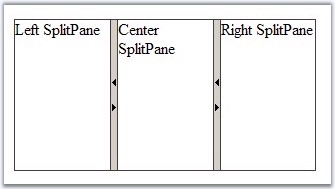
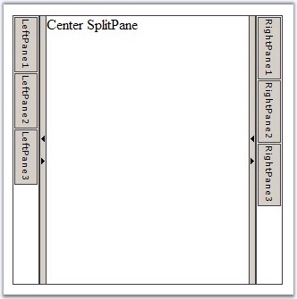

::: {style="DISPLAY: none"}
{#d2h_url_template}{#d2h_package_url style="WIDTH: 0px; DISPLAY: none; HEIGHT: 0px"}
:::

::: {.d2h_secondary_topic style="PADDING-BOTTOM: 10pt; MARGIN: 0pt; PADDING-LEFT: 0pt; PADDING-RIGHT: 0pt; PADDING-TOP: 0pt"}
##### Through Code {#through-code style="tab-stops: 0pt"}

[]{style="FONT-FAMILY: 'Trebuchet MS','sans-serif'; COLOR: #15428b; FONT-SIZE: 9pt"} 

You can configure the contents of the Syncfusion Splitter programmatically. To do that you need to create SplitPanes and SplitterBars object and add them to the Items collection of their parent Splitter. **Items** property is not persisted in the ViewState and if you create the Splitter in the code-behind you need to recreate them on every postback / callback.

 

The following code example demonstrates how to create single Splitter control with three SplitPanes programmatically.

[]{style="FONT-FAMILY: 'Trebuchet MS','sans-serif'; COLOR: #15428b; FONT-SIZE: 9pt"} 

+--------------------------------------------------------------------------------------------------------------------------------------------------------------------------------------------------------------------+
| **[\[C#\]]{style="FONT-FAMILY: 'Courier New'"}**                                                                                                                                                                   |
|                                                                                                                                                                                                                    |
| []{style="FONT-FAMILY: 'Courier New'; COLOR: blue"}                                                                                                                                                                |
|                                                                                                                                                                                                                    |
| [protected]{style="FONT-FAMILY: 'Courier New'; COLOR: blue"}[ [void]{style="COLOR: blue"} Page_Load([object]{style="COLOR: blue"} sender, [EventArgs]{style="COLOR: teal"} e)]{style="FONT-FAMILY: 'Courier New'"} |
|                                                                                                                                                                                                                    |
| [{]{style="FONT-FAMILY: 'Courier New'"}                                                                                                                                                                            |
|                                                                                                                                                                                                                    |
| [      [//create Splitter control]{style="COLOR: green"}]{style="FONT-FAMILY: 'Courier New'"}                                                                                                                      |
|                                                                                                                                                                                                                    |
| [      [Splitter]{style="COLOR: teal"} splitter = [new]{style="COLOR: blue"} [Splitter]{style="COLOR: teal"}();]{style="FONT-FAMILY: 'Courier New'"}                                                               |
|                                                                                                                                                                                                                    |
| [      splitter.Height = [Unit]{style="COLOR: teal"}.Pixel( 150 );]{style="FONT-FAMILY: 'Courier New'"}                                                                                                            |
|                                                                                                                                                                                                                    |
| [      splitter.Width = [Unit]{style="COLOR: teal"}.Pixel( 300 );]{style="FONT-FAMILY: 'Courier New'"}                                                                                                             |
|                                                                                                                                                                                                                    |
| [      splitter.ResizeMode = [SplitterResizeMode]{style="COLOR: teal"}.Proportional;]{style="FONT-FAMILY: 'Courier New'"}                                                                                          |
|                                                                                                                                                                                                                    |
| [      form1.Controls.Add( splitter );]{style="FONT-FAMILY: 'Courier New'"}                                                                                                                                        |
|                                                                                                                                                                                                                    |
| []{style="FONT-FAMILY: 'Courier New'"}                                                                                                                                                                             |
|                                                                                                                                                                                                                    |
| [      [//create Left SplitPane]{style="COLOR: green"}]{style="FONT-FAMILY: 'Courier New'"}                                                                                                                        |
|                                                                                                                                                                                                                    |
| [      [SplitPane]{style="COLOR: teal"} SplitPane_Left = [new]{style="COLOR: blue"} [SplitPane]{style="COLOR: teal"}();]{style="FONT-FAMILY: 'Courier New'"}                                                       |
|                                                                                                                                                                                                                    |
| [      SplitPane_Left.ID = [\"SplitPane_Left\"]{style="COLOR: maroon"};]{style="FONT-FAMILY: 'Courier New'"}                                                                                                       |
|                                                                                                                                                                                                                    |
| [      SplitPane_Left.Controls.Add( [new]{style="COLOR: blue"} [LiteralControl]{style="COLOR: teal"}( [\"Left SplitPane\"]{style="COLOR: maroon"} ) );]{style="FONT-FAMILY: 'Courier New'"}                        |
|                                                                                                                                                                                                                    |
| [      splitter.Items.Add( SplitPane_Left );]{style="FONT-FAMILY: 'Courier New'"}                                                                                                                                  |
|                                                                                                                                                                                                                    |
| []{style="FONT-FAMILY: 'Courier New'"}                                                                                                                                                                             |
|                                                                                                                                                                                                                    |
| [      [//create SplitterBar]{style="COLOR: green"}]{style="FONT-FAMILY: 'Courier New'"}                                                                                                                           |
|                                                                                                                                                                                                                    |
| [      [SplitterBar]{style="COLOR: teal"} splitterbar1 = [new]{style="COLOR: blue"} [SplitterBar]{style="COLOR: teal"}();]{style="FONT-FAMILY: 'Courier New'"}                                                     |
|                                                                                                                                                                                                                    |
| [      splitterbar1.ID = [\"SplitterBar1\"]{style="COLOR: maroon"};]{style="FONT-FAMILY: 'Courier New'"}                                                                                                           |
|                                                                                                                                                                                                                    |
| [      splitterbar1.CollapseMode = [SplitterBarCollapseMode]{style="COLOR: teal"}.Both;]{style="FONT-FAMILY: 'Courier New'"}                                                                                       |
|                                                                                                                                                                                                                    |
| [      splitter.Items.Add( splitterbar1 );]{style="FONT-FAMILY: 'Courier New'"}                                                                                                                                    |
|                                                                                                                                                                                                                    |
| []{style="FONT-FAMILY: 'Courier New'"}                                                                                                                                                                             |
|                                                                                                                                                                                                                    |
| [      [//create Center SplitPane]{style="COLOR: green"}]{style="FONT-FAMILY: 'Courier New'"}                                                                                                                      |
|                                                                                                                                                                                                                    |
| [      [SplitPane]{style="COLOR: teal"} SplitPane_Center = [new]{style="COLOR: blue"} [SplitPane]{style="COLOR: teal"}();]{style="FONT-FAMILY: 'Courier New'"}                                                     |
|                                                                                                                                                                                                                    |
| [      SplitPane_Center.ID = [\"SplitPane_Center\"]{style="COLOR: maroon"};       ]{style="FONT-FAMILY: 'Courier New'"}                                                                                            |
|                                                                                                                                                                                                                    |
| [      SplitPane_Center.Controls.Add( [new]{style="COLOR: blue"} [LiteralControl]{style="COLOR: teal"}( [\"Center SplitPane\"]{style="COLOR: maroon"} ) );]{style="FONT-FAMILY: 'Courier New'"}                    |
|                                                                                                                                                                                                                    |
| [      splitter.Items.Add( SplitPane_Center );]{style="FONT-FAMILY: 'Courier New'"}                                                                                                                                |
|                                                                                                                                                                                                                    |
| []{style="FONT-FAMILY: 'Courier New'"}                                                                                                                                                                             |
|                                                                                                                                                                                                                    |
| [      [//create SplitterBar]{style="COLOR: green"}]{style="FONT-FAMILY: 'Courier New'"}                                                                                                                           |
|                                                                                                                                                                                                                    |
| [      [SplitterBar]{style="COLOR: teal"} splitterbar2 = [new]{style="COLOR: blue"} [SplitterBar]{style="COLOR: teal"}();]{style="FONT-FAMILY: 'Courier New'"}                                                     |
|                                                                                                                                                                                                                    |
| [      splitterbar2.ID = [\"SplitterBar2\"]{style="COLOR: maroon"};]{style="FONT-FAMILY: 'Courier New'"}                                                                                                           |
|                                                                                                                                                                                                                    |
| [      splitterbar2.CollapseMode = [SplitterBarCollapseMode]{style="COLOR: teal"}.Both;]{style="FONT-FAMILY: 'Courier New'"}                                                                                       |
|                                                                                                                                                                                                                    |
| [      splitter.Items.Add( splitterbar2 );]{style="FONT-FAMILY: 'Courier New'"}                                                                                                                                    |
|                                                                                                                                                                                                                    |
| []{style="FONT-FAMILY: 'Courier New'"}                                                                                                                                                                             |
|                                                                                                                                                                                                                    |
| [      [//create Right SplitPane]{style="COLOR: green"}]{style="FONT-FAMILY: 'Courier New'"}                                                                                                                       |
|                                                                                                                                                                                                                    |
| [      [SplitPane]{style="COLOR: teal"} SplitPane_Right = [new]{style="COLOR: blue"} [SplitPane]{style="COLOR: teal"}();]{style="FONT-FAMILY: 'Courier New'"}                                                      |
|                                                                                                                                                                                                                    |
| [      SplitPane_Right.ID = [\"SplitPane_Right\"]{style="COLOR: maroon"};         ]{style="FONT-FAMILY: 'Courier New'"}                                                                                            |
|                                                                                                                                                                                                                    |
| [      SplitPane_Right.Controls.Add( [new]{style="COLOR: blue"} [LiteralControl]{style="COLOR: teal"}( [\"Right SplitPane\"]{style="COLOR: maroon"} ) );]{style="FONT-FAMILY: 'Courier New'"}                      |
|                                                                                                                                                                                                                    |
| [      splitter.Items.Add( SplitPane_Right );]{style="FONT-FAMILY: 'Courier New'"}                                                                                                                                 |
|                                                                                                                                                                                                                    |
| [}]{style="FONT-FAMILY: 'Courier New'"}                                                                                                                                                                            |
+--------------------------------------------------------------------------------------------------------------------------------------------------------------------------------------------------------------------+

[]{style="FONT-FAMILY: 'Trebuchet MS','sans-serif'; COLOR: #15428b; FONT-SIZE: 9pt"} 

The result will look like this.

[]{style="FONT-FAMILY: 'Trebuchet MS','sans-serif'; COLOR: #15428b; FONT-SIZE: 9pt"} 

{border="0"}

Figure 393: Splitter control through code

[]{style="FONT-FAMILY: 'Trebuchet MS','sans-serif'; COLOR: #15428b; FONT-SIZE: 9pt"} 

Also you can create SlidingZones programmatically and add them to the Controls collection of existing SplitPane controls as follows.

[]{style="FONT-FAMILY: 'Trebuchet MS','sans-serif'; COLOR: #15428b; FONT-SIZE: 9pt"} 

+--------------------------------------------------------------------------------------------------------------------------------------------------------------------------------------------------------------------+
| **[\[C#\]]{style="FONT-FAMILY: 'Courier New'"}**                                                                                                                                                                   |
|                                                                                                                                                                                                                    |
| []{style="FONT-FAMILY: 'Courier New'; COLOR: blue"}                                                                                                                                                                |
|                                                                                                                                                                                                                    |
| [protected]{style="FONT-FAMILY: 'Courier New'; COLOR: blue"}[ [void]{style="COLOR: blue"} Page_Load([object]{style="COLOR: blue"} sender, [EventArgs]{style="COLOR: teal"} e)]{style="FONT-FAMILY: 'Courier New'"} |
|                                                                                                                                                                                                                    |
| [{]{style="FONT-FAMILY: 'Courier New'"}                                                                                                                                                                            |
|                                                                                                                                                                                                                    |
| [      [//create Splitter control]{style="COLOR: green"}]{style="FONT-FAMILY: 'Courier New'"}                                                                                                                      |
|                                                                                                                                                                                                                    |
| [      [Splitter]{style="COLOR: teal"} splitter = [new]{style="COLOR: blue"} [Splitter]{style="COLOR: teal"}();]{style="FONT-FAMILY: 'Courier New'"}                                                               |
|                                                                                                                                                                                                                    |
| [      splitter.Layout = [SplitterLayout]{style="COLOR: teal"}.Horizontal;]{style="FONT-FAMILY: 'Courier New'"}                                                                                                    |
|                                                                                                                                                                                                                    |
| [      splitter.Height = [Unit]{style="COLOR: teal"}.Pixel( 300 );]{style="FONT-FAMILY: 'Courier New'"}                                                                                                            |
|                                                                                                                                                                                                                    |
| [      splitter.Width = [Unit]{style="COLOR: teal"}.Pixel( 300 );]{style="FONT-FAMILY: 'Courier New'"}                                                                                                             |
|                                                                                                                                                                                                                    |
| [      form1.Controls.Add( splitter );]{style="FONT-FAMILY: 'Courier New'"}                                                                                                                                        |
|                                                                                                                                                                                                                    |
| []{style="FONT-FAMILY: 'Courier New'"}                                                                                                                                                                             |
|                                                                                                                                                                                                                    |
| [      [//create Left SplitPane for Left SlidingZone]{style="COLOR: green"}]{style="FONT-FAMILY: 'Courier New'"}                                                                                                   |
|                                                                                                                                                                                                                    |
| [      [SplitPane]{style="COLOR: teal"} SplitPane_Left = [new]{style="COLOR: blue"} [SplitPane]{style="COLOR: teal"}();]{style="FONT-FAMILY: 'Courier New'"}                                                       |
|                                                                                                                                                                                                                    |
| [      SplitPane_Left.ID = [\"SplitPane_Left\"]{style="COLOR: maroon"};]{style="FONT-FAMILY: 'Courier New'"}                                                                                                       |
|                                                                                                                                                                                                                    |
| [      splitter.Items.Add( SplitPane_Left );]{style="FONT-FAMILY: 'Courier New'"}                                                                                                                                  |
|                                                                                                                                                                                                                    |
| []{style="FONT-FAMILY: 'Courier New'"}                                                                                                                                                                             |
|                                                                                                                                                                                                                    |
| [      [//create Left SlidingZone]{style="COLOR: green"}]{style="FONT-FAMILY: 'Courier New'"}                                                                                                                      |
|                                                                                                                                                                                                                    |
| [      [SlidingZone]{style="COLOR: teal"} SlidingZone_Left = [new]{style="COLOR: blue"} [SlidingZone]{style="COLOR: teal"}();]{style="FONT-FAMILY: 'Courier New'"}                                                 |
|                                                                                                                                                                                                                    |
| [      SlidingZone_Left.ID = [\"LeftSlidingZone\"]{style="COLOR: maroon"};]{style="FONT-FAMILY: 'Courier New'"}                                                                                                    |
|                                                                                                                                                                                                                    |
| [      SlidingZone_Left.SlideDirection= [SplitterSlideDirection]{style="COLOR: teal"}.Right;]{style="FONT-FAMILY: 'Courier New'"}                                                                                  |
|                                                                                                                                                                                                                    |
| [      SplitPane_Left.Controls.Add( SlidingZone_Left );]{style="FONT-FAMILY: 'Courier New'"}                                                                                                                       |
|                                                                                                                                                                                                                    |
| []{style="FONT-FAMILY: 'Courier New'"}                                                                                                                                                                             |
|                                                                                                                                                                                                                    |
| [      [for]{style="COLOR: blue"}( [int]{style="COLOR: blue"} i = 1; i \<= 3; i++ )]{style="FONT-FAMILY: 'Courier New'"}                                                                                           |
|                                                                                                                                                                                                                    |
| [      {]{style="FONT-FAMILY: 'Courier New'"}                                                                                                                                                                      |
|                                                                                                                                                                                                                    |
| [            [SlidingPane]{style="COLOR: teal"} slidingpane = [new]{style="COLOR: blue"} [SlidingPane]{style="COLOR: teal"}();]{style="FONT-FAMILY: 'Courier New'"}                                                |
|                                                                                                                                                                                                                    |
| [            slidingpane.ID = [\"LeftPane\"]{style="COLOR: maroon"} + i;]{style="FONT-FAMILY: 'Courier New'"}                                                                                                      |
|                                                                                                                                                                                                                    |
| [            slidingpane.Title = [\"LeftPane\"]{style="COLOR: maroon"} + i;]{style="FONT-FAMILY: 'Courier New'"}                                                                                                   |
|                                                                                                                                                                                                                    |
| [            slidingpane.Width = [Unit]{style="COLOR: teal"}.Pixel( 120 );]{style="FONT-FAMILY: 'Courier New'"}                                                                                                    |
|                                                                                                                                                                                                                    |
| [            SlidingZone_Left.Items.Add( slidingpane );]{style="FONT-FAMILY: 'Courier New'"}                                                                                                                       |
|                                                                                                                                                                                                                    |
| [      }]{style="FONT-FAMILY: 'Courier New'"}                                                                                                                                                                      |
|                                                                                                                                                                                                                    |
| []{style="FONT-FAMILY: 'Courier New'"}                                                                                                                                                                             |
|                                                                                                                                                                                                                    |
| [      [//create SplitterBar]{style="COLOR: green"}]{style="FONT-FAMILY: 'Courier New'"}                                                                                                                           |
|                                                                                                                                                                                                                    |
| [      [SplitterBar]{style="COLOR: teal"} splitterbar1 = [new]{style="COLOR: blue"} [SplitterBar]{style="COLOR: teal"}();]{style="FONT-FAMILY: 'Courier New'"}                                                     |
|                                                                                                                                                                                                                    |
| [      splitterbar1.ID = [\"SplitterBar1\"]{style="COLOR: maroon"};]{style="FONT-FAMILY: 'Courier New'"}                                                                                                           |
|                                                                                                                                                                                                                    |
| [      splitterbar1.CollapseMode = [SplitterBarCollapseMode]{style="COLOR: teal"}.Both;]{style="FONT-FAMILY: 'Courier New'"}                                                                                       |
|                                                                                                                                                                                                                    |
| [      splitter.Items.Add( splitterbar1 );]{style="FONT-FAMILY: 'Courier New'"}                                                                                                                                    |
|                                                                                                                                                                                                                    |
| []{style="FONT-FAMILY: 'Courier New'"}                                                                                                                                                                             |
|                                                                                                                                                                                                                    |
| [      [//create Center SplitPane]{style="COLOR: green"}]{style="FONT-FAMILY: 'Courier New'"}                                                                                                                      |
|                                                                                                                                                                                                                    |
| [      [SplitPane]{style="COLOR: teal"} SplitPane_Center = [new]{style="COLOR: blue"} [SplitPane]{style="COLOR: teal"}();]{style="FONT-FAMILY: 'Courier New'"}                                                     |
|                                                                                                                                                                                                                    |
| [      SplitPane_Center.ID = [\"SplitPane_Center\"]{style="COLOR: maroon"};       ]{style="FONT-FAMILY: 'Courier New'"}                                                                                            |
|                                                                                                                                                                                                                    |
| [      SplitPane_Center.Controls.Add( [new]{style="COLOR: blue"} [LiteralControl]{style="COLOR: teal"}( [\"Center SplitPane\"]{style="COLOR: maroon"} ) );]{style="FONT-FAMILY: 'Courier New'"}                    |
|                                                                                                                                                                                                                    |
| [      splitter.Items.Add( SplitPane_Center );]{style="FONT-FAMILY: 'Courier New'"}                                                                                                                                |
|                                                                                                                                                                                                                    |
| []{style="FONT-FAMILY: 'Courier New'"}                                                                                                                                                                             |
|                                                                                                                                                                                                                    |
| [      [//create SplitterBar]{style="COLOR: green"}]{style="FONT-FAMILY: 'Courier New'"}                                                                                                                           |
|                                                                                                                                                                                                                    |
| [      [SplitterBar]{style="COLOR: teal"} splitterbar2 = [new]{style="COLOR: blue"} [SplitterBar]{style="COLOR: teal"}();]{style="FONT-FAMILY: 'Courier New'"}                                                     |
|                                                                                                                                                                                                                    |
| [      splitterbar2.ID = [\"SplitterBar2\"]{style="COLOR: maroon"};]{style="FONT-FAMILY: 'Courier New'"}                                                                                                           |
|                                                                                                                                                                                                                    |
| [      splitterbar2.CollapseMode = [SplitterBarCollapseMode]{style="COLOR: teal"}.Both;]{style="FONT-FAMILY: 'Courier New'"}                                                                                       |
|                                                                                                                                                                                                                    |
| [      splitter.Items.Add( splitterbar2 );]{style="FONT-FAMILY: 'Courier New'"}                                                                                                                                    |
|                                                                                                                                                                                                                    |
| []{style="FONT-FAMILY: 'Courier New'"}                                                                                                                                                                             |
|                                                                                                                                                                                                                    |
| [      [//create Right SplitPane for Left SlidingZone]{style="COLOR: green"}]{style="FONT-FAMILY: 'Courier New'"}                                                                                                  |
|                                                                                                                                                                                                                    |
| [      [SplitPane]{style="COLOR: teal"} SplitPane_Right = [new]{style="COLOR: blue"} [SplitPane]{style="COLOR: teal"}();]{style="FONT-FAMILY: 'Courier New'"}                                                      |
|                                                                                                                                                                                                                    |
| [      SplitPane_Right.ID = [\"SplitPane_Right\"]{style="COLOR: maroon"};]{style="FONT-FAMILY: 'Courier New'"}                                                                                                     |
|                                                                                                                                                                                                                    |
| [      splitter.Items.Add( SplitPane_Right );]{style="FONT-FAMILY: 'Courier New'"}                                                                                                                                 |
|                                                                                                                                                                                                                    |
| []{style="FONT-FAMILY: 'Courier New'"}                                                                                                                                                                             |
|                                                                                                                                                                                                                    |
| [      [//create Right SlidingZone]{style="COLOR: green"}]{style="FONT-FAMILY: 'Courier New'"}                                                                                                                     |
|                                                                                                                                                                                                                    |
| [      [SlidingZone]{style="COLOR: teal"} SlidingZone_Right = [new]{style="COLOR: blue"} [SlidingZone]{style="COLOR: teal"}();]{style="FONT-FAMILY: 'Courier New'"}                                                |
|                                                                                                                                                                                                                    |
| [      SlidingZone_Right.ID = [\"RightSlidingZone\"]{style="COLOR: maroon"};]{style="FONT-FAMILY: 'Courier New'"}                                                                                                  |
|                                                                                                                                                                                                                    |
| [      SlidingZone_Right.SlideDirection= [SplitterSlideDirection]{style="COLOR: teal"}.Left;]{style="FONT-FAMILY: 'Courier New'"}                                                                                  |
|                                                                                                                                                                                                                    |
| [      SplitPane_Right.Controls.Add( SlidingZone_Right );]{style="FONT-FAMILY: 'Courier New'"}                                                                                                                     |
|                                                                                                                                                                                                                    |
| []{style="FONT-FAMILY: 'Courier New'"}                                                                                                                                                                             |
|                                                                                                                                                                                                                    |
| [      [for]{style="COLOR: blue"}( [int]{style="COLOR: blue"} i = 1; i \<= 3; i++ )]{style="FONT-FAMILY: 'Courier New'"}                                                                                           |
|                                                                                                                                                                                                                    |
| [      {]{style="FONT-FAMILY: 'Courier New'"}                                                                                                                                                                      |
|                                                                                                                                                                                                                    |
| [            [SlidingPane]{style="COLOR: teal"} slidingpane = [new]{style="COLOR: blue"} [SlidingPane]{style="COLOR: teal"}();]{style="FONT-FAMILY: 'Courier New'"}                                                |
|                                                                                                                                                                                                                    |
| [            slidingpane.ID = [\"RightPane\"]{style="COLOR: maroon"} + i;               ]{style="FONT-FAMILY: 'Courier New'"}                                                                                      |
|                                                                                                                                                                                                                    |
| [            slidingpane.Title = [\"RightPane\"]{style="COLOR: maroon"} + i;]{style="FONT-FAMILY: 'Courier New'"}                                                                                                  |
|                                                                                                                                                                                                                    |
| [            slidingpane.Width = [Unit]{style="COLOR: teal"}.Pixel( 120 );]{style="FONT-FAMILY: 'Courier New'"}                                                                                                    |
|                                                                                                                                                                                                                    |
| [            SlidingZone_Right.Items.Add( slidingpane );]{style="FONT-FAMILY: 'Courier New'"}                                                                                                                      |
|                                                                                                                                                                                                                    |
| [      }           ]{style="FONT-FAMILY: 'Courier New'"}                                                                                                                                                           |
|                                                                                                                                                                                                                    |
| [}]{style="FONT-FAMILY: 'Courier New'"}                                                                                                                                                                            |
+--------------------------------------------------------------------------------------------------------------------------------------------------------------------------------------------------------------------+

[]{style="FONT-FAMILY: 'Trebuchet MS','sans-serif'; COLOR: #15428b; FONT-SIZE: 9pt"} 

The result will look like this.

[]{style="FONT-FAMILY: 'Trebuchet MS','sans-serif'; COLOR: #15428b; FONT-SIZE: 9pt"} 

{border="0"}

Figure 394: Splitting control with Sliding zones added through code

 

[]{#related-topics}
:::
