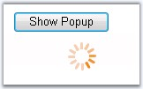

::: {style="DISPLAY: none"}
{#d2h_url_template}{#d2h_package_url style="WIDTH: 0px; DISPLAY: none; HEIGHT: 0px"}
:::

::: {.d2h_secondary_topic style="PADDING-BOTTOM: 10pt; MARGIN: 0pt; PADDING-LEFT: 0pt; PADDING-RIGHT: 0pt; PADDING-TOP: 0pt"}
##### Through Code {#through-code style="tab-stops: 0pt"}

[]{style="FONT-FAMILY: 'Trebuchet MS','sans-serif'; COLOR: #15428b; FONT-SIZE: 9pt"} 

To create WaitingPopup control programmatically, to appear during some process indicating the loading or refreshing process, follow the below given steps.

[]{style="FONT-FAMILY: 'Trebuchet MS','sans-serif'; COLOR: #15428b; FONT-SIZE: 9pt"} 

{border="0"}

**[]{style="FONT-FAMILY: 'Trebuchet MS','sans-serif'; COLOR: #15428b; FONT-SIZE: 9pt"}** 

Figure 422: WaitingPopup initiated for a html element

[]{style="FONT-FAMILY: 'Trebuchet MS','sans-serif'; COLOR: #15428b; FONT-SIZE: 9pt"} 

1.   The following namespaces should be added to the code behind file.

[]{style="FONT-FAMILY: 'Trebuchet MS','sans-serif'; COLOR: #15428b; FONT-SIZE: 9pt"} 

+-------------------------------------------------------------------------------------------------------------------------------------+
| **[\[C#\]]{style="FONT-FAMILY: 'Courier New'"}**                                                                                    |
|                                                                                                                                     |
| **[]{style="FONT-FAMILY: 'Courier New'"}**                                                                                          |
|                                                                                                                                     |
| [using]{style="FONT-FAMILY: 'Courier New'; COLOR: blue"}[ Syncfusion.Web.UI.WebControls.Tools;]{style="FONT-FAMILY: 'Courier New'"} |
+-------------------------------------------------------------------------------------------------------------------------------------+

[]{style="FONT-FAMILY: 'Trebuchet MS','sans-serif'; COLOR: #15428b; FONT-SIZE: 9pt"} 

+--------------------------------------------------------------------------------------------------------------------------------------+
| **[\[VB\]]{style="FONT-FAMILY: 'Courier New'"}**                                                                                     |
|                                                                                                                                      |
| **[]{style="FONT-FAMILY: 'Courier New'"}**                                                                                           |
|                                                                                                                                      |
| [Imports]{style="FONT-FAMILY: 'Courier New'; COLOR: blue"}[ Syncfusion.Web.UI.WebControls.Tools]{style="FONT-FAMILY: 'Courier New'"} |
+--------------------------------------------------------------------------------------------------------------------------------------+

[]{style="FONT-FAMILY: 'Trebuchet MS','sans-serif'; COLOR: #15428b; FONT-SIZE: 9pt"} 

2.   Instantiate the WaitingPopup control and add it to the form to display it.

[]{style="FONT-FAMILY: 'Trebuchet MS','sans-serif'; COLOR: #15428b; FONT-SIZE: 9pt"} 

+-----------------------------------------------------------------------------------------------------------------------------------------------------------------------------------------+
| **[\[C#\]]{style="FONT-FAMILY: 'Courier New'"}**                                                                                                                                        |
|                                                                                                                                                                                         |
| **[]{style="FONT-FAMILY: 'Courier New'"}**                                                                                                                                              |
|                                                                                                                                                                                         |
| [WaitingPopup]{style="FONT-FAMILY: 'Courier New'; COLOR: teal"}[ WaitingPopup1 = [new]{style="COLOR: blue"} [WaitingPopup]{style="COLOR: teal"}();]{style="FONT-FAMILY: 'Courier New'"} |
|                                                                                                                                                                                         |
| [WaitingPopup1.ID = [\"Popup\"]{style="COLOR: maroon"};]{style="FONT-FAMILY: 'Courier New'"}                                                                                            |
|                                                                                                                                                                                         |
| [WaitingPopup1.ClientObjectID = [\"Pop\"]{style="COLOR: maroon"};]{style="FONT-FAMILY: 'Courier New'"}                                                                                  |
|                                                                                                                                                                                         |
| [WaitingPopup1.PositionParent = [PopupPositionType]{style="COLOR: teal"}.Element;]{style="FONT-FAMILY: 'Courier New'"}                                                                  |
|                                                                                                                                                                                         |
| [WaitingPopup1.DisabledBackgroundColor = System.Drawing.[Color]{style="COLOR: teal"}.Cornsilk;]{style="FONT-FAMILY: 'Courier New'"}                                                     |
|                                                                                                                                                                                         |
| [WaitingPopup1.DisableOnShowElementID = [\"panel1\"]{style="COLOR: maroon"};]{style="FONT-FAMILY: 'Courier New'"}                                                                       |
|                                                                                                                                                                                         |
| [WaitingPopup1.Width = 250;]{style="FONT-FAMILY: 'Courier New'"}                                                                                                                        |
|                                                                                                                                                                                         |
| [WaitingPopup1.Height = 50;]{style="FONT-FAMILY: 'Courier New'"}                                                                                                                        |
|                                                                                                                                                                                         |
| [WaitingPopup1.GroupingText = [\"Process Loading\....\"]{style="COLOR: maroon"};]{style="FONT-FAMILY: 'Courier New'"}                                                                   |
|                                                                                                                                                                                         |
| [WaitingPopup1.CloseTimeOut = 1000;]{style="FONT-FAMILY: 'Courier New'"}                                                                                                                |
|                                                                                                                                                                                         |
| [form1.Controls.Add(WaitingPopup1);]{style="FONT-FAMILY: 'Courier New'"}                                                                                                                |
|                                                                                                                                                                                         |
| []{style="FONT-FAMILY: 'Courier New'"}                                                                                                                                                  |
|                                                                                                                                                                                         |
| [press.OnClientClick = [\"javascript:Pop.ShowPopup(); return false;\"]{style="COLOR: maroon"};]{style="FONT-FAMILY: 'Courier New'"}                                                     |
+-----------------------------------------------------------------------------------------------------------------------------------------------------------------------------------------+

[]{style="FONT-FAMILY: 'Trebuchet MS','sans-serif'; COLOR: #15428b; FONT-SIZE: 9pt"} 

+---------------------------------------------------------------------------------------------------------------------------------------------------------------------------------------------------+
| **[\[VB\]]{style="FONT-FAMILY: 'Courier New'"}**                                                                                                                                                  |
|                                                                                                                                                                                                   |
| []{style="COLOR: black"}                                                                                                                                                                          |
|                                                                                                                                                                                                   |
| [Private]{style="FONT-FAMILY: 'Courier New'; COLOR: blue"}[ WaitingPopup1 [As]{style="COLOR: blue"} WaitingPopup = [New]{style="COLOR: blue"} WaitingPopup()]{style="FONT-FAMILY: 'Courier New'"} |
|                                                                                                                                                                                                   |
| [Private]{style="FONT-FAMILY: 'Courier New'; COLOR: blue"}[ WaitingPopup1.ID = [\"Popup\"]{style="COLOR: maroon"}]{style="FONT-FAMILY: 'Courier New'"}                                            |
|                                                                                                                                                                                                   |
| [Private]{style="FONT-FAMILY: 'Courier New'; COLOR: blue"}[ WaitingPopup1.ClientObjectID = [\"Pop\"]{style="COLOR: maroon"}]{style="FONT-FAMILY: 'Courier New'"}                                  |
|                                                                                                                                                                                                   |
| [Private]{style="FONT-FAMILY: 'Courier New'; COLOR: blue"}[ WaitingPopup1.PositionParent = PopupPositionType.Element]{style="FONT-FAMILY: 'Courier New'"}                                         |
|                                                                                                                                                                                                   |
| [Private]{style="FONT-FAMILY: 'Courier New'; COLOR: blue"}[ WaitingPopup1.DisabledBackgroundColor = System.Drawing.Color.Cornsilk]{style="FONT-FAMILY: 'Courier New'"}                            |
|                                                                                                                                                                                                   |
| [Private]{style="FONT-FAMILY: 'Courier New'; COLOR: blue"}[ WaitingPopup1.DisableOnShowElementID = [\"panel1\"]{style="COLOR: maroon"}]{style="FONT-FAMILY: 'Courier New'"}                       |
|                                                                                                                                                                                                   |
| [Private]{style="FONT-FAMILY: 'Courier New'; COLOR: blue"}[ WaitingPopup1.Width = 250]{style="FONT-FAMILY: 'Courier New'"}                                                                        |
|                                                                                                                                                                                                   |
| [Private]{style="FONT-FAMILY: 'Courier New'; COLOR: blue"}[ WaitingPopup1.Height = 50]{style="FONT-FAMILY: 'Courier New'"}                                                                        |
|                                                                                                                                                                                                   |
| [Private]{style="FONT-FAMILY: 'Courier New'; COLOR: blue"}[ WaitingPopup1.GroupingText = [\"Process Loading\...\"]{style="COLOR: maroon"}]{style="FONT-FAMILY: 'Courier New'"}                    |
|                                                                                                                                                                                                   |
| [Private]{style="FONT-FAMILY: 'Courier New'; COLOR: blue"}[ WaitingPopup1.CloseTimeOut = 2000]{style="FONT-FAMILY: 'Courier New'"}                                                                |
|                                                                                                                                                                                                   |
| [form1.Controls.Add(WaitingPopup1)]{style="FONT-FAMILY: 'Courier New'"}                                                                                                                           |
|                                                                                                                                                                                                   |
| []{style="FONT-FAMILY: 'Courier New'"}                                                                                                                                                            |
|                                                                                                                                                                                                   |
| [Private]{style="FONT-FAMILY: 'Courier New'; COLOR: blue"}[ press.OnClientClick = [\"javascript:Pop.ShowPopup(); return false;\"]{style="COLOR: maroon"}]{style="FONT-FAMILY: 'Courier New'"}     |
+---------------------------------------------------------------------------------------------------------------------------------------------------------------------------------------------------+

[]{style="FONT-FAMILY: 'Trebuchet MS','sans-serif'; COLOR: #15428b; FONT-SIZE: 9pt"} 

The waiting popup can be displayed on the page or any html control. Also the controls can be disabled during the loading process and many more features can be applied, which has been discussed in [Concepts and Features]{.UGHyperlink} topic.

[]{style="FONT-FAMILY: 'Trebuchet MS','sans-serif'; COLOR: #15428b; FONT-SIZE: 9pt"} 

3.   Build and run the application to view the popup control on clicking the Button.

[]{style="FONT-FAMILY: 'Trebuchet MS','sans-serif'; COLOR: #15428b; FONT-SIZE: 9pt"} 

See Also

[]{style="FONT-FAMILY: 'Trebuchet MS','sans-serif'; COLOR: #15428b; FONT-SIZE: 9pt"} 

[Concepts and Features]{.UGHyperlink}[, ]{.UGHyperlink}[Creating WaitingPopup Through Designer]{.UGHyperlink}[]{.UGHyperlink}

 

[]{#p573} 

[]{#related-topics}
:::
