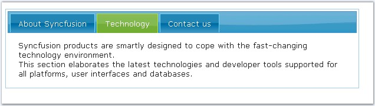

::: {style="DISPLAY: none"}
{#d2h_url_template}{#d2h_package_url style="WIDTH: 0px; DISPLAY: none; HEIGHT: 0px"}
:::

::: {.d2h_secondary_topic style="PADDING-BOTTOM: 10pt; MARGIN: 0pt; PADDING-LEFT: 0pt; PADDING-RIGHT: 0pt; PADDING-TOP: 0pt"}
##### Through Code {#through-code style="tab-stops: 0pt"}

[]{style="FONT-FAMILY: 'Trebuchet MS','sans-serif'; COLOR: #15428b; FONT-SIZE: 9pt"} 

The following steps illustrate how to create the jQueryUITabs control programmatically.

[]{style="FONT-FAMILY: 'Trebuchet MS','sans-serif'; COLOR: #15428b; FONT-SIZE: 9pt"} 

1.   Add the required namespace.

[]{style="FONT-FAMILY: 'Trebuchet MS','sans-serif'; COLOR: #15428b; FONT-SIZE: 9pt"} 

+--------------------------------------------------------------------------------------------------------------------------------------+
| **[\[C#\]]{style="FONT-FAMILY: 'Courier New'"}**                                                                                     |
|                                                                                                                                      |
| []{style="FONT-FAMILY: 'Courier New'; COLOR: blue"}                                                                                  |
|                                                                                                                                      |
| [using]{style="FONT-FAMILY: 'Courier New'; COLOR: blue"}[ Syncfusion.Web.UI.WebControls.Shared;]{style="FONT-FAMILY: 'Courier New'"} |
+--------------------------------------------------------------------------------------------------------------------------------------+

**[]{style="FONT-FAMILY: 'Trebuchet MS','sans-serif'; COLOR: #15428b; FONT-SIZE: 9pt"}** 

+---------------------------------------------------------------------------------------------------------------------------------------+
| **[\[VB\]]{style="FONT-FAMILY: 'Courier New'"}**                                                                                      |
|                                                                                                                                       |
| []{style="FONT-FAMILY: 'Courier New'; COLOR: blue"}                                                                                   |
|                                                                                                                                       |
| [Imports]{style="FONT-FAMILY: 'Courier New'; COLOR: blue"}[ Syncfusion.Web.UI.WebControls.Shared]{style="FONT-FAMILY: 'Courier New'"} |
+---------------------------------------------------------------------------------------------------------------------------------------+

[]{style="FONT-FAMILY: 'Trebuchet MS','sans-serif'; COLOR: #15428b; FONT-SIZE: 9pt"} 

2.   Instantiate and add the control to the form. Also set the required features and properties, if required.

[]{style="FONT-FAMILY: 'Trebuchet MS','sans-serif'; COLOR: #15428b; FONT-SIZE: 9pt"} 

+-----------------------------------------------------------------------------------------------------------------------------------------------+
| **[\[C#\]]{style="FONT-FAMILY: 'Courier New'"}**                                                                                              |
|                                                                                                                                               |
| []{style="FONT-FAMILY: 'Courier New'; COLOR: blue"}                                                                                           |
|                                                                                                                                               |
| [jQueryUITab Tab = [new]{style="COLOR: blue"} jQueryUITab();]{style="FONT-FAMILY: 'Courier New'"}                                             |
|                                                                                                                                               |
| [jQueryUITabItem TabItem = [new]{style="COLOR: blue"} jQueryUITabItem();]{style="FONT-FAMILY: 'Courier New'"}                                 |
|                                                                                                                                               |
| [TabItem.ID = [\"Item1\"]{style="COLOR: maroon"};]{style="FONT-FAMILY: 'Courier New'"}                                                        |
|                                                                                                                                               |
| [TabItem.Text = [\"Header1\"]{style="COLOR: maroon"};]{style="FONT-FAMILY: 'Courier New'"}                                                    |
|                                                                                                                                               |
| [HtmlGenericControl hgc=[new]{style="COLOR: blue"} HtmlGenericControl([\"div\"]{style="COLOR: maroon"});]{style="FONT-FAMILY: 'Courier New'"} |
|                                                                                                                                               |
| [hgc.InnerHtml = [\"This is the content of header1\"]{style="COLOR: maroon"};]{style="FONT-FAMILY: 'Courier New'"}                            |
|                                                                                                                                               |
| [TabItem.Controls.Add(hgc);]{style="FONT-FAMILY: 'Courier New'"}                                                                              |
|                                                                                                                                               |
| [Tab.Items.Add(TabItem);]{style="FONT-FAMILY: 'Courier New'"}                                                                                 |
|                                                                                                                                               |
| [this]{style="FONT-FAMILY: 'Courier New'; COLOR: blue"}[.form1.Controls.Add(Tab);]{style="FONT-FAMILY: 'Courier New'"}                        |
+-----------------------------------------------------------------------------------------------------------------------------------------------+

**[]{style="FONT-FAMILY: 'Trebuchet MS','sans-serif'; COLOR: #15428b; FONT-SIZE: 9pt"}** 

+-------------------------------------------------------------------------------------------------------------------------------------------------------------------------------------------------------------+
| **[\[VB\]]{style="FONT-FAMILY: 'Courier New'"}**                                                                                                                                                            |
|                                                                                                                                                                                                             |
| []{style="FONT-FAMILY: 'Courier New'; COLOR: blue"}                                                                                                                                                         |
|                                                                                                                                                                                                             |
| [Dim]{style="FONT-FAMILY: 'Courier New'; COLOR: blue"}[ Tab [As]{style="COLOR: blue"} [New]{style="COLOR: blue"} jQueryUITab()]{style="FONT-FAMILY: 'Courier New'"}                                         |
|                                                                                                                                                                                                             |
| [Dim]{style="FONT-FAMILY: 'Courier New'; COLOR: blue"}[ TabItem [As]{style="COLOR: blue"} [New]{style="COLOR: blue"} jQueryUITabItem()]{style="FONT-FAMILY: 'Courier New'"}                                 |
|                                                                                                                                                                                                             |
| [TabItem.ID = [\"Item1\"]{style="COLOR: #a31515"}]{style="FONT-FAMILY: 'Courier New'"}                                                                                                                      |
|                                                                                                                                                                                                             |
| [TabItem.Text = [\"Header1\"]{style="COLOR: #a31515"}]{style="FONT-FAMILY: 'Courier New'"}                                                                                                                  |
|                                                                                                                                                                                                             |
| [Dim]{style="FONT-FAMILY: 'Courier New'; COLOR: blue"}[ hgc [As]{style="COLOR: blue"} [New]{style="COLOR: blue"} HtmlGenericControl([\"div\"]{style="COLOR: #a31515"})]{style="FONT-FAMILY: 'Courier New'"} |
|                                                                                                                                                                                                             |
| [hgc.InnerHtml = [\"This is the content of header1\"]{style="COLOR: #a31515"}]{style="FONT-FAMILY: 'Courier New'"}                                                                                          |
|                                                                                                                                                                                                             |
| [TabItem.Controls.Add(hgc)]{style="FONT-FAMILY: 'Courier New'"}                                                                                                                                             |
|                                                                                                                                                                                                             |
| [Tab.Items.Add(TabItem)]{style="FONT-FAMILY: 'Courier New'"}                                                                                                                                                |
|                                                                                                                                                                                                             |
| [Me]{style="FONT-FAMILY: 'Courier New'; COLOR: blue"}[.form1.Controls.Add(Tab)]{style="FONT-FAMILY: 'Courier New'"}                                                                                         |
+-------------------------------------------------------------------------------------------------------------------------------------------------------------------------------------------------------------+

[]{style="FONT-FAMILY: 'Trebuchet MS','sans-serif'; COLOR: #15428b; FONT-SIZE: 9pt"} 

{border="0"}

 

Figure 461: jQueryUITabs Control

 

[]{#related-topics}
:::
