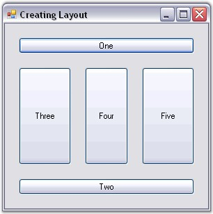

::: {style="DISPLAY: none"}
{#d2h_url_template}{#d2h_package_url style="WIDTH: 0px; DISPLAY: none; HEIGHT: 0px"}
:::

::: {.d2h_secondary_topic style="PADDING-BOTTOM: 10pt; MARGIN: 0pt; PADDING-LEFT: 0pt; PADDING-RIGHT: 0pt; PADDING-TOP: 0pt"}
#### Through Code {#through-code style="tab-stops: 0pt"}

[]{style="COLOR: #15428b"} 

The following steps will help you to create a simple layout for button controls, via code. Here the programmatic creation of the BorderLayout is discussed. Similarly other layouts can also be created.

[]{style="COLOR: #15428b"} 

[·      ]{style="FONT-FAMILY: Symbol"}Create a new Visual C# or VB.NET application in Visual Studio .NET.

[·      ]{style="FONT-FAMILY: Symbol"}Add the Syncfusion.Shared.Base and Syncfusion.Tools.Windows assemblies to your application.

[·      ]{style="FONT-FAMILY: Symbol"}Include the required namespace.

[]{style="COLOR: #15428b"} 

+--------------------------------------------------------------------------------------------------------------------------------+
| **[\[C#\]]{style="FONT-FAMILY: 'Courier New'; COLOR: black"}**                                                                 |
|                                                                                                                                |
| []{style="FONT-FAMILY: 'Courier New'; COLOR: black"}                                                                           |
|                                                                                                                                |
| [using]{style="FONT-FAMILY: 'Courier New'; COLOR: blue"}[ Syncfusion.Windows.Forms.Tools;]{style="FONT-FAMILY: 'Courier New'"} |
+--------------------------------------------------------------------------------------------------------------------------------+

[]{style="COLOR: #15428b"} 

+---------------------------------------------------------------------------------------------------------------------------------+
| **[\[VB.NET\]]{style="FONT-FAMILY: 'Courier New'; COLOR: black"}**                                                              |
|                                                                                                                                 |
| []{style="FONT-FAMILY: 'Courier New'; COLOR: black"}                                                                            |
|                                                                                                                                 |
| [Imports]{style="FONT-FAMILY: 'Courier New'; COLOR: blue"}[ Syncfusion.Windows.Forms.Tools]{style="FONT-FAMILY: 'Courier New'"} |
+---------------------------------------------------------------------------------------------------------------------------------+

[]{style="COLOR: #15428b"} 

[·      ]{style="FONT-FAMILY: Symbol"}Create variables for the Child controls (Buttons) and Layout Manager (Border Layout).

[]{style="COLOR: #15428b"} 

+---------------------------------------------------------------------------------------------------------------------------------------------------+
| **[\[C#\]]{style="FONT-FAMILY: 'Courier New'; COLOR: black"}**                                                                                    |
|                                                                                                                                                   |
| []{style="FONT-FAMILY: 'Courier New'; COLOR: black"}                                                                                              |
|                                                                                                                                                   |
| [private]{style="FONT-FAMILY: 'Courier New'; COLOR: blue"}[ System.Windows.Forms.Button btn1;]{style="FONT-FAMILY: 'Courier New'"}                |
|                                                                                                                                                   |
| [private]{style="FONT-FAMILY: 'Courier New'; COLOR: blue"}[ System.Windows.Forms.Button btn2;]{style="FONT-FAMILY: 'Courier New'"}                |
|                                                                                                                                                   |
| [private]{style="FONT-FAMILY: 'Courier New'; COLOR: blue"}[ System.Windows.Forms.Button btn3;]{style="FONT-FAMILY: 'Courier New'"}                |
|                                                                                                                                                   |
| [private]{style="FONT-FAMILY: 'Courier New'; COLOR: blue"}[ System.Windows.Forms.Button btn4;]{style="FONT-FAMILY: 'Courier New'"}                |
|                                                                                                                                                   |
| [private]{style="FONT-FAMILY: 'Courier New'; COLOR: blue"}[ System.Windows.Forms.Button btn5;]{style="FONT-FAMILY: 'Courier New'"}                |
|                                                                                                                                                   |
| [private]{style="FONT-FAMILY: 'Courier New'; COLOR: blue"}[ Syncfusion.Windows.Forms.Tools.BorderLayout brd;]{style="FONT-FAMILY: 'Courier New'"} |
+---------------------------------------------------------------------------------------------------------------------------------------------------+

[]{style="COLOR: #15428b"} 

+----------------------------------------------------------------------------------------------------------------------------------------------------------------------------+
| **[\[VB.NET\]]{style="FONT-FAMILY: 'Courier New'; COLOR: black"}**                                                                                                         |
|                                                                                                                                                                            |
| []{style="FONT-FAMILY: 'Courier New'; COLOR: black"}                                                                                                                       |
|                                                                                                                                                                            |
| [Private]{style="FONT-FAMILY: 'Courier New'; COLOR: blue"}[ btn1 [As]{style="COLOR: blue"} System.Windows.Forms.Button]{style="FONT-FAMILY: 'Courier New'"}                |
|                                                                                                                                                                            |
| [Private]{style="FONT-FAMILY: 'Courier New'; COLOR: blue"}[ btn2 [As]{style="COLOR: blue"} System.Windows.Forms.Button]{style="FONT-FAMILY: 'Courier New'"}                |
|                                                                                                                                                                            |
| [Private]{style="FONT-FAMILY: 'Courier New'; COLOR: blue"}[ btn3 [As]{style="COLOR: blue"} System.Windows.Forms.Button]{style="FONT-FAMILY: 'Courier New'"}                |
|                                                                                                                                                                            |
| [Private]{style="FONT-FAMILY: 'Courier New'; COLOR: blue"}[ btn4 [As]{style="COLOR: blue"} System.Windows.Forms.Button]{style="FONT-FAMILY: 'Courier New'"}                |
|                                                                                                                                                                            |
| [Private]{style="FONT-FAMILY: 'Courier New'; COLOR: blue"}[ btn5 [As]{style="COLOR: blue"} System.Windows.Forms.Button]{style="FONT-FAMILY: 'Courier New'"}                |
|                                                                                                                                                                            |
| [Private]{style="FONT-FAMILY: 'Courier New'; COLOR: blue"}[ brd [As]{style="COLOR: blue"} Syncfusion.Windows.Forms.Tools.BorderLayout]{style="FONT-FAMILY: 'Courier New'"} |
+----------------------------------------------------------------------------------------------------------------------------------------------------------------------------+

[]{style="COLOR: #15428b"} 

[·      ]{style="FONT-FAMILY: Symbol"}Declare instances for the Child controls (Buttons).

[]{style="COLOR: #15428b"} 

+-------------------------------------------------------------------------------------------------------------------------------------------------------------------+
| **[\[C#\]]{style="FONT-FAMILY: 'Courier New'; COLOR: black"}**                                                                                                    |
|                                                                                                                                                                   |
| []{style="FONT-FAMILY: 'Courier New'; COLOR: black"}                                                                                                              |
|                                                                                                                                                                   |
| [btn1 = ]{style="FONT-FAMILY: 'Courier New'; COLOR: black"}[new]{style="FONT-FAMILY: 'Courier New'; COLOR: blue"}[ Button();]{style="FONT-FAMILY: 'Courier New'"} |
|                                                                                                                                                                   |
| [btn2 = [new]{style="COLOR: blue"} Button();]{style="FONT-FAMILY: 'Courier New'"}                                                                                 |
|                                                                                                                                                                   |
| [btn3 = [new]{style="COLOR: blue"} Button();]{style="FONT-FAMILY: 'Courier New'"}                                                                                 |
|                                                                                                                                                                   |
| [btn4 = [new]{style="COLOR: blue"} Button();]{style="FONT-FAMILY: 'Courier New'"}                                                                                 |
|                                                                                                                                                                   |
| [btn5 = [new]{style="COLOR: blue"} Button();]{style="FONT-FAMILY: 'Courier New'"}                                                                                 |
+-------------------------------------------------------------------------------------------------------------------------------------------------------------------+

[]{style="COLOR: #15428b"} 

+----------------------------------------------------------------------------------+
| **[\[VB.NET\]]{style="FONT-FAMILY: 'Courier New'; COLOR: black"}**               |
|                                                                                  |
| []{style="FONT-FAMILY: 'Courier New'; COLOR: black"}                             |
|                                                                                  |
| [btn1 = [New]{style="COLOR: blue"} Button()]{style="FONT-FAMILY: 'Courier New'"} |
|                                                                                  |
| [btn2 = [New]{style="COLOR: blue"} Button()]{style="FONT-FAMILY: 'Courier New'"} |
|                                                                                  |
| [btn3 = [New]{style="COLOR: blue"} Button()]{style="FONT-FAMILY: 'Courier New'"} |
|                                                                                  |
| [btn4 = [New]{style="COLOR: blue"} Button()]{style="FONT-FAMILY: 'Courier New'"} |
|                                                                                  |
| [btn5 = [New]{style="COLOR: blue"} Button()]{style="FONT-FAMILY: 'Courier New'"} |
+----------------------------------------------------------------------------------+

[]{style="COLOR: #15428b"} 

[·      ]{style="FONT-FAMILY: Symbol"}Add the Child controls (Buttons) to the form.

[]{style="COLOR: #15428b"} 

+------------------------------------------------------------------------------------------------------------------------------------------------------------------------------------+
| **[\[C#\]]{style="FONT-FAMILY: 'Courier New'; COLOR: black"}**                                                                                                                     |
|                                                                                                                                                                                    |
| []{style="FONT-FAMILY: 'Courier New'; COLOR: black"}                                                                                                                               |
|                                                                                                                                                                                    |
| [this]{style="FONT-FAMILY: 'Courier New'; COLOR: blue"}[.Controls.AddRange([new]{style="COLOR: blue"} Button\[\] {btn1,btn2,btn3,btn4,btn5});]{style="FONT-FAMILY: 'Courier New'"} |
+------------------------------------------------------------------------------------------------------------------------------------------------------------------------------------+

[]{style="COLOR: #15428b"} 

+-------------------------------------------------------------------------------------------------------------------------------------------------------------------------------+
| **[\[VB.NET\]]{style="FONT-FAMILY: 'Courier New'; COLOR: black"}**                                                                                                            |
|                                                                                                                                                                               |
| []{style="FONT-FAMILY: 'Courier New'; COLOR: black"}                                                                                                                          |
|                                                                                                                                                                               |
| [Me]{style="FONT-FAMILY: 'Courier New'; COLOR: blue"}[.Controls.AddRange([New]{style="COLOR: blue"} Button() {btn1,btn2,btn3,btn4,btn5})]{style="FONT-FAMILY: 'Courier New'"} |
+-------------------------------------------------------------------------------------------------------------------------------------------------------------------------------+

[]{style="COLOR: #15428b"} 

[·      ]{style="FONT-FAMILY: Symbol"}Declare an instance for the Layout Manager (Border Layout).

[]{style="COLOR: #15428b"} 

+-----------------------------------------------------------------------------------------------------------------------+
| **[\[C#\]]{style="FONT-FAMILY: 'Courier New'; COLOR: black"}**                                                        |
|                                                                                                                       |
| []{style="FONT-FAMILY: 'Courier New'; COLOR: black"}                                                                  |
|                                                                                                                       |
| [brd = [new]{style="COLOR: blue"} Syncfusion.Windows.Forms.Tools.BorderLayout();]{style="FONT-FAMILY: 'Courier New'"} |
+-----------------------------------------------------------------------------------------------------------------------+

[]{style="COLOR: #15428b"} 

+----------------------------------------------------------------------------------------------------------------------+
| **[\[VB.NET\]]{style="FONT-FAMILY: 'Courier New'; COLOR: black"}**                                                   |
|                                                                                                                      |
| []{style="FONT-FAMILY: 'Courier New'; COLOR: black"}                                                                 |
|                                                                                                                      |
| [brd = [New]{style="COLOR: blue"} Syncfusion.Windows.Forms.Tools.BorderLayout()]{style="FONT-FAMILY: 'Courier New'"} |
+----------------------------------------------------------------------------------------------------------------------+

[]{style="COLOR: #15428b"} 

[·      ]{style="FONT-FAMILY: Symbol"}Set the Container control for the Layout Manager (Border Layout).

[]{style="COLOR: #15428b"} 

+---------------------------------------------------------------------------------------------------------------------------------------------------+
| **[\[C#\]]{style="FONT-FAMILY: 'Courier New'; COLOR: black"}**                                                                                    |
|                                                                                                                                                   |
| []{style="FONT-FAMILY: 'Courier New'; COLOR: black"}                                                                                              |
|                                                                                                                                                   |
| [this]{style="FONT-FAMILY: 'Courier New'; COLOR: blue"}[.brd.ContainerControl = [this]{style="COLOR: blue"};]{style="FONT-FAMILY: 'Courier New'"} |
|                                                                                                                                                   |
| [// To set the container control for a panel.]{style="FONT-FAMILY: 'Courier New'; COLOR: green"}                                                  |
|                                                                                                                                                   |
| [// this.brd.ContainerControl = this.panel1;]{style="FONT-FAMILY: 'Courier New'; COLOR: green"}                                                   |
+---------------------------------------------------------------------------------------------------------------------------------------------------+

[]{style="COLOR: #15428b"} 

+----------------------------------------------------------------------------------------------------------------------------------------------+
| **[\[VB.NET\]]{style="FONT-FAMILY: 'Courier New'; COLOR: black"}**                                                                           |
|                                                                                                                                              |
| []{style="FONT-FAMILY: 'Courier New'; COLOR: black"}                                                                                         |
|                                                                                                                                              |
| [Me]{style="FONT-FAMILY: 'Courier New'; COLOR: blue"}[.brd.ContainerControl = [Me]{style="COLOR: blue"}]{style="FONT-FAMILY: 'Courier New'"} |
|                                                                                                                                              |
| [// To set the container control for a panel.]{style="FONT-FAMILY: 'Courier New'; COLOR: green"}                                             |
|                                                                                                                                              |
| [// Me.brd.ContainerControl = Me.panel1;]{style="FONT-FAMILY: 'Courier New'; COLOR: green"}                                                  |
+----------------------------------------------------------------------------------------------------------------------------------------------+

[]{style="COLOR: #15428b"} 

[·      ]{style="FONT-FAMILY: Symbol"}Set the margin between the client rectangle and the layout rectangle.

[]{style="COLOR: #15428b"} 

+------------------------------------------------------------------------------------------------------------------------+
| **[\[C#\]]{style="FONT-FAMILY: 'Courier New'; COLOR: black"}**                                                         |
|                                                                                                                        |
| []{style="FONT-FAMILY: 'Courier New'; COLOR: black"}                                                                   |
|                                                                                                                        |
| [this]{style="FONT-FAMILY: 'Courier New'; COLOR: blue"}[.brd.BottomMargin = 20;]{style="FONT-FAMILY: 'Courier New'"}   |
|                                                                                                                        |
| [this]{style="FONT-FAMILY: 'Courier New'; COLOR: blue"}[.brd.HorzFarMargin = 20;]{style="FONT-FAMILY: 'Courier New'"}  |
|                                                                                                                        |
| [this]{style="FONT-FAMILY: 'Courier New'; COLOR: blue"}[.brd.HorzNearMargin = 20;]{style="FONT-FAMILY: 'Courier New'"} |
|                                                                                                                        |
| [this]{style="FONT-FAMILY: 'Courier New'; COLOR: blue"}[.brd.TopMargin = 20;]{style="FONT-FAMILY: 'Courier New'"}      |
+------------------------------------------------------------------------------------------------------------------------+

[]{style="COLOR: #15428b"} 

+---------------------------------------------------------------------------------------------------------------------+
| **[\[VB.NET\]]{style="FONT-FAMILY: 'Courier New'; COLOR: black"}**                                                  |
|                                                                                                                     |
| []{style="FONT-FAMILY: 'Courier New'; COLOR: black"}                                                                |
|                                                                                                                     |
| [Me]{style="FONT-FAMILY: 'Courier New'; COLOR: blue"}[.brd.BottomMargin = 20]{style="FONT-FAMILY: 'Courier New'"}   |
|                                                                                                                     |
| [Me]{style="FONT-FAMILY: 'Courier New'; COLOR: blue"}[.brd.HorzFarMargin = 20]{style="FONT-FAMILY: 'Courier New'"}  |
|                                                                                                                     |
| [Me]{style="FONT-FAMILY: 'Courier New'; COLOR: blue"}[.brd.HorzNearMargin = 20]{style="FONT-FAMILY: 'Courier New'"} |
|                                                                                                                     |
| [Me]{style="FONT-FAMILY: 'Courier New'; COLOR: blue"}[.brd.TopMargin = 20]{style="FONT-FAMILY: 'Courier New'"}      |
+---------------------------------------------------------------------------------------------------------------------+

[]{style="COLOR: #15428b"} 

[·      ]{style="FONT-FAMILY: Symbol"}Set the spacing between the layout border and the components.

[]{style="COLOR: #15428b"} 

+--------------------------------------------------------------------------------------------------------------+
| **[\[C#\]]{style="FONT-FAMILY: 'Courier New'; COLOR: black"}**                                               |
|                                                                                                              |
| []{style="FONT-FAMILY: 'Courier New'; COLOR: black"}                                                         |
|                                                                                                              |
| [this]{style="FONT-FAMILY: 'Courier New'; COLOR: blue"}[.brd.HGap = 20;]{style="FONT-FAMILY: 'Courier New'"} |
|                                                                                                              |
| [this]{style="FONT-FAMILY: 'Courier New'; COLOR: blue"}[.brd.VGap = 20;]{style="FONT-FAMILY: 'Courier New'"} |
+--------------------------------------------------------------------------------------------------------------+

[]{style="COLOR: #15428b"} 

+-----------------------------------------------------------------------------------------------------------+
| **[\[VB.NET\]]{style="FONT-FAMILY: 'Courier New'; COLOR: black"}**                                        |
|                                                                                                           |
| []{style="FONT-FAMILY: 'Courier New'; COLOR: black"}                                                      |
|                                                                                                           |
| [Me]{style="FONT-FAMILY: 'Courier New'; COLOR: blue"}[.brd.HGap = 20]{style="FONT-FAMILY: 'Courier New'"} |
|                                                                                                           |
| [Me]{style="FONT-FAMILY: 'Courier New'; COLOR: blue"}[.brd.VGap = 20]{style="FONT-FAMILY: 'Courier New'"} |
+-----------------------------------------------------------------------------------------------------------+

[]{style="COLOR: #15428b"} 

[·      ]{style="FONT-FAMILY: Symbol"}Set the text and border position for the Child controls (Buttons).

[]{style="COLOR: #15428b"} 

+-------------------------------------------------------------------------------------------------------------------------------------------------------------------------------------------------------+
| **[\[C#\]]{style="FONT-FAMILY: 'Courier New'; COLOR: black"}**                                                                                                                                        |
|                                                                                                                                                                                                       |
| []{style="FONT-FAMILY: 'Courier New'; COLOR: black"}                                                                                                                                                  |
|                                                                                                                                                                                                       |
| [this]{style="FONT-FAMILY: 'Courier New'; COLOR: blue"}[.btn1.Text = [\"One\"]{style="COLOR: maroon"};]{style="FONT-FAMILY: 'Courier New'"}                                                           |
|                                                                                                                                                                                                       |
| [this]{style="FONT-FAMILY: 'Courier New'; COLOR: blue"}[.btn2.Text = [\"Two\"]{style="COLOR: maroon"};]{style="FONT-FAMILY: 'Courier New'"}                                                           |
|                                                                                                                                                                                                       |
| [this]{style="FONT-FAMILY: 'Courier New'; COLOR: blue"}[.btn3.Text = [\"Three\"]{style="COLOR: maroon"};]{style="FONT-FAMILY: 'Courier New'"}                                                         |
|                                                                                                                                                                                                       |
| [this]{style="FONT-FAMILY: 'Courier New'; COLOR: blue"}[.btn4.Text = [\"Four\"]{style="COLOR: maroon"};]{style="FONT-FAMILY: 'Courier New'"}                                                          |
|                                                                                                                                                                                                       |
| [this]{style="FONT-FAMILY: 'Courier New'; COLOR: blue"}[.btn5.Text = [\"Five\"]{style="COLOR: maroon"};]{style="FONT-FAMILY: 'Courier New'"}                                                          |
|                                                                                                                                                                                                       |
| [this]{style="FONT-FAMILY: 'Courier New'; COLOR: blue"}[.brd.SetPosition([this]{style="COLOR: blue"}.btn1,Syncfusion.Windows.Forms.Tools.BorderPosition.North);]{style="FONT-FAMILY: 'Courier New'"}  |
|                                                                                                                                                                                                       |
| [this]{style="FONT-FAMILY: 'Courier New'; COLOR: blue"}[.brd.SetPosition([this]{style="COLOR: blue"}.btn2,Syncfusion.Windows.Forms.Tools.BorderPosition.South);]{style="FONT-FAMILY: 'Courier New'"}  |
|                                                                                                                                                                                                       |
| [this]{style="FONT-FAMILY: 'Courier New'; COLOR: blue"}[.brd.SetPosition([this]{style="COLOR: blue"}.btn3,Syncfusion.Windows.Forms.Tools.BorderPosition.East);]{style="FONT-FAMILY: 'Courier New'"}   |
|                                                                                                                                                                                                       |
| [this]{style="FONT-FAMILY: 'Courier New'; COLOR: blue"}[.brd.SetPosition([this]{style="COLOR: blue"}.btn4,Syncfusion.Windows.Forms.Tools.BorderPosition.West);]{style="FONT-FAMILY: 'Courier New'"}   |
|                                                                                                                                                                                                       |
| [this]{style="FONT-FAMILY: 'Courier New'; COLOR: blue"}[.brd.SetPosition([this]{style="COLOR: blue"}.btn5,Syncfusion.Windows.Forms.Tools.BorderPosition.Center);]{style="FONT-FAMILY: 'Courier New'"} |
+-------------------------------------------------------------------------------------------------------------------------------------------------------------------------------------------------------+

[]{style="COLOR: #15428b"} 

+--------------------------------------------------------------------------------------------------------------------------------------------------------------------------------------------------+
| **[\[VB.NET\]]{style="FONT-FAMILY: 'Courier New'; COLOR: black"}**                                                                                                                               |
|                                                                                                                                                                                                  |
| []{style="FONT-FAMILY: 'Courier New'; COLOR: black"}                                                                                                                                             |
|                                                                                                                                                                                                  |
| [Me]{style="FONT-FAMILY: 'Courier New'; COLOR: blue"}[.btn1.Text = [\"One\"]{style="COLOR: maroon"}]{style="FONT-FAMILY: 'Courier New'"}                                                         |
|                                                                                                                                                                                                  |
| [Me]{style="FONT-FAMILY: 'Courier New'; COLOR: blue"}[.btn2.Text = [\"Two\"]{style="COLOR: maroon"}]{style="FONT-FAMILY: 'Courier New'"}                                                         |
|                                                                                                                                                                                                  |
| [Me]{style="FONT-FAMILY: 'Courier New'; COLOR: blue"}[.btn3.Text = [\"Three\"]{style="COLOR: maroon"}]{style="FONT-FAMILY: 'Courier New'"}                                                       |
|                                                                                                                                                                                                  |
| [Me]{style="FONT-FAMILY: 'Courier New'; COLOR: blue"}[.btn4.Text = [\"Four\"]{style="COLOR: maroon"}]{style="FONT-FAMILY: 'Courier New'"}                                                        |
|                                                                                                                                                                                                  |
| [Me]{style="FONT-FAMILY: 'Courier New'; COLOR: blue"}[.btn5.Text = [\"Five\"]{style="COLOR: maroon"}]{style="FONT-FAMILY: 'Courier New'"}                                                        |
|                                                                                                                                                                                                  |
| [Me]{style="FONT-FAMILY: 'Courier New'; COLOR: blue"}[.brd.SetPosition([Me]{style="COLOR: blue"}.btn1,Syncfusion.Windows.Forms.Tools.BorderPosition.North)]{style="FONT-FAMILY: 'Courier New'"}  |
|                                                                                                                                                                                                  |
| [Me]{style="FONT-FAMILY: 'Courier New'; COLOR: blue"}[.brd.SetPosition([Me]{style="COLOR: blue"}.btn2,Syncfusion.Windows.Forms.Tools.BorderPosition.South)]{style="FONT-FAMILY: 'Courier New'"}  |
|                                                                                                                                                                                                  |
| [Me]{style="FONT-FAMILY: 'Courier New'; COLOR: blue"}[.brd.SetPosition([Me]{style="COLOR: blue"}.btn3,Syncfusion.Windows.Forms.Tools.BorderPosition.East)]{style="FONT-FAMILY: 'Courier New'"}   |
|                                                                                                                                                                                                  |
| [Me]{style="FONT-FAMILY: 'Courier New'; COLOR: blue"}[.brd.SetPosition([Me]{style="COLOR: blue"}.btn4,Syncfusion.Windows.Forms.Tools.BorderPosition.West)]{style="FONT-FAMILY: 'Courier New'"}   |
|                                                                                                                                                                                                  |
| [Me]{style="FONT-FAMILY: 'Courier New'; COLOR: blue"}[.brd.SetPosition([Me]{style="COLOR: blue"}.btn5,Syncfusion.Windows.Forms.Tools.BorderPosition.Center)]{style="FONT-FAMILY: 'Courier New'"} |
+--------------------------------------------------------------------------------------------------------------------------------------------------------------------------------------------------+

[]{style="COLOR: #15428b"} 

{border="0"}

[]{style="COLOR: #15428b"} 

Figure 653: Aligning Child Controls using Layout Manager

**[]{style="COLOR: #15428b"}** 

See Also

**[]{style="COLOR: #15428b"}** 

[Through Designer]{.UGHyperlink}[, ]{.UGHyperlink}[Concepts and Features]{.UGHyperlink}[]{.UGHyperlink}

[]{#related-topics}
:::
