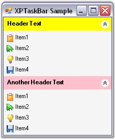

::: {style="DISPLAY: none"}
{#d2h_url_template}{#d2h_package_url style="WIDTH: 0px; DISPLAY: none; HEIGHT: 0px"}
:::

::: {.d2h_secondary_topic style="PADDING-BOTTOM: 10pt; MARGIN: 0pt; PADDING-LEFT: 0pt; PADDING-RIGHT: 0pt; PADDING-TOP: 0pt"}
##### Through Code {#through-code style="MARGIN-LEFT: 18pt; tab-stops: 18.0pt"}

[]{style="COLOR: #15428b"} 

The following step by step procedure helps you to create XPTaskBar programmatically.

[]{style="FONT-SIZE: 8pt"} 

1.   Add the namespace Syncfusion.Windows.Forms.Tools.

[]{style="COLOR: #15428b"} 

+--------------------------------------------------------------------------------------------------------------------------------+
| **[\[C#\]]{style="FONT-FAMILY: 'Courier New'; COLOR: black"}**                                                                 |
|                                                                                                                                |
| []{style="FONT-FAMILY: 'Courier New'; COLOR: black"}                                                                           |
|                                                                                                                                |
| [using]{style="FONT-FAMILY: 'Courier New'; COLOR: blue"}[ Syncfusion.Windows.Forms.Tools;]{style="FONT-FAMILY: 'Courier New'"} |
+--------------------------------------------------------------------------------------------------------------------------------+

[]{style="COLOR: #15428b"} 

+---------------------------------------------------------------------------------------------------------------------------------+
| **[\[VB.NET\]]{style="FONT-FAMILY: 'Courier New'; COLOR: black"}**                                                              |
|                                                                                                                                 |
| []{style="FONT-FAMILY: 'Courier New'; COLOR: black"}                                                                            |
|                                                                                                                                 |
| [Imports]{style="FONT-FAMILY: 'Courier New'; COLOR: blue"}[ Syncfusion.Windows.Forms.Tools]{style="FONT-FAMILY: 'Courier New'"} |
+---------------------------------------------------------------------------------------------------------------------------------+

[]{style="COLOR: #15428b"} 

2.   Drag and drop an ImageList control onto the form and add images into it through the **Images Collection Editor**.

[]{style="COLOR: #15428b"} 

3.   Create instances for XPTaskBar control, XPTaskBar Box1, XPTaskBar Box2 and ImageList control.

[]{style="COLOR: #15428b"} 

+--------------------------------------------------------------------------------------------------------------------------------------------------------------------------------------------------------------------------------------+
| **[\[C#\]]{style="FONT-FAMILY: 'Courier New'; COLOR: black"}**                                                                                                                                                                       |
|                                                                                                                                                                                                                                      |
| []{style="FONT-FAMILY: 'Courier New'; COLOR: black"}                                                                                                                                                                                 |
|                                                                                                                                                                                                                                      |
| [private]{style="FONT-FAMILY: 'Courier New'; COLOR: blue"}[ Syncfusion.Windows.Forms.Tools.XPTaskBar xpTaskBar1;]{style="FONT-FAMILY: 'Courier New'"}                                                                                |
|                                                                                                                                                                                                                                      |
| [private]{style="FONT-FAMILY: 'Courier New'; COLOR: blue"}[ System.Windows.Forms.[ImageList]{style="COLOR: teal"} imageList1;]{style="FONT-FAMILY: 'Courier New'"}                                                                   |
|                                                                                                                                                                                                                                      |
| [private]{style="FONT-FAMILY: 'Courier New'; COLOR: blue"}[ Syncfusion.Windows.Forms.Tools.XPTaskBarBox xpTaskBarBox1;]{style="FONT-FAMILY: 'Courier New'"}                                                                          |
|                                                                                                                                                                                                                                      |
| [private]{style="FONT-FAMILY: 'Courier New'; COLOR: blue"}[ Syncfusion.Windows.Forms.Tools.XPTaskBarBox xpTaskBarBox2;]{style="FONT-FAMILY: 'Courier New'"}                                                                          |
|                                                                                                                                                                                                                                      |
| []{style="FONT-FAMILY: 'Courier New'"}                                                                                                                                                                                               |
|                                                                                                                                                                                                                                      |
| [this]{style="FONT-FAMILY: 'Courier New'; COLOR: blue"}[.xpTaskBar1 = [new]{style="COLOR: blue"} Syncfusion.Windows.Forms.Tools.XPTaskBar();]{style="FONT-FAMILY: 'Courier New'"}                                                    |
|                                                                                                                                                                                                                                      |
| [this]{style="FONT-FAMILY: 'Courier New'; COLOR: blue"}[.imageList1 = [new]{style="COLOR: blue"} System.Windows.Forms.[ImageList]{style="COLOR: teal"}([this]{style="COLOR: blue"}.components);]{style="FONT-FAMILY: 'Courier New'"} |
|                                                                                                                                                                                                                                      |
| [this]{style="FONT-FAMILY: 'Courier New'; COLOR: blue"}[.xpTaskBarBox1 = [new]{style="COLOR: blue"} Syncfusion.Windows.Forms.Tools.XPTaskBarBox();]{style="FONT-FAMILY: 'Courier New'"}                                              |
|                                                                                                                                                                                                                                      |
| [this]{style="FONT-FAMILY: 'Courier New'; COLOR: blue"}[.xpTaskBarBox2 = [new]{style="COLOR: blue"} Syncfusion.Windows.Forms.Tools.XPTaskBarBox();]{style="FONT-FAMILY: 'Courier New'"}                                              |
+--------------------------------------------------------------------------------------------------------------------------------------------------------------------------------------------------------------------------------------+

[]{style="COLOR: #15428b"} 

+-------------------------------------------------------------------------------------------------------------------------------------------------------------------------------------------------------------------------+
| **[\[VB.NET\]]{style="FONT-FAMILY: 'Courier New'; COLOR: black"}**                                                                                                                                                      |
|                                                                                                                                                                                                                         |
| []{style="FONT-FAMILY: 'Courier New'; COLOR: black"}                                                                                                                                                                    |
|                                                                                                                                                                                                                         |
| [Private]{style="FONT-FAMILY: 'Courier New'; COLOR: blue"}[ xpTaskBar1 [As]{style="COLOR: blue"} Syncfusion.Windows.Forms.Tools.XPTaskBar = [New]{style="COLOR: blue"} XPTaskBar()]{style="FONT-FAMILY: 'Courier New'"} |
|                                                                                                                                                                                                                         |
| [Private]{style="FONT-FAMILY: 'Courier New'; COLOR: blue"}[ imageList1 [As]{style="COLOR: blue"} System.Windows.Forms.ImageList ]{style="FONT-FAMILY: 'Courier New'"}                                                   |
|                                                                                                                                                                                                                         |
| [Private]{style="FONT-FAMILY: 'Courier New'; COLOR: blue"}[ xpTaskBarBox1 [As]{style="COLOR: blue"} Syncfusion.Windows.Forms.Tools.XPTaskBarBox]{style="FONT-FAMILY: 'Courier New'"}                                    |
|                                                                                                                                                                                                                         |
| [Private]{style="FONT-FAMILY: 'Courier New'; COLOR: blue"}[ xpTaskBarBox2 [As]{style="COLOR: blue"} Syncfusion.Windows.Forms.Tools.XPTaskBarBox]{style="FONT-FAMILY: 'Courier New'"}                                    |
|                                                                                                                                                                                                                         |
| []{style="FONT-FAMILY: 'Courier New'"}                                                                                                                                                                                  |
|                                                                                                                                                                                                                         |
| [Me]{style="FONT-FAMILY: 'Courier New'; COLOR: blue"}[.xpTaskBar1 = [New]{style="COLOR: blue"} Syncfusion.Windows.Forms.Tools.XPTaskBar() ]{style="FONT-FAMILY: 'Courier New'"}                                         |
|                                                                                                                                                                                                                         |
| [Me]{style="FONT-FAMILY: 'Courier New'; COLOR: blue"}[.imageList1 = [New]{style="COLOR: blue"} System.Windows.Forms.ImageList([Me]{style="COLOR: blue"}.components) ]{style="FONT-FAMILY: 'Courier New'"}               |
|                                                                                                                                                                                                                         |
| [Me]{style="FONT-FAMILY: 'Courier New'; COLOR: blue"}[.xpTaskBarBox1 = [New]{style="COLOR: blue"} Syncfusion.Windows.Forms.Tools.XPTaskBarBox() ]{style="FONT-FAMILY: 'Courier New'"}                                   |
|                                                                                                                                                                                                                         |
| [Me]{style="FONT-FAMILY: 'Courier New'; COLOR: blue"}[.xpTaskBarBox2 = [New]{style="COLOR: blue"} Syncfusion.Windows.Forms.Tools.XPTaskBarBox()]{style="FONT-FAMILY: 'Courier New'"}                                    |
+-------------------------------------------------------------------------------------------------------------------------------------------------------------------------------------------------------------------------+

[]{style="COLOR: #15428b"} 

4.   Add XPTaskBar to the control collection.

[]{style="COLOR: #15428b"} 

+-----------------------------------------------------------------------------------------------------------------------------------------------------+
| **[\[C#\]]{style="FONT-FAMILY: 'Courier New'; COLOR: black"}**                                                                                      |
|                                                                                                                                                     |
| []{style="FONT-FAMILY: 'Courier New'; COLOR: black"}                                                                                                |
|                                                                                                                                                     |
| [this]{style="FONT-FAMILY: 'Courier New'; COLOR: blue"}[.Controls.Add([this]{style="COLOR: blue"}.xpTaskBar1);]{style="FONT-FAMILY: 'Courier New'"} |
+-----------------------------------------------------------------------------------------------------------------------------------------------------+

[]{style="COLOR: #15428b"} 

+------------------------------------------------------------------------------------------------------------------------------------------------+
| **[\[VB.NET\]]{style="FONT-FAMILY: 'Courier New'; COLOR: black"}**                                                                             |
|                                                                                                                                                |
| []{style="FONT-FAMILY: 'Courier New'; COLOR: black"}                                                                                           |
|                                                                                                                                                |
| [Me]{style="FONT-FAMILY: 'Courier New'; COLOR: blue"}[.Controls.Add([Me]{style="COLOR: blue"}.xpTaskBar1)]{style="FONT-FAMILY: 'Courier New'"} |
+------------------------------------------------------------------------------------------------------------------------------------------------+

[]{style="COLOR: #15428b"} 

5.   Set the ImageList to XPTaskBar Box1 and XPTaskBar Box2.

[]{style="COLOR: #15428b"} 

+-----------------------------------------------------------------------------------------------------------------------------------------------------------------+
| **[\[C#\]]{style="FONT-FAMILY: 'Courier New'; COLOR: black"}**                                                                                                  |
|                                                                                                                                                                 |
| []{style="FONT-FAMILY: 'Courier New'; COLOR: black"}                                                                                                            |
|                                                                                                                                                                 |
| [this]{style="FONT-FAMILY: 'Courier New'; COLOR: blue"}[.xpTaskBarBox1.ImageList = [this]{style="COLOR: blue"}.imageList1;]{style="FONT-FAMILY: 'Courier New'"} |
|                                                                                                                                                                 |
| [this]{style="FONT-FAMILY: 'Courier New'; COLOR: blue"}[.xpTaskBarBox2.ImageList = [this]{style="COLOR: blue"}.imageList1;]{style="FONT-FAMILY: 'Courier New'"} |
+-----------------------------------------------------------------------------------------------------------------------------------------------------------------+

[]{style="COLOR: #15428b"} 

+-------------------------------------------------------------------------------------------------------------------------------------------------------------+
| **[\[VB.NET\]]{style="FONT-FAMILY: 'Courier New'; COLOR: black"}**                                                                                          |
|                                                                                                                                                             |
| []{style="FONT-FAMILY: 'Courier New'; COLOR: black"}                                                                                                        |
|                                                                                                                                                             |
| [Me]{style="FONT-FAMILY: 'Courier New'; COLOR: blue"}[.xpTaskBarBox1.ImageList = [Me]{style="COLOR: blue"}.imageList1 ]{style="FONT-FAMILY: 'Courier New'"} |
|                                                                                                                                                             |
| [Me]{style="FONT-FAMILY: 'Courier New'; COLOR: blue"}[.xpTaskBarBox2.ImageList = [Me]{style="COLOR: blue"}.imageList1]{style="FONT-FAMILY: 'Courier New'"}  |
+-------------------------------------------------------------------------------------------------------------------------------------------------------------+

[]{style="COLOR: #15428b"} 

6.   Set Header BackColor, Text and Item BackColor for XPTaskBar Box1 and XPTaskBar Box2.

[]{style="COLOR: #15428b"} 

+-----------------------------------------------------------------------------------------------------------------------------------------------+
| **[\[C#\]]{style="FONT-FAMILY: 'Courier New'; COLOR: black"}**                                                                                |
|                                                                                                                                               |
| []{style="FONT-FAMILY: 'Courier New'; COLOR: black"}                                                                                          |
|                                                                                                                                               |
| [this]{style="FONT-FAMILY: 'Courier New'; COLOR: blue"}[.xpTaskBarBox1.HeaderBackColor = Color.Yellow;]{style="FONT-FAMILY: 'Courier New'"}   |
|                                                                                                                                               |
| [this]{style="FONT-FAMILY: 'Courier New'; COLOR: blue"}[.xpTaskBarBox1.Text = \"Header Text\";]{style="FONT-FAMILY: 'Courier New'"}           |
|                                                                                                                                               |
| [this]{style="FONT-FAMILY: 'Courier New'; COLOR: blue"}[.xpTaskBarBox1.ItemBackColor = Color.WhiteSmoke;]{style="FONT-FAMILY: 'Courier New'"} |
|                                                                                                                                               |
| []{style="FONT-FAMILY: 'Courier New'"}                                                                                                        |
|                                                                                                                                               |
| [this]{style="FONT-FAMILY: 'Courier New'; COLOR: blue"}[.xpTaskBarBox2.HeaderBackColor = Color.Pink;]{style="FONT-FAMILY: 'Courier New'"}     |
|                                                                                                                                               |
| [this]{style="FONT-FAMILY: 'Courier New'; COLOR: blue"}[.xpTaskBarBox2.Text = \"Another Header Text\";]{style="FONT-FAMILY: 'Courier New'"}   |
|                                                                                                                                               |
| [this]{style="FONT-FAMILY: 'Courier New'; COLOR: blue"}[.xpTaskBarBox2.ItemBackColor = Color.WhiteSmoke;]{style="FONT-FAMILY: 'Courier New'"} |
+-----------------------------------------------------------------------------------------------------------------------------------------------+

[]{style="COLOR: #15428b"} 

+--------------------------------------------------------------------------------------------------------------------------------------------------------------------+
| **[\[VB.NET\]]{style="FONT-FAMILY: 'Courier New'; COLOR: black"}**                                                                                                 |
|                                                                                                                                                                    |
| []{style="FONT-FAMILY: 'Courier New'"}                                                                                                                             |
|                                                                                                                                                                    |
| [Me]{style="FONT-FAMILY: 'Courier New'; COLOR: blue"}[.xpTaskBarBox1.HeaderBackColor = Color.Yellow ]{style="FONT-FAMILY: 'Courier New'"}                          |
|                                                                                                                                                                    |
| [Me]{style="FONT-FAMILY: 'Courier New'; COLOR: blue"}[.xpTaskBarBox1.Text = [\"Header Text\"]{style="COLOR: maroon"} ]{style="FONT-FAMILY: 'Courier New'"}         |
|                                                                                                                                                                    |
| [Me]{style="FONT-FAMILY: 'Courier New'; COLOR: blue"}[.xpTaskBarBox1.ItemBackColor = Color.WhiteSmoke ]{style="FONT-FAMILY: 'Courier New'"}                        |
|                                                                                                                                                                    |
| []{style="FONT-FAMILY: 'Courier New'"}                                                                                                                             |
|                                                                                                                                                                    |
| [Me]{style="FONT-FAMILY: 'Courier New'; COLOR: blue"}[.xpTaskBarBox2.HeaderBackColor = Color.Pink ]{style="FONT-FAMILY: 'Courier New'"}                            |
|                                                                                                                                                                    |
| [Me]{style="FONT-FAMILY: 'Courier New'; COLOR: blue"}[.xpTaskBarBox2.Text = [\"Another Header Text\"]{style="COLOR: maroon"} ]{style="FONT-FAMILY: 'Courier New'"} |
|                                                                                                                                                                    |
| [Me]{style="FONT-FAMILY: 'Courier New'; COLOR: blue"}[.xpTaskBarBox2.ItemBackColor = Color.WhiteSmoke]{style="FONT-FAMILY: 'Courier New'"}                         |
+--------------------------------------------------------------------------------------------------------------------------------------------------------------------+

[]{style="COLOR: #15428b"} 

7.   Add XPTaskBar Items to the XPTaskBar Box1 and XPTaskBar Box2.

[]{style="COLOR: #15428b"} 

+------------------------------------------------------------------------------------------------------------------------------------------------------------------------------------------------------------------------------------------------------------------------------------------------------------------------------------------------------------------------------------------------------------------------------------------------------------------------------------------------------------------------------------------------------+
| **[\[C#\]]{style="FONT-FAMILY: 'Courier New'; COLOR: black"}**                                                                                                                                                                                                                                                                                                                                                                                                                                                                                       |
|                                                                                                                                                                                                                                                                                                                                                                                                                                                                                                                                                      |
| []{style="FONT-FAMILY: 'Courier New'; COLOR: black"}                                                                                                                                                                                                                                                                                                                                                                                                                                                                                                 |
|                                                                                                                                                                                                                                                                                                                                                                                                                                                                                                                                                      |
| [this]{style="FONT-FAMILY: 'Courier New'; COLOR: blue"}[.xpTaskBarBox1.Items.AddRange([new]{style="COLOR: blue"} Syncfusion.Windows.Forms.Tools.[XPTaskBarItem]{style="COLOR: teal"}\[\] {]{style="FONT-FAMILY: 'Courier New'"}                                                                                                                                                                                                                                                                                                                      |
|                                                                                                                                                                                                                                                                                                                                                                                                                                                                                                                                                      |
| [            [new]{style="COLOR: blue"} Syncfusion.Windows.Forms.Tools.[XPTaskBarItem]{style="COLOR: teal"}([\"Item1\"]{style="COLOR: maroon"}, System.Drawing.[Color]{style="COLOR: teal"}.Empty, 0, [null]{style="COLOR: blue"}, [\"\"]{style="COLOR: maroon"}, [true]{style="COLOR: blue"}, [true]{style="COLOR: blue"}, [\"XPTaskBarItem0\"]{style="COLOR: maroon"}, [new]{style="COLOR: blue"} System.Drawing.[Font]{style="COLOR: teal"}([\"Microsoft Sans Serif\"]{style="COLOR: maroon"}, 8.25F), 0),]{style="FONT-FAMILY: 'Courier New'"}   |
|                                                                                                                                                                                                                                                                                                                                                                                                                                                                                                                                                      |
| [            [new]{style="COLOR: blue"} Syncfusion.Windows.Forms.Tools.[XPTaskBarItem]{style="COLOR: teal"}([\"Item2\"]{style="COLOR: maroon"}, System.Drawing.[Color]{style="COLOR: teal"}.Empty, 1, [null]{style="COLOR: blue"}, [\"\"]{style="COLOR: maroon"}, [true]{style="COLOR: blue"}, [true]{style="COLOR: blue"}, [\"XPTaskBarItem1\"]{style="COLOR: maroon"}, [new]{style="COLOR: blue"} System.Drawing.[Font]{style="COLOR: teal"}([\"Microsoft Sans Serif\"]{style="COLOR: maroon"}, 8.25F), 0),]{style="FONT-FAMILY: 'Courier New'"}   |
|                                                                                                                                                                                                                                                                                                                                                                                                                                                                                                                                                      |
| [            [new]{style="COLOR: blue"} Syncfusion.Windows.Forms.Tools.[XPTaskBarItem]{style="COLOR: teal"}([\"Item3\"]{style="COLOR: maroon"}, System.Drawing.[Color]{style="COLOR: teal"}.Empty, 2, [null]{style="COLOR: blue"}, [\"\"]{style="COLOR: maroon"}, [true]{style="COLOR: blue"}, [true]{style="COLOR: blue"}, [\"XPTaskBarItem2\"]{style="COLOR: maroon"}, [new]{style="COLOR: blue"} System.Drawing.[Font]{style="COLOR: teal"}([\"Microsoft Sans Serif\"]{style="COLOR: maroon"}, 8.25F), 0),]{style="FONT-FAMILY: 'Courier New'"}   |
|                                                                                                                                                                                                                                                                                                                                                                                                                                                                                                                                                      |
| [            [new]{style="COLOR: blue"} Syncfusion.Windows.Forms.Tools.[XPTaskBarItem]{style="COLOR: teal"}([\"Item4\"]{style="COLOR: maroon"}, System.Drawing.[Color]{style="COLOR: teal"}.Empty, 3, [null]{style="COLOR: blue"}, [\"\"]{style="COLOR: maroon"}, [true]{style="COLOR: blue"}, [true]{style="COLOR: blue"}, [\"XPTaskBarItem3\"]{style="COLOR: maroon"}, [new]{style="COLOR: blue"} System.Drawing.[Font]{style="COLOR: teal"}([\"Microsoft Sans Serif\"]{style="COLOR: maroon"}, 8.25F), 0)});]{style="FONT-FAMILY: 'Courier New'"} |
|                                                                                                                                                                                                                                                                                                                                                                                                                                                                                                                                                      |
| []{style="FONT-FAMILY: 'Courier New'"}                                                                                                                                                                                                                                                                                                                                                                                                                                                                                                               |
|                                                                                                                                                                                                                                                                                                                                                                                                                                                                                                                                                      |
| [this]{style="FONT-FAMILY: 'Courier New'; COLOR: blue"}[.xpTaskBarBox2.Items.AddRange([new]{style="COLOR: blue"} Syncfusion.Windows.Forms.Tools.[XPTaskBarItem]{style="COLOR: teal"}\[\] {]{style="FONT-FAMILY: 'Courier New'"}                                                                                                                                                                                                                                                                                                                      |
|                                                                                                                                                                                                                                                                                                                                                                                                                                                                                                                                                      |
| [            [new]{style="COLOR: blue"} Syncfusion.Windows.Forms.Tools.[XPTaskBarItem]{style="COLOR: teal"}([\"Item1\"]{style="COLOR: maroon"}, System.Drawing.[Color]{style="COLOR: teal"}.Empty, 0, [null]{style="COLOR: blue"}, [\"\"]{style="COLOR: maroon"}, [true]{style="COLOR: blue"}, [true]{style="COLOR: blue"}, [\"XPTaskBarItem4\"]{style="COLOR: maroon"}, [new]{style="COLOR: blue"} System.Drawing.[Font]{style="COLOR: teal"}([\"Microsoft Sans Serif\"]{style="COLOR: maroon"}, 8.25F), 0),]{style="FONT-FAMILY: 'Courier New'"}   |
|                                                                                                                                                                                                                                                                                                                                                                                                                                                                                                                                                      |
| [            [new]{style="COLOR: blue"} Syncfusion.Windows.Forms.Tools.[XPTaskBarItem]{style="COLOR: teal"}([\"Item2\"]{style="COLOR: maroon"}, System.Drawing.[Color]{style="COLOR: teal"}.Empty, 1, [null]{style="COLOR: blue"}, [\"\"]{style="COLOR: maroon"}, [true]{style="COLOR: blue"}, [true]{style="COLOR: blue"}, [\"XPTaskBarItem5\"]{style="COLOR: maroon"}, [new]{style="COLOR: blue"} System.Drawing.[Font]{style="COLOR: teal"}([\"Microsoft Sans Serif\"]{style="COLOR: maroon"}, 8.25F), 0),]{style="FONT-FAMILY: 'Courier New'"}   |
|                                                                                                                                                                                                                                                                                                                                                                                                                                                                                                                                                      |
| [            [new]{style="COLOR: blue"} Syncfusion.Windows.Forms.Tools.[XPTaskBarItem]{style="COLOR: teal"}([\"Item3\"]{style="COLOR: maroon"}, System.Drawing.[Color]{style="COLOR: teal"}.Empty, 2, [null]{style="COLOR: blue"}, [\"\"]{style="COLOR: maroon"}, [true]{style="COLOR: blue"}, [true]{style="COLOR: blue"}, [\"XPTaskBarItem6\"]{style="COLOR: maroon"}, [new]{style="COLOR: blue"} System.Drawing.[Font]{style="COLOR: teal"}([\"Microsoft Sans Serif\"]{style="COLOR: maroon"}, 8.25F), 0),]{style="FONT-FAMILY: 'Courier New'"}   |
|                                                                                                                                                                                                                                                                                                                                                                                                                                                                                                                                                      |
| [            [new]{style="COLOR: blue"} Syncfusion.Windows.Forms.Tools.[XPTaskBarItem]{style="COLOR: teal"}([\"Item4\"]{style="COLOR: maroon"}, System.Drawing.[Color]{style="COLOR: teal"}.Empty, 3, [null]{style="COLOR: blue"}, [\"\"]{style="COLOR: maroon"}, [true]{style="COLOR: blue"}, [true]{style="COLOR: blue"}, [\"XPTaskBarItem7\"]{style="COLOR: maroon"}, [new]{style="COLOR: blue"} System.Drawing.[Font]{style="COLOR: teal"}([\"Microsoft Sans Serif\"]{style="COLOR: maroon"}, 8.25F), 0)});]{style="FONT-FAMILY: 'Courier New'"} |
+------------------------------------------------------------------------------------------------------------------------------------------------------------------------------------------------------------------------------------------------------------------------------------------------------------------------------------------------------------------------------------------------------------------------------------------------------------------------------------------------------------------------------------------------------+

[]{style="COLOR: #15428b"} 

+------------------------------------------------------------------------------------------------------------------------------------------------------------------------------------------------------------------------------------------------------------------------------------------------------------------------------------------------------------------------------------------------------------------------------------------------------------------------------------------------------+
| **[\[VB.NET\]]{style="FONT-FAMILY: 'Courier New'; COLOR: black"}**                                                                                                                                                                                                                                                                                                                                                                                                                                   |
|                                                                                                                                                                                                                                                                                                                                                                                                                                                                                                      |
| []{style="FONT-FAMILY: 'Courier New'; COLOR: black"}                                                                                                                                                                                                                                                                                                                                                                                                                                                 |
|                                                                                                                                                                                                                                                                                                                                                                                                                                                                                                      |
| [Me]{style="FONT-FAMILY: 'Courier New'; COLOR: blue"}[.xpTaskBarBox1.Items.AddRange([New]{style="COLOR: blue"} Syncfusion.Windows.Forms.Tools.XPTaskBarItem() {[New]{style="COLOR: blue"} Syncfusion.Windows.Forms.Tools.XPTaskBarItem([\"Item1\"]{style="COLOR: maroon"}, System.Drawing.Color.Empty, 0, [Nothing]{style="COLOR: blue"}, [\"\"]{style="COLOR: maroon"}, [True]{style="COLOR: blue"}, \_ ]{style="FONT-FAMILY: 'Courier New'"}                                                       |
|                                                                                                                                                                                                                                                                                                                                                                                                                                                                                                      |
| [True]{style="FONT-FAMILY: 'Courier New'; COLOR: blue"}[, [\"XPTaskBarItem0\"]{style="COLOR: maroon"}, [New]{style="COLOR: blue"} System.Drawing.Font([\"Microsoft Sans Serif\"]{style="COLOR: maroon"}, 8.25F), 0), [New]{style="COLOR: blue"} Syncfusion.Windows.Forms.Tools.XPTaskBarItem([\"Item2\"]{style="COLOR: maroon"}, System.Drawing.Color.Empty, 1, [Nothing]{style="COLOR: blue"}, [\"\"]{style="COLOR: maroon"}, [True]{style="COLOR: blue"}, \_ ]{style="FONT-FAMILY: 'Courier New'"} |
|                                                                                                                                                                                                                                                                                                                                                                                                                                                                                                      |
| [True]{style="FONT-FAMILY: 'Courier New'; COLOR: blue"}[, [\"XPTaskBarItem1\"]{style="COLOR: maroon"}, [New]{style="COLOR: blue"} System.Drawing.Font([\"Microsoft Sans Serif\"]{style="COLOR: maroon"}, 8.25F), 0), [New]{style="COLOR: blue"} Syncfusion.Windows.Forms.Tools.XPTaskBarItem([\"Item3\"]{style="COLOR: maroon"}, System.Drawing.Color.Empty, 2, [Nothing]{style="COLOR: blue"}, [\"\"]{style="COLOR: maroon"}, [True]{style="COLOR: blue"}, \_ ]{style="FONT-FAMILY: 'Courier New'"} |
|                                                                                                                                                                                                                                                                                                                                                                                                                                                                                                      |
| [True]{style="FONT-FAMILY: 'Courier New'; COLOR: blue"}[, [\"XPTaskBarItem2\"]{style="COLOR: maroon"}, [New]{style="COLOR: blue"} System.Drawing.Font([\"Microsoft Sans Serif\"]{style="COLOR: maroon"}, 8.25F), 0), [New]{style="COLOR: blue"} Syncfusion.Windows.Forms.Tools.XPTaskBarItem([\"Item4\"]{style="COLOR: maroon"}, System.Drawing.Color.Empty, 3, [Nothing]{style="COLOR: blue"}, [\"\"]{style="COLOR: maroon"}, [True]{style="COLOR: blue"}, \_ ]{style="FONT-FAMILY: 'Courier New'"} |
|                                                                                                                                                                                                                                                                                                                                                                                                                                                                                                      |
| [True]{style="FONT-FAMILY: 'Courier New'; COLOR: blue"}[, [\"XPTaskBarItem3\"]{style="COLOR: maroon"}, [New]{style="COLOR: blue"} System.Drawing.Font([\"Microsoft Sans Serif\"]{style="COLOR: maroon"}, 8.25F), 0)}) ]{style="FONT-FAMILY: 'Courier New'"}                                                                                                                                                                                                                                          |
|                                                                                                                                                                                                                                                                                                                                                                                                                                                                                                      |
| []{style="FONT-FAMILY: 'Courier New'"}                                                                                                                                                                                                                                                                                                                                                                                                                                                               |
|                                                                                                                                                                                                                                                                                                                                                                                                                                                                                                      |
| [Me]{style="FONT-FAMILY: 'Courier New'; COLOR: blue"}[.xpTaskBarBox2.Items.AddRange([New]{style="COLOR: blue"} Syncfusion.Windows.Forms.Tools.XPTaskBarItem() {[New]{style="COLOR: blue"} Syncfusion.Windows.Forms.Tools.XPTaskBarItem([\"Item1\"]{style="COLOR: maroon"}, System.Drawing.Color.Empty, 0, [Nothing]{style="COLOR: blue"}, [\"\"]{style="COLOR: maroon"}, [True]{style="COLOR: blue"}, \_ ]{style="FONT-FAMILY: 'Courier New'"}                                                       |
|                                                                                                                                                                                                                                                                                                                                                                                                                                                                                                      |
| [True]{style="FONT-FAMILY: 'Courier New'; COLOR: blue"}[, [\"XPTaskBarItem4\"]{style="COLOR: maroon"}, [New]{style="COLOR: blue"} System.Drawing.Font([\"Microsoft Sans Serif\"]{style="COLOR: maroon"}, 8.25F), 0), [New]{style="COLOR: blue"} Syncfusion.Windows.Forms.Tools.XPTaskBarItem([\"Item2\"]{style="COLOR: maroon"}, System.Drawing.Color.Empty, 1, [Nothing]{style="COLOR: blue"}, [\"\"]{style="COLOR: maroon"}, [True]{style="COLOR: blue"}, \_ ]{style="FONT-FAMILY: 'Courier New'"} |
|                                                                                                                                                                                                                                                                                                                                                                                                                                                                                                      |
| [True]{style="FONT-FAMILY: 'Courier New'; COLOR: blue"}[, [\"XPTaskBarItem5\"]{style="COLOR: maroon"}, [New]{style="COLOR: blue"} System.Drawing.Font([\"Microsoft Sans Serif\"]{style="COLOR: maroon"}, 8.25F), 0), [New]{style="COLOR: blue"} Syncfusion.Windows.Forms.Tools.XPTaskBarItem([\"Item3\"]{style="COLOR: maroon"}, System.Drawing.Color.Empty, 2, [Nothing]{style="COLOR: blue"}, [\"\"]{style="COLOR: maroon"}, [True]{style="COLOR: blue"}, \_ ]{style="FONT-FAMILY: 'Courier New'"} |
|                                                                                                                                                                                                                                                                                                                                                                                                                                                                                                      |
| [True]{style="FONT-FAMILY: 'Courier New'; COLOR: blue"}[, [\"XPTaskBarItem6\"]{style="COLOR: maroon"}, [New]{style="COLOR: blue"} System.Drawing.Font([\"Microsoft Sans Serif\"]{style="COLOR: maroon"}, 8.25F), 0), [New]{style="COLOR: blue"} Syncfusion.Windows.Forms.Tools.XPTaskBarItem([\"Item4\"]{style="COLOR: maroon"}, System.Drawing.Color.Empty, 3, [Nothing]{style="COLOR: blue"}, [\"\"]{style="COLOR: maroon"}, [True]{style="COLOR: blue"}, \_ ]{style="FONT-FAMILY: 'Courier New'"} |
|                                                                                                                                                                                                                                                                                                                                                                                                                                                                                                      |
| [True]{style="FONT-FAMILY: 'Courier New'; COLOR: blue"}[, [\"XPTaskBarItem7\"]{style="COLOR: maroon"}, [New]{style="COLOR: blue"} System.Drawing.Font([\"Microsoft Sans Serif\"]{style="COLOR: maroon"}, 8.25F), 0)}) ]{style="FONT-FAMILY: 'Courier New'"}                                                                                                                                                                                                                                          |
+------------------------------------------------------------------------------------------------------------------------------------------------------------------------------------------------------------------------------------------------------------------------------------------------------------------------------------------------------------------------------------------------------------------------------------------------------------------------------------------------------+

[]{style="COLOR: #15428b"} 

8.   Finally add the created XPTaskBar Boxes to the XPTaskBar control.

[]{style="COLOR: #15428b"} 

+-------------------------------------------------------------------------------------------------------------------------------------------------------------------+
| **[\[C#\]]{style="FONT-FAMILY: 'Courier New'; COLOR: black"}**                                                                                                    |
|                                                                                                                                                                   |
| []{style="FONT-FAMILY: 'Courier New'; COLOR: black"}                                                                                                              |
|                                                                                                                                                                   |
| [this]{style="FONT-FAMILY: 'Courier New'; COLOR: blue"}[.xpTaskBar1.Controls.Add([this]{style="COLOR: blue"}.xpTaskBarBox1);]{style="FONT-FAMILY: 'Courier New'"} |
|                                                                                                                                                                   |
| [this]{style="FONT-FAMILY: 'Courier New'; COLOR: blue"}[.xpTaskBar1.Controls.Add([this]{style="COLOR: blue"}.xpTaskBarBox2);]{style="FONT-FAMILY: 'Courier New'"} |
+-------------------------------------------------------------------------------------------------------------------------------------------------------------------+

[]{style="COLOR: #15428b"} 

+--------------------------------------------------------------------------------------------------------------------------------------------------------------+
| **[\[VB.NET\]]{style="FONT-FAMILY: 'Courier New'; COLOR: black"}**                                                                                           |
|                                                                                                                                                              |
| []{style="FONT-FAMILY: 'Courier New'; COLOR: black"}                                                                                                         |
|                                                                                                                                                              |
| [Me]{style="FONT-FAMILY: 'Courier New'; COLOR: blue"}[.xpTaskBar1.Controls.Add([Me]{style="COLOR: blue"}.xpTaskBarBox1)]{style="FONT-FAMILY: 'Courier New'"} |
|                                                                                                                                                              |
| [Me]{style="FONT-FAMILY: 'Courier New'; COLOR: blue"}[.xpTaskBar1.Controls.Add([Me]{style="COLOR: blue"}.xpTaskBarBox2)]{style="FONT-FAMILY: 'Courier New'"} |
+--------------------------------------------------------------------------------------------------------------------------------------------------------------+

[]{style="COLOR: #15428b"} 

{border="0"}

[]{style="COLOR: #15428b"} 

Figure 937: XPTaskBar control created Through Code

[]{style="COLOR: #15428b"} 

See Also

**[]{style="COLOR: #15428b"}** 

[[Concepts and Features]{.UGHyperlink}](../../../../../../../../Documents%20and%20Settings/sylviap/Desktop/Tools%20-%20Part%202.docx#_Concepts_and_Features_3)[]{.UGHyperlink}

 

 

[]{#p669} 

 

[]{#related-topics}
:::
