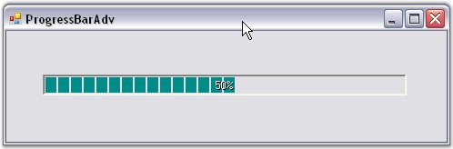

::: {style="DISPLAY: none"}
{#d2h_url_template}{#d2h_package_url style="WIDTH: 0px; DISPLAY: none; HEIGHT: 0px"}
:::

::: {.d2h_secondary_topic style="PADDING-BOTTOM: 10pt; MARGIN: 0pt; PADDING-LEFT: 0pt; PADDING-RIGHT: 0pt; PADDING-TOP: 0pt"}
##### Through Code {#through-code style="MARGIN-LEFT: 18pt; tab-stops: 18.0pt"}

[]{style="COLOR: #15428b"} 

This step-by-step procedure explains how to create the ProgressBarAdv control programmatically.

[]{style="COLOR: #15428b"} 

[·      ]{style="FONT-FAMILY: Symbol"}Create a C# or VB.NET application in Visual Studio. Switch to the code view.

[·      ]{style="FONT-FAMILY: Symbol"}Declare and initialize a ProgressBarAdv as below.

[]{style="COLOR: #15428b"} 

+--------------------------------------------------------------------------------------------------------------------------------------------------------------------------------------------------------------------+
| **[\[C#\]]{style="FONT-FAMILY: 'Courier New'; COLOR: black"}**                                                                                                                                                     |
|                                                                                                                                                                                                                    |
| []{style="FONT-FAMILY: 'Courier New'; COLOR: black"}                                                                                                                                                               |
|                                                                                                                                                                                                                    |
| [private]{style="FONT-FAMILY: 'Courier New'; COLOR: blue"}[ Syncfusion.Windows.Forms.Tools.[ProgressBarAdv]{style="COLOR: teal"} progressBarAdv1;]{style="FONT-FAMILY: 'Courier New'"}                             |
|                                                                                                                                                                                                                    |
| []{style="FONT-FAMILY: 'Courier New'"}                                                                                                                                                                             |
|                                                                                                                                                                                                                    |
| [this]{style="FONT-FAMILY: 'Courier New'; COLOR: blue"}[.progressBarAdv1 = [new]{style="COLOR: blue"} Syncfusion.Windows.Forms.Tools.[ProgressBarAdv]{style="COLOR: teal"}();]{style="FONT-FAMILY: 'Courier New'"} |
|                                                                                                                                                                                                                    |
| [((System.ComponentModel.[ISupportInitialize]{style="COLOR: teal"})([this]{style="COLOR: blue"}.progressBarAdv1)).BeginInit();]{style="FONT-FAMILY: 'Courier New'"}                                                |
|                                                                                                                                                                                                                    |
| [this]{style="FONT-FAMILY: 'Courier New'; COLOR: blue"}[.SuspendLayout();]{style="FONT-FAMILY: 'Courier New'"}                                                                                                     |
+--------------------------------------------------------------------------------------------------------------------------------------------------------------------------------------------------------------------+

[]{style="COLOR: #15428b"} 

+---------------------------------------------------------------------------------------------------------------------------------------------------------------------------------------------------------------------------+
| **[\[VB.NET\]]{style="FONT-FAMILY: 'Courier New'; COLOR: black"}**                                                                                                                                                        |
|                                                                                                                                                                                                                           |
| []{style="FONT-FAMILY: 'Courier New'; COLOR: black"}                                                                                                                                                                      |
|                                                                                                                                                                                                                           |
| [Friend]{style="FONT-FAMILY: 'Courier New'; COLOR: blue"}[ [WithEvents]{style="COLOR: blue"} ProgressBarAdv1 [As]{style="COLOR: blue"} Syncfusion.Windows.Forms.Tools.ProgressBarAdv]{style="FONT-FAMILY: 'Courier New'"} |
|                                                                                                                                                                                                                           |
| []{style="FONT-FAMILY: 'Courier New'"}                                                                                                                                                                                    |
|                                                                                                                                                                                                                           |
| [Me]{style="FONT-FAMILY: 'Courier New'; COLOR: blue"}[.ProgressBarAdv1 = [New]{style="COLOR: blue"} Syncfusion.Windows.Forms.Tools.ProgressBarAdv]{style="FONT-FAMILY: 'Courier New'"}                                    |
|                                                                                                                                                                                                                           |
| [CType]{style="FONT-FAMILY: 'Courier New'; COLOR: blue"}[([Me]{style="COLOR: blue"}.ProgressBarAdv1, System.ComponentModel.ISupportInitialize).BeginInit()]{style="FONT-FAMILY: 'Courier New'"}                           |
|                                                                                                                                                                                                                           |
| [Me]{style="FONT-FAMILY: 'Courier New'; COLOR: blue"}[.SuspendLayout()]{style="FONT-FAMILY: 'Courier New'"}                                                                                                               |
+---------------------------------------------------------------------------------------------------------------------------------------------------------------------------------------------------------------------------+

[]{style="COLOR: #15428b"} 

[·      ]{style="FONT-FAMILY: Symbol"}Set the **Location** property of the control.

[]{style="COLOR: #15428b"} 

+----------------------------------------------------------------------------------------------------------------------------------------------------------------------------------------------------------+
| **[\[C#\]]{style="FONT-FAMILY: 'Courier New'; COLOR: black"}**                                                                                                                                           |
|                                                                                                                                                                                                          |
| []{style="FONT-FAMILY: 'Courier New'; COLOR: black"}                                                                                                                                                     |
|                                                                                                                                                                                                          |
| [this]{style="FONT-FAMILY: 'Courier New'; COLOR: blue"}[.progressBarAdv1.Location = [new]{style="COLOR: blue"} System.Drawing.[Point]{style="COLOR: teal"}(40, 48);]{style="FONT-FAMILY: 'Courier New'"} |
+----------------------------------------------------------------------------------------------------------------------------------------------------------------------------------------------------------+

[]{style="COLOR: #15428b"} 

+--------------------------------------------------------------------------------------------------------------------------------------------------------------------------------+
| **[\[VB.NET\]]{style="FONT-FAMILY: 'Courier New'; COLOR: black"}**                                                                                                             |
|                                                                                                                                                                                |
| []{style="FONT-FAMILY: 'Courier New'; COLOR: black"}                                                                                                                           |
|                                                                                                                                                                                |
| [Me]{style="FONT-FAMILY: 'Courier New'; COLOR: blue"}[.ProgressBarAdv1.Location = [New]{style="COLOR: blue"} System.Drawing.Point(40, 48)]{style="FONT-FAMILY: 'Courier New'"} |
+--------------------------------------------------------------------------------------------------------------------------------------------------------------------------------+

[]{style="COLOR: #15428b"} 

[·      ]{style="FONT-FAMILY: Symbol"}Add the control to the form.

[]{style="COLOR: #15428b"} 

+-------------------------------------------------------------------------------------------------------------------------------------------------------------------+
| **[\[C#\]]{style="FONT-FAMILY: 'Courier New'; COLOR: black"}**                                                                                                    |
|                                                                                                                                                                   |
| []{style="FONT-FAMILY: 'Courier New'; COLOR: black"}                                                                                                              |
|                                                                                                                                                                   |
| [this]{style="FONT-FAMILY: 'Courier New'; COLOR: blue"}[.Controls.Add([this]{style="COLOR: blue"}.progressBarAdv1);]{style="FONT-FAMILY: 'Courier New'"}          |
|                                                                                                                                                                   |
| [this]{style="FONT-FAMILY: 'Courier New'; COLOR: blue"}[.Text = [\"ProgressBarAdv\"]{style="COLOR: maroon"};]{style="FONT-FAMILY: 'Courier New'"}                 |
|                                                                                                                                                                   |
| [((System.ComponentModel.[ISupportInitialize]{style="COLOR: teal"})([this]{style="COLOR: blue"}.progressBarAdv1)).EndInit();]{style="FONT-FAMILY: 'Courier New'"} |
|                                                                                                                                                                   |
| [this]{style="FONT-FAMILY: 'Courier New'; COLOR: blue"}[.ResumeLayout([false]{style="COLOR: blue"});]{style="FONT-FAMILY: 'Courier New'"}                         |
+-------------------------------------------------------------------------------------------------------------------------------------------------------------------+

[]{style="COLOR: #15428b"} 

+-----------------------------------------------------------------------------------------------------------------------------------------------------------------------------------------------+
| **[\[VB.NET\]]{style="FONT-FAMILY: 'Courier New'; COLOR: black"}**                                                                                                                            |
|                                                                                                                                                                                               |
| []{style="FONT-FAMILY: 'Courier New'; COLOR: black"}                                                                                                                                          |
|                                                                                                                                                                                               |
| [Me]{style="FONT-FAMILY: 'Courier New'; COLOR: blue"}[.Controls.Add([Me]{style="COLOR: blue"}.ProgressBarAdv1)]{style="FONT-FAMILY: 'Courier New'"}                                           |
|                                                                                                                                                                                               |
| [Me]{style="FONT-FAMILY: 'Courier New'; COLOR: blue"}[.Text = [\"ProgressBarAdv\"]{style="COLOR: maroon"}]{style="FONT-FAMILY: 'Courier New'"}                                                |
|                                                                                                                                                                                               |
| [CType]{style="FONT-FAMILY: 'Courier New'; COLOR: blue"}[([Me]{style="COLOR: blue"}.ProgressBarAdv1, System.ComponentModel.ISupportInitialize).EndInit()]{style="FONT-FAMILY: 'Courier New'"} |
|                                                                                                                                                                                               |
| [Me]{style="FONT-FAMILY: 'Courier New'; COLOR: blue"}[.ResumeLayout([False]{style="COLOR: blue"})]{style="FONT-FAMILY: 'Courier New'"}                                                        |
+-----------------------------------------------------------------------------------------------------------------------------------------------------------------------------------------------+

[]{style="COLOR: #15428b"} 

[·      ]{style="FONT-FAMILY: Symbol"}Run the application.

[]{style="COLOR: #15428b"} 

{border="0"}

**[]{style="COLOR: #15428b"}** 

Figure 956: ProgressBarAdv created Through Code

**[]{style="COLOR: #15428b"}** 

See Also

[]{style="COLOR: #15428b"} 

[[Through Designer]{.UGHyperlink}](../../../../../../../../Documents%20and%20Settings/sylviap/Desktop/Tools%20-%20Part%202.docx#_Through_Designer)[, ]{style="COLOR: #15428b"}[[Frequently Asked Questions]{.UGHyperlink}](../../../../../../../../Documents%20and%20Settings/sylviap/Desktop/Tools%20-%20Part%202.docx#_Frequently_Asked_Questions)[]{.UGHyperlink}

 

 

 

[]{#p706} 

[]{#related-topics}
:::
