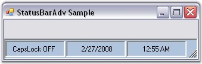

::: {style="DISPLAY: none"}
{#d2h_url_template}{#d2h_package_url style="WIDTH: 0px; DISPLAY: none; HEIGHT: 0px"}
:::

::: {.d2h_secondary_topic style="PADDING-BOTTOM: 10pt; MARGIN: 0pt; PADDING-LEFT: 0pt; PADDING-RIGHT: 0pt; PADDING-TOP: 0pt"}
##### Through Code {#through-code style="MARGIN-LEFT: 18pt; tab-stops: 18.0pt"}

[]{style="COLOR: #15428b"} 

To create a StatusBarAdv control programmatically,

[]{style="COLOR: #15428b"} 

1.               Open a new Visual C# or VB.NET application in Visual Studio .NET.

[]{style="COLOR: #15428b"} 

2.   Add the Syncfusion.Shared.Base and Syncfusion.Tools.Windows assemblies to your application.

[]{style="COLOR: #15428b"} 

3.   Declare the StatusBarAdv and StatusBarAdvPanel controls.

[]{style="COLOR: #15428b"} 

+----------------------------------------------------------------------------------------------------------------------------------------------------------------------------------------------+
| **[\[C#\]]{style="FONT-FAMILY: 'Courier New'; COLOR: black"}**                                                                                                                               |
|                                                                                                                                                                                              |
| []{style="FONT-FAMILY: 'Courier New'; COLOR: black"}                                                                                                                                         |
|                                                                                                                                                                                              |
| [private]{style="FONT-FAMILY: 'Courier New'; COLOR: blue"}[ Syncfusion.Windows.Forms.Tools.[StatusBarAdv]{style="COLOR: teal"} statusBarAdv1;]{style="FONT-FAMILY: 'Courier New'"}           |
|                                                                                                                                                                                              |
| [private]{style="FONT-FAMILY: 'Courier New'; COLOR: blue"}[ Syncfusion.Windows.Forms.Tools.[StatusBarAdvPanel]{style="COLOR: teal"} statusBarAdvPanel1;]{style="FONT-FAMILY: 'Courier New'"} |
|                                                                                                                                                                                              |
| [private]{style="FONT-FAMILY: 'Courier New'; COLOR: blue"}[ Syncfusion.Windows.Forms.Tools.[StatusBarAdvPanel]{style="COLOR: teal"} statusBarAdvPanel2;]{style="FONT-FAMILY: 'Courier New'"} |
|                                                                                                                                                                                              |
| [private]{style="FONT-FAMILY: 'Courier New'; COLOR: blue"}[ Syncfusion.Windows.Forms.Tools.[StatusBarAdvPanel]{style="COLOR: teal"} statusBarAdvPanel3;]{style="FONT-FAMILY: 'Courier New'"} |
+----------------------------------------------------------------------------------------------------------------------------------------------------------------------------------------------+

[]{style="COLOR: #15428b"} 

+------------------------------------------------------------------------------------------------------------------------------------------------------------------------------------------------+
| **[\[VB.NET\]]{style="FONT-FAMILY: 'Courier New'; COLOR: black"}**                                                                                                                             |
|                                                                                                                                                                                                |
| []{style="FONT-FAMILY: 'Courier New'; COLOR: black"}                                                                                                                                           |
|                                                                                                                                                                                                |
| [Private]{style="FONT-FAMILY: 'Courier New'; COLOR: blue"}[ statusBarAdv1 [As]{style="COLOR: blue"} Syncfusion.Windows.Forms.Tools.StatusBarAdv]{style="FONT-FAMILY: 'Courier New'"}           |
|                                                                                                                                                                                                |
| [Private]{style="FONT-FAMILY: 'Courier New'; COLOR: blue"}[ statusBarAdvPanel1 [As]{style="COLOR: blue"} Syncfusion.Windows.Forms.Tools.StatusBarAdvPanel]{style="FONT-FAMILY: 'Courier New'"} |
|                                                                                                                                                                                                |
| [Private]{style="FONT-FAMILY: 'Courier New'; COLOR: blue"}[ statusBarAdvPanel2 [As]{style="COLOR: blue"} Syncfusion.Windows.Forms.Tools.StatusBarAdvPanel]{style="FONT-FAMILY: 'Courier New'"} |
|                                                                                                                                                                                                |
| [Private]{style="FONT-FAMILY: 'Courier New'; COLOR: blue"}[ statusBarAdvPanel3 [As]{style="COLOR: blue"} Syncfusion.Windows.Forms.Tools.StatusBarAdvPanel]{style="FONT-FAMILY: 'Courier New'"} |
+------------------------------------------------------------------------------------------------------------------------------------------------------------------------------------------------+

[]{style="COLOR: #15428b"} 

4.   Initialize the controls.

[]{style="COLOR: #15428b"} 

+--------------------------------------------------------------------------------------------------------------------------------------------------------------------------------------------------------------------------+
| **[\[C#\]]{style="FONT-FAMILY: 'Courier New'; COLOR: black"}**                                                                                                                                                           |
|                                                                                                                                                                                                                          |
| []{style="FONT-FAMILY: 'Courier New'; COLOR: black"}                                                                                                                                                                     |
|                                                                                                                                                                                                                          |
| [this]{style="FONT-FAMILY: 'Courier New'; COLOR: blue"}[.statusBarAdv1 = [new]{style="COLOR: blue"} Syncfusion.Windows.Forms.Tools.[StatusBarAdv]{style="COLOR: teal"}();]{style="FONT-FAMILY: 'Courier New'"}           |
|                                                                                                                                                                                                                          |
| [this]{style="FONT-FAMILY: 'Courier New'; COLOR: blue"}[.statusBarAdvPanel1 = [new]{style="COLOR: blue"} Syncfusion.Windows.Forms.Tools.[StatusBarAdvPanel]{style="COLOR: teal"}();]{style="FONT-FAMILY: 'Courier New'"} |
|                                                                                                                                                                                                                          |
| [this]{style="FONT-FAMILY: 'Courier New'; COLOR: blue"}[.statusBarAdvPanel2 = [new]{style="COLOR: blue"} Syncfusion.Windows.Forms.Tools.[StatusBarAdvPanel]{style="COLOR: teal"}();]{style="FONT-FAMILY: 'Courier New'"} |
|                                                                                                                                                                                                                          |
| [this]{style="FONT-FAMILY: 'Courier New'; COLOR: blue"}[.statusBarAdvPanel3 = [new]{style="COLOR: blue"} Syncfusion.Windows.Forms.Tools.[StatusBarAdvPanel]{style="COLOR: teal"}();]{style="FONT-FAMILY: 'Courier New'"} |
+--------------------------------------------------------------------------------------------------------------------------------------------------------------------------------------------------------------------------+

[]{style="COLOR: #15428b"} 

+---------------------------------------------------------------------------------------------------------------------------------------------------------------------------------------------------------------------------------------+
| **[\[VB.NET\]]{style="FONT-FAMILY: 'Courier New'; COLOR: black"}**                                                                                                                                                                    |
|                                                                                                                                                                                                                                       |
| []{style="FONT-FAMILY: 'Courier New'; COLOR: black"}                                                                                                                                                                                  |
|                                                                                                                                                                                                                                       |
| [Me]{style="FONT-FAMILY: 'Courier New'; COLOR: blue"}[.statusBarAdv1 = [New]{style="COLOR: blue"} Syncfusion.Windows.Forms.Tools.StatusBarAdv() ]{style="FONT-FAMILY: 'Courier New'"}                                                 |
|                                                                                                                                                                                                                                       |
| [Me]{style="FONT-FAMILY: 'Courier New'; COLOR: blue"}[.statusBarAdvPanel1 = [New]{style="COLOR: blue"} Syncfusion.Windows.Forms.Tools.StatusBarAdvPanel() ]{style="FONT-FAMILY: 'Courier New'"}                                       |
|                                                                                                                                                                                                                                       |
| [Me]{style="FONT-FAMILY: 'Courier New'; COLOR: blue"}[.statusBarAdvPanel2 = [New]{style="COLOR: blue"} Syncfusion.Windows.Forms.Tools.StatusBarAdvPanel() ]{style="FONT-FAMILY: 'Courier New'"}                                       |
|                                                                                                                                                                                                                                       |
| [Me]{style="FONT-FAMILY: 'Courier New'; COLOR: blue"}[.statusBarAdvPanel3 = [New]{style="COLOR: blue"} Syncfusion.Windows.Forms.Tools.StatusBarAdvPanel()]{style="FONT-FAMILY: 'Courier New'"}[ ]{style="FONT-FAMILY: 'Courier New'"} |
+---------------------------------------------------------------------------------------------------------------------------------------------------------------------------------------------------------------------------------------+

[]{style="COLOR: #15428b"} 

5.   Set the properties to customize the control\'s appearance, and add the control to the form.

[]{style="COLOR: #15428b"} 

+--------------------------------------------------------------------------------------------------------------------------------------------------------------------------------------------------------------------------+
| **[\[C#\]]{style="FONT-FAMILY: 'Courier New'; COLOR: black"}**                                                                                                                                                           |
|                                                                                                                                                                                                                          |
| []{style="FONT-FAMILY: 'Courier New'; COLOR: black"}                                                                                                                                                                     |
|                                                                                                                                                                                                                          |
| [this]{style="FONT-FAMILY: 'Courier New'; COLOR: blue"}[.statusBarAdv1.BackColor = System.Drawing.[Color]{style="COLOR: teal"}.LightSteelBlue;]{style="FONT-FAMILY: 'Courier New'"}                                      |
|                                                                                                                                                                                                                          |
| [this]{style="FONT-FAMILY: 'Courier New'; COLOR: blue"}[.statusBarAdv1.BorderColor = System.Drawing.[Color]{style="COLOR: teal"}.Black;]{style="FONT-FAMILY: 'Courier New'"}                                             |
|                                                                                                                                                                                                                          |
| [this]{style="FONT-FAMILY: 'Courier New'; COLOR: blue"}[.statusBarAdv1.Dock = System.Windows.Forms.[DockStyle]{style="COLOR: teal"}.Bottom;]{style="FONT-FAMILY: 'Courier New'"}                                         |
|                                                                                                                                                                                                                          |
| [this]{style="FONT-FAMILY: 'Courier New'; COLOR: blue"}[.statusBarAdv1.Name = [\"statusBarAdv1\"]{style="COLOR: maroon"};]{style="FONT-FAMILY: 'Courier New'"}                                                           |
|                                                                                                                                                                                                                          |
| [this]{style="FONT-FAMILY: 'Courier New'; COLOR: blue"}[.statusBarAdv1.Controls.Add([this]{style="COLOR: blue"}.statusBarAdvPanel1);]{style="FONT-FAMILY: 'Courier New'"}                                                |
|                                                                                                                                                                                                                          |
| [this]{style="FONT-FAMILY: 'Courier New'; COLOR: blue"}[.statusBarAdv1.Controls.Add([this]{style="COLOR: blue"}.statusBarAdvPanel2);]{style="FONT-FAMILY: 'Courier New'"}                                                |
|                                                                                                                                                                                                                          |
| [this]{style="FONT-FAMILY: 'Courier New'; COLOR: blue"}[.statusBarAdv1.Controls.Add([this]{style="COLOR: blue"}.statusBarAdvPanel3);]{style="FONT-FAMILY: 'Courier New'"}                                                |
|                                                                                                                                                                                                                          |
| [this]{style="FONT-FAMILY: 'Courier New'; COLOR: blue"}[.statusBarAdvPanel1.PanelType = Syncfusion.Windows.Forms.Tools.[StatusBarAdvPanelType]{style="COLOR: teal"}.CurrentCulture;]{style="FONT-FAMILY: 'Courier New'"} |
|                                                                                                                                                                                                                          |
| [this]{style="FONT-FAMILY: 'Courier New'; COLOR: blue"}[.statusBarAdvPanel2.PanelType = Syncfusion.Windows.Forms.Tools.[StatusBarAdvPanelType]{style="COLOR: teal"}.ShortDate;]{style="FONT-FAMILY: 'Courier New'"}      |
|                                                                                                                                                                                                                          |
| [this]{style="FONT-FAMILY: 'Courier New'; COLOR: blue"}[.statusBarAdvPanel3.PanelType = Syncfusion.Windows.Forms.Tools.[StatusBarAdvPanelType]{style="COLOR: teal"}.ShortTime;]{style="FONT-FAMILY: 'Courier New'"}      |
|                                                                                                                                                                                                                          |
| [this]{style="FONT-FAMILY: 'Courier New'; COLOR: blue"}[.statusBarAdvPanel1.Size = [new]{style="COLOR: blue"} System.Drawing.[Size]{style="COLOR: teal"}(100, 27);]{style="FONT-FAMILY: 'Courier New'"}                  |
|                                                                                                                                                                                                                          |
| [this]{style="FONT-FAMILY: 'Courier New'; COLOR: blue"}[.statusBarAdvPanel2.Size = [new]{style="COLOR: blue"} System.Drawing.[Size]{style="COLOR: teal"}(100, 27);]{style="FONT-FAMILY: 'Courier New'"}                  |
|                                                                                                                                                                                                                          |
| [this]{style="FONT-FAMILY: 'Courier New'; COLOR: blue"}[.statusBarAdvPanel3.Size = [new]{style="COLOR: blue"} System.Drawing.[Size]{style="COLOR: teal"}(100, 27);]{style="FONT-FAMILY: 'Courier New'"}                  |
|                                                                                                                                                                                                                          |
| []{style="FONT-FAMILY: 'Courier New'"}                                                                                                                                                                                   |
|                                                                                                                                                                                                                          |
| [this]{style="FONT-FAMILY: 'Courier New'; COLOR: blue"}[.Controls.Add([this]{style="COLOR: blue"}.statusBarAdv1);]{style="FONT-FAMILY: 'Courier New'"}                                                                   |
+--------------------------------------------------------------------------------------------------------------------------------------------------------------------------------------------------------------------------+

[]{style="COLOR: #15428b"} 

+------------------------------------------------------------------------------------------------------------------------------------------------------------------------------------------------+
| **[\[VB.NET\]]{style="FONT-FAMILY: 'Courier New'; COLOR: black"}**                                                                                                                             |
|                                                                                                                                                                                                |
| []{style="FONT-FAMILY: 'Courier New'; COLOR: black"}                                                                                                                                           |
|                                                                                                                                                                                                |
| [Me]{style="FONT-FAMILY: 'Courier New'; COLOR: blue"}[.statusBarAdv1.BackColor = System.Drawing.Color.LightSteelBlue]{style="FONT-FAMILY: 'Courier New'"}                                      |
|                                                                                                                                                                                                |
| [Me]{style="FONT-FAMILY: 'Courier New'; COLOR: blue"}[.statusBarAdv1.BorderColor = System.Drawing.Color.Black]{style="FONT-FAMILY: 'Courier New'"}                                             |
|                                                                                                                                                                                                |
| [Me]{style="FONT-FAMILY: 'Courier New'; COLOR: blue"}[.statusBarAdv1.Dock = System.Windows.Forms.DockStyle.Bottom]{style="FONT-FAMILY: 'Courier New'"}                                         |
|                                                                                                                                                                                                |
| [Me]{style="FONT-FAMILY: 'Courier New'; COLOR: blue"}[.statusBarAdv1.Name = \"statusBarAdv1\"]{style="FONT-FAMILY: 'Courier New'"}                                                             |
|                                                                                                                                                                                                |
| [Me]{style="FONT-FAMILY: 'Courier New'; COLOR: blue"}[.statusBarAdv1.Controls.Add([Me]{style="COLOR: blue"}.statusBarAdvPanel1)]{style="FONT-FAMILY: 'Courier New'"}                           |
|                                                                                                                                                                                                |
| [Me]{style="FONT-FAMILY: 'Courier New'; COLOR: blue"}[.statusBarAdv1.Controls.Add([Me]{style="COLOR: blue"}.statusBarAdvPanel2)]{style="FONT-FAMILY: 'Courier New'"}                           |
|                                                                                                                                                                                                |
| [Me]{style="FONT-FAMILY: 'Courier New'; COLOR: blue"}[.statusBarAdv1.Controls.Add([Me]{style="COLOR: blue"}.statusBarAdvPanel3)]{style="FONT-FAMILY: 'Courier New'"}                           |
|                                                                                                                                                                                                |
| [Me]{style="FONT-FAMILY: 'Courier New'; COLOR: blue"}[.statusBarAdvPanel1.PanelType = Syncfusion.Windows.Forms.Tools.StatusBarAdvPanelType.CurrentCulture]{style="FONT-FAMILY: 'Courier New'"} |
|                                                                                                                                                                                                |
| [Me]{style="FONT-FAMILY: 'Courier New'; COLOR: blue"}[.statusBarAdvPanel2.PanelType = Syncfusion.Windows.Forms.Tools.StatusBarAdvPanelType.ShortDate]{style="FONT-FAMILY: 'Courier New'"}      |
|                                                                                                                                                                                                |
| [Me]{style="FONT-FAMILY: 'Courier New'; COLOR: blue"}[.statusBarAdvPanel3.PanelType = Syncfusion.Windows.Forms.Tools.StatusBarAdvPanelType.ShortTime]{style="FONT-FAMILY: 'Courier New'"}      |
|                                                                                                                                                                                                |
| [Me]{style="FONT-FAMILY: 'Courier New'; COLOR: blue"}[.statusBarAdvPanel1.Size = [New]{style="COLOR: blue"} System.Drawing.Size(100, 27)]{style="FONT-FAMILY: 'Courier New'"}                  |
|                                                                                                                                                                                                |
| [Me]{style="FONT-FAMILY: 'Courier New'; COLOR: blue"}[.statusBarAdvPanel2.Size = [New]{style="COLOR: blue"} System.Drawing.Size(100, 27)]{style="FONT-FAMILY: 'Courier New'"}                  |
|                                                                                                                                                                                                |
| [Me]{style="FONT-FAMILY: 'Courier New'; COLOR: blue"}[.statusBarAdvPanel3.Size = [New]{style="COLOR: blue"} System.Drawing.Size(100, 27)]{style="FONT-FAMILY: 'Courier New'"}                  |
|                                                                                                                                                                                                |
| []{style="FONT-FAMILY: 'Courier New'; COLOR: blue"}                                                                                                                                            |
|                                                                                                                                                                                                |
| [Me]{style="FONT-FAMILY: 'Courier New'; COLOR: blue"}[.Controls.Add([Me]{style="COLOR: blue"}.statusBarAdv1)]{style="FONT-FAMILY: 'Courier New'"}                                              |
+------------------------------------------------------------------------------------------------------------------------------------------------------------------------------------------------+

[]{style="FONT-SIZE: 8pt"} 

6.   Run the application. You will see the StatusBarAdv control docked to the bottom of the form. By default it will be docked to \'Bottom\'.

[]{style="FONT-SIZE: 8pt"} 

{border="0"}

**[]{style="COLOR: #15428b"}** 

Figure 1007: StatusBarAdv Control created Through Code

**[]{style="COLOR: #15428b"}** 

See Also

[]{style="COLOR: #15428b"} 

[[Through Designer]{.UGHyperlink}](../../../../../../../../Documents%20and%20Settings/sylviap/Desktop/Tools%20-%20Part%202.docx#_Through_Designer_3)[]{.UGHyperlink}

 

 

 

 

[]{#related-topics}
:::
