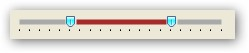

::: {style="DISPLAY: none"}
{#d2h_url_template}{#d2h_package_url style="WIDTH: 0px; DISPLAY: none; HEIGHT: 0px"}
:::

::: {.d2h_secondary_topic style="PADDING-BOTTOM: 10pt; MARGIN: 0pt; PADDING-LEFT: 0pt; PADDING-RIGHT: 0pt; PADDING-TOP: 0pt"}
##### Through Code {#through-code style="MARGIN-LEFT: 18pt; tab-stops: 18.0pt"}

[]{style="COLOR: #15428b"} 

The following code illustrates the creation of RangeSlider.[]{#p1084}

[]{style="COLOR: #15428b"} 

+-------------------------------------------------------------------------------------------------------------------------------------------------------------------------------------------+
| **[\[C#\]]{style="FONT-FAMILY: 'Courier New'; COLOR: black"}**                                                                                                                            |
|                                                                                                                                                                                           |
| []{style="COLOR: #15428b"}                                                                                                                                                                |
|                                                                                                                                                                                           |
| [RangeSlider]{style="FONT-FAMILY: 'Courier New'; COLOR: #2b91af"}[ rangeSlider = [new]{style="COLOR: blue"} [RangeSlider]{style="COLOR: #2b91af"}();]{style="FONT-FAMILY: 'Courier New'"} |
|                                                                                                                                                                                           |
| [rangeSlider.Maximum = 20;]{style="FONT-FAMILY: 'Courier New'"}                                                                                                                           |
|                                                                                                                                                                                           |
| [rangeSlider.Minimum = 0;]{style="FONT-FAMILY: 'Courier New'"}                                                                                                                            |
|                                                                                                                                                                                           |
| [rangeSlider.SliderMax = 15;]{style="FONT-FAMILY: 'Courier New'"}                                                                                                                         |
|                                                                                                                                                                                           |
| [rangeSlider.SliderMin = 5;]{style="FONT-FAMILY: 'Courier New'"}                                                                                                                          |
|                                                                                                                                                                                           |
| [rangeSlider.RangeColor = [Color]{style="COLOR: #2b91af"}.Brown;]{style="FONT-FAMILY: 'Courier New'"}                                                                                     |
|                                                                                                                                                                                           |
| [rangeSlider.ChannelColor = [Color]{style="COLOR: #2b91af"}.DarkGray;]{style="FONT-FAMILY: 'Courier New'"}                                                                                |
|                                                                                                                                                                                           |
| [rangeSlider.ChannelHeight = 5;]{style="FONT-FAMILY: 'Courier New'"}                                                                                                                      |
|                                                                                                                                                                                           |
| [rangeSlider.HighlightedThumbColor = [Color]{style="COLOR: #2b91af"}.DarkBlue;]{style="FONT-FAMILY: 'Courier New'"}                                                                       |
|                                                                                                                                                                                           |
| [rangeSlider.PushedThumbColor = [Color]{style="COLOR: #2b91af"}.Crimson;]{style="FONT-FAMILY: 'Courier New'"}                                                                             |
|                                                                                                                                                                                           |
| [rangeSlider.ThumbColor = [Color]{style="COLOR: #2b91af"}.Aqua;]{style="FONT-FAMILY: 'Courier New'"}                                                                                      |
|                                                                                                                                                                                           |
| [rangeSlider.Location = [new]{style="COLOR: blue"} [Point]{style="COLOR: #2b91af"}(80, 30);]{style="FONT-FAMILY: 'Courier New'"}                                                          |
|                                                                                                                                                                                           |
| [this]{style="FONT-FAMILY: 'Courier New'; COLOR: blue"}[.Controls.Add(rangeSlider);]{style="FONT-FAMILY: 'Courier New'"}[]{style="FONT-FAMILY: 'Courier New'"}                            |
+-------------------------------------------------------------------------------------------------------------------------------------------------------------------------------------------+

[]{style="COLOR: #15428b"} 

Run the code.

[]{style="COLOR: #15428b"} 

Output

**[]{style="COLOR: #15428b"}** 

{border="0"}

***[]{style="COLOR: #15428b"}*** 

Figure 1266: Range Slider

 

[]{#related-topics}
:::
