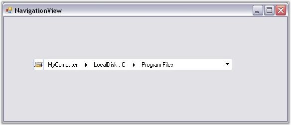

::: {style="DISPLAY: none"}
{#d2h_url_template}{#d2h_package_url style="WIDTH: 0px; DISPLAY: none; HEIGHT: 0px"}
:::

::: {.d2h_secondary_topic style="PADDING-BOTTOM: 10pt; MARGIN: 0pt; PADDING-LEFT: 0pt; PADDING-RIGHT: 0pt; PADDING-TOP: 0pt"}
#### Through Code {#through-code style="MARGIN-LEFT: 18pt; tab-stops: 18.0pt"}

[]{style="COLOR: #15428b"} 

To create a NavigationView control programmatically, follow the below given steps.

[]{style="COLOR: #15428b"} 

1.  Include the Tools Windows namespace to the .cs / .vb file.

[]{style="COLOR: #15428b"} 

+----------------------------------------------------------------------------------------------------------------------------------------------------------------------+
| **[\[C#\]]{style="FONT-FAMILY: 'Courier New'; COLOR: black"}**                                                                                                       |
|                                                                                                                                                                      |
| []{style="FONT-FAMILY: 'Courier New'; COLOR: black"}                                                                                                                 |
|                                                                                                                                                                      |
| [using]{style="FONT-FAMILY: 'Courier New'; COLOR: blue"}[ Syncfusion.Windows.Forms.Tools;]{style="FONT-FAMILY: 'Courier New'"}[]{style="FONT-FAMILY: 'Courier New'"} |
+----------------------------------------------------------------------------------------------------------------------------------------------------------------------+

[]{style="COLOR: #15428b"} 

+-----------------------------------------------------------------------------------------------------------------------------------------------------------------------+
| **[\[VB.NET\]]{style="FONT-FAMILY: 'Courier New'; COLOR: black"}**                                                                                                    |
|                                                                                                                                                                       |
| []{style="FONT-FAMILY: 'Courier New'; COLOR: black"}                                                                                                                  |
|                                                                                                                                                                       |
| [Imports]{style="FONT-FAMILY: 'Courier New'; COLOR: blue"}[ Syncfusion.Windows.Forms.Tools]{style="FONT-FAMILY: 'Courier New'"}[]{style="FONT-FAMILY: 'Courier New'"} |
+-----------------------------------------------------------------------------------------------------------------------------------------------------------------------+

[]{style="COLOR: #15428b"} 

2.   Create an instance of the NavigationView control and add Parent Bars and Child Bars to it.

[]{style="COLOR: #15428b"} 

+-----------------------------------------------------------------------------------------------------------------------------------------------------------------------------+
| **[\[C#\]]{style="FONT-FAMILY: 'Courier New'; COLOR: black"}**                                                                                                              |
|                                                                                                                                                                             |
| []{style="FONT-FAMILY: 'Courier New'; COLOR: black"}                                                                                                                        |
|                                                                                                                                                                             |
| [//Creating instance of NavigationView]{style="FONT-FAMILY: 'Courier New'; COLOR: green"}                                                                                   |
|                                                                                                                                                                             |
| [NavigationView navigationView4 = [new]{style="COLOR: blue"} NavigationView();]{style="FONT-FAMILY: 'Courier New'"}                                                         |
|                                                                                                                                                                             |
| [// Creating instance of Bars ]{style="FONT-FAMILY: 'Courier New'; COLOR: green"}                                                                                           |
|                                                                                                                                                                             |
| [Syncfusion.Windows.Forms.Tools.Navigation.Bar Rootbar = [new]{style="COLOR: blue"} Syncfusion.Windows.Forms.Tools.Navigation.Bar();]{style="FONT-FAMILY: 'Courier New'"}   |
|                                                                                                                                                                             |
| [Syncfusion.Windows.Forms.Tools.Navigation.Bar ChildBar1 = [new]{style="COLOR: blue"} Syncfusion.Windows.Forms.Tools.Navigation.Bar();]{style="FONT-FAMILY: 'Courier New'"} |
|                                                                                                                                                                             |
| [Syncfusion.Windows.Forms.Tools.Navigation.Bar ChildBar2 = [new]{style="COLOR: blue"} Syncfusion.Windows.Forms.Tools.Navigation.Bar();]{style="FONT-FAMILY: 'Courier New'"} |
|                                                                                                                                                                             |
| [Rootbar.ImageIndex = 0;]{style="FONT-FAMILY: 'Courier New'"}                                                                                                               |
|                                                                                                                                                                             |
| [Rootbar.Text = [\"MyComputer\"]{style="COLOR: maroon"};]{style="FONT-FAMILY: 'Courier New'"}                                                                               |
|                                                                                                                                                                             |
| [ChildBar1.ImageIndex = 1;]{style="FONT-FAMILY: 'Courier New'"}                                                                                                             |
|                                                                                                                                                                             |
| [ChildBar1.Text = [\"LocalDisk : C\"]{style="COLOR: maroon"};]{style="FONT-FAMILY: 'Courier New'"}                                                                          |
|                                                                                                                                                                             |
| [ChildBar2.ImageIndex = 1;]{style="FONT-FAMILY: 'Courier New'"}                                                                                                             |
|                                                                                                                                                                             |
| [ChildBar2.Text = [\"Program Files\"]{style="COLOR: maroon"};]{style="FONT-FAMILY: 'Courier New'"}                                                                          |
|                                                                                                                                                                             |
| [// Adding child bars into Rootbar]{style="FONT-FAMILY: 'Courier New'; COLOR: green"}                                                                                       |
|                                                                                                                                                                             |
| [ChildBar1.Bars.AddRange([new]{style="COLOR: blue"} Syncfusion.Windows.Forms.Tools.Navigation.Bar\[\] {]{style="FONT-FAMILY: 'Courier New'"}                                |
|                                                                                                                                                                             |
| [ChildBar2});]{style="FONT-FAMILY: 'Courier New'"}                                                                                                                          |
|                                                                                                                                                                             |
| [Rootbar.Bars.AddRange([new]{style="COLOR: blue"} Syncfusion.Windows.Forms.Tools.Navigation.Bar\[\] {]{style="FONT-FAMILY: 'Courier New'"}                                  |
|                                                                                                                                                                             |
| [ChildBar1});]{style="FONT-FAMILY: 'Courier New'"}                                                                                                                          |
|                                                                                                                                                                             |
| [// Adding the rootbar into NavigationView]{style="FONT-FAMILY: 'Courier New'; COLOR: green"}                                                                               |
|                                                                                                                                                                             |
| [navigationView4.Bars.AddRange([new]{style="COLOR: blue"} Syncfusion.Windows.Forms.Tools.Navigation.Bar\[\] {]{style="FONT-FAMILY: 'Courier New'"}                          |
|                                                                                                                                                                             |
| [Rootbar});]{style="FONT-FAMILY: 'Courier New'"}                                                                                                                            |
|                                                                                                                                                                             |
| [navigationView4.ImageList = [this]{style="COLOR: blue"}.imageList1;]{style="FONT-FAMILY: 'Courier New'"}                                                                   |
|                                                                                                                                                                             |
| [navigationView4.Location = [new]{style="COLOR: blue"} System.Drawing.[Point]{style="COLOR: teal"}(250, 300);]{style="FONT-FAMILY: 'Courier New'"}                          |
|                                                                                                                                                                             |
| [navigationView4.Name = [\"navigationView\"]{style="COLOR: maroon"};]{style="FONT-FAMILY: 'Courier New'"}                                                                   |
|                                                                                                                                                                             |
| [navigationView4.Size = [new]{style="COLOR: blue"} System.Drawing.[Size]{style="COLOR: teal"}(343, 21);]{style="FONT-FAMILY: 'Courier New'"}                                |
|                                                                                                                                                                             |
| [navigationView4.TabIndex = 0;]{style="FONT-FAMILY: 'Courier New'"}                                                                                                         |
|                                                                                                                                                                             |
| [navigationView4.Text = [\"navigationView\"]{style="COLOR: maroon"};]{style="FONT-FAMILY: 'Courier New'"}                                                                   |
|                                                                                                                                                                             |
| [// Setting the Visual Style into Vista]{style="FONT-FAMILY: 'Courier New'; COLOR: green"}                                                                                  |
|                                                                                                                                                                             |
| [navigationView4.VisualStyle = Syncfusion.Windows.Forms.Tools.Navigation.VisualStyles.Vista;]{style="FONT-FAMILY: 'Courier New'"}                                           |
|                                                                                                                                                                             |
| [this]{style="FONT-FAMILY: 'Courier New'; COLOR: blue"}[.Controls.Add(navigationView4);]{style="FONT-FAMILY: 'Courier New'"}[]{style="FONT-FAMILY: 'Courier New'"}          |
+-----------------------------------------------------------------------------------------------------------------------------------------------------------------------------+

[]{style="COLOR: #15428b"} 

+-------------------------------------------------------------------------------------------------------------------------------------------------------------------------------------------------------------------------------------------------------------+
| **[\[VB.NET\]]{style="FONT-FAMILY: 'Courier New'; COLOR: black"}**                                                                                                                                                                                          |
|                                                                                                                                                                                                                                                             |
| []{style="FONT-FAMILY: 'Courier New'; COLOR: black"}                                                                                                                                                                                                        |
|                                                                                                                                                                                                                                                             |
| [\'Creating instance of NavigationView]{style="FONT-FAMILY: 'Courier New'; COLOR: green"}                                                                                                                                                                   |
|                                                                                                                                                                                                                                                             |
| []{style="FONT-FAMILY: 'Courier New'; COLOR: green"}                                                                                                                                                                                                        |
|                                                                                                                                                                                                                                                             |
| [Dim]{style="FONT-FAMILY: 'Courier New'; COLOR: blue"}[ navigationView4 [As]{style="COLOR: blue"} NavigationView = [New]{style="COLOR: blue"} NavigationView()]{style="FONT-FAMILY: 'Courier New'"}                                                         |
|                                                                                                                                                                                                                                                             |
| [\' Creating instance of Bars ]{style="FONT-FAMILY: 'Courier New'; COLOR: green"}                                                                                                                                                                           |
|                                                                                                                                                                                                                                                             |
| [Dim]{style="FONT-FAMILY: 'Courier New'; COLOR: blue"}[ Rootbar [As]{style="COLOR: blue"} Syncfusion.Windows.Forms.Tools.Navigation.Bar = [New]{style="COLOR: blue"} Syncfusion.Windows.Forms.Tools.Navigation.Bar()]{style="FONT-FAMILY: 'Courier New'"}   |
|                                                                                                                                                                                                                                                             |
| [Dim]{style="FONT-FAMILY: 'Courier New'; COLOR: blue"}[ ChildBar1 [As]{style="COLOR: blue"} Syncfusion.Windows.Forms.Tools.Navigation.Bar = [New]{style="COLOR: blue"} Syncfusion.Windows.Forms.Tools.Navigation.Bar()]{style="FONT-FAMILY: 'Courier New'"} |
|                                                                                                                                                                                                                                                             |
| [Dim]{style="FONT-FAMILY: 'Courier New'; COLOR: blue"}[ ChildBar2 [As]{style="COLOR: blue"} Syncfusion.Windows.Forms.Tools.Navigation.Bar = [New]{style="COLOR: blue"} Syncfusion.Windows.Forms.Tools.Navigation.Bar()]{style="FONT-FAMILY: 'Courier New'"} |
|                                                                                                                                                                                                                                                             |
| [Rootbar.ImageIndex = 0]{style="FONT-FAMILY: 'Courier New'"}                                                                                                                                                                                                |
|                                                                                                                                                                                                                                                             |
| [Rootbar.Text = [\"MyComputer\"]{style="COLOR: #a31515"}]{style="FONT-FAMILY: 'Courier New'"}                                                                                                                                                               |
|                                                                                                                                                                                                                                                             |
| [ChildBar1.ImageIndex = 1]{style="FONT-FAMILY: 'Courier New'"}                                                                                                                                                                                              |
|                                                                                                                                                                                                                                                             |
| [ChildBar1.Text = [\"LocalDisk : C\"]{style="COLOR: #a31515"}]{style="FONT-FAMILY: 'Courier New'"}                                                                                                                                                          |
|                                                                                                                                                                                                                                                             |
| [ChildBar2.ImageIndex = 1]{style="FONT-FAMILY: 'Courier New'"}                                                                                                                                                                                              |
|                                                                                                                                                                                                                                                             |
| [ChildBar2.Text = [\"Program Files\"]{style="COLOR: #a31515"}]{style="FONT-FAMILY: 'Courier New'"}                                                                                                                                                          |
|                                                                                                                                                                                                                                                             |
| [\' Adding child bars into Rootbar]{style="FONT-FAMILY: 'Courier New'; COLOR: green"}                                                                                                                                                                       |
|                                                                                                                                                                                                                                                             |
| [ChildBar1.Bars.AddRange([New]{style="COLOR: blue"} Syncfusion.Windows.Forms.Tools.Navigation.Bar() { ChildBar2})]{style="FONT-FAMILY: 'Courier New'"}                                                                                                      |
|                                                                                                                                                                                                                                                             |
| [Rootbar.Bars.AddRange([New]{style="COLOR: blue"} Syncfusion.Windows.Forms.Tools.Navigation.Bar() { ChildBar1})]{style="FONT-FAMILY: 'Courier New'"}                                                                                                        |
|                                                                                                                                                                                                                                                             |
| []{style="FONT-FAMILY: 'Courier New'"}                                                                                                                                                                                                                      |
|                                                                                                                                                                                                                                                             |
| [\' Adding the rootbar into NavigationView]{style="FONT-FAMILY: 'Courier New'; COLOR: green"}                                                                                                                                                               |
|                                                                                                                                                                                                                                                             |
| [navigationView4.Bars.AddRange([New]{style="COLOR: blue"} Syncfusion.Windows.Forms.Tools.Navigation.Bar() { Rootbar})]{style="FONT-FAMILY: 'Courier New'"}                                                                                                  |
|                                                                                                                                                                                                                                                             |
| [navigationView4.ImageList = [Me]{style="COLOR: blue"}.imageList1]{style="FONT-FAMILY: 'Courier New'"}                                                                                                                                                      |
|                                                                                                                                                                                                                                                             |
| [navigationView4.Location = [New]{style="COLOR: blue"} System.Drawing.Point(250, 300)]{style="FONT-FAMILY: 'Courier New'"}                                                                                                                                  |
|                                                                                                                                                                                                                                                             |
| [navigationView4.Name = [\"navigationView\"]{style="COLOR: #a31515"}]{style="FONT-FAMILY: 'Courier New'"}                                                                                                                                                   |
|                                                                                                                                                                                                                                                             |
| [navigationView4.Size = [New]{style="COLOR: blue"} System.Drawing.Size(343, 21)]{style="FONT-FAMILY: 'Courier New'"}                                                                                                                                        |
|                                                                                                                                                                                                                                                             |
| [navigationView4.TabIndex = 0]{style="FONT-FAMILY: 'Courier New'"}                                                                                                                                                                                          |
|                                                                                                                                                                                                                                                             |
| [navigationView4.Text = [\"navigationView\"]{style="COLOR: #a31515"}]{style="FONT-FAMILY: 'Courier New'"}                                                                                                                                                   |
|                                                                                                                                                                                                                                                             |
| [\' Setting the Visual Style into Vista]{style="FONT-FAMILY: 'Courier New'; COLOR: green"}                                                                                                                                                                  |
|                                                                                                                                                                                                                                                             |
| [navigationView4.VisualStyle = Syncfusion.Windows.Forms.Tools.Navigation.VisualStyles.Vista]{style="FONT-FAMILY: 'Courier New'"}                                                                                                                            |
|                                                                                                                                                                                                                                                             |
| [Me]{style="FONT-FAMILY: 'Courier New'; COLOR: blue"}[.Controls.Add(navigationView4)]{style="FONT-FAMILY: 'Courier New'"}[]{style="FONT-FAMILY: 'Courier New'"}                                                                                             |
+-------------------------------------------------------------------------------------------------------------------------------------------------------------------------------------------------------------------------------------------------------------+

[  ]{style="COLOR: #15428b"}

{border="0"}

[]{style="COLOR: #15428b"} 

Figure 1477: NavigationView with Bars

 

[]{#related-topics}
:::
