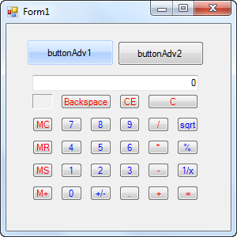
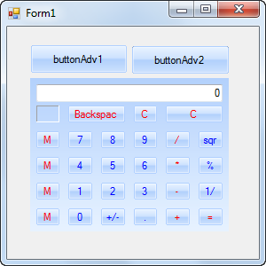

::: {style="DISPLAY: none"}
{#d2h_url_template}{#d2h_package_url style="WIDTH: 0px; DISPLAY: none; HEIGHT: 0px"}
:::

::: {.d2h_secondary_topic style="PADDING-BOTTOM: 10pt; MARGIN: 0pt; PADDING-LEFT: 0pt; PADDING-RIGHT: 0pt; PADDING-TOP: 0pt"}
#### Through Code {#through-code style="TEXT-ALIGN: justify; tab-stops: 0pt"}

You can add Skin Manager to one of the controls in your form or to the entire control as needed by specifying the root control. You can specify the root control using the *Control* property.

 

To add Skin Manager to one of the controls, specify the control as root control. The following code illustrates this:

 

+---------------------------------------------------------------------------------------------------------------------------------------------------------------+
| [\[C#\]]{style="FONT-FAMILY: 'Courier New'; COLOR: #2b91af"}                                                                                                  |
|                                                                                                                                                               |
| []{style="FONT-FAMILY: 'Courier New'; COLOR: #2b91af"}                                                                                                        |
|                                                                                                                                                               |
| [SkinManager]{style="FONT-FAMILY: 'Courier New'; COLOR: #2b91af"}[.SetVisualStyle([this]{style="COLOR: blue"}.buttonAdv1]{style="FONT-FAMILY: 'Courier New'"} |
|                                                                                                                                                               |
| [, [VisualTheme]{style="COLOR: #2b91af"}.Office2007Blue );]{style="FONT-FAMILY: 'Courier New'"}                                                               |
+---------------------------------------------------------------------------------------------------------------------------------------------------------------+

 

+------------------------------------------------------------------------------------------------------------------------------------+
| \[VB\]                                                                                                                             |
|                                                                                                                                    |
| [SkinManager.SetVisualStyle([Me]{style="COLOR: blue"}.buttonAdv1, VisualTheme.Office2007Blue)]{style="FONT-FAMILY: 'Courier New'"} |
+------------------------------------------------------------------------------------------------------------------------------------+

 

{border="0"}

 

To add Skin Manager to the entire form, specify the form as root control. The following code illustrates this:

 

+---------------------------------------------------------------------------------------------------------------------------------------------------------------------------------------------+
| **[\[C#\]]{style="FONT-FAMILY: 'Courier New'"}**                                                                                                                                            |
|                                                                                                                                                                                             |
| [            [SkinManager]{style="COLOR: #2b91af"}.SetVisualStyle([this]{style="COLOR: blue"}, [VisualTheme]{style="COLOR: #2b91af"}.Office2007Blue );]{style="FONT-FAMILY: 'Courier New'"} |
+---------------------------------------------------------------------------------------------------------------------------------------------------------------------------------------------+

 

+-------------------------------------------------------------------------------------------------------------------------------------+
| [\[VB\]]{style="FONT-FAMILY: 'Courier New'"}                                                                                        |
|                                                                                                                                     |
| [            SkinManager.SetVisualStyle([Me]{style="COLOR: blue"}, VisualTheme.Office2007Blue)]{style="FONT-FAMILY: 'Courier New'"} |
+-------------------------------------------------------------------------------------------------------------------------------------+

 

{border="0"}

 

 

[]{#related-topics}
:::
