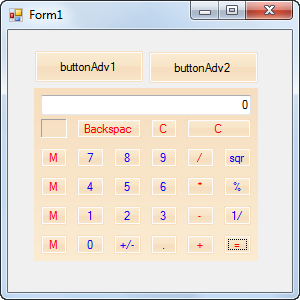

::: {style="DISPLAY: none"}
{#d2h_url_template}{#d2h_package_url style="WIDTH: 0px; DISPLAY: none; HEIGHT: 0px"}
:::

::: {.d2h_secondary_topic style="PADDING-BOTTOM: 10pt; MARGIN: 0pt; PADDING-LEFT: 0pt; PADDING-RIGHT: 0pt; PADDING-TOP: 0pt"}
#### Through Code {#through-code style="TEXT-ALIGN: justify; tab-stops: 0pt"}

You can apply the required skin to the form using the *VisualTheme* property.

 

The following code illustrates how to apply Office 2007 theme:

 

+---------------------------------------------------------------------------------------------------------------------------------------------------------------------------------------------+
| **[\[C#\]]{style="FONT-FAMILY: 'Courier New'"}**                                                                                                                                            |
|                                                                                                                                                                                             |
| [            [SkinManager]{style="COLOR: #2b91af"}.SetVisualStyle([this]{style="COLOR: blue"}, [VisualTheme]{style="COLOR: #2b91af"}.Office2007Blue );]{style="FONT-FAMILY: 'Courier New'"} |
|                                                                                                                                                                                             |
|                                                                                                                                                                                             |
+---------------------------------------------------------------------------------------------------------------------------------------------------------------------------------------------+

 

+-------------------------------------------------------------------------------------------------------------------------------------+
| [\[VB\]]{style="FONT-FAMILY: 'Courier New'"}                                                                                        |
|                                                                                                                                     |
| [            SkinManager.SetVisualStyle([Me]{style="COLOR: blue"}, VisualTheme.Office2007Blue)]{style="FONT-FAMILY: 'Courier New'"} |
|                                                                                                                                     |
|                                                                                                                                     |
+-------------------------------------------------------------------------------------------------------------------------------------+

 

{border="0"}

 

 

The following code illustrates how to apply Managed themes:

 

+--------------------------------------------------------------------------------------------------------------------------------------------------------------------------+
| [\[C#\]]{style="FONT-FAMILY: 'Courier New'; COLOR: #2b91af"}                                                                                                             |
|                                                                                                                                                                          |
| [Office12ColorTable]{style="FONT-FAMILY: 'Courier New'; COLOR: #2b91af"}[.ApplyManagedColors([this]{style="COLOR: blue"}.buttonAdv1]{style="FONT-FAMILY: 'Courier New'"} |
|                                                                                                                                                                          |
| [,[Color]{style="COLOR: #2b91af"}.]{style="FONT-FAMILY: 'Courier New'"}[ Orange);]{style="FONT-FAMILY: 'Courier New'"}                                                   |
+--------------------------------------------------------------------------------------------------------------------------------------------------------------------------+

 

+---------------------------------------------------------------------------------------------------------------------------------+
| [\[VB\]]{style="FONT-FAMILY: 'Courier New'"}                                                                                    |
|                                                                                                                                 |
| []{style="FONT-FAMILY: 'Courier New'"}                                                                                          |
|                                                                                                                                 |
| [Office12ColorTable.ApplyManagedColors([Me]{style="COLOR: blue"}.buttonAdv1,Color.Orange )]{style="FONT-FAMILY: 'Courier New'"} |
+---------------------------------------------------------------------------------------------------------------------------------+

 

{border="0"}

 

 

 

 

[]{#related-topics}
:::
