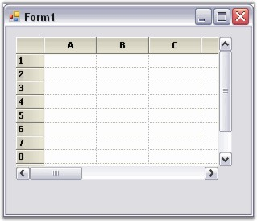
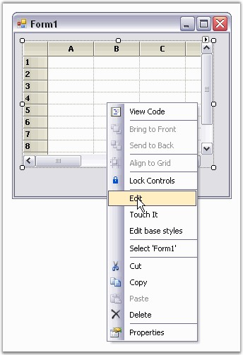
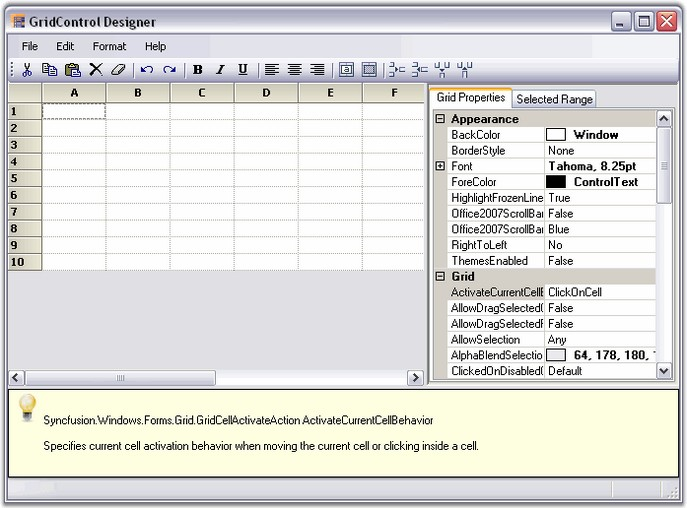
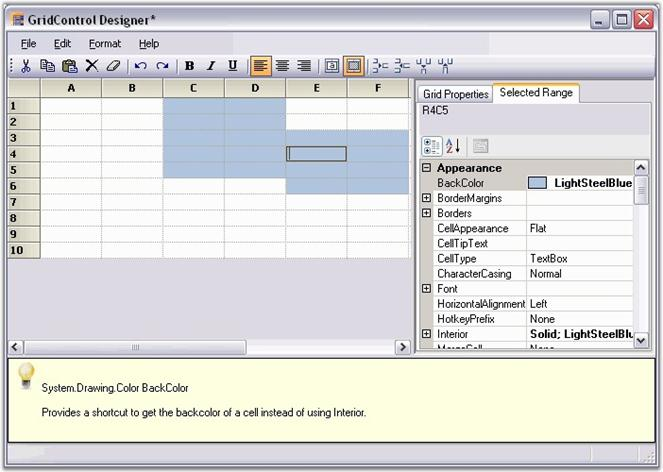

::: {style="DISPLAY: none"}
{#d2h_url_template}{#d2h_package_url style="WIDTH: 0px; DISPLAY: none; HEIGHT: 0px"}
:::

::: {.d2h_secondary_topic style="PADDING-BOTTOM: 10pt; MARGIN: 0pt; PADDING-LEFT: 0pt; PADDING-RIGHT: 0pt; PADDING-TOP: 0pt"}
#### Through Designer {#through-designer style="tab-stops: 0pt"}

[]{style="FONT-FAMILY: 'Trebuchet MS','sans-serif'; COLOR: #15428b; FONT-SIZE: 9pt"} 

To make the task of designing the Grid control easier on a cell level, a new Designer Editor has been added. With the editor, the grid can be modified and saved (and loaded) to xml formatted files, or Soap formatted templates. There is also no longer a Toggle Interactive Mode design verb that was present in versions prior to 4.1.

[]{style="FONT-FAMILY: 'Trebuchet MS','sans-serif'; COLOR: #15428b; FONT-SIZE: 9pt"} 

To add a Grid Control to the Application

[]{style="FONT-FAMILY: 'Trebuchet MS','sans-serif'; COLOR: #15428b; FONT-SIZE: 9pt"} 

Following steps illustrate how to add a Grid control to your application.

[]{style="FONT-FAMILY: 'Trebuchet MS','sans-serif'; COLOR: #15428b; FONT-SIZE: 9pt"} 

1.   Drag the **GridControl** component from the toolbox onto the form.

 

{border="0"}

[]{style="FONT-FAMILY: 'Trebuchet MS','sans-serif'; COLOR: #15428b; FONT-SIZE: 9pt"} 

Figure 68: Grid Control

[]{style="FONT-FAMILY: 'Trebuchet MS','sans-serif'; COLOR: #15428b; FONT-SIZE: 9pt"} 

2.   To edit the cell level properties of the grid (and also general Grid control properties), right-click anywhere in the Grid control and select **Edit**.

[]{style="FONT-FAMILY: 'Trebuchet MS','sans-serif'; COLOR: #15428b; FONT-SIZE: 9pt"} 

{border="0"}

[]{style="FONT-FAMILY: 'Trebuchet MS','sans-serif'; COLOR: #15428b; FONT-SIZE: 9pt"} 

Figure 69: Select Edit option in the Grid Control Context Menu

 

3.   This opens the **GridControl Designer** window. By using the GridControl Designer, the cell contents or styles, as well as general grid properties can be modified.

 

{border="0"}

[]{style="FONT-FAMILY: 'Trebuchet MS','sans-serif'; COLOR: #15428b; FONT-SIZE: 9pt"} 

Figure 70: Property Editor

[]{style="FONT-FAMILY: 'Trebuchet MS','sans-serif'; COLOR: #15428b; FONT-SIZE: 9pt"} 

4.   Single cells can be modified along with a selection of ranges. To do this, select a range of cells, and switch to the **Selected Range** tab to view the property grid for the selection.

 

{border="0"}

[\
]{style="FONT-FAMILY: 'Trebuchet MS','sans-serif'; COLOR: #15428b"}Figure 71: Property Window**[]{style="FONT-STYLE: normal; FONT-FAMILY: 'Trebuchet MS','sans-serif'; COLOR: #15428b"}**

[]{style="FONT-FAMILY: 'Trebuchet MS','sans-serif'; COLOR: #15428b; FONT-SIZE: 9pt"} 

GridControl Designer also lets you to save/load xml formatted files, and Soap templates.

 

5.   When the changes are complete, simply exit out of the designer. If changes have been made, you will be prompted to save the changes to the Grid control in the designer.

6.   Click **OK** to apply the settings to the grid control.

[]{style="FONT-FAMILY: 'Trebuchet MS','sans-serif'; COLOR: #15428b; FONT-SIZE: 9pt"} 

See Also

[]{style="FONT-FAMILY: 'Trebuchet MS','sans-serif'; COLOR: #15428b; FONT-SIZE: 9pt"} 

[Through Code]{.UGHyperlink}[]{.UGHyperlink}

 

[]{#p39} 

 

[]{#related-topics}
:::
