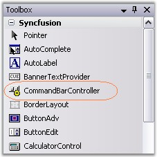
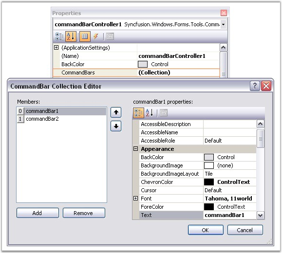
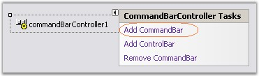

::: {style="DISPLAY: none"}
{#d2h_url_template}{#d2h_package_url style="WIDTH: 0px; DISPLAY: none; HEIGHT: 0px"}
:::

::: {.d2h_secondary_topic style="PADDING-BOTTOM: 10pt; MARGIN: 0pt; PADDING-LEFT: 0pt; PADDING-RIGHT: 0pt; PADDING-TOP: 0pt"}
#### Through Designer {#through-designer style="tab-stops: 0pt"}

 

The CommandBar framework makes it an effortless process to add, remove and design the CommandBars in an application. With the WYSIWYG designer that it provides, all that is involved in setting up the CommandBar layout is to drag and drop the various CommandBars to the target location. The layout state is then serialized by the designer along with the form\'s resources and is used when the form is loaded at run time.

[]{style="COLOR: #15428b"} 

The following steps are involved in creating and setting up a simple CommandBar layout.

[]{style="COLOR: #15428b"} 

1.   Drag the **CommandBarController** component from the toolbox onto the form. The CommandBarController will be created in the components area of the form.

[]{style="COLOR: #15428b"} 

{border="0"}

[]{style="COLOR: #15428b"} 

Figure 5: CommandBarController in Toolbox

[]{style="FONT-SIZE: 8pt"} 

2.   To add a CommandBar using the properties window, follow the procedure given below.

 

3.   In the properties window, select the CommandBars property. The CommandBar Collection Editor will be opened. Click Add, a CommandBar will be added to the form.

[]{style="FONT-FAMILY: 'Verdana','sans-serif'; FONT-SIZE: 8pt"} 

4.   The CommandBars can also be added / removed using the **Add CommandBar** design time verb or smart tag that is found in the property grid.

[]{style="COLOR: #15428b"} 

New CommandBars will be initially docked to the top border of the form. The commandbars can then be dragged, redocked or floated to the desired location.

[]{style="COLOR: #15428b"} 

{border="0"}

[]{style="COLOR: #15428b"} 

Figure 6: CommandBar Collection Editor[]{style="COLOR: #15428b"}

[]{style="COLOR: #15428b"} 

[]{style="COLOR: #15428b"} 

{border="0"}

[]{style="COLOR: #15428b"} 

Figure 7: Adding CommandBar Through Designer Time Verb

[]{style="COLOR: #15428b"} 

{border="0"}

**[]{style="COLOR: #15428b"}** 

Figure 8: CommandBar created Through Designer

[]{style="COLOR: #15428b"} 

See Also

[]{style="COLOR: #4a5c8c"} 

[Through Code]{.UGHyperlink}[, ]{.UGHyperlink}[Through XP Menus Framework]{.UGHyperlink}[]{.UGHyperlink}

[]{#related-topics}
:::
