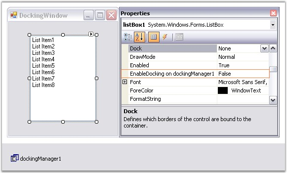
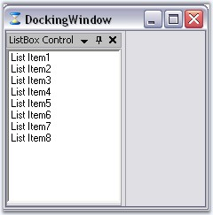
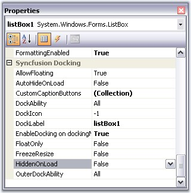
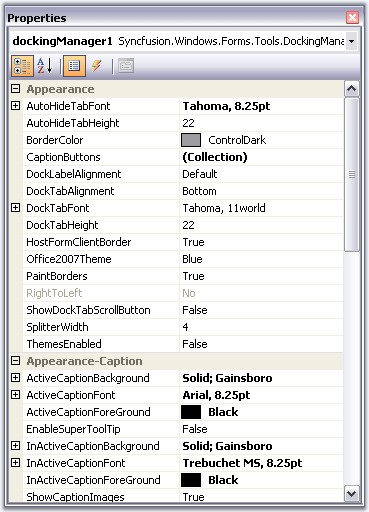
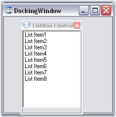
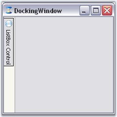

::: {style="DISPLAY: none"}
{#d2h_url_template}{#d2h_package_url style="WIDTH: 0px; DISPLAY: none; HEIGHT: 0px"}
:::

::: {.d2h_secondary_topic style="PADDING-BOTTOM: 10pt; MARGIN: 0pt; PADDING-LEFT: 0pt; PADDING-RIGHT: 0pt; PADDING-TOP: 0pt"}
#### Through Designer {#through-designer style="tab-stops: 0pt"}

[]{#p43}**** 

*** ***The docking window\'s WYSIWYG designer makes the implementation of a docking windows layout a highly intuitive process. Complex layouts can be designed by dragging-and-dropping the docking manager, without having to write a single line of code.

[]{style="COLOR: #15428b"} 

The following steps outline the sequence of steps involved in setting up a simple docking windows (listbox for ex) layout using the designer.

[]{style="COLOR: #15428b"} 

1.   Open the host form within the windows forms designer and add the controls that should be implemented as docking windows.

2.   Drag a DockingManager control from the toolbox onto the form. The docking manager is implemented as an extender provider and will add the **EnableDocking on dockingManager** property to all the child controls that are dropped in the form as shown in the image below.

[]{style="COLOR: #15428b"} 

{border="0"}

***[]{style="COLOR: #15428b"}*** 

Figure 38: EnableDocking on dockingManager property added to the Properties Grid of the ListBox Control

[]{style="COLOR: #15428b"} 

3.   Turn on the **EnableDocking on dockingManager** property for those controls that should be hosted as docking windows. Setting this property will immediately transform the control into a docking window by creating a dockable container and adding the control to it. The control is now a full-featured docking window that is docked to the form\'s left border, by default as in the image displayed below.

[]{style="COLOR: #15428b"} 

{border="0"}

***[]{style="COLOR: #15428b"}*** 

Figure 39: ListBox control transformed into a Docking Window

[]{style="COLOR: #15428b"} 

4.   DockingManager provides docking specific properties to the docked controls, which will be listed under the Syncfusion Docking category of those controls. These properties lets you specify icons for the caption, edit the caption labels, auto hide the controls and so on.

[]{style="COLOR: #15428b"} 

{border="0"}

[]{style="COLOR: #15428b"} 

Figure 40: Properties of Docked Control

[]{style="COLOR: #15428b"} 

5.   DockingManager comes with enormous appearance properties, whose settings will be applied to all the docked controls.

**[]{style="COLOR: #15428b"}** 

{border="0"}

**[]{style="COLOR: #15428b"}** 

Figure 41: Properties of Docked Control

**[]{style="COLOR: #15428b"}** 

6.   The form\'s docking layout can be set up by dragging the dock-enabled controls and redocking or floating them at the desired locations by using **DragProviderStyle** property.

[]{style="COLOR: #15428b"} 

{border="0"}

***[]{style="COLOR: #15428b"}*** 

Figure 42: Floating the ListBox control by using the DragProviderStyle property

[]{style="COLOR: #15428b"} 

7.   Use the AutoHideOnLoad and HiddenOnLoad extended properties for setting the autohidden and hidden dock states for the controls.

[]{style="COLOR: #15428b"} 

{border="0"}

[]{style="COLOR: #15428b"} 

Figure 43: AutoHidden Control

**[]{style="COLOR: #15428b"}** 

See Also

[]{style="COLOR: #15428b"} 

[Through Code]{.UGHyperlink}[, ]{.UGHyperlink}[Concepts and Features]{.UGHyperlink}[]{.UGHyperlink}

[]{#related-topics}
:::
