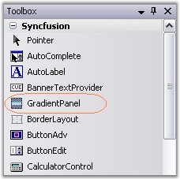
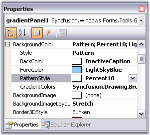
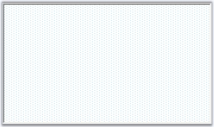
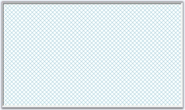

::: {style="DISPLAY: none"}
{#d2h_url_template}{#d2h_package_url style="WIDTH: 0px; DISPLAY: none; HEIGHT: 0px"}
:::

::: {.d2h_secondary_topic style="PADDING-BOTTOM: 10pt; MARGIN: 0pt; PADDING-LEFT: 0pt; PADDING-RIGHT: 0pt; PADDING-TOP: 0pt"}
##### Through Designer {#through-designer style="tab-stops: 0pt"}

 

This section will guide you to create a GradientPanel control.

[]{style="COLOR: #15428b"} 

1.   Create a new Visual C# application or VB.NET application in Visual Studio .NET.

1.   Drag-and-drop a GradientPanel control object from the toolbox onto the form and resize it to the desired dimensions.

[]{style="COLOR: #15428b"} 

{border="0"}

[]{style="COLOR: #15428b"} 

Figure 388: GradientPanel Control in Toolbox

[]{style="COLOR: #15428b"} 

2.   Set background color for GradientPanel through property grid.

[]{style="COLOR: #15428b"} 

{border="0"}

[]{style="COLOR: #15428b"} 

Figure 389: GradientPanel Color Collection Editor

[]{style="COLOR: #15428b"} 

3.   Build and run the application.

[]{style="COLOR: #15428b"} 

{border="0"}

[]{style="COLOR: #15428b"} 

Figure 390: GradientPanel

**[]{style="COLOR: #15428b"}** 

See Also

**[]{style="COLOR: #15428b"}** 

[Through Code]{.UGHyperlink}[, ]{.UGHyperlink}[Concepts and Features]{.UGHyperlink}[]{.UGHyperlink}

###### []{#_Through_Code_3}3.3.6.2.3.1 Through Code {#through-code style="tab-stops: 0pt"}

[]{#p456}[]{style="COLOR: #15428b"} 

The following steps will guide you to create a gradient panel programmatically.

[]{style="COLOR: #15428b"} 

4.   Create a C# or VB.NET application through Visual studio and switch to the code view.

5.   Add the Syncfusion.Shared.Base and Syncfusion.Shared.Windows assembly references.

6.   Declare a gradient panel as below.

[]{style="COLOR: #15428b"} 

+---------------------------------------------------------------------------------------------------------------------------------------------------------------+
| **[\[C#\]]{style="FONT-FAMILY: 'Courier New'; COLOR: black"}**                                                                                                |
|                                                                                                                                                               |
| **[]{style="FONT-FAMILY: 'Courier New'; COLOR: black"}**                                                                                                      |
|                                                                                                                                                               |
| [private]{style="FONT-FAMILY: 'Courier New'; COLOR: blue"}[ Syncfusion.Windows.Forms.Tools.GradientPanel gradientPanel1;]{style="FONT-FAMILY: 'Courier New'"} |
+---------------------------------------------------------------------------------------------------------------------------------------------------------------+

[]{style="COLOR: #15428b"} 

+-------------------------------------------------------------------------------------------------------------------------------------------------------------------------------------------------------------------------+
| **[\[VB.NET\]]{style="FONT-FAMILY: 'Courier New'; COLOR: black"}**                                                                                                                                                      |
|                                                                                                                                                                                                                         |
| **[]{style="FONT-FAMILY: 'Courier New'; COLOR: black"}**                                                                                                                                                                |
|                                                                                                                                                                                                                         |
| [Friend]{style="FONT-FAMILY: 'Courier New'; COLOR: blue"}[ [WithEvents]{style="COLOR: blue"} GradientPanel1 [As]{style="COLOR: blue"} Syncfusion.Windows.Forms.Tools.GradientPanel]{style="FONT-FAMILY: 'Courier New'"} |
+-------------------------------------------------------------------------------------------------------------------------------------------------------------------------------------------------------------------------+

[]{style="COLOR: #15428b"} 

In the Initialize function, include the below code to initialize the gradient panel.

[]{style="COLOR: #15428b"} 

+-------------------------------------------------------------------------------------------------------------------------------------------------------------------------------------------+
| **[\[C#\]]{style="FONT-FAMILY: 'Courier New'; COLOR: black"}**                                                                                                                            |
|                                                                                                                                                                                           |
| **[]{style="FONT-FAMILY: 'Courier New'; COLOR: black"}**                                                                                                                                  |
|                                                                                                                                                                                           |
| [this]{style="FONT-FAMILY: 'Courier New'; COLOR: blue"}[.gradientPanel1 = [new]{style="COLOR: blue"} Syncfusion.Windows.Forms.Tools.GradientPanel();]{style="FONT-FAMILY: 'Courier New'"} |
|                                                                                                                                                                                           |
| [((System.ComponentModel.ISupportInitialize)([this]{style="COLOR: blue"}.gradientPanel1)).BeginInit();]{style="FONT-FAMILY: 'Courier New'"}                                               |
+-------------------------------------------------------------------------------------------------------------------------------------------------------------------------------------------+

[]{style="COLOR: #15428b"} 

+------------------------------------------------------------------------------------------------------------------------------------------------------------------------------------------------+
| **[\[VB.NET\]]{style="FONT-FAMILY: 'Courier New'; COLOR: black"}**                                                                                                                             |
|                                                                                                                                                                                                |
| **[]{style="FONT-FAMILY: 'Courier New'; COLOR: black"}**                                                                                                                                       |
|                                                                                                                                                                                                |
| [Me]{style="FONT-FAMILY: 'Courier New'; COLOR: blue"}[.GradientPanel1 = [New]{style="COLOR: blue"} Syncfusion.Windows.Forms.Tools.GradientPanel ]{style="FONT-FAMILY: 'Courier New'"}          |
|                                                                                                                                                                                                |
| [CType]{style="FONT-FAMILY: 'Courier New'; COLOR: blue"}[([Me]{style="COLOR: blue"}.GradientPanel1, System.ComponentModel.ISupportInitialize).BeginInit()]{style="FONT-FAMILY: 'Courier New'"} |
+------------------------------------------------------------------------------------------------------------------------------------------------------------------------------------------------+

[]{style="COLOR: #15428b"} 

7.   Set the properties as follows for the gradient panel and the form.

[]{style="COLOR: #15428b"} 

+---------------------------------------------------------------------------------------------------------------------------------------------------------------------------------------------------------------------------------------------------------------------------------------------------------------------+
| **[\[C#\]]{style="FONT-FAMILY: 'Courier New'; COLOR: black"}**                                                                                                                                                                                                                                                      |
|                                                                                                                                                                                                                                                                                                                     |
| **[]{style="FONT-FAMILY: 'Courier New'; COLOR: black"}**                                                                                                                                                                                                                                                            |
|                                                                                                                                                                                                                                                                                                                     |
| [// gradientPanel1]{style="FONT-FAMILY: 'Courier New'; COLOR: green"}                                                                                                                                                                                                                                               |
|                                                                                                                                                                                                                                                                                                                     |
| [this]{style="FONT-FAMILY: 'Courier New'; COLOR: blue"}[.gradientPanel1.BackgroundColor = [new]{style="COLOR: blue"} Syncfusion.Drawing.BrushInfo(Syncfusion.Drawing.PatternStyle.DiagonalCross, System.Drawing.Color.LightBlue, System.Drawing.SystemColors.InactiveCaption);]{style="FONT-FAMILY: 'Courier New'"} |
|                                                                                                                                                                                                                                                                                                                     |
| [this]{style="FONT-FAMILY: 'Courier New'; COLOR: blue"}[.gradientPanel1.BorderColor = System.Drawing.Color.White;]{style="FONT-FAMILY: 'Courier New'"}                                                                                                                                                              |
|                                                                                                                                                                                                                                                                                                                     |
| [this]{style="FONT-FAMILY: 'Courier New'; COLOR: blue"}[.gradientPanel1.Location = [new]{style="COLOR: blue"} System.Drawing.Point(37, 32);]{style="FONT-FAMILY: 'Courier New'"}                                                                                                                                    |
|                                                                                                                                                                                                                                                                                                                     |
| [this]{style="FONT-FAMILY: 'Courier New'; COLOR: blue"}[.gradientPanel1.Name = \"gradientPanel1\";]{style="FONT-FAMILY: 'Courier New'"}                                                                                                                                                                             |
|                                                                                                                                                                                                                                                                                                                     |
| [this]{style="FONT-FAMILY: 'Courier New'; COLOR: blue"}[.gradientPanel1.Size = [new]{style="COLOR: blue"} System.Drawing.Size(350, 202);]{style="FONT-FAMILY: 'Courier New'"}                                                                                                                                       |
|                                                                                                                                                                                                                                                                                                                     |
| [this]{style="FONT-FAMILY: 'Courier New'; COLOR: blue"}[.gradientPanel1.TabIndex = 0;]{style="FONT-FAMILY: 'Courier New'"}                                                                                                                                                                                          |
|                                                                                                                                                                                                                                                                                                                     |
| [this]{style="FONT-FAMILY: 'Courier New'; COLOR: blue"}[.Controls.Add([this]{style="COLOR: blue"}.gradientPanel1);]{style="FONT-FAMILY: 'Courier New'"}                                                                                                                                                             |
+---------------------------------------------------------------------------------------------------------------------------------------------------------------------------------------------------------------------------------------------------------------------------------------------------------------------+

[]{style="COLOR: #15428b"} 

+------------------------------------------------------------------------------------------------------------------------------------------------------------------------------------------------------------------------------------------------------------------------------------------------------------+
| **[\[VB.NET\]]{style="FONT-FAMILY: 'Courier New'; COLOR: black"}**                                                                                                                                                                                                                                         |
|                                                                                                                                                                                                                                                                                                            |
| **[]{style="FONT-FAMILY: 'Courier New'; COLOR: black"}**                                                                                                                                                                                                                                                   |
|                                                                                                                                                                                                                                                                                                            |
| [\'GradientPanel1]{style="FONT-FAMILY: 'Courier New'; COLOR: green"}                                                                                                                                                                                                                                       |
|                                                                                                                                                                                                                                                                                                            |
| [Me]{style="FONT-FAMILY: 'Courier New'; COLOR: blue"}[.GradientPanel1.BackgroundColor = [New]{style="COLOR: blue"} Syncfusion.Drawing.BrushInfo(Syncfusion.Drawing.PatternStyle.DiagonalCross, System.Drawing.Color.LightSkyBlue, System.Drawing.SystemColors.Window)]{style="FONT-FAMILY: 'Courier New'"} |
|                                                                                                                                                                                                                                                                                                            |
| [Me]{style="FONT-FAMILY: 'Courier New'; COLOR: blue"}[.GradientPanel1.BorderColor = System.Drawing.Color.Black]{style="FONT-FAMILY: 'Courier New'"}                                                                                                                                                        |
|                                                                                                                                                                                                                                                                                                            |
| [Me]{style="FONT-FAMILY: 'Courier New'; COLOR: blue"}[.GradientPanel1.Location = [New]{style="COLOR: blue"} System.Drawing.Point(64, 48)]{style="FONT-FAMILY: 'Courier New'"}                                                                                                                              |
|                                                                                                                                                                                                                                                                                                            |
| [Me]{style="FONT-FAMILY: 'Courier New'; COLOR: blue"}[.GradientPanel1.Name = \"GradientPanel1\"]{style="FONT-FAMILY: 'Courier New'"}                                                                                                                                                                       |
|                                                                                                                                                                                                                                                                                                            |
| [Me]{style="FONT-FAMILY: 'Courier New'; COLOR: blue"}[.GradientPanel1.Size = [New]{style="COLOR: blue"} System.Drawing.Size(296, 208)]{style="FONT-FAMILY: 'Courier New'"}                                                                                                                                 |
|                                                                                                                                                                                                                                                                                                            |
| [Me]{style="FONT-FAMILY: 'Courier New'; COLOR: blue"}[.GradientPanel1.TabIndex = 0]{style="FONT-FAMILY: 'Courier New'"}                                                                                                                                                                                    |
|                                                                                                                                                                                                                                                                                                            |
| [Me]{style="FONT-FAMILY: 'Courier New'; COLOR: blue"}[.Controls.Add([Me]{style="COLOR: blue"}.GradientPanel1)]{style="FONT-FAMILY: 'Courier New'"}                                                                                                                                                         |
+------------------------------------------------------------------------------------------------------------------------------------------------------------------------------------------------------------------------------------------------------------------------------------------------------------+

[]{style="COLOR: #15428b"} 

8.   Run the application.

[]{style="COLOR: #15428b"} 

{border="0"}

**[]{style="COLOR: #15428b"}** 

Figure 391: PatternStyle Gradient Panel Created Programmatically

**[]{style="COLOR: black; FONT-SIZE: 8pt"}** 

See Also

**[]{style="COLOR: black"}** 

[Concepts and Features]{.UGHyperlink}[]{.UGHyperlink}

[]{#related-topics}
:::
