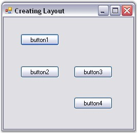
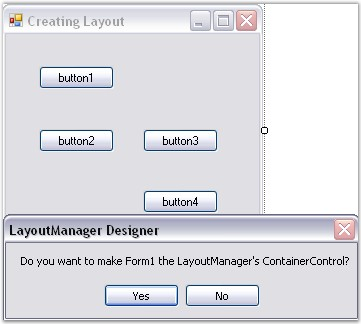
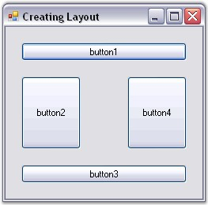

::: {style="DISPLAY: none"}
{#d2h_url_template}{#d2h_package_url style="WIDTH: 0px; DISPLAY: none; HEIGHT: 0px"}
:::

:::: {.d2h_secondary_topic style="PADDING-BOTTOM: 10pt; MARGIN: 0pt; PADDING-LEFT: 0pt; PADDING-RIGHT: 0pt; PADDING-TOP: 0pt"}
#### Through Designer {#through-designer style="tab-stops: 0pt"}

[]{style="COLOR: #15428b"} 

This topic discusses how to create a simple layout for aligning Child controls through designer.

[]{style="COLOR: #15428b"} 

Adding Child Controls

[]{style="COLOR: #15428b"} 

[·      ]{style="FONT-FAMILY: Symbol"}Populate the form with the necessary Child controls (here, we are using Buttons), by dragging and dropping them from the toolbox.

[]{style="COLOR: #15428b"} 

{border="0"}

[]{style="COLOR: #15428b"} 

Figure 650: Child Controls (Buttons) added to the Form

[]{style="COLOR: #15428b"} 

Adding Layout Managers

[]{style="COLOR: #15428b"} 

The Layout Manager can be added before or after adding the Child controls to the Container control.

[]{style="COLOR: #15428b"} 

[·      ]{style="FONT-FAMILY: Symbol"}The Layout Manager can be added to the form by just dragging and dropping the appropriate Layout Manager (for ex: BorderLayout) from the toolbox onto your form, which will be then be automatically added to the component tray.

[]{style="COLOR: #15428b"} 

{border="0"}

Figure 651: Adding Layout Manager

[]{style="COLOR: #4a5c8c; FONT-SIZE: 8pt"} 

Setting Container Control

[]{style="COLOR: #15428b"} 

[·      ]{style="FONT-FAMILY: Symbol"}You can optionally drop the Child controls onto the Container control that you want to layout and the design time will automatically set the **ContainerControl** property in the Layout Manager.

[·      ]{style="FONT-FAMILY: Symbol"}Form, Panel or any control that inherits the Container control can be set as a Container control for the Child controls that are added (here, form is set as the Container control).

 

::: {style="BORDER-BOTTOM: windowtext 1pt solid; BORDER-LEFT: medium none; PADDING-BOTTOM: 1pt; MARGIN-TOP: 9pt; PADDING-LEFT: 0pt; PADDING-RIGHT: 0pt; MARGIN-BOTTOM: 9pt; BORDER-TOP: windowtext 1pt solid; BORDER-RIGHT: medium none; PADDING-TOP: 1pt"}
{border="0"} Note: The FlowLayout, CardLayout and GridLayout controls automatically arrange the Child controls of the Container control in a specific manner. When new controls are added, the Layout Manager will ensure that the old layout is not broken and that the existing controls are not messed up.
:::

[]{style="COLOR: #15428b"} 

Configuring Child Controls

[]{style="COLOR: #15428b"} 

For BorderLayout and GridBagLayout, it is necessary to configure the Child controls by changing their extended properties via the property grid in the designer so that the Child controls can be aligned properly.

[]{style="COLOR: #15428b"} 

{border="0"}

[]{style="COLOR: #15428b"} 

Figure 652: Aligned Child Controls

 

Configuring Layout Manager

 

You can then configure the Layout Manager by changing its properties via the property grid in the designer.

[]{style="COLOR: #15428b"} 

See Also

[]{style="COLOR: #15428b"} 

[Through Code]{.UGHyperlink}[, ]{.UGHyperlink}[Concepts and Features]{.UGHyperlink}[]{.UGHyperlink}

[]{#related-topics}
::::
