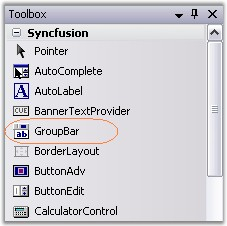
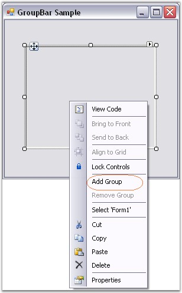
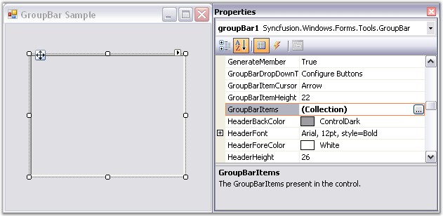
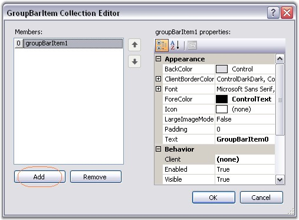
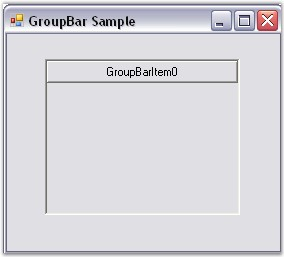

::: {style="DISPLAY: none"}
{#d2h_url_template}{#d2h_package_url style="WIDTH: 0px; DISPLAY: none; HEIGHT: 0px"}
:::

::: {.d2h_secondary_topic style="PADDING-BOTTOM: 10pt; MARGIN: 0pt; PADDING-LEFT: 0pt; PADDING-RIGHT: 0pt; PADDING-TOP: 0pt"}
##### Through Designer {#through-designer style="tab-stops: 0pt"}

[]{style="COLOR: #15428b"} 

The GroupBar\'s designer allows you to add new groups using it\'s design-time verbs or the property browser, while adding a Child control to a group involves merely activating the particular group and dropping the control onto the GroupBar.

 

To create a GroupBar through designer,

[]{style="COLOR: #15428b"} 

[·      ]{style="FONT-FAMILY: Symbol"}Drag-and-drop a GroupBar object from the controls toolbox onto your form.

[]{style="COLOR: #15428b"} 

{border="0"}[]{style="FONT-FAMILY: 'Calibri','sans-serif'; FONT-SIZE: 11pt"}

 

Figure 855: GroupBar in Toolbox

[]{style="COLOR: #15428b"} 

[·      ]{style="FONT-FAMILY: Symbol"}To add a GroupBar Item using design-time verbs, follow the procedure given below.

 

To add a GroupBar Item using the design-time verbs, right-click on the GroupBar and select the Add Group option. This adds a GroupBar Item to the GroupBar control.

[]{style="FONT-SIZE: 8pt"} 

{border="0"}

[]{style="FONT-SIZE: 8pt"} 

Figure 856: \"Add Group\" Option Displayed on Right-Clicking the GroupBar Control

[]{style="COLOR: #15428b"} 

[·      ]{style="FONT-FAMILY: Symbol"}To add a GroupBar Item using the property browser, follow the procedure given below.

 

In the Properties window, select the **GroupBarItems** property. The **GroupBarItem Collection Editor** will be opened. Click Add, a GroupBar Item will be added to the GroupBar control.

                               

{border="0"}

 

Figure 857: \"GroupBarItems\" Property Displayed in the Properties Window

[]{style="COLOR: #15428b"} 

{border="0"}

 

Figure 858: GroupBarItem Collection Editor

[]{style="COLOR: #15428b"} 

{border="0"}

 

Figure 859: GroupBar with a GroupBar Item

[]{style="COLOR: #15428b"} 

You can also add child controls to the GroupBar. Refer Integrating Child Controls to the GroupBarItem topic, for information on this topic.

[]{style="COLOR: #15428b"} 

See also

[]{style="COLOR: #15428b"} 

[[Concepts and Features]{.UGHyperlink}](../../../../../../../../Documents%20and%20Settings/sylviap/Desktop/Tools%20-%20Part%202.docx#_Concepts_and_Features_1)[]{.UGHyperlink}

 

 

[]{#p593} 

 

[]{#related-topics}
:::
