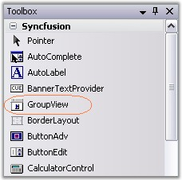
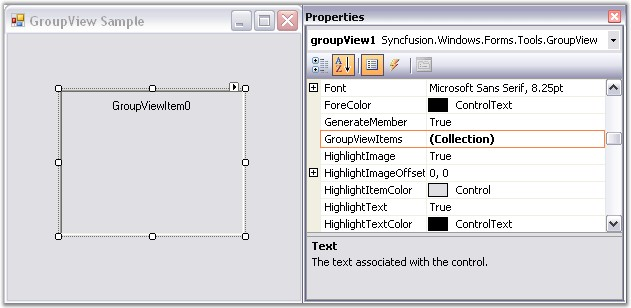
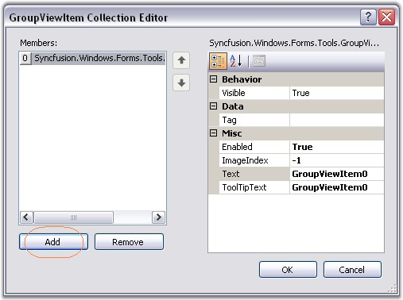
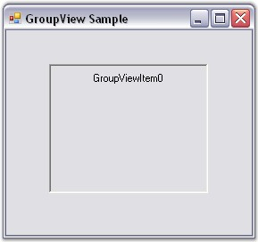

::: {style="DISPLAY: none"}
{#d2h_url_template}{#d2h_package_url style="WIDTH: 0px; DISPLAY: none; HEIGHT: 0px"}
:::

::: {.d2h_secondary_topic style="PADDING-BOTTOM: 10pt; MARGIN: 0pt; PADDING-LEFT: 0pt; PADDING-RIGHT: 0pt; PADDING-TOP: 0pt"}
##### Through Designer {#through-designer style="MARGIN-LEFT: 18pt; tab-stops: 18.0pt"}

[]{style="COLOR: #15428b"} 

To create a GroupView control and add GroupView Items to it,

[]{style="COLOR: #15428b"} 

1.   Drag-and-drop a **GroupView** control from the VS.NET toolbox onto the form. This will create an instance of the GroupView control on the form.

[]{style="COLOR: #15428b"} 

{border="0"}

[]{style="COLOR: #15428b"} 

Figure 893: GroupView in Toolbox

[]{style="COLOR: #15428b"} 

2.   In the Properties window, select the **GroupViewItems** property. The **GroupViewItem** **Collection** **Editor** will be opened. Click Add, a GroupView Item will be added to the GroupView control.

[]{style="COLOR: #15428b"} 

The text of the GroupView Items is also set using the Collection Editor.

[]{style="COLOR: #15428b"} 

{border="0"}

[]{style="COLOR: #15428b"} 

Figure 894: \"GroupViewItems\" Property Displayed in the Properties Window

[]{style="COLOR: #15428b"} 

{border="0"}

[]{style="COLOR: #15428b"} 

Figure 895: GroupViewItem Collection Editor

[]{style="COLOR: #15428b"} 

{border="0"}

[]{style="COLOR: #15428b"} 

Figure 896: GroupView Item added to the GroupView Control

[]{style="COLOR: #15428b"} 

See Also

[]{style="COLOR: #4a5c8c"} 

[[Concepts and Features]{.UGHyperlink}](../../../../../../../../Documents%20and%20Settings/sylviap/Desktop/Tools%20-%20Part%202.docx#_Concepts_and_Features_2)[]{.UGHyperlink}

 

 

[]{#p637} 

 

[]{#related-topics}
:::
