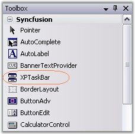
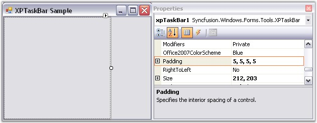
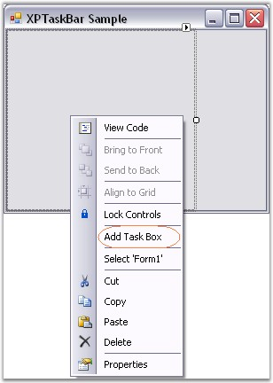
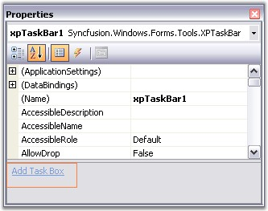
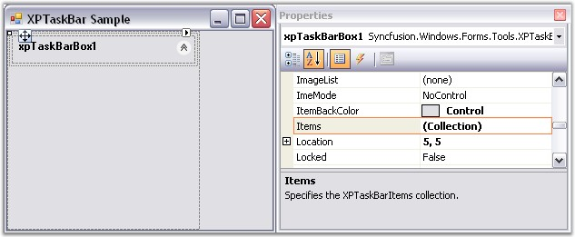
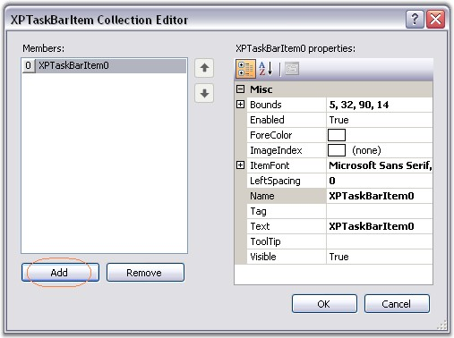
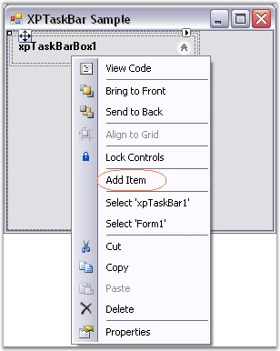
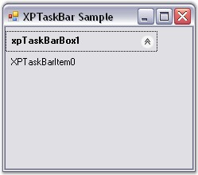

::: {style="DISPLAY: none"}
{#d2h_url_template}{#d2h_package_url style="WIDTH: 0px; DISPLAY: none; HEIGHT: 0px"}
:::

:::: {.d2h_secondary_topic style="PADDING-BOTTOM: 10pt; MARGIN: 0pt; PADDING-LEFT: 0pt; PADDING-RIGHT: 0pt; PADDING-TOP: 0pt"}
##### Through Designer {#through-designer style="MARGIN-LEFT: 18pt; tab-stops: 18.0pt"}

[]{style="COLOR: #15428b"} 

In this tutorial, we will create a simple XPTaskBar.

[]{style="COLOR: red; FONT-SIZE: 8pt"} 

1.   Add an**[ ]{style="COLOR: black"}XPTaskBar control** from the toolbox onto your form and a new instance will be placed on your form. Dock the control to the left of the form. Set the **DockPadding.All** property to \'5\' on the XPTaskBar so that there will be some space between the XPTaskBar Box children and the XPTaskBar.

[]{style="COLOR: #15428b"} 

{border="0"}

[]{style="COLOR: #15428b"} 

Figure 929: XPTaskBar in Toolbox

[]{style="COLOR: #15428b"} 

{border="0"}

[]{style="COLOR: #15428b"} 

Figure 930: DockPadding property set to \"5\"

[]{style="COLOR: #15428b"} 

2.   To add an XPTaskBar Box, right click on the XPTaskBar control and select the **Add Task Box** verb. This will add an empty XPTaskBar Box instance. You can change it\'s **Header Text** property to change the text of the header.

[]{style="COLOR: #15428b"} 

3.   You can also add an XPTaskBar Box using the Add Task Box command in the Property Grid.

[]{style="COLOR: #15428b"} 

{border="0"}

**[]{style="COLOR: #15428b"}** 

Figure 931: Adding XPTaskBar Box through Verbs

**[]{style="COLOR: #15428b"}** 

{border="0"}

[]{style="COLOR: #15428b"} 

Figure 932: Adding XPTaskBar Box through Property Grid

[]{style="COLOR: #15428b"} 

4.   Select the newly added XPTaskBar Box and open it\'s **XPTaskBarItem Collection Editor**. There you can add one or more XPTaskBar Items specifying the text, image (using the **ImageIndex** property), etc. for each item. To distinguish one item from the other, you can specify a unique **Tag** property for each item.

[]{style="COLOR: #15428b"} 

{border="0"}

[]{style="COLOR: #15428b"} 

Figure 933: \"XPTaskBarBox Items\" Property Displayed in the Properties Window

[]{style="COLOR: #15428b"} 

{border="0"}

[]{style="COLOR: #15428b"} 

Figure 934: XPTaskBarItem Collection Editor

[]{style="COLOR: #15428b"} 

{border="0"}

[]{style="COLOR: #15428b"} 

Figure 935: Adding XPTaskBar Items using Verbs

[]{style="COLOR: #15428b"} 

{border="0"}

[]{style="COLOR: #15428b"} 

Figure 936: XPTaskBar with a single TaskBar Box and TaskBar Item

[]{style="COLOR: #15428b"} 

::: {style="BORDER-BOTTOM: windowtext 1pt solid; BORDER-LEFT: medium none; PADDING-BOTTOM: 1pt; MARGIN: 9pt 0pt 9pt 18pt; PADDING-LEFT: 0pt; PADDING-RIGHT: 0pt; BORDER-TOP: windowtext 1pt solid; BORDER-RIGHT: medium none; PADDING-TOP: 1pt"}
{border="0"} Note: The XPTaskBar Boxes can also host a Panel control within it. During design time, users can simply drag and drop the panel on the box. In code, users can do this  by adding the panel to the Controls collection of XPTaskBarBox. The panel\'s width will be resized to fit, whereas it\'s height will be based on the PreferredChildPanelHeight property setting.
:::

[]{style="COLOR: #4a5c8c; FONT-SIZE: 8pt"} 

See Also

[]{style="COLOR: #4a5c8c"} 

[[Concepts and Features]{.UGHyperlink}](../../../../../../../../Documents%20and%20Settings/sylviap/Desktop/Tools%20-%20Part%202.docx#_Concepts_and_Features_3)[]{.UGHyperlink}

 

 

[]{#p668} 

 

[]{#related-topics}
::::
