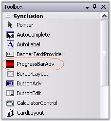
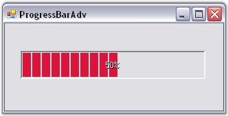

::: {style="DISPLAY: none"}
{#d2h_url_template}{#d2h_package_url style="WIDTH: 0px; DISPLAY: none; HEIGHT: 0px"}
:::

::: {.d2h_secondary_topic style="PADDING-BOTTOM: 10pt; MARGIN: 0pt; PADDING-LEFT: 0pt; PADDING-RIGHT: 0pt; PADDING-TOP: 0pt"}
##### Through Designer {#through-designer style="MARGIN-LEFT: 18pt; tab-stops: 18.0pt"}

[]{style="COLOR: black; FONT-SIZE: 8pt"} 

We can create a ProgressBarAdv through designer using the steps given below.

[]{style="COLOR: #15428b"} 

[·      ]{style="FONT-FAMILY: Symbol"}The ProgressBarAdv control provides full support for the Windows Forms designer. Drag and drop the ProgressBarAdv control from the toolbox onto your form.

[]{style="COLOR: #15428b"} 

{border="0"}

[]{style="COLOR: #15428b"} 

Figure 954: ProgressBarAdv in Toolbox

[]{style="COLOR: #15428b"} 

[·      ]{style="FONT-FAMILY: Symbol"}Set the desired properties for the control through the Property grid.

[]{style="COLOR: black; FONT-SIZE: 8pt"} 

{border="0"}

[]{style="COLOR: black; FONT-SIZE: 8pt"} 

Figure 955: ProgressBarAdv created Through Designer

[]{style="COLOR: #15428b"} 

[·      ]{style="FONT-FAMILY: Symbol"}Activate the ProgressBarAdv in the desired place.

[]{style="COLOR: black; FONT-SIZE: 8pt"} 

See Also

[]{style="COLOR: #15428b"} 

[[Through Code]{.UGHyperlink}](../../../../../../../../Documents%20and%20Settings/sylviap/Desktop/Tools%20-%20Part%202.docx#_Through_Code)[,]{style="COLOR: #15428b"}[ ]{style="COLOR: black"}[[Frequently Asked Questions]{.UGHyperlink}](../../../../../../../../Documents%20and%20Settings/sylviap/Desktop/Tools%20-%20Part%202.docx#_Frequently_Asked_Questions)[]{style="COLOR: black"}

 

 

 

[]{#p705} 

[]{#related-topics}
:::
