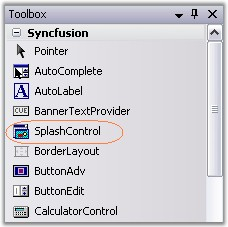
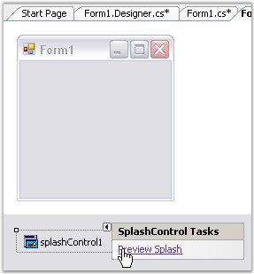
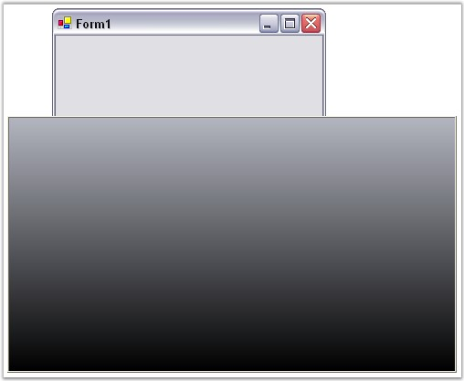

::: {style="DISPLAY: none"}
{#d2h_url_template}{#d2h_package_url style="WIDTH: 0px; DISPLAY: none; HEIGHT: 0px"}
:::

::: {.d2h_secondary_topic style="PADDING-BOTTOM: 10pt; MARGIN: 0pt; PADDING-LEFT: 0pt; PADDING-RIGHT: 0pt; PADDING-TOP: 0pt"}
##### Through Designer {#through-designer style="MARGIN-LEFT: 18pt; tab-stops: 18.0pt"}

[]{style="COLOR: #15428b"} 

The SplashControl provides full support for the Windows Forms designer.

[]{style="COLOR: #15428b"} 

1.   Drag and drop the **SplashControl** from the toolbox onto the form. The SplashControl will be created in the components area of the form.

[]{style="COLOR: #15428b"} 

{border="0"}

[]{style="COLOR: #15428b"} 

Figure 980: SplashControl in Toolbox

[]{style="COLOR: #15428b"} 

2.   Set the**[ ]{style="COLOR: black; FONT-SIZE: 8pt"}SplashImage** and the **TimerInterval** properties through the property grid.

[]{style="COLOR: #15428b"} 

3.   Set the**[ ]{style="COLOR: black; FONT-SIZE: 8pt"}AutoMode** property. This property controls how the SplashControl will be invoked. If the AutoMode property is set to \'True\', the SplashControl will automatically launch itself during the parent form\'s **load** event.

[]{style="COLOR: #15428b"} 

4.   The SplashPanel can also be viewed at design time using the **Preview Splash** option by clicking the smart tag as shown below.

[]{style="COLOR: #15428b"} 

{border="0"}

***[]{style="COLOR: #15428b"}*** 

Figure 981: \"Preview Splash\" option displayed in the Smart Tag

[]{style="COLOR: #15428b"} 

5.   Now run the application.

[]{style="COLOR: #15428b"} 

6.   If the AutoMode property is set to \'False\', the splash screen will have to be invoked explicitly by calling the**[ ]{style="COLOR: black; FONT-SIZE: 8pt"}ShowSplash()** method.

[]{style="COLOR: #15428b"} 

7.   Handle the **SplashClosed** event to do your processing after the splash screen is closed.

[]{style="COLOR: #15428b"} 

{border="0"}

[]{style="COLOR: #15428b"} 

Figure 982: SplashControl created Through Designer

[]{style="COLOR: #15428b"} 

8.   You can cancel the SplashControl while it is displaying the splash screen by calling the **HideSplash()** method.

[]{style="COLOR: #15428b"} 

See Also

[]{style="COLOR: #15428b"} 

[[Through Code]{.UGHyperlink}](../../../../../../../../Documents%20and%20Settings/sylviap/Desktop/Tools%20-%20Part%202.docx#_Through_Code_1)[, ]{style="COLOR: #15428b"}[[SplashScreen Settings]{.UGHyperlink}](../../../../../../../../Documents%20and%20Settings/sylviap/Desktop/Tools%20-%20Part%202.docx#_SplashScreen_Settings)[]{style="COLOR: black"}

 

 

 

 

[]{#related-topics}
:::
