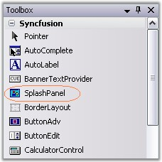
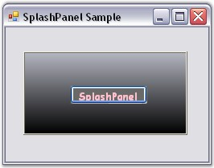

::: {style="DISPLAY: none"}
{#d2h_url_template}{#d2h_package_url style="WIDTH: 0px; DISPLAY: none; HEIGHT: 0px"}
:::

::: {.d2h_secondary_topic style="PADDING-BOTTOM: 10pt; MARGIN: 0pt; PADDING-LEFT: 0pt; PADDING-RIGHT: 0pt; PADDING-TOP: 0pt"}
##### Through Designer {#through-designer style="MARGIN-LEFT: 18pt; tab-stops: 18.0pt"}

[]{style="COLOR: #15428b"} 

The SplashPanel control provides full support for the Windows Forms designer.

[]{style="COLOR: #15428b"} 

1.   Drag-and-drop the SplashPanel control from the toolbox onto the form.

[]{style="COLOR: #15428b"} 

{border="0"}

[]{style="COLOR: #15428b"} 

Figure 995: SplashPanel in Toolbox

*[]{style="COLOR: #15428b"}* 

2.   Set the properties for the SplashPanel control and also drag and drop any child controls you want to add to the panel. Set the**[ ]{style="COLOR: black; FONT-SIZE: 8pt"}TimerInterval** property to specify the period of time, the SplashPanel needs to be visible.

[]{style="COLOR: #15428b"} 

3.   Specify the startup location of the SplashPanel using the **DesktopAlignment** property.

[]{style="COLOR: #15428b"} 

4.   Launch the SplashPanel control by calling the **ShowSplash()** method.

[]{style="COLOR: #15428b"} 

5.   You can cancel the SplashPanel by calling the **HideSplash()** method.

[]{style="COLOR: #15428b"} 

{border="0"}

[]{style="COLOR: #15428b"} 

Figure 996: SplashPanel Control created Through Designer

[]{style="COLOR: #15428b"} 

See Also

[]{style="COLOR: black"} 

[[Through Code]{.UGHyperlink}](../../../../../../../../Documents%20and%20Settings/sylviap/Desktop/Tools%20-%20Part%202.docx#_Through_Code_2)[]{.UGHyperlink}

 

 

 

 

[]{#related-topics}
:::
