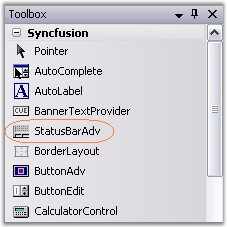
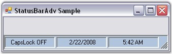

::: {style="DISPLAY: none"}
{#d2h_url_template}{#d2h_package_url style="WIDTH: 0px; DISPLAY: none; HEIGHT: 0px"}
:::

::: {.d2h_secondary_topic style="PADDING-BOTTOM: 10pt; MARGIN: 0pt; PADDING-LEFT: 0pt; PADDING-RIGHT: 0pt; PADDING-TOP: 0pt"}
##### Through Designer {#through-designer style="MARGIN-LEFT: 18pt; tab-stops: 18.0pt"}

[]{style="COLOR: #15428b"} 

To create a StatusBarAdv control through designer,

[]{style="COLOR: #15428b"} 

1.  Drag and drop a **StatusBarAdv** control from the toolbox onto the form.

[]{style="COLOR: #15428b"} 

{border="0"}

**[]{style="COLOR: #15428b"}** 

Figure 1005: StatusBarAdv in Toolbox

[]{style="COLOR: #15428b"} 

2.   Set the desired background for the StatusBarAdv control by setting the desired values for properties that control the background in the properties window.

[]{style="COLOR: #15428b"} 

3.   Drag and drop controls onto the StatusBarAdv control. Add the StatusBarAdvPanel control to it. Set the **PanelType** property to the desired value, for all the StatusBarAdvPanel controls.

[]{style="COLOR: #15428b"} 

4.   Build and run the application.

[]{style="COLOR: #15428b"} 

{border="0"}

[]{style="COLOR: #15428b"} 

Figure 1006: StatusBarAdv Control with StatusBarAdvPanel Controls

[]{style="COLOR: #15428b"} 

See Also

[]{style="COLOR: #15428b"} 

[[Through Code]{.UGHyperlink}](../../../../../../../../Documents%20and%20Settings/sylviap/Desktop/Tools%20-%20Part%202.docx#_Through_Code_3)[]{.UGHyperlink}

 

 

 

 

[]{#related-topics}
:::
