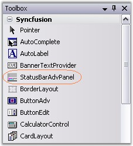
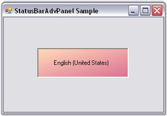

::: {style="DISPLAY: none"}
{#d2h_url_template}{#d2h_package_url style="WIDTH: 0px; DISPLAY: none; HEIGHT: 0px"}
:::

::: {.d2h_secondary_topic style="PADDING-BOTTOM: 10pt; MARGIN: 0pt; PADDING-LEFT: 0pt; PADDING-RIGHT: 0pt; PADDING-TOP: 0pt"}
##### Through Designer {#through-designer style="MARGIN-LEFT: 18pt; tab-stops: 18.0pt"}

 

To create a StatusBarAdvPanel control through designer,

[]{style="COLOR: #15428b"} 

[·      ]{style="FONT-FAMILY: Symbol"}Drag-and-drop a **StatusBarAdvPanel** control from the toolbox onto the form.

[]{style="COLOR: #15428b"} 

{border="0"}

[]{style="COLOR: #15428b"} 

Figure 1019: StatusBarAdvPanel in Toolbox

[]{style="COLOR: #15428b"} 

[·      ]{style="FONT-FAMILY: Symbol"}Set the desired background in the properties window.

[·      ]{style="FONT-FAMILY: Symbol"}Set the **PanelType** property for the control.

[·      ]{style="FONT-FAMILY: Symbol"}You can set the StatusBarAdvPanel to have a custom border color by setting the value of the **BorderColor** property.

[·      ]{style="FONT-FAMILY: Symbol"}Build and run the application.

[]{style="COLOR: #15428b"} 

{border="0"}

[]{style="COLOR: #15428b"} 

Figure 1020: StatusBarAdvPanel with PanelType set to \"CurrentCulture\"

[]{style="COLOR: #15428b"} 

See Also

[]{style="COLOR: #15428b"} 

[[Through Code]{.UGHyperlink}](../../../../../../../../Documents%20and%20Settings/sylviap/Desktop/Tools%20-%20Part%202.docx#_Through_Code_4)[]{.UGHyperlink}

 

 

 

 

[]{#related-topics}
:::
