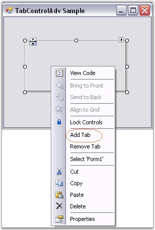
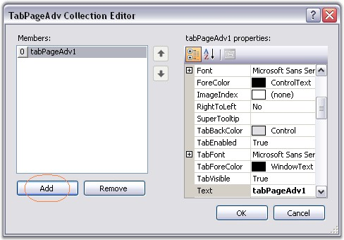
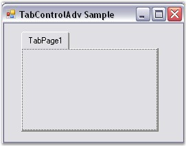

::: {style="DISPLAY: none"}
{#d2h_url_template}{#d2h_package_url style="WIDTH: 0px; DISPLAY: none; HEIGHT: 0px"}
:::

::: {.d2h_secondary_topic style="PADDING-BOTTOM: 10pt; MARGIN: 0pt; PADDING-LEFT: 0pt; PADDING-RIGHT: 0pt; PADDING-TOP: 0pt"}
#### Through Designer {#through-designer style="MARGIN-LEFT: 18pt; tab-stops: 18.0pt"}

[]{style="FONT-SIZE: 8pt"} 

To create a TabControlAdv through designer,

[]{style="COLOR: #15428b"} 

[·      ]{style="FONT-FAMILY: Symbol"}Drag and drop a TabControlAdv object from the controls toolbox onto your form.

[·      ]{style="FONT-FAMILY: Symbol"}Add TabPages to the control in the designer in the following ways.

[]{style="COLOR: #15428b"} 

1.   Right click on the TabControlAdv and select the Add Tab option. This adds a tabpage to the TabControlAdv.

[]{style="COLOR: #15428b"} 

{border="0"}

***[]{style="COLOR: #15428b"}*** 

Figure 1034: Add Tab Design-Time Verb

[]{style="COLOR: #15428b"} 

2.   In the Properties window, select the TabPages property. The TabPageAdv Collection Editor will be opened. Click Add, a tabpage will be added to the TabControlAdv.

[]{style="COLOR: #15428b"} 

{border="0"}

***[]{style="COLOR: #15428b"}*** 

Figure 1035: TabPages property in the Properties Grid

[]{style="COLOR: #15428b"} 

{border="0"}

***[]{style="COLOR: #15428b"}*** 

Figure 1036: TabPageAdv Collection Editor

[]{style="FONT-SIZE: 8pt"} 

{border="0"}

**[]{style="COLOR: #15428b"}** 

Figure 1037: TabControlAdv with a TabPage

[]{style="COLOR: #15428b"} 

See Also

[]{style="COLOR: #15428b"} 

[[Through Code]{.UGHyperlink}](../../../../../../../../Documents%20and%20Settings/sylviap/Desktop/Tools%20-%20Part%202.docx#_Through_Code_5)[]{.UGHyperlink}

 

 

 

 

[]{#related-topics}
:::
