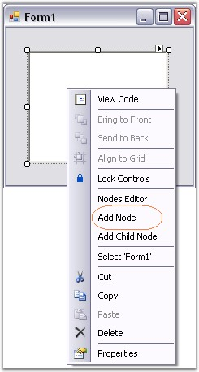
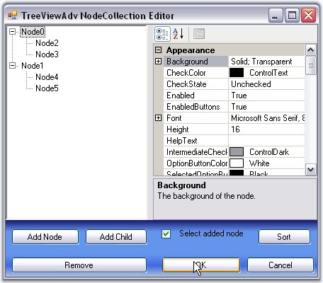

::: {style="DISPLAY: none"}
{#d2h_url_template}{#d2h_package_url style="WIDTH: 0px; DISPLAY: none; HEIGHT: 0px"}
:::

::: {.d2h_secondary_topic style="PADDING-BOTTOM: 10pt; MARGIN: 0pt; PADDING-LEFT: 0pt; PADDING-RIGHT: 0pt; PADDING-TOP: 0pt"}
#### Through Designer {#through-designer style="MARGIN-LEFT: 18pt; tab-stops: 18.0pt"}

[]{style="COLOR: #15428b"} 

Tree nodes can be added to the control at design time as follows.

[]{style="COLOR: #15428b"} 

1.    Create an application in Visual Studio .NET.

[]{style="COLOR: #15428b"} 

2.   In the designer, drag and drop a TreeViewAdv control to your form, from the toolbox.

[]{style="COLOR: #15428b"} 

3.   Select the TreeViewAdv control in the form. In the**[ ]{style="COLOR: black"}**properties, click the ellipsis button of the **Nodes** property to open the NodeCollection Editor. You can also open this editor using task window or by right clicking the control and selecting Node Editor.

[]{style="COLOR: #15428b"} 

4.   This TreeViewAdv NodeCollection Editor can also be invoked by clicking the Node Editor option, which appears when the TreeViewAdv control is right clicked at the design time. User can also add top level nodes by clicking the Add Node option. The below image illustrates the same. The nodes added can be customized using the NodeCollection Editor.

[]{style="COLOR: #15428b"} 

{border="0"}

[]{style="COLOR: #15428b"} 

Figure 1117: \"Add Node\" Design-Time Verb

[]{style="COLOR: #15428b"} 

5.   Click \"Add Node\". This will add a new top-level node.

[]{style="COLOR: #15428b"} 

6.   The node\'s properties will be displayed in the property grid to the right. Specify a custom label for the node by changing its **text** property as shown in the below image.

[]{style="COLOR: #15428b"} 

{border="0"}

[]{style="COLOR: #15428b"} 

Figure 1118: Collection Editor Property Grid

[]{style="COLOR: #15428b"} 

7.   Click \"Add Node\" to add another sibling to the selected node.

[]{style="COLOR: #15428b"} 

8.   Click \"Add Child\" to add a child node to the selected node.

[]{style="COLOR: #15428b"} 

9.   Repeat steps 5 and 6 as required in the application.

[]{style="COLOR: #15428b"} 

10.  Click \"Remove\" to delete a selected node.

[]{style="COLOR: #15428b"} 

11.  To move a node to a different parent, just drag-and-drop that node over the parent or besides the desired sibling.

[]{style="COLOR: #15428b"} 

12.  Click \"OK\" to save changes.

 

 

 

 

[]{#related-topics}
:::
