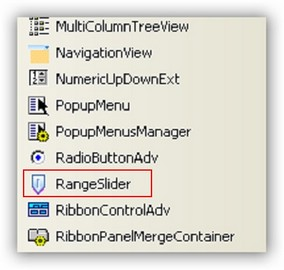
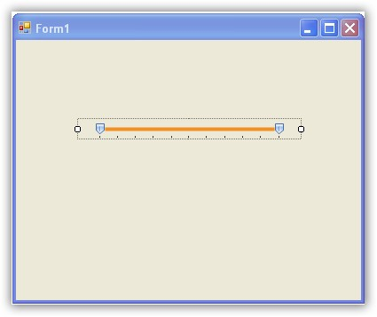

::: {style="DISPLAY: none"}
{#d2h_url_template}{#d2h_package_url style="WIDTH: 0px; DISPLAY: none; HEIGHT: 0px"}
:::

::: {.d2h_secondary_topic style="PADDING-BOTTOM: 10pt; MARGIN: 0pt; PADDING-LEFT: 0pt; PADDING-RIGHT: 0pt; PADDING-TOP: 0pt"}
##### Through Designer {#through-designer style="MARGIN-LEFT: 18pt; tab-stops: 18.0pt"}

[]{style="COLOR: #15428b"} 

The following steps illustrate the creation of RangeSlider.

[]{style="COLOR: #15428b"} 

1.   Select RangeSlider from the toolbox.

[]{style="COLOR: #15428b"} 

{border="0"}

***[]{style="COLOR: #15428b"}*** 

Figure 1267: Toolbox

***[]{style="COLOR: #15428b"}*** 

2.   Drag the RangeSlider from the toolbox to the form.

[]{style="COLOR: #15428b"} 

{border="0"}

***[]{style="COLOR: #15428b"}*** 

***[]{style="COLOR: #15428b"}*** 

Figure 1268: RangeSlider

***[]{style="COLOR: #15428b"}*** 

The RangeSlider is created.

 

 

[]{#related-topics}
:::
