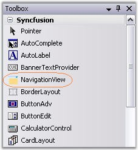
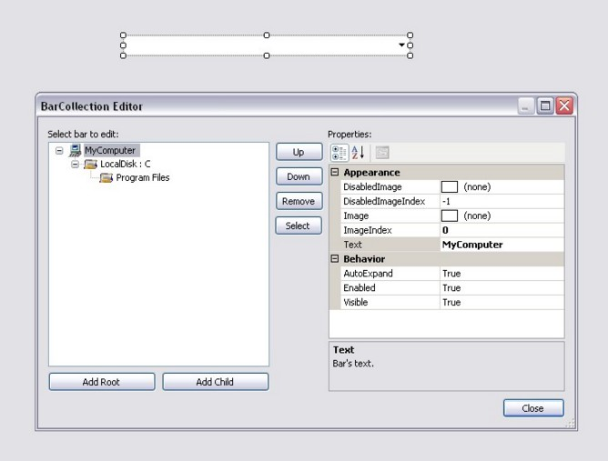

::: {style="DISPLAY: none"}
{#d2h_url_template}{#d2h_package_url style="WIDTH: 0px; DISPLAY: none; HEIGHT: 0px"}
:::

::: {.d2h_secondary_topic style="PADDING-BOTTOM: 10pt; MARGIN: 0pt; PADDING-LEFT: 0pt; PADDING-RIGHT: 0pt; PADDING-TOP: 0pt"}
#### Through Designer {#through-designer style="MARGIN-LEFT: 18pt; tab-stops: 18.0pt"}

[]{style="COLOR: #15428b"} 

To create a NavigationView control, follow the steps given below.

[]{style="COLOR: #15428b"} 

1.              Drag the NavigationView control from the controls toolbox onto your form.

[]{style="COLOR: #15428b"} 

{border="0"}

[]{style="COLOR: #15428b"} 

Figure 1475: NavigationView in Toolbox

[]{style="COLOR: #15428b"} 

2.   Add Parent Bars and Child Bars to the NavigationView control using the **BarCollection Editor**.

[]{style="COLOR: #15428b"} 

{border="0"}

[]{style="COLOR: #15428b"} 

***[]{style="COLOR: #15428b"}*** 

Figure 1476: NavigationView BarCollection Editor

 

[]{#related-topics}
:::
