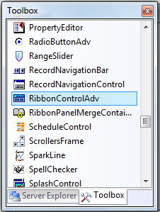
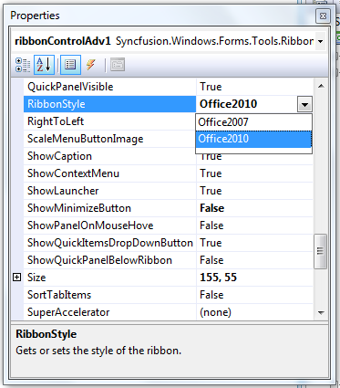
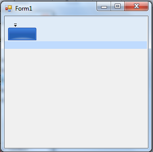
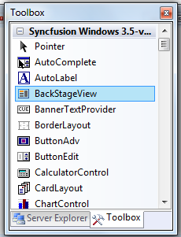
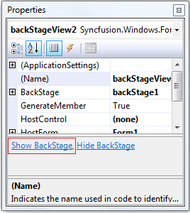
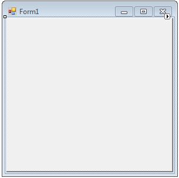
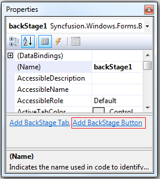
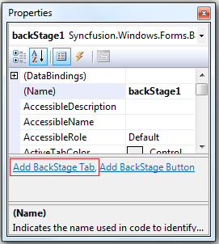
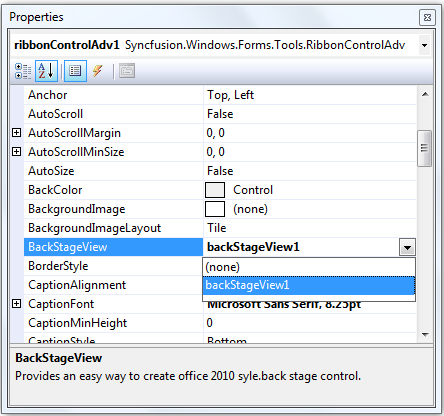
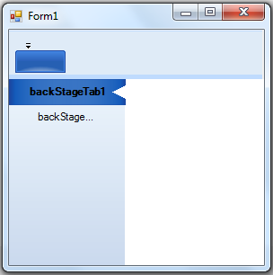

::: {style="DISPLAY: none"}
{#d2h_url_template}{#d2h_package_url style="WIDTH: 0px; DISPLAY: none; HEIGHT: 0px"}
:::

::: {.d2h_secondary_topic style="PADDING-BOTTOM: 10pt; MARGIN: 0pt; PADDING-LEFT: 0pt; PADDING-RIGHT: 0pt; PADDING-TOP: 0pt"}
##### Through Designer {#through-designer style="tab-stops: 0pt"}

 

Apply Theme for Ribbon

The following are steps to apply Office 2010 style for the Ribbon:

 

1.   Create a Windows Form application in Visual Studio.

2.   Drag and drop the **RibbonControlAdv** from the **Toolbox**.

 

{border="0"}

Figure 1459: Toolbox

 

3.   In the Property grid, set RibbonStyle to Office2010.

{border="0"}

Figure 1460: RibbonStyle in Property Grid

 

4.   Office 2010 Ribbon will be applied for Ribbon.

 

 {border="0"}

Figure 1461: Ribbon with Office 2010 Styles

 

Creating BackStageView

The following are steps to create a BackStageView:

 

1)  Drag and drop the **BackStageView** from the **Toolbox**.

{border="0"}

Figure 1462: Toolbox

 

2)  In the **Property grid**, click the **ShowBackstage**.

{border="0"}

Figure 1463: ShowBackStage in Property Grid

 

3)  Empty **BackStage** will be displayed.

{border="0"}

Figure 1464: Empty BackStage

 

4)  To add a **BackStageButton**, click the **Add BackStage Button**.

 

{border="0"}

Figure 1465: Add BackStage Button in Property Grig

 

5)  To add **BackStageTab**, click the **Add BackStage Tab**.

{border="0"}

Figure 1466: Add BackStage Tab in Property Grid

 

6)  Set **BackStageView** to **RibbonControlAdv**.

{border="0"}

Figure 7: Add BackStageView to RibbonControlAdv

 

7)  Back Stage will be created with a BackStage Button and a BackStage Tab

{border="0"}

Figure 1467: BackStage with a BackStage Button and BackStage Tab

 

 

 

 

[]{#related-topics}
:::
