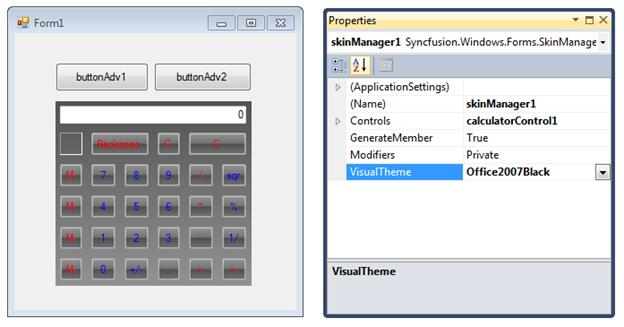
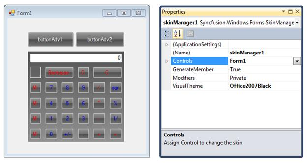

::: {style="DISPLAY: none"}
{#d2h_url_template}{#d2h_package_url style="WIDTH: 0px; DISPLAY: none; HEIGHT: 0px"}
:::

::: {.d2h_secondary_topic style="PADDING-BOTTOM: 10pt; MARGIN: 0pt; PADDING-LEFT: 0pt; PADDING-RIGHT: 0pt; PADDING-TOP: 0pt"}
#### Through Designer {#through-designer style="TEXT-ALIGN: justify; tab-stops: 0pt"}

The following are the steps to apply the required skin to the form through designer:

 

1.   Open the **Properties** Window.

2.   In the **Controls** field assign the root control for which you want to apply the theme.

 

{border="0"}

Figure 1494: Calculator control is set as parent control.

 

{border="0"}

Figure 1495: Form1 is set as parent control.

 

3.  

 

 

[]{#related-topics}
:::
