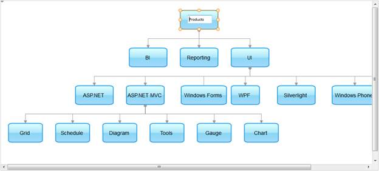

::: {style="DISPLAY: none"}
{#d2h_url_template}{#d2h_package_url style="WIDTH: 0px; DISPLAY: none; HEIGHT: 0px"}
:::

:::: {.d2h_secondary_topic style="PADDING-BOTTOM: 10pt; MARGIN: 0pt; PADDING-LEFT: 0pt; PADDING-RIGHT: 0pt; PADDING-TOP: 0pt"}
#### Through Diagram Builder {#through-diagram-builder style="tab-stops: 0pt"}

1.  [Create a model in the application (Refer to [[Getting Started \> Examining the MVC Project \> Adding a Model to the Application]{style="COLOR: blue"}]{.underline}).]{style="FONT-FAMILY: 'Arial','sans-serif'"}

2.  [In the **controller**, pass the data to the **view** page.]{style="FONT-FAMILY: 'Arial','sans-serif'"}

::: {align="center"}
+----------------------------------------------------------------------------------------------------------------------------------------+
| **[Controller]{style="FONT-FAMILY: 'Courier New'"}[]{style="FONT-FAMILY: 'Courier New'"}**                                             |
|                                                                                                                                        |
| []{style="FONT-FAMILY: Consolas; COLOR: #2b91af; FONT-SIZE: 9.5pt"}                                                                    |
|                                                                                                                                        |
| [        [Northwind]{style="COLOR: #2b91af"} context = [null]{style="COLOR: blue"};]{style="FONT-FAMILY: Consolas; FONT-SIZE: 9.5pt"}  |
|                                                                                                                                        |
| [        [public]{style="COLOR: blue"} [ActionResult]{style="COLOR: #2b91af"} CRUD()]{style="FONT-FAMILY: Consolas; FONT-SIZE: 9.5pt"} |
|                                                                                                                                        |
| [        {]{style="FONT-FAMILY: Consolas; FONT-SIZE: 9.5pt"}                                                                           |
|                                                                                                                                        |
| [            context = SqlCE;]{style="FONT-FAMILY: Consolas; FONT-SIZE: 9.5pt"}                                                        |
|                                                                                                                                        |
| [            [return]{style="COLOR: blue"} View(context.Products);]{style="FONT-FAMILY: Consolas; FONT-SIZE: 9.5pt"}                   |
|                                                                                                                                        |
| [        }]{style="FONT-FAMILY: Consolas; FONT-SIZE: 9.5pt"}                                                                           |
+----------------------------------------------------------------------------------------------------------------------------------------+
:::

 

[3.   ]{style="COLOR: black"}Create a strongly typed view (Refer to [How to \> Strongly Typed View](http://help.syncfusion.com/ug_94/User%20Interface/ASP.NET%20MVC/Diagram/default.htm?turl=Documents%2Fcreateastronglytypedview.htm)).[]{style="COLOR: black"}

[4.   ]{style="COLOR: black"}In the **view**, invoke the **Diagram** helper with the control ID, and you can use its **Model** property in **DataSource** to bind the data source and set the **SaveAction** in **Mappers**.[ ]{style="COLOR: black"}

[]{style="COLOR: black"} 

+----------------------------------------------------------------------------------------------------------------------------------------------------+
| **[\[ASPX\]]{style="FONT-FAMILY: 'Courier New'"}**                                                                                                 |
|                                                                                                                                                    |
| [\<%]{style="FONT-FAMILY: Consolas; BACKGROUND: yellow; FONT-SIZE: 9.5pt"}[{]{style="FONT-FAMILY: Consolas; FONT-SIZE: 9.5pt"}                     |
|                                                                                                                                                    |
| [      Html.Syncfusion().Diagram([\"CRUD\"]{style="COLOR: #a31515"})]{style="FONT-FAMILY: Consolas; FONT-SIZE: 9.5pt"}                             |
|                                                                                                                                                    |
| [        .DataSource(Model)]{style="FONT-FAMILY: Consolas; FONT-SIZE: 9.5pt"}                                                                      |
|                                                                                                                                                    |
| [        .BindTo(bind =\>]{style="FONT-FAMILY: Consolas; FONT-SIZE: 9.5pt"}                                                                        |
|                                                                                                                                                    |
| [            bind.NodeId([\"ProductCode\"]{style="COLOR: #a31515"})]{style="FONT-FAMILY: Consolas; FONT-SIZE: 9.5pt"}                              |
|                                                                                                                                                    |
| [            .ParentNodeId([\"Parent\"]{style="COLOR: #a31515"})]{style="FONT-FAMILY: Consolas; FONT-SIZE: 9.5pt"}                                 |
|                                                                                                                                                    |
| [            .NodeText([\"ProductName\"]{style="COLOR: #a31515"})]{style="FONT-FAMILY: Consolas; FONT-SIZE: 9.5pt"}                                |
|                                                                                                                                                    |
| [            .NodeShape([\"Shape\"]{style="COLOR: #a31515"}))]{style="FONT-FAMILY: Consolas; FONT-SIZE: 9.5pt"}                                    |
|                                                                                                                                                    |
| [        .DiagramMode([DiagramMode]{style="COLOR: #2b91af"}.SVG)]{style="FONT-FAMILY: Consolas; FONT-SIZE: 9.5pt"}                                 |
|                                                                                                                                                    |
| [        .HorizontalSpacing(35)]{style="FONT-FAMILY: Consolas; FONT-SIZE: 9.5pt"}                                                                  |
|                                                                                                                                                    |
| [        .LayoutType([LayoutType]{style="COLOR: #2b91af"}.HierarchicalTreeLayout)]{style="FONT-FAMILY: Consolas; FONT-SIZE: 9.5pt"}                |
|                                                                                                                                                    |
| [        .Orientation([TreeOrientation]{style="COLOR: #2b91af"}.TopBottom)]{style="FONT-FAMILY: Consolas; FONT-SIZE: 9.5pt"}                       |
|                                                                                                                                                    |
| **[        .Mappers(mappers =\> mappers.SaveAction([\"SaveDiagram\"]{style="COLOR: #a31515"}))]{style="FONT-FAMILY: Consolas; FONT-SIZE: 9.5pt"}** |
|                                                                                                                                                    |
| [        .Width(1000)]{style="FONT-FAMILY: Consolas; FONT-SIZE: 9.5pt"}                                                                            |
|                                                                                                                                                    |
| [        .Height(450)]{style="FONT-FAMILY: Consolas; FONT-SIZE: 9.5pt"}                                                                            |
|                                                                                                                                                    |
| [        .Render();]{style="FONT-FAMILY: Consolas; FONT-SIZE: 9.5pt"}                                                                              |
|                                                                                                                                                    |
| [  }[%\>]{style="BACKGROUND: yellow"}]{style="FONT-FAMILY: Consolas; FONT-SIZE: 9.5pt"}                                                            |
|                                                                                                                                                    |
| []{style="FONT-FAMILY: Consolas; BACKGROUND: yellow; FONT-SIZE: 9.5pt"}                                                                            |
|                                                                                                                                                    |
| **[\[Razor\]]{style="FONT-FAMILY: 'Courier New'"}**                                                                                                |
|                                                                                                                                                    |
| [\@{]{style="FONT-FAMILY: Consolas; BACKGROUND: yellow; FONT-SIZE: 9.5pt"}[]{style="FONT-FAMILY: Consolas; FONT-SIZE: 9.5pt"}                      |
|                                                                                                                                                    |
| [    Html.Syncfusion().Diagram([\"CRUD\"]{style="COLOR: #a31515"})]{style="FONT-FAMILY: Consolas; FONT-SIZE: 9.5pt"}                               |
|                                                                                                                                                    |
| [      .DataSource(Model)]{style="FONT-FAMILY: Consolas; FONT-SIZE: 9.5pt"}                                                                        |
|                                                                                                                                                    |
| [      .BindTo(bind =\>]{style="FONT-FAMILY: Consolas; FONT-SIZE: 9.5pt"}                                                                          |
|                                                                                                                                                    |
| [          bind.NodeId([\"ProductCode\"]{style="COLOR: #a31515"})]{style="FONT-FAMILY: Consolas; FONT-SIZE: 9.5pt"}                                |
|                                                                                                                                                    |
| [            .ParentNodeId([\"Parent\"]{style="COLOR: #a31515"})]{style="FONT-FAMILY: Consolas; FONT-SIZE: 9.5pt"}                                 |
|                                                                                                                                                    |
| [            .NodeText([\"ProductName\"]{style="COLOR: #a31515"})]{style="FONT-FAMILY: Consolas; FONT-SIZE: 9.5pt"}                                |
|                                                                                                                                                    |
| [            .NodeShape([\"Shape\"]{style="COLOR: #a31515"}))]{style="FONT-FAMILY: Consolas; FONT-SIZE: 9.5pt"}                                    |
|                                                                                                                                                    |
| [      .DiagramMode([DiagramMode]{style="COLOR: #2b91af"}.SVG)]{style="FONT-FAMILY: Consolas; FONT-SIZE: 9.5pt"}                                   |
|                                                                                                                                                    |
| [      .HorizontalSpacing(35)]{style="FONT-FAMILY: Consolas; FONT-SIZE: 9.5pt"}                                                                    |
|                                                                                                                                                    |
| [      .LayoutType([LayoutType]{style="COLOR: #2b91af"}.HierarchicalTreeLayout)]{style="FONT-FAMILY: Consolas; FONT-SIZE: 9.5pt"}                  |
|                                                                                                                                                    |
| [      .Orientation([TreeOrientation]{style="COLOR: #2b91af"}.TopBottom)]{style="FONT-FAMILY: Consolas; FONT-SIZE: 9.5pt"}                         |
|                                                                                                                                                    |
| **[      .Mappers(mappers =\> mappers.SaveAction([\"SaveDiagram\"]{style="COLOR: #a31515"}))]{style="FONT-FAMILY: Consolas; FONT-SIZE: 9.5pt"}**   |
|                                                                                                                                                    |
| [      .Width(1000)]{style="FONT-FAMILY: Consolas; FONT-SIZE: 9.5pt"}                                                                              |
|                                                                                                                                                    |
| [      .Height(450)]{style="FONT-FAMILY: Consolas; FONT-SIZE: 9.5pt"}                                                                              |
|                                                                                                                                                    |
| [      .Render();]{style="FONT-FAMILY: Consolas; FONT-SIZE: 9.5pt"}                                                                                |
|                                                                                                                                                    |
| [}]{style="FONT-FAMILY: Consolas; BACKGROUND: yellow; FONT-SIZE: 9.5pt"}[]{style="FONT-FAMILY: Consolas; FONT-SIZE: 9.5pt"}                        |
|                                                                                                                                                    |
| []{style="FONT-FAMILY: Consolas; FONT-SIZE: 9.5pt"}                                                                                                |
+----------------------------------------------------------------------------------------------------------------------------------------------------+

 

5.  [In the controller, define the post action to save changes as displayed below. In this example, the repository method **SaveDiagram()** is used to update records to the data source. In the function below, we can get the list of updated nodes through the parameter **updatedNodes** using the bind prefix **updatedNodes**. In the same way we can get the list of added and deleted nodes and lines using the bind prefixes **addedNodes**, **deletedNodes**, **addedLines**, **updatedLines**, and **deletedLines** respectively.]{style="FONT-FAMILY: 'Arial','sans-serif'"}

 

+--------------------------------------------------------------------------------------------------------------------------------------------------------------------------------------------------------------------------------------------------------------------------------------------------------------------------------------------------------------------------------------------------------------------------------------------------------------------------------------------------------------------------------------------------------------------------------------------------------------------+
| **[Controller]{style="FONT-FAMILY: 'Courier New'"}**                                                                                                                                                                                                                                                                                                                                                                                                                                                                                                                                                               |
|                                                                                                                                                                                                                                                                                                                                                                                                                                                                                                                                                                                                                    |
| [        \[[HttpPost]{style="COLOR: #2b91af"}\]]{style="FONT-FAMILY: Consolas; FONT-SIZE: 9.5pt"}                                                                                                                                                                                                                                                                                                                                                                                                                                                                                                                  |
|                                                                                                                                                                                                                                                                                                                                                                                                                                                                                                                                                                                                                    |
| [        [public]{style="COLOR: blue"} [ActionResult]{style="COLOR: #2b91af"} SaveDiagram(\[[Bind]{style="COLOR: #2b91af"}(Prefix = [\"addedNodes\"]{style="COLOR: #a31515"})\][IEnumerable]{style="COLOR: #2b91af"}\<[Node]{style="COLOR: #2b91af"}\> addNodes, \[[Bind]{style="COLOR: #2b91af"}(Prefix = [\"updatedNodes\"]{style="COLOR: #a31515"})\][IEnumerable]{style="COLOR: #2b91af"}\<[Node]{style="COLOR: #2b91af"}\> updatedNodes,]{style="FONT-FAMILY: Consolas; FONT-SIZE: 9.5pt"}                                                                                                                    |
|                                                                                                                                                                                                                                                                                                                                                                                                                                                                                                                                                                                                                    |
| [             \[[Bind]{style="COLOR: #2b91af"}(Prefix = [\"deletedNodes\"]{style="COLOR: #a31515"})\][IEnumerable]{style="COLOR: #2b91af"}\<[Node]{style="COLOR: #2b91af"}\> deletedNodes, \[[Bind]{style="COLOR: #2b91af"}(Prefix = [\"addedLines\"]{style="COLOR: #a31515"})\][IEnumerable]{style="COLOR: #2b91af"}\<[LineConnector]{style="COLOR: #2b91af"}\> addLines, \[[Bind]{style="COLOR: #2b91af"}(Prefix = [\"updatedLines\"]{style="COLOR: #a31515"})\][IEnumerable]{style="COLOR: #2b91af"}\<[LineConnector]{style="COLOR: #2b91af"}\> updatedLines,]{style="FONT-FAMILY: Consolas; FONT-SIZE: 9.5pt"} |
|                                                                                                                                                                                                                                                                                                                                                                                                                                                                                                                                                                                                                    |
| [               \[[Bind]{style="COLOR: #2b91af"}(Prefix = [\"deletedLines\"]{style="COLOR: #a31515"})\][IEnumerable]{style="COLOR: #2b91af"}\<[LineConnector]{style="COLOR: #2b91af"}\> deletedLines, [string]{style="COLOR: blue"} RequestType)]{style="FONT-FAMILY: Consolas; FONT-SIZE: 9.5pt"}                                                                                                                                                                                                                                                                                                                 |
|                                                                                                                                                                                                                                                                                                                                                                                                                                                                                                                                                                                                                    |
| [        {]{style="FONT-FAMILY: Consolas; FONT-SIZE: 9.5pt"}                                                                                                                                                                                                                                                                                                                                                                                                                                                                                                                                                       |
|                                                                                                                                                                                                                                                                                                                                                                                                                                                                                                                                                                                                                    |
| [            context = SqlCE;]{style="FONT-FAMILY: Consolas; FONT-SIZE: 9.5pt"}                                                                                                                                                                                                                                                                                                                                                                                                                                                                                                                                    |
|                                                                                                                                                                                                                                                                                                                                                                                                                                                                                                                                                                                                                    |
| [            [if]{style="COLOR: blue"} (addNodes != [null]{style="COLOR: blue"})]{style="FONT-FAMILY: Consolas; FONT-SIZE: 9.5pt"}                                                                                                                                                                                                                                                                                                                                                                                                                                                                                 |
|                                                                                                                                                                                                                                                                                                                                                                                                                                                                                                                                                                                                                    |
| [                [this]{style="COLOR: blue"}.AddNodes(addNodes);]{style="FONT-FAMILY: Consolas; FONT-SIZE: 9.5pt"}                                                                                                                                                                                                                                                                                                                                                                                                                                                                                                 |
|                                                                                                                                                                                                                                                                                                                                                                                                                                                                                                                                                                                                                    |
| [            [if]{style="COLOR: blue"} (updatedNodes != [null]{style="COLOR: blue"})]{style="FONT-FAMILY: Consolas; FONT-SIZE: 9.5pt"}                                                                                                                                                                                                                                                                                                                                                                                                                                                                             |
|                                                                                                                                                                                                                                                                                                                                                                                                                                                                                                                                                                                                                    |
| [                [this]{style="COLOR: blue"}.UpdateNodes(updatedNodes);]{style="FONT-FAMILY: Consolas; FONT-SIZE: 9.5pt"}                                                                                                                                                                                                                                                                                                                                                                                                                                                                                          |
|                                                                                                                                                                                                                                                                                                                                                                                                                                                                                                                                                                                                                    |
| [            [if]{style="COLOR: blue"} (deletedNodes != [null]{style="COLOR: blue"})]{style="FONT-FAMILY: Consolas; FONT-SIZE: 9.5pt"}                                                                                                                                                                                                                                                                                                                                                                                                                                                                             |
|                                                                                                                                                                                                                                                                                                                                                                                                                                                                                                                                                                                                                    |
| [                [this]{style="COLOR: blue"}.DeletedNodes(deletedNodes);]{style="FONT-FAMILY: Consolas; FONT-SIZE: 9.5pt"}                                                                                                                                                                                                                                                                                                                                                                                                                                                                                         |
|                                                                                                                                                                                                                                                                                                                                                                                                                                                                                                                                                                                                                    |
| [            [return]{style="COLOR: blue"} context.Products.DiagramAction([true]{style="COLOR: blue"});]{style="FONT-FAMILY: Consolas; FONT-SIZE: 9.5pt"}                                                                                                                                                                                                                                                                                                                                                                                                                                                          |
|                                                                                                                                                                                                                                                                                                                                                                                                                                                                                                                                                                                                                    |
| [        }]{style="FONT-FAMILY: Consolas; FONT-SIZE: 9.5pt"}                                                                                                                                                                                                                                                                                                                                                                                                                                                                                                                                                       |
+--------------------------------------------------------------------------------------------------------------------------------------------------------------------------------------------------------------------------------------------------------------------------------------------------------------------------------------------------------------------------------------------------------------------------------------------------------------------------------------------------------------------------------------------------------------------------------------------------------------------+

[]{style="FONT-SIZE: 9pt"} 

6.  [To save the diagram, call the **saveDiagram** function on button click.]{style="FONT-FAMILY: 'Arial','sans-serif'"}

+-----------------------------------------------------------------------------------------------------------------------------------------------------------------------------------+
| **[\[JavaScript\]]{style="FONT-FAMILY: 'Courier New'"}**                                                                                                                          |
|                                                                                                                                                                                   |
| [    \$([\"#btnSave\"]{style="COLOR: maroon"}).bind([\"click\"]{style="COLOR: maroon"}, [function]{style="COLOR: blue"} (evt) {]{style="FONT-FAMILY: Consolas; FONT-SIZE: 9.5pt"} |
|                                                                                                                                                                                   |
| [        diagram = \$find([\"CRUD\"]{style="COLOR: maroon"});]{style="FONT-FAMILY: Consolas; FONT-SIZE: 9.5pt"}                                                                   |
|                                                                                                                                                                                   |
| [        diagram.saveDiagram();]{style="FONT-FAMILY: Consolas; FONT-SIZE: 9.5pt"}                                                                                                 |
|                                                                                                                                                                                   |
| [    });]{style="FONT-FAMILY: Consolas; FONT-SIZE: 9.5pt"}                                                                                                                        |
|                                                                                                                                                                                   |
| []{style="FONT-FAMILY: Consolas; FONT-SIZE: 9.5pt"}                                                                                                                               |
+-----------------------------------------------------------------------------------------------------------------------------------------------------------------------------------+

 

7.  [Build and run the application. Edit the diagram as displayed below.]{style="FONT-FAMILY: 'Arial','sans-serif'"}

 

{border="0"}

Figure 121: Diagram with Editing

8.  [Click the **Save** button to save the changes in the data source. ]{style="FONT-FAMILY: 'Arial','sans-serif'"}

[]{#related-topics}
::::
