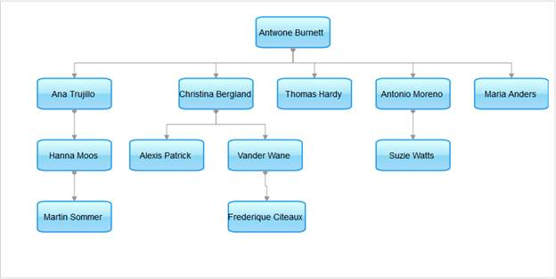

::: {style="DISPLAY: none"}
{#d2h_url_template}{#d2h_package_url style="WIDTH: 0px; DISPLAY: none; HEIGHT: 0px"}
:::

:::: {.d2h_secondary_topic style="PADDING-BOTTOM: 10pt; MARGIN: 0pt; PADDING-LEFT: 0pt; PADDING-RIGHT: 0pt; PADDING-TOP: 0pt"}
#### Through Diagram Builder {#through-diagram-builder style="tab-stops: 0pt"}

1.  [Create an Entity model in an application (see ]{style="FONT-FAMILY: 'Arial','sans-serif'"}[[Creating the ADO.NET Entity Data Model]{style="FONT-FAMILY: 'Arial','sans-serif'"}](http://help.syncfusion.com/ug_94/User%20Interface/ASP.NET%20MVC/Diagram/default.htm?turl=Documents%2F52createtheadonetentitydatamodel.htm)[).]{style="FONT-FAMILY: 'Arial','sans-serif'"}

2.  [In the **controller**, pass the data to the **view** page.]{style="FONT-FAMILY: 'Arial','sans-serif'"}

::: {align="center"}
+-----------------------------------------------------------------------------------------------------------------------------------------------------+
| **[Controller]{style="FONT-FAMILY: 'Courier New'"}[]{style="FONT-FAMILY: 'Courier New'"}**                                                          |
|                                                                                                                                                     |
| []{style="FONT-FAMILY: Consolas; COLOR: #2b91af; FONT-SIZE: 9.5pt"}                                                                                 |
|                                                                                                                                                     |
| [        [NorthwindEntities]{style="COLOR: #2b91af"} entities = [null]{style="COLOR: blue"};]{style="FONT-FAMILY: Consolas; FONT-SIZE: 9.5pt"}      |
|                                                                                                                                                     |
| [        [public]{style="COLOR: blue"} [ActionResult]{style="COLOR: #2b91af"} Index()]{style="FONT-FAMILY: Consolas; FONT-SIZE: 9.5pt"}             |
|                                                                                                                                                     |
| [        {]{style="FONT-FAMILY: Consolas; FONT-SIZE: 9.5pt"}                                                                                        |
|                                                                                                                                                     |
| [            entities = [new]{style="COLOR: blue"} [NorthwindEntities]{style="COLOR: #2b91af"}();]{style="FONT-FAMILY: Consolas; FONT-SIZE: 9.5pt"} |
|                                                                                                                                                     |
| [            [return]{style="COLOR: blue"} View(entities.Employee);]{style="FONT-FAMILY: Consolas; FONT-SIZE: 9.5pt"}                               |
|                                                                                                                                                     |
| [        }]{style="FONT-FAMILY: Consolas; FONT-SIZE: 9.5pt"}                                                                                        |
+-----------------------------------------------------------------------------------------------------------------------------------------------------+
:::

 

[3.   ]{style="COLOR: black"}Create a strongly typed view (Refer to [How to \> Strongly Typed View](http://help.syncfusion.com/ug_94/User%20Interface/ASP.NET%20MVC/Diagram/default.htm?turl=Documents%2Fcreateastronglytypedview.htm)).[]{style="COLOR: black"}

[4.   ]{style="COLOR: black"}In the **view**, invoke the **Diagram** helper with the control ID, and you can use its **Model** property in **DataSource()** to bind the data source.[ ]{style="COLOR: black"}

[]{style="COLOR: black"} 

+--------------------------------------------------------------------------------------------------------------------------------------+
| **[\[ASPX\]]{style="FONT-FAMILY: 'Courier New'"}**                                                                                   |
|                                                                                                                                      |
| [\<%]{style="FONT-FAMILY: Consolas; BACKGROUND: yellow; FONT-SIZE: 9.5pt"}[{]{style="FONT-FAMILY: Consolas; FONT-SIZE: 9.5pt"}       |
|                                                                                                                                      |
| [      Html.Syncfusion().Diagram([\"EntityDataModel\"]{style="COLOR: #a31515"})]{style="FONT-FAMILY: Consolas; FONT-SIZE: 9.5pt"}    |
|                                                                                                                                      |
| [        .DataSource(Model)]{style="FONT-FAMILY: Consolas; FONT-SIZE: 9.5pt"}                                                        |
|                                                                                                                                      |
| [        .BindTo(bind =\>]{style="FONT-FAMILY: Consolas; FONT-SIZE: 9.5pt"}                                                          |
|                                                                                                                                      |
| [            bind.NodeId([\"Emp_Id\"]{style="COLOR: #a31515"})]{style="FONT-FAMILY: Consolas; FONT-SIZE: 9.5pt"}                     |
|                                                                                                                                      |
| [            .ParentNodeId([\"Emp_Head\"]{style="COLOR: #a31515"})]{style="FONT-FAMILY: Consolas; FONT-SIZE: 9.5pt"}                 |
|                                                                                                                                      |
| [            .NodeText([\"Emp_Name\"]{style="COLOR: #a31515"})]{style="FONT-FAMILY: Consolas; FONT-SIZE: 9.5pt"}                     |
|                                                                                                                                      |
| [            .NodeShape([\"Shape\"]{style="COLOR: #a31515"}))]{style="FONT-FAMILY: Consolas; FONT-SIZE: 9.5pt"}                      |
|                                                                                                                                      |
| [        .DiagramMode([DiagramMode]{style="COLOR: #2b91af"}.SVG)]{style="FONT-FAMILY: Consolas; FONT-SIZE: 9.5pt"}                   |
|                                                                                                                                      |
| [        .HorizontalSpacing(40)]{style="FONT-FAMILY: Consolas; FONT-SIZE: 9.5pt"}                                                    |
|                                                                                                                                      |
| [        .LayoutType([LayoutType]{style="COLOR: #2b91af"}.HierarchicalTreeLayout)]{style="FONT-FAMILY: Consolas; FONT-SIZE: 9.5pt"}  |
|                                                                                                                                      |
| [        .Orientation([TreeOrientation]{style="COLOR: #2b91af"}.TopBottom)]{style="FONT-FAMILY: Consolas; FONT-SIZE: 9.5pt"}         |
|                                                                                                                                      |
| [        .Width(900)]{style="FONT-FAMILY: Consolas; FONT-SIZE: 9.5pt"}                                                               |
|                                                                                                                                      |
| [        .Height(450)]{style="FONT-FAMILY: Consolas; FONT-SIZE: 9.5pt"}                                                              |
|                                                                                                                                      |
| [        .Render();]{style="FONT-FAMILY: Consolas; FONT-SIZE: 9.5pt"}                                                                |
|                                                                                                                                      |
| [  }[%\>]{style="BACKGROUND: yellow"}]{style="FONT-FAMILY: Consolas; FONT-SIZE: 9.5pt"}                                              |
|                                                                                                                                      |
| []{style="FONT-FAMILY: Consolas; BACKGROUND: yellow; FONT-SIZE: 9.5pt"}                                                              |
|                                                                                                                                      |
| []{style="FONT-FAMILY: Consolas; BACKGROUND: yellow; FONT-SIZE: 9.5pt"}                                                              |
|                                                                                                                                      |
| **[\[Razor\]]{style="FONT-FAMILY: 'Courier New'"}**                                                                                  |
|                                                                                                                                      |
| [\@{]{style="FONT-FAMILY: Consolas; BACKGROUND: yellow; FONT-SIZE: 9.5pt"}[]{style="FONT-FAMILY: Consolas; FONT-SIZE: 9.5pt"}        |
|                                                                                                                                      |
| [    Html.Syncfusion().Diagram([\"EntityDataModel\"]{style="COLOR: #a31515"})]{style="FONT-FAMILY: Consolas; FONT-SIZE: 9.5pt"}      |
|                                                                                                                                      |
| [         .DataSource(Model)]{style="FONT-FAMILY: Consolas; FONT-SIZE: 9.5pt"}                                                       |
|                                                                                                                                      |
| [         .BindTo(bind =\>]{style="FONT-FAMILY: Consolas; FONT-SIZE: 9.5pt"}                                                         |
|                                                                                                                                      |
| [             bind.NodeId([\"Emp_Id\"]{style="COLOR: #a31515"})]{style="FONT-FAMILY: Consolas; FONT-SIZE: 9.5pt"}                    |
|                                                                                                                                      |
| [             .ParentNodeId([\"Emp_Head\"]{style="COLOR: #a31515"})]{style="FONT-FAMILY: Consolas; FONT-SIZE: 9.5pt"}                |
|                                                                                                                                      |
| [             .NodeText([\"Emp_Name\"]{style="COLOR: #a31515"})]{style="FONT-FAMILY: Consolas; FONT-SIZE: 9.5pt"}                    |
|                                                                                                                                      |
| [             .NodeShape([\"Shape\"]{style="COLOR: #a31515"}))]{style="FONT-FAMILY: Consolas; FONT-SIZE: 9.5pt"}                     |
|                                                                                                                                      |
| [         .DiagramMode([DiagramMode]{style="COLOR: #2b91af"}.SVG)]{style="FONT-FAMILY: Consolas; FONT-SIZE: 9.5pt"}                  |
|                                                                                                                                      |
| [         .HorizontalSpacing(40)]{style="FONT-FAMILY: Consolas; FONT-SIZE: 9.5pt"}                                                   |
|                                                                                                                                      |
| [         .LayoutType([LayoutType]{style="COLOR: #2b91af"}.HierarchicalTreeLayout)]{style="FONT-FAMILY: Consolas; FONT-SIZE: 9.5pt"} |
|                                                                                                                                      |
| [         .Orientation([TreeOrientation]{style="COLOR: #2b91af"}.TopBottom)]{style="FONT-FAMILY: Consolas; FONT-SIZE: 9.5pt"}        |
|                                                                                                                                      |
| [         .Width(900)]{style="FONT-FAMILY: Consolas; FONT-SIZE: 9.5pt"}                                                              |
|                                                                                                                                      |
| [         .Height(450)]{style="FONT-FAMILY: Consolas; FONT-SIZE: 9.5pt"}                                                             |
|                                                                                                                                      |
| [         .Render();]{style="FONT-FAMILY: Consolas; FONT-SIZE: 9.5pt"}                                                               |
|                                                                                                                                      |
| [}]{style="FONT-FAMILY: Consolas; BACKGROUND: yellow; FONT-SIZE: 9.5pt"}[]{style="FONT-FAMILY: Consolas; FONT-SIZE: 9.5pt"}          |
+--------------------------------------------------------------------------------------------------------------------------------------+

 

5.  [Build and run the application. The diagram will appear as shown below.]{style="FONT-FAMILY: 'Arial','sans-serif'"}

 

{border="0"}

Figure 125: Entity Model Diagram

[]{#related-topics}
::::
