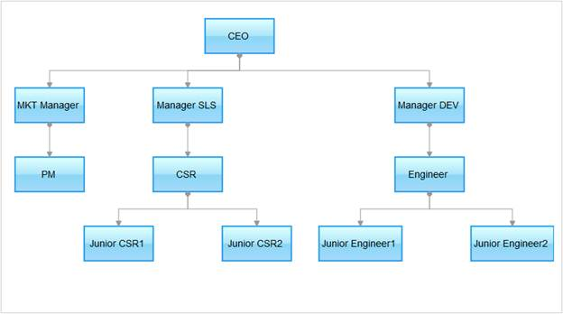

::: {style="DISPLAY: none"}
{#d2h_url_template}{#d2h_package_url style="WIDTH: 0px; DISPLAY: none; HEIGHT: 0px"}
:::

:::: {.d2h_secondary_topic style="PADDING-BOTTOM: 10pt; MARGIN: 0pt; PADDING-LEFT: 0pt; PADDING-RIGHT: 0pt; PADDING-TOP: 0pt"}
#### Through Diagram Properties Model {#through-diagram-properties-model style="tab-stops: 0pt"}

1.  [Create a model in the application (Refer to ]{style="FONT-FAMILY: 'Arial','sans-serif'"}[[Getting Started \> Examining the MVC Project \> Adding a Model to the Application]{style="FONT-FAMILY: 'Arial','sans-serif'"}](http://help.syncfusion.com/ug_94/User%20Interface/ASP.NET%20MVC/Diagram/default.htm?turl=Documents%2Faddingamodeltotheapplication.htm)[).]{style="FONT-FAMILY: 'Arial','sans-serif'"}

2.  [Create a **DiagramPropertiesModel** in the **Index** method. Bind the data source using the **DataSource** property and pass the model from the **controller** to the **view** using the **ViewData** class as shown in the following code.]{style="FONT-FAMILY: 'Arial','sans-serif'"}

::: {align="center"}
+-------------------------------------------------------------------------------------------------------------------------------------------------------------------------------------------------------+
| **[Controller]{style="FONT-FAMILY: 'Courier New'"}[]{style="FONT-FAMILY: 'Courier New'"}**                                                                                                            |
|                                                                                                                                                                                                       |
| []{style="FONT-FAMILY: Consolas; COLOR: #2b91af; FONT-SIZE: 9.5pt"}                                                                                                                                   |
|                                                                                                                                                                                                       |
| [        [public]{style="COLOR: blue"} [ActionResult]{style="COLOR: #2b91af"} Index()]{style="FONT-FAMILY: Consolas; FONT-SIZE: 9.5pt"}                                                               |
|                                                                                                                                                                                                       |
| [        {]{style="FONT-FAMILY: Consolas; FONT-SIZE: 9.5pt"}                                                                                                                                          |
|                                                                                                                                                                                                       |
| [            context = SqlCE;]{style="FONT-FAMILY: Consolas; FONT-SIZE: 9.5pt"}                                                                                                                       |
|                                                                                                                                                                                                       |
| [            [DiagramPropertiesModel]{style="COLOR: #2b91af"} model = [new]{style="COLOR: blue"} [DiagramPropertiesModel]{style="COLOR: #2b91af"}()]{style="FONT-FAMILY: Consolas; FONT-SIZE: 9.5pt"} |
|                                                                                                                                                                                                       |
| [            {]{style="FONT-FAMILY: Consolas; FONT-SIZE: 9.5pt"}                                                                                                                                      |
|                                                                                                                                                                                                       |
| [                DataSource = context.DiagramDataBinding,]{style="FONT-FAMILY: Consolas; FONT-SIZE: 9.5pt"}                                                                                           |
|                                                                                                                                                                                                       |
| [                BindTo = [new]{style="COLOR: blue"} [DiagramFields]{style="COLOR: #2b91af"}()]{style="FONT-FAMILY: Consolas; FONT-SIZE: 9.5pt"}                                                      |
|                                                                                                                                                                                                       |
| [                {]{style="FONT-FAMILY: Consolas; FONT-SIZE: 9.5pt"}                                                                                                                                  |
|                                                                                                                                                                                                       |
| [                    NodeId = [\"NodeId\"]{style="COLOR: #a31515"},]{style="FONT-FAMILY: Consolas; FONT-SIZE: 9.5pt"}                                                                                 |
|                                                                                                                                                                                                       |
| [                    ParentNodeId = [\"ParentNodeId\"]{style="COLOR: #a31515"},]{style="FONT-FAMILY: Consolas; FONT-SIZE: 9.5pt"}                                                                     |
|                                                                                                                                                                                                       |
| [                    NodeText = [\"NodeText\"]{style="COLOR: #a31515"},]{style="FONT-FAMILY: Consolas; FONT-SIZE: 9.5pt"}                                                                             |
|                                                                                                                                                                                                       |
| [                    NodeShape = [\"Shape\"]{style="COLOR: #a31515"}]{style="FONT-FAMILY: Consolas; FONT-SIZE: 9.5pt"}                                                                                |
|                                                                                                                                                                                                       |
| [                },]{style="FONT-FAMILY: Consolas; FONT-SIZE: 9.5pt"}                                                                                                                                 |
|                                                                                                                                                                                                       |
| [                DiagramMode = [DiagramMode]{style="COLOR: #2b91af"}.SVG,]{style="FONT-FAMILY: Consolas; FONT-SIZE: 9.5pt"}                                                                           |
|                                                                                                                                                                                                       |
| [                LayoutType = [LayoutType]{style="COLOR: #2b91af"}.HierarchicalTreeLayout,]{style="FONT-FAMILY: Consolas; FONT-SIZE: 9.5pt"}                                                          |
|                                                                                                                                                                                                       |
| [                Orientation = [TreeOrientation]{style="COLOR: #2b91af"}.TopBottom,]{style="FONT-FAMILY: Consolas; FONT-SIZE: 9.5pt"}                                                                 |
|                                                                                                                                                                                                       |
| [                Width = 800,]{style="FONT-FAMILY: Consolas; FONT-SIZE: 9.5pt"}                                                                                                                       |
|                                                                                                                                                                                                       |
| [                Height = 450]{style="FONT-FAMILY: Consolas; FONT-SIZE: 9.5pt"}                                                                                                                       |
|                                                                                                                                                                                                       |
| [            };]{style="FONT-FAMILY: Consolas; FONT-SIZE: 9.5pt"}                                                                                                                                     |
|                                                                                                                                                                                                       |
| [            ViewData\[[\"LinqToSql\"]{style="COLOR: #a31515"}\] = model;]{style="FONT-FAMILY: Consolas; FONT-SIZE: 9.5pt"}                                                                           |
|                                                                                                                                                                                                       |
| [            [return]{style="COLOR: blue"} View();]{style="FONT-FAMILY: Consolas; FONT-SIZE: 9.5pt"}                                                                                                  |
|                                                                                                                                                                                                       |
| [        }]{style="FONT-FAMILY: Consolas; FONT-SIZE: 9.5pt"}                                                                                                                                          |
+-------------------------------------------------------------------------------------------------------------------------------------------------------------------------------------------------------+
:::

 

3.   In the **view**, invoke the **Diagram** helper with the control ID the same as the view data key[.]{style="COLOR: black"}

[]{style="COLOR: black"} 

+--------------------------------------------------------------------------------------------------------------------------------+
| **[\[ASPX\]]{style="FONT-FAMILY: 'Courier New'"}**                                                                             |
|                                                                                                                                |
| [\<%]{style="FONT-FAMILY: Consolas; BACKGROUND: yellow; FONT-SIZE: 9.5pt"}[{]{style="FONT-FAMILY: Consolas; FONT-SIZE: 9.5pt"} |
|                                                                                                                                |
| [      Html.Syncfusion().Diagram([\"LinqToSql\"]{style="COLOR: #a31515"})]{style="FONT-FAMILY: Consolas; FONT-SIZE: 9.5pt"}    |
|                                                                                                                                |
| [        .Render();]{style="FONT-FAMILY: Consolas; FONT-SIZE: 9.5pt"}                                                          |
|                                                                                                                                |
| [  }[%\>]{style="BACKGROUND: yellow"}]{style="FONT-FAMILY: Consolas; FONT-SIZE: 9.5pt"}                                        |
|                                                                                                                                |
| []{style="FONT-FAMILY: Consolas; BACKGROUND: yellow; FONT-SIZE: 9.5pt"}                                                        |
|                                                                                                                                |
| **[\[Razor\]]{style="FONT-FAMILY: 'Courier New'"}**                                                                            |
|                                                                                                                                |
| [\@{]{style="FONT-FAMILY: Consolas; BACKGROUND: yellow; FONT-SIZE: 9.5pt"}[]{style="FONT-FAMILY: Consolas; FONT-SIZE: 9.5pt"}  |
|                                                                                                                                |
| [    Html.Syncfusion().Diagram([\"LinqToSql\"]{style="COLOR: #a31515"})]{style="FONT-FAMILY: Consolas; FONT-SIZE: 9.5pt"}      |
|                                                                                                                                |
| [      .Render();]{style="FONT-FAMILY: Consolas; FONT-SIZE: 9.5pt"}                                                            |
|                                                                                                                                |
| [}]{style="FONT-FAMILY: Consolas; BACKGROUND: yellow; FONT-SIZE: 9.5pt"}[]{style="FONT-FAMILY: Consolas; FONT-SIZE: 9.5pt"}    |
|                                                                                                                                |
| []{style="FONT-FAMILY: Consolas; FONT-SIZE: 9.5pt"}                                                                            |
|                                                                                                                                |
| []{style="FONT-FAMILY: Consolas; FONT-SIZE: 9.5pt"}                                                                            |
+--------------------------------------------------------------------------------------------------------------------------------+

 

4.  [Build and run the application. The diagram will appear as shown below.]{style="FONT-FAMILY: 'Arial','sans-serif'"}

 

{border="0"}

Figure 124: LINQ to SQL Diagram

[]{#related-topics}
::::
