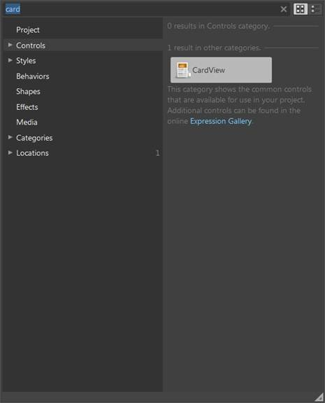
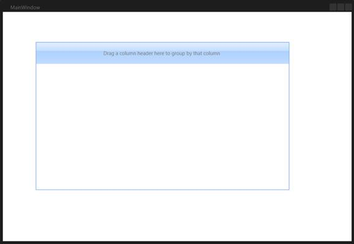
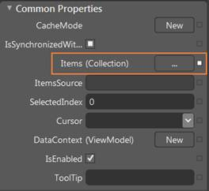
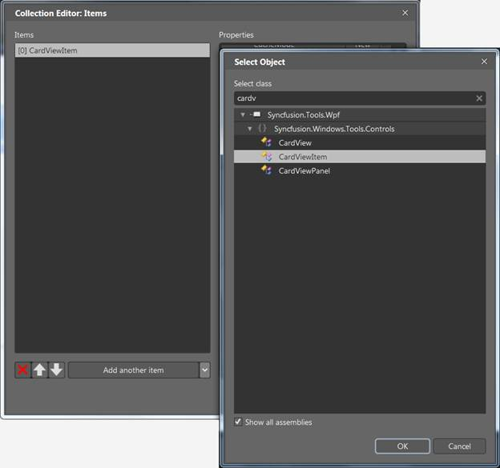

::: {style="DISPLAY: none"}
{#d2h_url_template}{#d2h_package_url style="WIDTH: 0px; DISPLAY: none; HEIGHT: 0px"}
:::

:::: {.d2h_secondary_topic style="PADDING-BOTTOM: 10pt; MARGIN: 0pt; PADDING-LEFT: 0pt; PADDING-RIGHT: 0pt; PADDING-TOP: 0pt"}
##### Through Expression Blend {#through-expression-blend style="tab-stops: 0pt"}

The CardView control can also be created and configured using Expression Blend. The following are the steps to do so.

 

1.   Create a WPF project in Expression Blend and reference the following assemblies.

 

[·      ]{style="FONT-FAMILY: Symbol"}Syncfusion.Shared.Wpf

[·      ]{style="FONT-FAMILY: Symbol"}Syncfusion.Tools.Wpf

[·      ]{style="FONT-FAMILY: Symbol"}Syncfusion.Core

 

2.   Search for *CardView* in the **Toolbox**.

 

{border="0"}

Figure 91: CardView in Expression Blend Toolbox

 

3.   Drag the **CardView** to the designer. This will generate the following CardView control.

 

{border="0"}

Figure 92: Dragging CardView to the Expression Blend Designer

 

4.   To add the items to the CardView using the CollectionEditor, select the **CardView** and go to **Properties** area, and then click **Items (Collection)** under Common Properties.

 

{border="0"}

Figure 93: CardView Properties

 

5.   Once the **Collection Editor** opens, click **Add Another Item. ** The **Select Object** window will open.

6.   Select the **CardViewItem** by typing *CardViewItem* in the search box, and then click **OK**.

                                   

{border="0"}

Figure 94: Collection Editor for CardView in Expression Blend

 

7.   Configure the CardViewItem using the properties in the **Collection Editor**.

::: {style="BORDER-BOTTOM: windowtext 1pt solid; BORDER-LEFT: medium none; PADDING-BOTTOM: 1pt; MARGIN-TOP: 9pt; PADDING-LEFT: 0pt; PADDING-RIGHT: 0pt; MARGIN-BOTTOM: 9pt; BORDER-TOP: windowtext 1pt solid; BORDER-RIGHT: medium none; PADDING-TOP: 1pt"}
{border="0"}Note: You can also customize the appearance of CardView control and its items using the template editing feature available in the Expression Blend.
:::

 

[]{#related-topics}
::::
