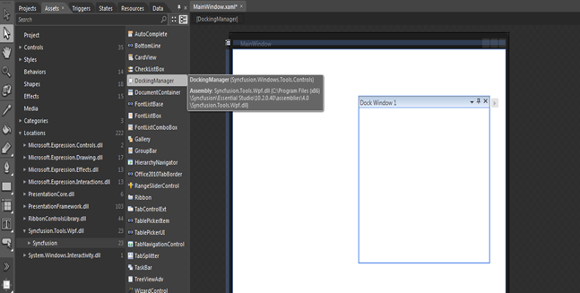

::: {style="DISPLAY: none"}
{#d2h_url_template}{#d2h_package_url style="WIDTH: 0px; DISPLAY: none; HEIGHT: 0px"}
:::

::: {.d2h_secondary_topic style="PADDING-BOTTOM: 10pt; MARGIN: 0pt; PADDING-LEFT: 0pt; PADDING-RIGHT: 0pt; PADDING-TOP: 0pt"}
##### Through Expression Blend {#through-expression-blend style="tab-stops: 0pt"}

The Docking Manager control can also be created and configured using Expression Blend. Follow these steps to do so.

 

1.   Create a WPF project in Expression Blend and reference the following assemblies.

[·      ]{style="FONT-FAMILY: Symbol"}Syncfusion.Tools.Wpf

[·      ]{style="FONT-FAMILY: Symbol"}Syncfusion.Shared.Wpf

 

2.   Search for **DockingManager** in the Toolbox.

3.   Drag the **DockingManager** to the designer. It will generate the following Docking Manager control with one child element.

 

{border="0"}

Figure 303: Adding Docking Manager through Expression Blend

 

[]{#related-topics}
:::
