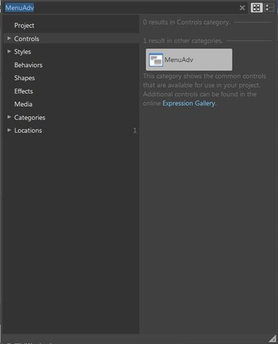
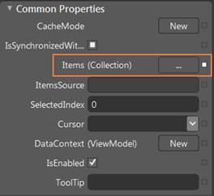
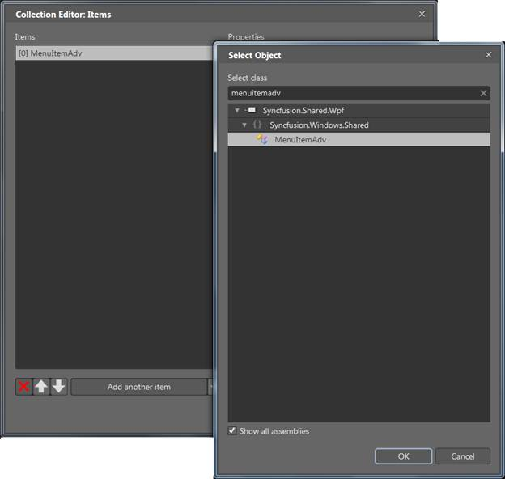
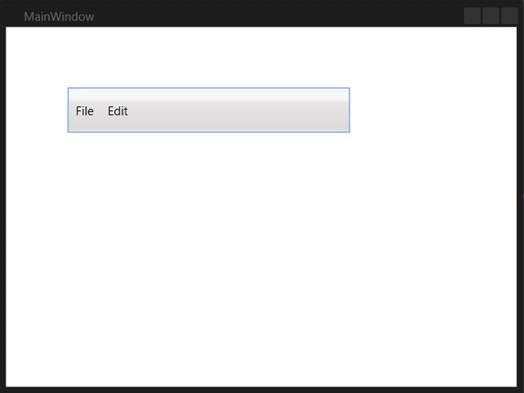

::: {style="DISPLAY: none"}
{#d2h_url_template}{#d2h_package_url style="WIDTH: 0px; DISPLAY: none; HEIGHT: 0px"}
:::

:::: {.d2h_secondary_topic style="PADDING-BOTTOM: 10pt; MARGIN: 0pt; PADDING-LEFT: 0pt; PADDING-RIGHT: 0pt; PADDING-TOP: 0pt"}
##### Through Expression Blend {#through-expression-blend style="tab-stops: 0pt"}

The MenuAdv control can also be created and configured using Expression Blend. The following are the steps to do so.

 

1.   Create a WPF project in the Expression Blend and reference the following assemblies.

 

[·      ]{style="FONT-FAMILY: Symbol"}Syncfusion.Shared.Wpf

[·      ]{style="FONT-FAMILY: Symbol"}Syncfusion.Core

 

2.   Search for **MenuAdv** in the Toolbox.

 

{border="0"}

Figure 710:  MenuAdv in Expression Blend Toolbox

 

3.   Drag the **MenuAdv** to the designer. This will generate an empty menu bar.

4.   To add the MenuItemAdvs to the MenuAdv control, select the **MenuAdv** and go to **Properties** area.

5.   Click **Items (Collection)** under Common Properties.

 

{border="0"}

Figure 711:  MenuAdv properties

6.   Once the **Collection Editor** opens, click **Add another item. ** The **Select Object** window will open.

7.   Select **MenuItemAdv** by typing *MenuItemAdv* in the search box, and then click **OK**.

{border="0"}

Figure 712: Collection Editor for MenuAdv in Expression Blend

 

8.   Configure the properties (such as header or icon) of the MenuItemAdv using the properties in the **Collection Editor**. This will generate the following control.

{border="0"}

Figure 713: MenuAdv in Expression Blend Designer

::: {style="BORDER-BOTTOM: windowtext 1pt solid; BORDER-LEFT: medium none; PADDING-BOTTOM: 1pt; MARGIN-TOP: 9pt; PADDING-LEFT: 0pt; PADDING-RIGHT: 0pt; MARGIN-BOTTOM: 9pt; BORDER-TOP: windowtext 1pt solid; BORDER-RIGHT: medium none; PADDING-TOP: 1pt"}
{border="0"}Note: You can customize the appearance of the MenuItemAdv using the template-editing feature available in the Expression Blend.
:::

 

[]{#related-topics}
::::
