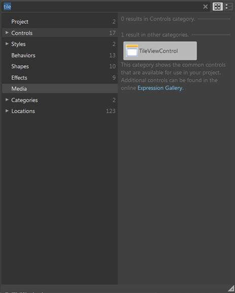
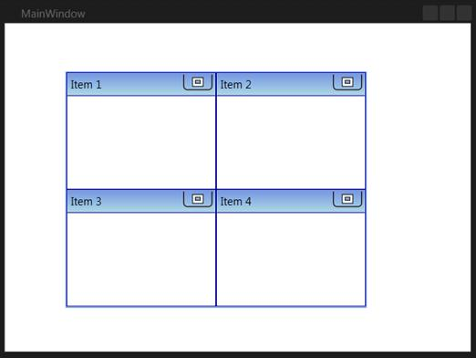
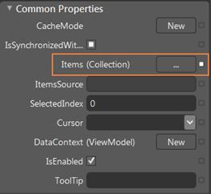
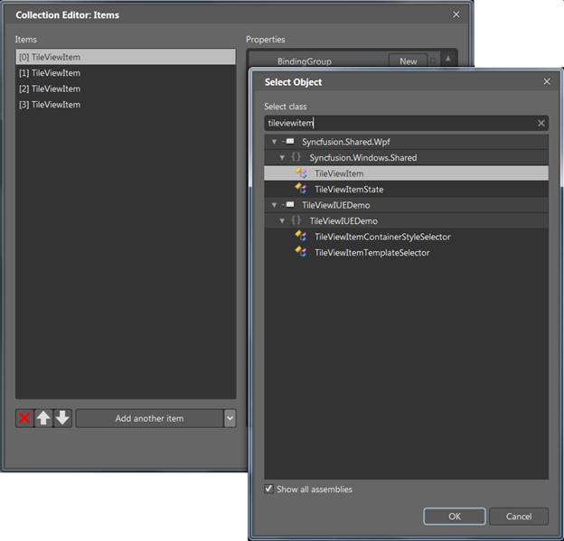

::: {style="DISPLAY: none"}
{#d2h_url_template}{#d2h_package_url style="WIDTH: 0px; DISPLAY: none; HEIGHT: 0px"}
:::

:::: {.d2h_secondary_topic style="PADDING-BOTTOM: 10pt; MARGIN: 0pt; PADDING-LEFT: 0pt; PADDING-RIGHT: 0pt; PADDING-TOP: 0pt"}
##### Through Expression Blend {#through-expression-blend style="tab-stops: 0pt"}

The TileViewControl can also be created and configured using Expression Blend. The following are the steps to do so.

1.   Create a WPF project in Expression Blend and reference the following assemblies.

 

[·      ]{style="FONT-FAMILY: Symbol"}Syncfusion.Shared.Wpf

[·      ]{style="FONT-FAMILY: Symbol"}Syncfusion.Core

 

2.   Search for **TileViewControl** in the Toolbox.

 

{border="0"}

Figure 1060: TileViewControl in Expression Blend Toolbox

 

3.   Drag the **TileViewControl** to the designer. This will generate the control as follows.

 

{border="0"}

Figure 1061: TileViewControl in Expression Blend Designer

 

4.   To add items to the TileViewControl using the **Collection Editor**, select **TileViewControl** and go to **Properties**.

5.   Click **Items (Collection)** under Common Properties.

 

{border="0"}

Figure 1062: TileViewControl properties

 

6.   Once the Collection Editor window opens, click **Add another item.** The **Select Object** window will open.

7.   Select **TileViewItem** by typing *TileViewItem* in the search box, and then click **OK**.

           

{border="0"}

Figure 1063: Collection Editor for TileViewControl in Expression Blend

 

8.   Configure the TileViewItem using the properties in the **Collection Editor**.

::: {style="BORDER-BOTTOM: windowtext 1pt solid; BORDER-LEFT: medium none; PADDING-BOTTOM: 1pt; MARGIN-TOP: 9pt; PADDING-LEFT: 0pt; PADDING-RIGHT: 0pt; MARGIN-BOTTOM: 9pt; BORDER-TOP: windowtext 1pt solid; BORDER-RIGHT: medium none; PADDING-TOP: 1pt"}
{border="0"}Note: You can customize the appearance of the TileViewControl and its Item using the template-editing feature available in the Expression Blend.   
:::

 

[]{#related-topics}
::::
