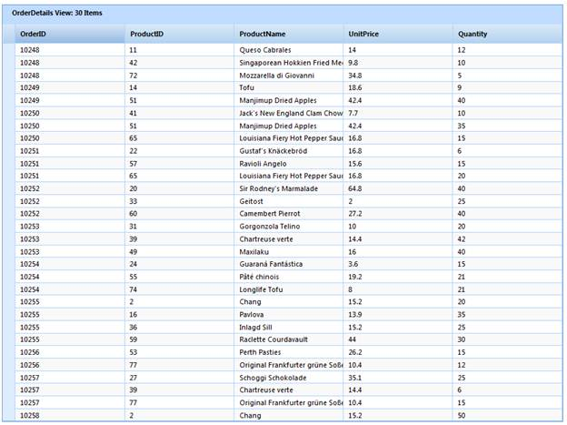
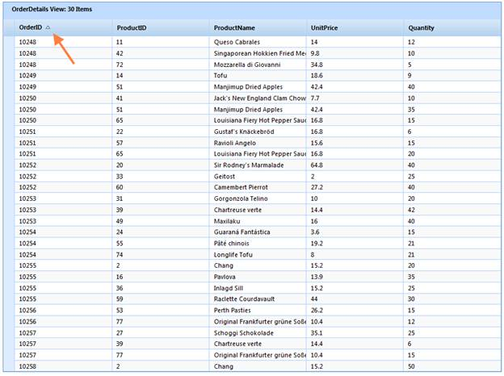

::: {style="DISPLAY: none"}
{#d2h_url_template}{#d2h_package_url style="WIDTH: 0px; DISPLAY: none; HEIGHT: 0px"}
:::

::::: {.d2h_secondary_topic style="PADDING-BOTTOM: 10pt; MARGIN: 0pt; PADDING-LEFT: 0pt; PADDING-RIGHT: 0pt; PADDING-TOP: 0pt"}
#### Through GridBuilder {#through-gridbuilder style="tab-stops: 0pt"}

 

1.   Create a model in the application (Refer to [[Getting Started\>Adding a Model to the Application]{style="COLOR: blue"}]{.underline}).

2.   Create a strongly typed view (Refer to [[How to\>Strongly Typed View]{style="COLOR: blue"}]{.underline}).

3.   Create the Grid control in the view and configure its properties.

4.   Set the JSON action mode using the **ActionMode** method.

5.   Enable sorting using the **EnableSorting** method.

 

::: {align="center"}
+------------------------------------------------------------------------------------------------------------------------------------------------------------+
| **[View \[ASPX\]]{style="FONT-FAMILY: 'Courier New'"}**                                                                                                    |
|                                                                                                                                                            |
| **[]{style="FONT-FAMILY: 'Courier New'; FONT-SIZE: 11pt"}**                                                                                                |
|                                                                                                                                                            |
| [ [\<%]{style="BACKGROUND: yellow"}[=]{style="COLOR: blue"}Html.Syncfusion().Grid\<[Order]{style="COLOR: #2b91af"}\>([\"Grid1\"]{style="COLOR: #a31515"})\ |
|        .Caption([\"Orders\"]{style="COLOR: #a31515"})\                                                                                                     |
|        .AutoFormat([Skins]{style="COLOR: #2b91af"}.Sandune)]{style="FONT-FAMILY: 'Courier New'; FONT-SIZE: 11pt"}                                          |
|                                                                                                                                                            |
| **[       .ActionMode(ActionMode.JSON)]{style="FONT-FAMILY: 'Courier New'; FONT-SIZE: 11pt"}**                                                             |
|                                                                                                                                                            |
| **[       .EnableSorting()]{style="FONT-FAMILY: 'Courier New'; FONT-SIZE: 11pt"}**[\                                                                       |
|        .Column( columns =\> {\                                                                                                                             |
|            columns.Add(p =\> p.OrderID);\                                                                                                                  |
|            columns.Add(p =\> p.CustomerID);\                                                                                                               |
|            columns.Add(p =\> p.EmployeeID);  \                                                                                                             |
|            columns.Add(P =\> P.ShipCountry);[]{style="COLOR: green"}]{style="FONT-FAMILY: 'Courier New'; FONT-SIZE: 11pt"}                                 |
|                                                                                                                                                            |
| [           columns.Add(p =\> p.OrderDate).Format([\"{0:dd-MM-yyyy}\"]{style="COLOR: #a31515"});\                                                          |
|            })\                                                                                                                                             |
|        [%\>]{style="BACKGROUND: yellow"}]{style="FONT-FAMILY: 'Courier New'; FONT-SIZE: 11pt"}                                                             |
|                                                                                                                                                            |
| [   ]{style="FONT-FAMILY: 'Courier New'; FONT-SIZE: 11pt"}                                                                                                 |
+------------------------------------------------------------------------------------------------------------------------------------------------------------+
:::

[]{style="FONT-FAMILY: 'Courier New'; FONT-SIZE: 11pt"} 

::: {align="center"}
+------------------------------------------------------------------------------------------------------------------------------------------------------------+
| **[View \[cshtml\]]{style="FONT-FAMILY: 'Courier New'"}**                                                                                                  |
|                                                                                                                                                            |
| **[]{style="FONT-FAMILY: 'Courier New'; FONT-SIZE: 11pt"}**                                                                                                |
|                                                                                                                                                            |
| [ [\@{]{style="BACKGROUND: yellow"}[ ]{style="COLOR: blue"}Html.Syncfusion().Grid\<[Order]{style="COLOR: #2b91af"}\>([\"Grid1\"]{style="COLOR: #a31515"})\ |
|        .Caption([\"Orders\"]{style="COLOR: #a31515"})\                                                                                                     |
|        .AutoFormat([Skins]{style="COLOR: #2b91af"}.Sandune)]{style="FONT-FAMILY: 'Courier New'; FONT-SIZE: 11pt"}                                          |
|                                                                                                                                                            |
| **[       .ActionMode(ActionMode.JSON)]{style="FONT-FAMILY: 'Courier New'; FONT-SIZE: 11pt"}**                                                             |
|                                                                                                                                                            |
| **[       .EnableSorting()]{style="FONT-FAMILY: 'Courier New'; FONT-SIZE: 11pt"}**[\                                                                       |
|        .Column( columns =\> {\                                                                                                                             |
|            columns.Add(p =\> p.OrderID);\                                                                                                                  |
|            columns.Add(p =\> p.CustomerID);\                                                                                                               |
|            columns.Add(p =\> p.EmployeeID);  \                                                                                                             |
|            columns.Add(P =\> P.ShipCountry);[]{style="COLOR: green"}]{style="FONT-FAMILY: 'Courier New'; FONT-SIZE: 11pt"}                                 |
|                                                                                                                                                            |
| [           columns.Add(p =\> p.OrderDate).Format([\"{0:dd-MM-yyyy}\"]{style="COLOR: #a31515"});\                                                          |
|            }).Render();\                                                                                                                                   |
|        [}]{style="BACKGROUND: yellow"}]{style="FONT-FAMILY: 'Courier New'; FONT-SIZE: 11pt"}                                                               |
|                                                                                                                                                            |
| [   ]{style="FONT-FAMILY: 'Courier New'; FONT-SIZE: 11pt"}                                                                                                 |
+------------------------------------------------------------------------------------------------------------------------------------------------------------+
:::

 

6.   Render the view.

 

+--------------------------------------------------------------------------------------------------------------------------------------------------------------------------------------------------------------------------------------------------------------------------------+
| **[Controller]{style="FONT-FAMILY: 'Courier New'"}**[]{style="FONT-FAMILY: 'Courier New'"}                                                                                                                                                                                     |
|                                                                                                                                                                                                                                                                                |
| [ ]{style="FONT-FAMILY: 'Times New Roman','serif'; FONT-SIZE: 12pt"}[        [public]{style="COLOR: blue"} [ActionResult]{style="COLOR: #2b91af"} Index()]{style="FONT-FAMILY: Consolas; FONT-SIZE: 9.5pt"}[]{style="FONT-FAMILY: 'Times New Roman','serif'; FONT-SIZE: 12pt"} |
|                                                                                                                                                                                                                                                                                |
| [        {]{style="FONT-FAMILY: Consolas; FONT-SIZE: 9.5pt"}[]{style="FONT-FAMILY: 'Times New Roman','serif'; FONT-SIZE: 12pt"}                                                                                                                                                |
|                                                                                                                                                                                                                                                                                |
| [            [return]{style="COLOR: blue"} View();]{style="FONT-FAMILY: Consolas; FONT-SIZE: 9.5pt"}[]{style="FONT-FAMILY: 'Times New Roman','serif'; FONT-SIZE: 12pt"}                                                                                                        |
|                                                                                                                                                                                                                                                                                |
| [        }]{style="FONT-FAMILY: Consolas; FONT-SIZE: 9.5pt"}[]{style="FONT-FAMILY: 'Times New Roman','serif'; FONT-SIZE: 12pt"}                                                                                                                                                |
+--------------------------------------------------------------------------------------------------------------------------------------------------------------------------------------------------------------------------------------------------------------------------------+

 

7.   In order to work with sorting actions, create a **Post** method for **Index** actions and bind the data source to the grid as shown in the code below.

 

+---------------------------------------------------------------------------------------------------------------------------------------------------------------------------------------------------------------------------------------------------------+
| **[Controller]{style="FONT-FAMILY: 'Courier New'"}**[]{style="FONT-FAMILY: 'Courier New'"}                                                                                                                                                              |
|                                                                                                                                                                                                                                                         |
| [ ]{style="FONT-FAMILY: 'Times New Roman','serif'; FONT-SIZE: 12pt"}[  ]{style="FONT-FAMILY: 'Courier New'; COLOR: gray"}[     \[[AcceptVerbs]{style="COLOR: #2b91af"}([HttpVerbs]{style="COLOR: #2b91af"}.Post)\]]{style="FONT-FAMILY: 'Courier New'"} |
|                                                                                                                                                                                                                                                         |
| [        [public]{style="COLOR: blue"} [ActionResult]{style="COLOR: #2b91af"} Index([PagingParams]{style="COLOR: #2b91af"} args)]{style="FONT-FAMILY: 'Courier New'"}                                                                                   |
|                                                                                                                                                                                                                                                         |
| [        {]{style="FONT-FAMILY: 'Courier New'"}                                                                                                                                                                                                         |
|                                                                                                                                                                                                                                                         |
| [            [IEnumerable]{style="COLOR: #2b91af"} data = [new]{style="COLOR: blue"} [NorthwindDataContext]{style="COLOR: #2b91af"}().Orders.ToList();]{style="FONT-FAMILY: 'Courier New'"}                                                             |
|                                                                                                                                                                                                                                                         |
| **[            [return]{style="COLOR: blue"} data.GridJSONActions\<[Order]{style="COLOR: #2b91af"}\>();]{style="FONT-FAMILY: 'Courier New'"}**                                                                                                          |
|                                                                                                                                                                                                                                                         |
| [        }]{style="FONT-FAMILY: 'Courier New'"}[]{style="FONT-FAMILY: 'Times New Roman','serif'; FONT-SIZE: 12pt"}                                                                                                                                      |
+---------------------------------------------------------------------------------------------------------------------------------------------------------------------------------------------------------------------------------------------------------+

[]{style="FONT-FAMILY: 'Times New Roman','serif'; FONT-SIZE: 12pt"} 

8.   Run the application. The grid will appear as shown below.

 

{border="0"}

Figure 113: Sorting Enabled Grid

{border="0"}

Figure 114: "Order ID" Column Sorted in Descending Order

 

 

More:

[ ]{#related-topics}

[{border="0" align="absMiddle"}Sorting Customization](ms-xhelp:///?Id=f81fe7ee-972b-44c6-8608-036886a79d59){style="TEXT-DECORATION: none"}
:::::
