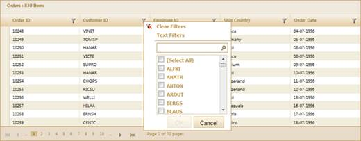

::: {style="DISPLAY: none"}
{#d2h_url_template}{#d2h_package_url style="WIDTH: 0px; DISPLAY: none; HEIGHT: 0px"}
:::

::: {.d2h_secondary_topic style="PADDING-BOTTOM: 10pt; MARGIN: 0pt; PADDING-LEFT: 0pt; PADDING-RIGHT: 0pt; PADDING-TOP: 0pt"}
#### Through GridBuilder {#through-gridbuilder style="tab-stops: 0pt"}

To add a filter to the application using GridBuilder:

1.   Create a model in the application (Refer to [Getting Started\>Adding a Model to the Application]{.UGHyperlink}).

2.   Create a strongly typed view (Refer to [How to\>Strongly Typed View]{.UGHyperlink}).

3.   In the view you can use the **Model** property in **Datasource()** to bind the data source.

 

+------------------------------------------------------------------------------------------------------------------------------------------------------------+
| **[View \[ASPX\]]{style="FONT-FAMILY: 'Courier New'"}**                                                                                                    |
|                                                                                                                                                            |
| [ [\<%]{style="BACKGROUND: yellow"}[=]{style="COLOR: blue"}Html.Syncfusion().Grid\<[Order]{style="COLOR: #2b91af"}\>([\"Grid1\"]{style="COLOR: #a31515"})\ |
| **       .Datasource(Model)**\                                                                                                                             |
|        .Caption([\"Orders\"]{style="COLOR: #a31515"})\                                                                                                     |
|        .EnablePaging()\                                                                                                                                    |
|        .EnableSorting()\                                                                                                                                   |
|        .EnableFiltering()\                                                                                                                                 |
|        .AutoFormat([Skins]{style="COLOR: #2b91af"}.Sandune)      \                                                                                         |
|        .Column( columns =\> {\                                                                                                                             |
|            columns.Add(p =\> p.OrderID).HeaderText([\"Order ID\"]{style="COLOR: #a31515"});\                                                               |
|            columns.Add(p =\> p.CustomerID).HeaderText([\"Customer ID\"]{style="COLOR: #a31515"});\                                                         |
|            columns.Add(p =\> p.EmployeeID).HeaderText([\"Employee ID\"]{style="COLOR: #a31515"});         \                                                |
|            columns.Add(P =\> P.ShipCountry).HeaderText([\"Ship Country\"]{style="COLOR: #a31515"});\                                                       |
|            columns.Add(p =\> p.OrderDate).HeaderText([\"Order Date\"]{style="COLOR: #a31515"});\                                                           |
|            })\                                                                                                                                             |
|        [%\>]{style="BACKGROUND: yellow"}]{style="FONT-FAMILY: 'Courier New'"}                                                                              |
|                                                                                                                                                            |
|                                                                                                                                                            |
+------------------------------------------------------------------------------------------------------------------------------------------------------------+

 

 

+------------------------------------------------------------------------------------------------------------------------------------------------------------+
| **[View \[]{style="FONT-FAMILY: 'Courier New'"}[cshtml]{style="FONT-FAMILY: 'Courier New'"}[\]]{style="FONT-FAMILY: 'Courier New'"}**                      |
|                                                                                                                                                            |
| [ [\@{]{style="BACKGROUND: yellow"}[ ]{style="COLOR: blue"}Html.Syncfusion().Grid\<[Order]{style="COLOR: #2b91af"}\>([\"Grid1\"]{style="COLOR: #a31515"})\ |
| **       .Datasource(Model)**\                                                                                                                             |
|        .Caption([\"Orders\"]{style="COLOR: #a31515"})\                                                                                                     |
|        .EnablePaging()\                                                                                                                                    |
|        .EnableSorting()\                                                                                                                                   |
|        .EnableFiltering()\                                                                                                                                 |
|        .AutoFormat([Skins]{style="COLOR: #2b91af"}.Sandune)      \                                                                                         |
|        .Column( columns =\> {\                                                                                                                             |
|            columns.Add(p =\> p.OrderID).HeaderText([\"Order ID\"]{style="COLOR: #a31515"});\                                                               |
|            columns.Add(p =\> p.CustomerID).HeaderText([\"Customer ID\"]{style="COLOR: #a31515"});\                                                         |
|            columns.Add(p =\> p.EmployeeID).HeaderText([\"Employee ID\"]{style="COLOR: #a31515"});         \                                                |
|            columns.Add(P =\> P.ShipCountry).HeaderText([\"Ship Country\"]{style="COLOR: #a31515"});\                                                       |
|            columns.Add(p =\> p.OrderDate).HeaderText([\"Order Date\"]{style="COLOR: #a31515"});\                                                           |
|            }).Render();\                                                                                                                                   |
|        [}]{style="BACKGROUND: yellow"}]{style="FONT-FAMILY: 'Courier New'"}                                                                                |
|                                                                                                                                                            |
|                                                                                                                                                            |
+------------------------------------------------------------------------------------------------------------------------------------------------------------+

 

 

 

 

 

4.   To enable the filtering feature for your grid, you should use the **EnableFiltering()** method.

 

+----------------------------------------------------------------------------------------------------------------------------------------------------------------------------------------------------------------+
| **[View \[ASPX\]]{style="FONT-FAMILY: 'Courier New'"}**                                                                                                                                                        |
|                                                                                                                                                                                                                |
| [ [\<%]{style="BACKGROUND: yellow"}[=]{style="COLOR: blue"}Html.Syncfusion().Grid\<[Order]{style="COLOR: #2b91af"}\>([\"Grid1\"]{style="COLOR: #a31515"})\                                                     |
| **       .**Datasource(Model)\                                                                                                                                                                                 |
|        .Caption([\"Orders\"]{style="COLOR: #a31515"})\                                                                                                                                                         |
|        .EnablePaging()\                                                                                                                                                                                        |
|        .EnableSorting()\                                                                                                                                                                                       |
| **       .EnableFiltering()**\                                                                                                                                                                                 |
|        .AutoFormat([Skins]{style="COLOR: #2b91af"}.Sandune)      \                                                                                                                                             |
|        .Column( columns =\> {\                                                                                                                                                                                 |
|            columns.Add(p =\> p.OrderID).HeaderText([\"Order ID\"]{style="COLOR: #a31515"});\                                                                                                                   |
|            columns.Add(p =\> p.CustomerID).HeaderText([\"Customer ID\"]{style="COLOR: #a31515"});\                                                                                                             |
|            columns.Add(p =\> p.EmployeeID).HeaderText([\"Employee ID\"]{style="COLOR: #a31515"});                    columns.Add(P =\> P.ShipCountry).HeaderText([\"Ship Country\"]{style="COLOR: #a31515"});\ |
|            columns.Add(p =\> p.OrderDate).HeaderText([\"Order Date\"]{style="COLOR: #a31515"});\                                                                                                               |
|            })\                                                                                                                                                                                                 |
|        [%\>]{style="BACKGROUND: yellow"}]{style="FONT-FAMILY: 'Courier New'"}                                                                                                                                  |
|                                                                                                                                                                                                                |
|                                                                                                                                                                                                                |
+----------------------------------------------------------------------------------------------------------------------------------------------------------------------------------------------------------------+

 

 

+----------------------------------------------------------------------------------------------------------------------------------------------------------------------------------------------------------------+
| **[View \[cshtml\]]{style="FONT-FAMILY: 'Courier New'"}**                                                                                                                                                      |
|                                                                                                                                                                                                                |
| [ [\@{]{style="BACKGROUND: yellow"}[ ]{style="COLOR: blue"}Html.Syncfusion().Grid\<[Order]{style="COLOR: #2b91af"}\>([\"Grid1\"]{style="COLOR: #a31515"})\                                                     |
| **       .**Datasource(Model)\                                                                                                                                                                                 |
|        .Caption([\"Orders\"]{style="COLOR: #a31515"})\                                                                                                                                                         |
|        .EnablePaging()\                                                                                                                                                                                        |
|        .EnableSorting()\                                                                                                                                                                                       |
| **       .EnableFiltering()**\                                                                                                                                                                                 |
|        .AutoFormat([Skins]{style="COLOR: #2b91af"}.Sandune)      \                                                                                                                                             |
|        .Column( columns =\> {\                                                                                                                                                                                 |
|            columns.Add(p =\> p.OrderID).HeaderText([\"Order ID\"]{style="COLOR: #a31515"});\                                                                                                                   |
|            columns.Add(p =\> p.CustomerID).HeaderText([\"Customer ID\"]{style="COLOR: #a31515"});\                                                                                                             |
|            columns.Add(p =\> p.EmployeeID).HeaderText([\"Employee ID\"]{style="COLOR: #a31515"});                    columns.Add(P =\> P.ShipCountry).HeaderText([\"Ship Country\"]{style="COLOR: #a31515"});\ |
|            columns.Add(p =\> p.OrderDate).HeaderText([\"Order Date\"]{style="COLOR: #a31515"});\                                                                                                               |
|            }).Render();\                                                                                                                                                                                       |
|        [}]{style="BACKGROUND: yellow"}]{style="FONT-FAMILY: 'Courier New'"}                                                                                                                                    |
|                                                                                                                                                                                                                |
|                                                                                                                                                                                                                |
+----------------------------------------------------------------------------------------------------------------------------------------------------------------------------------------------------------------+

 

5.   Set its data source and render the view.

 

+------------------------------------------------------------------------------------------------------------------------------------------------------------------------------------------------------------------------------------------------------------+
| **[\[C#\]]{style="FONT-FAMILY: 'Courier New'"}**                                                                                                                                                                                                           |
|                                                                                                                                                                                                                                                            |
| [ ]{style="FONT-FAMILY: 'Courier New'"}[       ]{style="FONT-FAMILY: Consolas"}[///]{style="FONT-FAMILY: 'Courier New'; COLOR: gray"}[ ]{style="FONT-FAMILY: 'Courier New'; COLOR: green"}[\<summary\>]{style="FONT-FAMILY: 'Courier New'; COLOR: gray"}[\ |
|         [///]{style="COLOR: gray"}[ Used for rendering the grid initially.]{style="COLOR: green"}\                                                                                                                                                         |
|         [///]{style="COLOR: gray"}[ ]{style="COLOR: green"}[\</summary\>]{style="COLOR: gray"}\                                                                                                                                                            |
|         [///]{style="COLOR: gray"}[ ]{style="COLOR: green"}[\<returns\>]{style="COLOR: gray"}[View page; it displays the grid.]{style="COLOR: green"}[\</returns\>]{style="COLOR: gray"}\                                                                  |
|         [public]{style="COLOR: blue"} [ActionResult]{style="COLOR: #2b91af"} Index()\                                                                                                                                                                      |
|         {\                                                                                                                                                                                                                                                 |
|             [var]{style="COLOR: blue"} data = [new]{style="COLOR: blue"} [NorthwindDataContext]{style="COLOR: #2b91af"}().Orders;\                                                                                                                         |
|             [return]{style="COLOR: blue"} View(data);\                                                                                                                                                                                                     |
|         }]{style="FONT-FAMILY: 'Courier New'"}                                                                                                                                                                                                             |
+------------------------------------------------------------------------------------------------------------------------------------------------------------------------------------------------------------------------------------------------------------+

 

6.   In order to work with filter actions, create a **Post** method for **Index** actions and bind the data source to the grid as shown in the following code.

 

+------------------------------------------------------------------------------------------------------------------------------------------------------------------------------------------------+
| **[\[C#\]]{style="FONT-FAMILY: 'Courier New'"}**                                                                                                                                               |
|                                                                                                                                                                                                |
| [ ]{style="FONT-FAMILY: 'Courier New'"}[      ]{style="FONT-FAMILY: Consolas"}[ [///]{style="COLOR: gray"}[ ]{style="COLOR: green"}[\<summary\>]{style="COLOR: gray"}\                         |
|         [///]{style="COLOR: gray"}[ Paging/sorting/filtering requests are mapped to this method. This method invokes the HtmlActionResult]{style="COLOR: green"}\                              |
|         [///]{style="COLOR: gray"}[ from the grid. The required response is generated.]{style="COLOR: green"}\                                                                                 |
|         [///]{style="COLOR: gray"}[ ]{style="COLOR: green"}[\</summary\>]{style="COLOR: gray"}\                                                                                                |
|         [///]{style="COLOR: gray"}[ ]{style="COLOR: green"}[\<param name=\"args\"\>]{style="COLOR: gray"}[Contains paging properties.]{style="COLOR: green"}[\</param\>]{style="COLOR: gray"}\ |
|         [///]{style="COLOR: gray"}[ ]{style="COLOR: green"}[\<returns\>]{style="COLOR: gray"}\                                                                                                 |
|         [///]{style="COLOR: gray"}[ HtmlActionResult returns the data displayed on the grid.]{style="COLOR: green"}\                                                                           |
|         [///]{style="COLOR: gray"}[ ]{style="COLOR: green"}[\</returns\>]{style="COLOR: gray"}\                                                                                                |
|         \[[AcceptVerbs]{style="COLOR: #2b91af"}([HttpVerbs]{style="COLOR: #2b91af"}.Post)\]\                                                                                                   |
|         [public]{style="COLOR: blue"} [ActionResult]{style="COLOR: #2b91af"} Index([PagingParams]{style="COLOR: #2b91af"} args)\                                                               |
|         {\                                                                                                                                                                                     |
|             [IEnumerable]{style="COLOR: #2b91af"} data = [new]{style="COLOR: blue"} [NorthwindDataContext]{style="COLOR: #2b91af"}().Orders;\                                                  |
|             [return]{style="COLOR: blue"} data.GridActions\<[Order]{style="COLOR: #2b91af"}\>();\                                                                                              |
|         }]{style="FONT-FAMILY: 'Courier New'"}                                                                                                                                                 |
|                                                                                                                                                                                                |
| []{style="FONT-FAMILY: 'Courier New'"}                                                                                                                                                         |
+------------------------------------------------------------------------------------------------------------------------------------------------------------------------------------------------+

 

7.   Run the application. The grid will appear as shown in the following screenshot.

 

{border="0"}

Figure 121: Grid with Filter Option

More:

[ ]{#related-topics}

[{border="0" align="absMiddle"}Filter Customization](ms-xhelp:///?Id=d9865862-6f90-437b-b11a-29bcfb234e25){style="TEXT-DECORATION: none"}
:::
