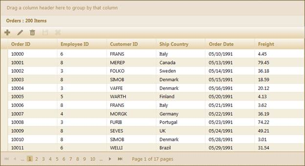
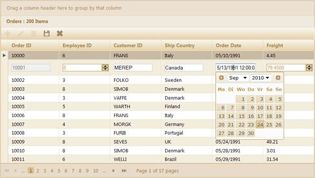
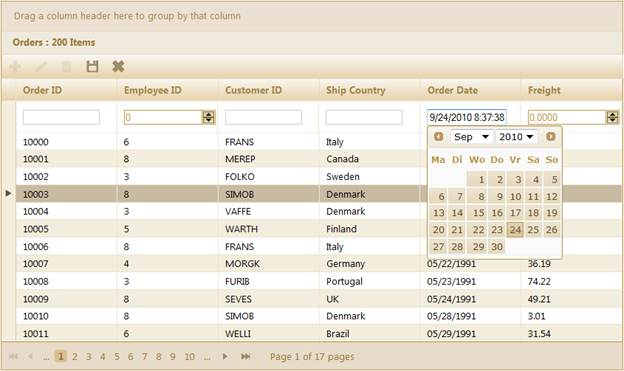
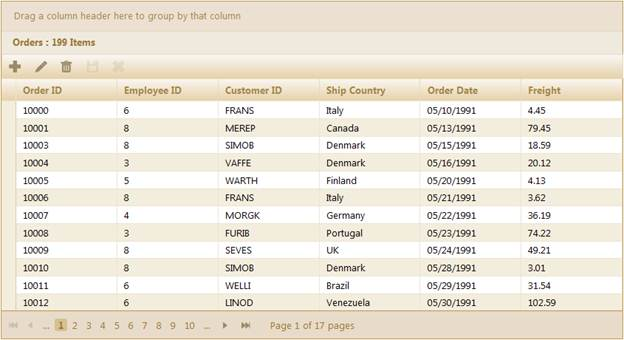

::: {style="DISPLAY: none"}
{#d2h_url_template}{#d2h_package_url style="WIDTH: 0px; DISPLAY: none; HEIGHT: 0px"}
:::

:::::::::::: {.d2h_secondary_topic style="PADDING-BOTTOM: 10pt; MARGIN: 0pt; PADDING-LEFT: 0pt; PADDING-RIGHT: 0pt; PADDING-TOP: 0pt"}
#### Through GridBuilder {#through-gridbuilder style="tab-stops: 0pt"}

The steps to work with the editing feature through **GridBuilder** are as follows:

1.   Add the **MicrosoftMvcValidation.debug.js** file in the master page.

[]{style="FONT-FAMILY: 'Myriad Pro','sans-serif'"} 

::: {align="center"}
+----------------------------------------------------------------------------------------------------------------------------------------------------------------------------------------------------------------------------------------------------------------------------------------------------------------------------------------------------------------------------------------------------------------------------------------------------------------------------------------+
| **[\[Site.Master\]]{style="FONT-FAMILY: 'Courier New'"}**                                                                                                                                                                                                                                                                                                                                                                                                                              |
|                                                                                                                                                                                                                                                                                                                                                                                                                                                                                        |
| [\<]{style="FONT-FAMILY: Consolas; COLOR: blue; FONT-SIZE: 9.5pt"}[head]{style="FONT-FAMILY: Consolas; COLOR: maroon; FONT-SIZE: 9.5pt"}[ [runat]{style="COLOR: red"}[=\"server\"\>]{style="COLOR: blue"}]{style="FONT-FAMILY: Consolas; FONT-SIZE: 9.5pt"}                                                                                                                                                                                                                            |
|                                                                                                                                                                                                                                                                                                                                                                                                                                                                                        |
| [    [\<]{style="COLOR: blue"}[title]{style="COLOR: maroon"}[\>\<]{style="COLOR: blue"}[asp]{style="COLOR: maroon"}[:]{style="COLOR: blue"}[ContentPlaceHolder]{style="COLOR: maroon"} [ID]{style="COLOR: red"}[=\"TitleContent\"]{style="COLOR: blue"} [runat]{style="COLOR: red"}[=\"server\"]{style="COLOR: blue"} [/\>\</]{style="COLOR: blue"}[title]{style="COLOR: maroon"}[\>]{style="COLOR: blue"}]{style="FONT-FAMILY: Consolas; FONT-SIZE: 9.5pt"}                           |
|                                                                                                                                                                                                                                                                                                                                                                                                                                                                                        |
| [.........]{style="FONT-FAMILY: Consolas; COLOR: blue; FONT-SIZE: 9.5pt"}[]{style="FONT-FAMILY: Consolas; FONT-SIZE: 9.5pt"}                                                                                                                                                                                                                                                                                                                                                           |
|                                                                                                                                                                                                                                                                                                                                                                                                                                                                                        |
| [    [\<]{style="COLOR: blue"}[script]{style="COLOR: maroon"} [src]{style="COLOR: red"}[=\"]{style="COLOR: blue"}[\<%]{style="BACKGROUND: yellow"}[=]{style="COLOR: blue"} Url.Content(\"\~/Scripts/MicrosoftMvcValidation.debug.js\") [%\>]{style="BACKGROUND: yellow"}[\"]{style="COLOR: blue"} [type]{style="COLOR: red"}[=\"text/javascript\"\>\</]{style="COLOR: blue"}[script]{style="COLOR: maroon"}[\>]{style="COLOR: blue"}]{style="FONT-FAMILY: Consolas; FONT-SIZE: 9.5pt"} |
|                                                                                                                                                                                                                                                                                                                                                                                                                                                                                        |
| [        ]{style="FONT-FAMILY: Consolas; FONT-SIZE: 9.5pt"}                                                                                                                                                                                                                                                                                                                                                                                                                            |
|                                                                                                                                                                                                                                                                                                                                                                                                                                                                                        |
| [\</]{style="FONT-FAMILY: Consolas; COLOR: blue; FONT-SIZE: 9.5pt"}[head]{style="FONT-FAMILY: Consolas; COLOR: maroon; FONT-SIZE: 9.5pt"}[\>]{style="FONT-FAMILY: Consolas; COLOR: blue; FONT-SIZE: 9.5pt"}[]{style="FONT-FAMILY: Consolas; FONT-SIZE: 9.5pt"}                                                                                                                                                                                                                         |
|                                                                                                                                                                                                                                                                                                                                                                                                                                                                                        |
| []{style="FONT-FAMILY: 'Courier New'"}                                                                                                                                                                                                                                                                                                                                                                                                                                                 |
+----------------------------------------------------------------------------------------------------------------------------------------------------------------------------------------------------------------------------------------------------------------------------------------------------------------------------------------------------------------------------------------------------------------------------------------------------------------------------------------+
:::

[]{style="FONT-FAMILY: 'Myriad Pro','sans-serif'"} 

+-------------------------------------------------------------------------------------------------------------------------------------------------------------------------------------------------------------------------------------------------------------------------------------------------------------------------------------------------------------------------------------------------------------------------------------------------------------------------------------------------------------------------------------------------------------------------------------------------------------------------------------------------------------------------------------------------------------------------------------------------------------------------+
| **[\[\_Layout.cshtml\]]{style="FONT-FAMILY: 'Courier New'"}**                                                                                                                                                                                                                                                                                                                                                                                                                                                                                                                                                                                                                                                                                                           |
|                                                                                                                                                                                                                                                                                                                                                                                                                                                                                                                                                                                                                                                                                                                                                                         |
| []{style="FONT-FAMILY: 'Courier New'; COLOR: blue"}                                                                                                                                                                                                                                                                                                                                                                                                                                                                                                                                                                                                                                                                                                                     |
|                                                                                                                                                                                                                                                                                                                                                                                                                                                                                                                                                                                                                                                                                                                                                                         |
| [\<]{style="FONT-FAMILY: 'Courier New'; COLOR: blue"}[head]{style="FONT-FAMILY: 'Courier New'; COLOR: maroon"}[ [runat]{style="COLOR: red"}[=\"server\"\>]{style="COLOR: blue"}]{style="FONT-FAMILY: 'Courier New'"}                                                                                                                                                                                                                                                                                                                                                                                                                                                                                                                                                    |
|                                                                                                                                                                                                                                                                                                                                                                                                                                                                                                                                                                                                                                                                                                                                                                         |
| [    [\<]{style="COLOR: blue"}[title]{style="COLOR: maroon"}[\>\<]{style="COLOR: blue"}[asp]{style="COLOR: maroon"}[:]{style="COLOR: blue"}[ContentPlaceHolder]{style="COLOR: maroon"} [ID]{style="COLOR: red"}[=\"TitleContent\"]{style="COLOR: blue"} [runat]{style="COLOR: red"}[=\"server\"]{style="COLOR: blue"} [/\>\</]{style="COLOR: blue"}[title]{style="COLOR: maroon"}[\>]{style="COLOR: blue"}]{style="FONT-FAMILY: 'Courier New'"}                                                                                                                                                                                                                                                                                                                         |
|                                                                                                                                                                                                                                                                                                                                                                                                                                                                                                                                                                                                                                                                                                                                                                         |
| [.........]{style="FONT-FAMILY: 'Courier New'; COLOR: blue"}[]{style="FONT-FAMILY: 'Courier New'"}                                                                                                                                                                                                                                                                                                                                                                                                                                                                                                                                                                                                                                                                      |
|                                                                                                                                                                                                                                                                                                                                                                                                                                                                                                                                                                                                                                                                                                                                                                         |
| []{style="FONT-FAMILY: 'Courier New'; COLOR: blue"}                                                                                                                                                                                                                                                                                                                                                                                                                                                                                                                                                                                                                                                                                                                     |
|                                                                                                                                                                                                                                                                                                                                                                                                                                                                                                                                                                                                                                                                                                                                                                         |
| [         \<]{style="FONT-FAMILY: Consolas; COLOR: blue; FONT-SIZE: 9.5pt"}[script]{style="FONT-FAMILY: Consolas; COLOR: maroon; FONT-SIZE: 9.5pt"}[ [src]{style="COLOR: red"}[=\"]{style="COLOR: blue"}[@]{style="BACKGROUND: yellow"}[Url.Content(]{style="COLOR: blue"}[\"\~/Scripts/]{style="COLOR: #c0504d"}]{style="FONT-FAMILY: Consolas; FONT-SIZE: 9.5pt"}[MicrosoftMvcValidation.debug.js \"]{style="FONT-FAMILY: 'Courier New'; COLOR: #c0504d"}[)\"]{style="FONT-FAMILY: Consolas; COLOR: blue; FONT-SIZE: 9.5pt"}[ [type]{style="COLOR: red"}[=\"text/javascript\"\>\</]{style="COLOR: blue"}[script]{style="COLOR: maroon"}[\>]{style="COLOR: blue"}]{style="FONT-FAMILY: Consolas; FONT-SIZE: 9.5pt"}[]{style="FONT-FAMILY: 'Courier New'; COLOR: blue"} |
|                                                                                                                                                                                                                                                                                                                                                                                                                                                                                                                                                                                                                                                                                                                                                                         |
| []{style="FONT-FAMILY: 'Courier New'; COLOR: blue"}                                                                                                                                                                                                                                                                                                                                                                                                                                                                                                                                                                                                                                                                                                                     |
|                                                                                                                                                                                                                                                                                                                                                                                                                                                                                                                                                                                                                                                                                                                                                                         |
| [  \</]{style="FONT-FAMILY: 'Courier New'; COLOR: blue"}[head]{style="FONT-FAMILY: 'Courier New'; COLOR: maroon"}[\>]{style="FONT-FAMILY: 'Courier New'; COLOR: blue"}[]{style="FONT-FAMILY: 'Courier New'"}                                                                                                                                                                                                                                                                                                                                                                                                                                                                                                                                                            |
+-------------------------------------------------------------------------------------------------------------------------------------------------------------------------------------------------------------------------------------------------------------------------------------------------------------------------------------------------------------------------------------------------------------------------------------------------------------------------------------------------------------------------------------------------------------------------------------------------------------------------------------------------------------------------------------------------------------------------------------------------------------------------+

[]{style="FONT-FAMILY: 'Myriad Pro','sans-serif'"} 

2.   Create a model in the application (Refer to [[Getting Started\>Adding a Model to the Application]{style="COLOR: blue"}]{.underline}).

3.   Create a strongly typed view (Refer to [[How to\>Strongly Typed View]{style="COLOR: blue"}]{.underline}).

4.   Create the Grid control in the view and configure its properties.

5.   Set the JSON action mode using the **ActionMode** method.

6.   Enable editing by using the **Editing** method and configure the editing properties such as **AllowNew**, **AllowEdit**, and **Allow Delete** as displayed below.

[]{style="FONT-FAMILY: 'Myriad Pro','sans-serif'"} 

::: {align="center"}
+---------------------------------------------------------------------------------------------------------------------------------------------------------------------------------------------------------------------------------------------------------------------------------------------------+
| **[View \[ASPX\]]{style="FONT-FAMILY: 'Courier New'"}**                                                                                                                                                                                                                                           |
|                                                                                                                                                                                                                                                                                                   |
| [ ]{style="FONT-FAMILY: Consolas"}[\<%]{style="FONT-FAMILY: 'Courier New'; BACKGROUND: yellow"}[=]{style="FONT-FAMILY: 'Courier New'; COLOR: blue"}[Html.Syncfusion().Grid\<[Order]{style="COLOR: #2b91af"}\>([\"Grid1\"]{style="COLOR: #a31515"})\                                               |
|        .Caption([\"Orders\"]{style="COLOR: #a31515"})\                                                                                                                                                                                                                                            |
|        .AutoFormat([Skins]{style="COLOR: #2b91af"}.Sandune)]{style="FONT-FAMILY: 'Courier New'"}                                                                                                                                                                                                  |
|                                                                                                                                                                                                                                                                                                   |
| **[       .ActionMode(ActionMode.JSON)]{style="FONT-FAMILY: 'Courier New'"}**                                                                                                                                                                                                                     |
|                                                                                                                                                                                                                                                                                                   |
| **[               ]{style="FONT-FAMILY: 'Courier New'; COLOR: #0070c0"}[.Editing( edit=\>{]{style="FONT-FAMILY: 'Courier New'"}**                                                                                                                                                                 |
|                                                                                                                                                                                                                                                                                                   |
| **[               edit.AllowEdit([true]{style="COLOR: blue"}, [\"Home/OrderSave\"]{style="COLOR: #a31515"})[// Specify the action method which will perform the update action.]{style="COLOR: green"}]{style="FONT-FAMILY: 'Courier New'"}**                                                      |
|                                                                                                                                                                                                                                                                                                   |
| **[                   .AllowNew([true]{style="COLOR: blue"}, [\"Home/AddOrder\"]{style="COLOR: #a31515"})[// Specify the action method which will perform the insert action.]{style="COLOR: green"}]{style="FONT-FAMILY: 'Courier New'"}**                                                        |
|                                                                                                                                                                                                                                                                                                   |
| **[                   .AllowDelete([true]{style="COLOR: blue"}, [\"Home/DeleteOrder\"]{style="COLOR: #a31515"});[// Specify the action method which will perform the delete action.]{style="COLOR: green"}                                                ]{style="FONT-FAMILY: 'Courier New'"}** |
|                                                                                                                                                                                                                                                                                                   |
| **[                        })]{style="FONT-FAMILY: 'Courier New'"}**[\                                                                                                                                                                                                                            |
|        .Column( columns =\> {\                                                                                                                                                                                                                                                                    |
|            columns.Add(p =\> p.OrderID);\                                                                                                                                                                                                                                                         |
|            columns.Add(p =\> p.CustomerID);\                                                                                                                                                                                                                                                      |
|            columns.Add(p =\> p.EmployeeID);  \                                                                                                                                                                                                                                                    |
|            columns.Add(P =\> P.ShipCountry);]{style="FONT-FAMILY: 'Courier New'"}                                                                                                                                                                                                                 |
|                                                                                                                                                                                                                                                                                                   |
| [           columns.Add(p =\> p.OrderDate).Format([\"{0:dd-MM-yyyy}\"]{style="COLOR: #a31515"});\                                                                                                                                                                                                 |
|            })    ]{style="FONT-FAMILY: 'Courier New'"}                                                                                                                                                                                                                                            |
|                                                                                                                                                                                                                                                                                                   |
| [   [%\>]{style="BACKGROUND: yellow"}]{style="FONT-FAMILY: 'Courier New'"}[   ]{style="FONT-FAMILY: 'Courier New'"}                                                                                                                                                                               |
+---------------------------------------------------------------------------------------------------------------------------------------------------------------------------------------------------------------------------------------------------------------------------------------------------+
:::

[]{style="FONT-FAMILY: 'Myriad Pro','sans-serif'"} 

::: {align="center"}
+---------------------------------------------------------------------------------------------------------------------------------------------------------------------------------------------------------------------------------------------------------------------------------------------------+
| **[View \[cshtml\]]{style="FONT-FAMILY: 'Courier New'"}**                                                                                                                                                                                                                                         |
|                                                                                                                                                                                                                                                                                                   |
| **[]{style="FONT-FAMILY: 'Courier New'"}**                                                                                                                                                                                                                                                        |
|                                                                                                                                                                                                                                                                                                   |
| [ ]{style="FONT-FAMILY: Consolas"}[\@{]{style="FONT-FAMILY: 'Courier New'; BACKGROUND: yellow"}[ ]{style="FONT-FAMILY: 'Courier New'; COLOR: blue"}[Html.Syncfusion().Grid\<[Order]{style="COLOR: #2b91af"}\>([\"Grid1\"]{style="COLOR: #a31515"})\                                               |
|        .Caption([\"Orders\"]{style="COLOR: #a31515"})\                                                                                                                                                                                                                                            |
|        .AutoFormat([Skins]{style="COLOR: #2b91af"}.Sandune)]{style="FONT-FAMILY: 'Courier New'"}                                                                                                                                                                                                  |
|                                                                                                                                                                                                                                                                                                   |
| **[       .ActionMode(ActionMode.JSON)]{style="FONT-FAMILY: 'Courier New'"}**                                                                                                                                                                                                                     |
|                                                                                                                                                                                                                                                                                                   |
| **[               ]{style="FONT-FAMILY: 'Courier New'; COLOR: #0070c0"}[.Editing( edit=\>{]{style="FONT-FAMILY: 'Courier New'"}**                                                                                                                                                                 |
|                                                                                                                                                                                                                                                                                                   |
| **[               edit.AllowEdit([true]{style="COLOR: blue"}, [\"Home/OrderSave\"]{style="COLOR: #a31515"})[// Specify the action method which will perform the update action.]{style="COLOR: green"}]{style="FONT-FAMILY: 'Courier New'"}**                                                      |
|                                                                                                                                                                                                                                                                                                   |
| **[                   .AllowNew([true]{style="COLOR: blue"}, [\"Home/AddOrder\"]{style="COLOR: #a31515"})[// Specify the action method which will perform the insert action.]{style="COLOR: green"}]{style="FONT-FAMILY: 'Courier New'"}**                                                        |
|                                                                                                                                                                                                                                                                                                   |
| **[                   .AllowDelete([true]{style="COLOR: blue"}, [\"Home/DeleteOrder\"]{style="COLOR: #a31515"});[// Specify the action method which will perform the delete action.]{style="COLOR: green"}                                                ]{style="FONT-FAMILY: 'Courier New'"}** |
|                                                                                                                                                                                                                                                                                                   |
| **[                        })]{style="FONT-FAMILY: 'Courier New'"}**[\                                                                                                                                                                                                                            |
|        .Column( columns =\> {\                                                                                                                                                                                                                                                                    |
|            columns.Add(p =\> p.OrderID);\                                                                                                                                                                                                                                                         |
|            columns.Add(p =\> p.CustomerID);\                                                                                                                                                                                                                                                      |
|            columns.Add(p =\> p.EmployeeID);  \                                                                                                                                                                                                                                                    |
|            columns.Add(P =\> P.ShipCountry);]{style="FONT-FAMILY: 'Courier New'"}                                                                                                                                                                                                                 |
|                                                                                                                                                                                                                                                                                                   |
| [           columns.Add(p =\> p.OrderDate).Format([\"{0:dd-MM-yyyy}\"]{style="COLOR: #a31515"});\                                                                                                                                                                                                 |
|            }).Render();\                                                                                                                                                                                                                                                                          |
|        [}]{style="BACKGROUND: yellow"}]{style="FONT-FAMILY: 'Courier New'"}                                                                                                                                                                                                                       |
|                                                                                                                                                                                                                                                                                                   |
| [   ]{style="FONT-FAMILY: 'Courier New'"}                                                                                                                                                                                                                                                         |
+---------------------------------------------------------------------------------------------------------------------------------------------------------------------------------------------------------------------------------------------------------------------------------------------------+
:::

[]{style="FONT-FAMILY: 'Myriad Pro','sans-serif'"} 

7.   Essential Grid allows adding new records through toolbar items. In this example, **AddNew**, **Edit**, **Delete**, **Save**, and **Cancel** buttons have been added as toolbar items as displayed below.

 

::: {align="center"}
+----------------------------------------------------------------------------------------------------------------------------------------------------------------------------------------------------------------------------------------------------+
| **[View \[ASPX\]]{style="FONT-FAMILY: 'Courier New'"}**                                                                                                                                                                                            |
|                                                                                                                                                                                                                                                    |
| **[]{style="FONT-FAMILY: 'Courier New'"}**                                                                                                                                                                                                         |
|                                                                                                                                                                                                                                                    |
| [ [\<%]{style="BACKGROUND: yellow"}[=]{style="COLOR: blue"}Html.Syncfusion().Grid\<[Order]{style="COLOR: #2b91af"}\>([\"Grid1\"]{style="COLOR: #a31515"})\                                                                                         |
|        .Caption([\"Orders\"]{style="COLOR: #a31515"})\                                                                                                                                                                                             |
|        .AutoFormat([Skins]{style="COLOR: #2b91af"}.Sandune)]{style="FONT-FAMILY: 'Courier New'"}                                                                                                                                                   |
|                                                                                                                                                                                                                                                    |
| **[       .ActionMode(ActionMode.JSON)]{style="FONT-FAMILY: 'Courier New'"}**                                                                                                                                                                      |
|                                                                                                                                                                                                                                                    |
| **[  .ToolBar(tools =\>]{style="FONT-FAMILY: 'Courier New'"}**                                                                                                                                                                                     |
|                                                                                                                                                                                                                                                    |
| **[                       {]{style="FONT-FAMILY: 'Courier New'"}**                                                                                                                                                                                 |
|                                                                                                                                                                                                                                                    |
| **[                         tools.Add([GridToolBarItems]{style="COLOR: #2b91af"}.AddNew)[// Toolbar item for Insert record.]{style="COLOR: green"}]{style="FONT-FAMILY: 'Courier New'"}**                                                          |
|                                                                                                                                                                                                                                                    |
| **[                              .Add([GridToolBarItems]{style="COLOR: #2b91af"}.Edit)[// Toolbar item for Editing record.]{style="COLOR: green"}]{style="FONT-FAMILY: 'Courier New'"}**                                                           |
|                                                                                                                                                                                                                                                    |
| **[                              .Add([GridToolBarItems]{style="COLOR: #2b91af"}.Delete)[// Toolbar item for Deleting record.]{style="COLOR: green"}]{style="FONT-FAMILY: 'Courier New'"}**                                                        |
|                                                                                                                                                                                                                                                    |
| **[                              .Add([GridToolBarItems]{style="COLOR: #2b91af"}.Update)[// Toolbar item for save changes.]{style="COLOR: green"}]{style="FONT-FAMILY: 'Courier New'"}**                                                           |
|                                                                                                                                                                                                                                                    |
| **[                              .Add([GridToolBarItems]{style="COLOR: #2b91af"}.Cancel);[// Toolbar item for Cancel request.                                                       ]{style="COLOR: green"}]{style="FONT-FAMILY: 'Courier New'"}** |
|                                                                                                                                                                                                                                                    |
| **[                      })]{style="FONT-FAMILY: 'Courier New'"}**[\                                                                                                                                                                               |
|        [%\>]{style="BACKGROUND: yellow"}]{style="FONT-FAMILY: 'Courier New'"}[  ]{style="FONT-FAMILY: 'Courier New'"}**[]{style="FONT-FAMILY: Consolas; FONT-SIZE: 9.5pt"}**                                                                       |
+----------------------------------------------------------------------------------------------------------------------------------------------------------------------------------------------------------------------------------------------------+
:::

[]{style="FONT-FAMILY: 'Myriad Pro','sans-serif'"} 

 

::: {align="center"}
+----------------------------------------------------------------------------------------------------------------------------------------------------------------------------------------------------------------------------------------------------+
| **[View \[cshtml\]]{style="FONT-FAMILY: 'Courier New'"}**                                                                                                                                                                                          |
|                                                                                                                                                                                                                                                    |
| **[]{style="FONT-FAMILY: 'Courier New'"}**                                                                                                                                                                                                         |
|                                                                                                                                                                                                                                                    |
| [ [\@{]{style="BACKGROUND: yellow"}[ ]{style="COLOR: blue"}Html.Syncfusion().Grid\<[Order]{style="COLOR: #2b91af"}\>([\"Grid1\"]{style="COLOR: #a31515"})\                                                                                         |
|        .Caption([\"Orders\"]{style="COLOR: #a31515"})\                                                                                                                                                                                             |
|        .AutoFormat([Skins]{style="COLOR: #2b91af"}.Sandune)]{style="FONT-FAMILY: 'Courier New'"}                                                                                                                                                   |
|                                                                                                                                                                                                                                                    |
| **[       .ActionMode(ActionMode.JSON)]{style="FONT-FAMILY: 'Courier New'"}**                                                                                                                                                                      |
|                                                                                                                                                                                                                                                    |
| **[  .ToolBar(tools =\>]{style="FONT-FAMILY: 'Courier New'"}**                                                                                                                                                                                     |
|                                                                                                                                                                                                                                                    |
| **[                       {]{style="FONT-FAMILY: 'Courier New'"}**                                                                                                                                                                                 |
|                                                                                                                                                                                                                                                    |
| **[                         tools.Add([GridToolBarItems]{style="COLOR: #2b91af"}.AddNew)[// Toolbar item for Insert record.]{style="COLOR: green"}]{style="FONT-FAMILY: 'Courier New'"}**                                                          |
|                                                                                                                                                                                                                                                    |
| **[                              .Add([GridToolBarItems]{style="COLOR: #2b91af"}.Edit)[// Toolbar item for Editing record.]{style="COLOR: green"}]{style="FONT-FAMILY: 'Courier New'"}**                                                           |
|                                                                                                                                                                                                                                                    |
| **[                              .Add([GridToolBarItems]{style="COLOR: #2b91af"}.Delete)[// Toolbar item for Deleting record.]{style="COLOR: green"}]{style="FONT-FAMILY: 'Courier New'"}**                                                        |
|                                                                                                                                                                                                                                                    |
| **[                              .Add([GridToolBarItems]{style="COLOR: #2b91af"}.Update)[// Toolbar item for save changes.]{style="COLOR: green"}]{style="FONT-FAMILY: 'Courier New'"}**                                                           |
|                                                                                                                                                                                                                                                    |
| **[                              .Add([GridToolBarItems]{style="COLOR: #2b91af"}.Cancel);[// Toolbar item for Cancel request.                                                       ]{style="COLOR: green"}]{style="FONT-FAMILY: 'Courier New'"}** |
|                                                                                                                                                                                                                                                    |
| **[                      })]{style="FONT-FAMILY: 'Courier New'"}**[.Render();]{style="FONT-FAMILY: 'Courier New'"}                                                                                                                                 |
|                                                                                                                                                                                                                                                    |
| [       [}]{style="BACKGROUND: yellow"}]{style="FONT-FAMILY: 'Courier New'"}[  ]{style="FONT-FAMILY: 'Courier New'"}**[]{style="FONT-FAMILY: Consolas; FONT-SIZE: 9.5pt"}**                                                                        |
+----------------------------------------------------------------------------------------------------------------------------------------------------------------------------------------------------------------------------------------------------+
:::

[]{style="FONT-FAMILY: 'Myriad Pro','sans-serif'"} 

8.   Specify the **Primary** property which uniquely identifies the grid record.

[]{style="FONT-FAMILY: 'Myriad Pro','sans-serif'"} 

::: {align="center"}
+---------------------------------------------------------------------------------------------------------------------------------------------------------------------------------------------------------------------------------------------------------------------------------------------+
| **[View \[ASPX\]]{style="FONT-FAMILY: 'Courier New'"}**                                                                                                                                                                                                                                     |
|                                                                                                                                                                                                                                                                                             |
| **[]{style="FONT-FAMILY: 'Courier New'"}**                                                                                                                                                                                                                                                  |
|                                                                                                                                                                                                                                                                                             |
| [ [\<%]{style="BACKGROUND: yellow"}[=]{style="COLOR: blue"}Html.Syncfusion().Grid\<[Order]{style="COLOR: #2b91af"}\>([\"Grid1\"]{style="COLOR: #a31515"})\                                                                                                                                  |
|        .Caption([\"Orders\"]{style="COLOR: #a31515"})\                                                                                                                                                                                                                                      |
|        .AutoFormat([Skins]{style="COLOR: #2b91af"}.Sandune)]{style="FONT-FAMILY: 'Courier New'"}                                                                                                                                                                                            |
|                                                                                                                                                                                                                                                                                             |
| **[       .ActionMode(ActionMode.JSON)]{style="FONT-FAMILY: 'Courier New'"}**                                                                                                                                                                                                               |
|                                                                                                                                                                                                                                                                                             |
| [.Editing( edit=\>{]{style="FONT-FAMILY: Consolas; FONT-SIZE: 9.5pt"}                                                                                                                                                                                                                       |
|                                                                                                                                                                                                                                                                                             |
| [         **edit.PrimaryKey(key =\> key.Add(p =\> p.OrderID));   [// Add the primary key to primary key collections.     ]{style="COLOR: green"}**[                                 ]{style="COLOR: #0070c0"}**[]{style="COLOR: green"}**]{style="FONT-FAMILY: Consolas; FONT-SIZE: 9.5pt"} |
|                                                                                                                                                                                                                                                                                             |
| [                        })                      ]{style="FONT-FAMILY: Consolas; FONT-SIZE: 9.5pt"}[\                                                                                                                                                                                       |
|        [%\>]{style="BACKGROUND: yellow"}]{style="FONT-FAMILY: 'Courier New'"}[  ]{style="FONT-FAMILY: 'Courier New'"}[]{style="FONT-FAMILY: Consolas; FONT-SIZE: 9.5pt"}                                                                                                                    |
+---------------------------------------------------------------------------------------------------------------------------------------------------------------------------------------------------------------------------------------------------------------------------------------------+
:::

[]{style="FONT-FAMILY: 'Myriad Pro','sans-serif'"} 

[]{style="FONT-FAMILY: 'Myriad Pro','sans-serif'"} 

::: {align="center"}
+---------------------------------------------------------------------------------------------------------------------------------------------------------------------------------------------------------------------------------------------------------------------------------------------+
| **[View \[cshtml\]]{style="FONT-FAMILY: 'Courier New'"}**                                                                                                                                                                                                                                   |
|                                                                                                                                                                                                                                                                                             |
| **[]{style="FONT-FAMILY: 'Courier New'"}**                                                                                                                                                                                                                                                  |
|                                                                                                                                                                                                                                                                                             |
| [ [\@{]{style="BACKGROUND: yellow"}[ ]{style="COLOR: blue"}Html.Syncfusion().Grid\<[Order]{style="COLOR: #2b91af"}\>([\"Grid1\"]{style="COLOR: #a31515"})\                                                                                                                                  |
|        .Caption([\"Orders\"]{style="COLOR: #a31515"})\                                                                                                                                                                                                                                      |
|        .AutoFormat([Skins]{style="COLOR: #2b91af"}.Sandune)]{style="FONT-FAMILY: 'Courier New'"}                                                                                                                                                                                            |
|                                                                                                                                                                                                                                                                                             |
| **[       .ActionMode(ActionMode.JSON)]{style="FONT-FAMILY: 'Courier New'"}**                                                                                                                                                                                                               |
|                                                                                                                                                                                                                                                                                             |
| [.Editing( edit=\>{]{style="FONT-FAMILY: Consolas; FONT-SIZE: 9.5pt"}                                                                                                                                                                                                                       |
|                                                                                                                                                                                                                                                                                             |
| [         **edit.PrimaryKey(key =\> key.Add(p =\> p.OrderID));   [// Add the primary key to primary key collections.     ]{style="COLOR: green"}**[                                 ]{style="COLOR: #0070c0"}**[]{style="COLOR: green"}**]{style="FONT-FAMILY: Consolas; FONT-SIZE: 9.5pt"} |
|                                                                                                                                                                                                                                                                                             |
| [                        }).Render();                      ]{style="FONT-FAMILY: Consolas; FONT-SIZE: 9.5pt"}[\                                                                                                                                                                             |
|        [}]{style="BACKGROUND: yellow"}]{style="FONT-FAMILY: 'Courier New'"}[  ]{style="FONT-FAMILY: 'Courier New'"}[]{style="FONT-FAMILY: Consolas; FONT-SIZE: 9.5pt"}                                                                                                                      |
+---------------------------------------------------------------------------------------------------------------------------------------------------------------------------------------------------------------------------------------------------------------------------------------------+
:::

[]{style="FONT-FAMILY: 'Myriad Pro','sans-serif'"} 

9.   Specify the **GridEditing** mode through the **EditMode()** method.

 

::: {align="center"}
+-----------------------------------------------------------------------------------------------------------------------------------------------------------------------------------------------------------------------------------------------------------------------------------------+
| **[View \[ASPX\]]{style="FONT-FAMILY: 'Courier New'"}**                                                                                                                                                                                                                                 |
|                                                                                                                                                                                                                                                                                         |
| **[]{style="FONT-FAMILY: 'Courier New'"}**                                                                                                                                                                                                                                              |
|                                                                                                                                                                                                                                                                                         |
| [ [\<%]{style="BACKGROUND: yellow"}[=]{style="COLOR: blue"}Html.Syncfusion().Grid\<[Order]{style="COLOR: #2b91af"}\>([\"Grid1\"]{style="COLOR: #a31515"})\                                                                                                                              |
|        .Caption([\"Orders\"]{style="COLOR: #a31515"})\                                                                                                                                                                                                                                  |
|        .AutoFormat([Skins]{style="COLOR: #2b91af"}.Sandune)]{style="FONT-FAMILY: 'Courier New'"}                                                                                                                                                                                        |
|                                                                                                                                                                                                                                                                                         |
| **[       .ActionMode(ActionMode.JSON)]{style="FONT-FAMILY: 'Courier New'"}**                                                                                                                                                                                                           |
|                                                                                                                                                                                                                                                                                         |
| [.Editing( edit=\>{]{style="FONT-FAMILY: Consolas; FONT-SIZE: 9.5pt"}                                                                                                                                                                                                                   |
|                                                                                                                                                                                                                                                                                         |
| [         **edit.PrimaryKey(key =\> key.Add(p =\> p.OrderID));   [// Add primary key to primary key collections.     ]{style="COLOR: green"}**[                                 ]{style="COLOR: #0070c0"}**[]{style="COLOR: green"}**]{style="FONT-FAMILY: Consolas; FONT-SIZE: 9.5pt"} |
|                                                                                                                                                                                                                                                                                         |
| [                        })                      ]{style="FONT-FAMILY: Consolas; FONT-SIZE: 9.5pt"}[\                                                                                                                                                                                   |
|        [%\>]{style="BACKGROUND: yellow"}]{style="FONT-FAMILY: 'Courier New'"}[  ]{style="FONT-FAMILY: 'Courier New'"}[]{style="FONT-FAMILY: Consolas; FONT-SIZE: 9.5pt"}                                                                                                                |
+-----------------------------------------------------------------------------------------------------------------------------------------------------------------------------------------------------------------------------------------------------------------------------------------+
:::

[]{style="FONT-FAMILY: 'Myriad Pro','sans-serif'"} 

 

::: {align="center"}
+-----------------------------------------------------------------------------------------------------------------------------------------------------------------------------------------------------------------------------------------------------------------------------------------+
| **[View \[cshtml\]]{style="FONT-FAMILY: 'Courier New'"}**                                                                                                                                                                                                                               |
|                                                                                                                                                                                                                                                                                         |
| **[]{style="FONT-FAMILY: 'Courier New'"}**                                                                                                                                                                                                                                              |
|                                                                                                                                                                                                                                                                                         |
| [\@{]{style="FONT-FAMILY: 'Courier New'; BACKGROUND: yellow"}[ ]{style="FONT-FAMILY: 'Courier New'; COLOR: blue"}[Html.Syncfusion().Grid\<[Order]{style="COLOR: #2b91af"}\>([\"Grid1\"]{style="COLOR: #a31515"})\                                                                       |
|        .Caption([\"Orders\"]{style="COLOR: #a31515"})\                                                                                                                                                                                                                                  |
|        .AutoFormat([Skins]{style="COLOR: #2b91af"}.Sandune)]{style="FONT-FAMILY: 'Courier New'"}                                                                                                                                                                                        |
|                                                                                                                                                                                                                                                                                         |
| **[       .ActionMode(ActionMode.JSON)]{style="FONT-FAMILY: 'Courier New'"}**                                                                                                                                                                                                           |
|                                                                                                                                                                                                                                                                                         |
| [.Editing( edit=\>{]{style="FONT-FAMILY: Consolas; FONT-SIZE: 9.5pt"}                                                                                                                                                                                                                   |
|                                                                                                                                                                                                                                                                                         |
| [         **edit.PrimaryKey(key =\> key.Add(p =\> p.OrderID));   [// Add primary key to primary key collections.     ]{style="COLOR: green"}**[                                 ]{style="COLOR: #0070c0"}**[]{style="COLOR: green"}**]{style="FONT-FAMILY: Consolas; FONT-SIZE: 9.5pt"} |
|                                                                                                                                                                                                                                                                                         |
| [                        }).Render();                      ]{style="FONT-FAMILY: Consolas; FONT-SIZE: 9.5pt"}[\                                                                                                                                                                         |
|        [}]{style="BACKGROUND: yellow"}]{style="FONT-FAMILY: 'Courier New'"}[  ]{style="FONT-FAMILY: 'Courier New'"}[]{style="FONT-FAMILY: Consolas; FONT-SIZE: 9.5pt"}                                                                                                                  |
+-----------------------------------------------------------------------------------------------------------------------------------------------------------------------------------------------------------------------------------------------------------------------------------------+
:::

[]{style="FONT-FAMILY: 'Myriad Pro','sans-serif'"} 

10.  Render the view.

 

+--------------------------------------------------------------------------------------------------------------------------------------------------------------------------------------------------------------------------------------------------------------------------------+
| **[Controller]{style="FONT-FAMILY: 'Courier New'"}**[]{style="FONT-FAMILY: 'Courier New'"}                                                                                                                                                                                     |
|                                                                                                                                                                                                                                                                                |
| [ ]{style="FONT-FAMILY: 'Times New Roman','serif'; FONT-SIZE: 12pt"}[        [public]{style="COLOR: blue"} [ActionResult]{style="COLOR: #2b91af"} Index()]{style="FONT-FAMILY: Consolas; FONT-SIZE: 9.5pt"}[]{style="FONT-FAMILY: 'Times New Roman','serif'; FONT-SIZE: 12pt"} |
|                                                                                                                                                                                                                                                                                |
| [        {]{style="FONT-FAMILY: Consolas; FONT-SIZE: 9.5pt"}[]{style="FONT-FAMILY: 'Times New Roman','serif'; FONT-SIZE: 12pt"}                                                                                                                                                |
|                                                                                                                                                                                                                                                                                |
| [            [return]{style="COLOR: blue"} View();]{style="FONT-FAMILY: Consolas; FONT-SIZE: 9.5pt"}[]{style="FONT-FAMILY: 'Times New Roman','serif'; FONT-SIZE: 12pt"}                                                                                                        |
|                                                                                                                                                                                                                                                                                |
| [        }]{style="FONT-FAMILY: Consolas; FONT-SIZE: 9.5pt"}[]{style="FONT-FAMILY: 'Times New Roman','serif'; FONT-SIZE: 12pt"}                                                                                                                                                |
+--------------------------------------------------------------------------------------------------------------------------------------------------------------------------------------------------------------------------------------------------------------------------------+

[]{style="LINE-HEIGHT: 115%; FONT-FAMILY: 'Times New Roman','serif'; FONT-SIZE: 12pt"} 

11.  In order to work with editing actions, create a **Post** method for **Index** actions and bind the data source to the grid as given in the following code.[]{style="FONT-FAMILY: 'Times New Roman','serif'"}

[]{style="FONT-FAMILY: 'Times New Roman','serif'; FONT-SIZE: 12pt"} 

+---------------------------------------------------------------------------------------------------------------------------------------------------------------------------------------------------------------------------------------------------------+
| **[Controller]{style="FONT-FAMILY: 'Courier New'"}**[]{style="FONT-FAMILY: 'Courier New'"}                                                                                                                                                              |
|                                                                                                                                                                                                                                                         |
| [ ]{style="FONT-FAMILY: 'Times New Roman','serif'; FONT-SIZE: 12pt"}[  ]{style="FONT-FAMILY: 'Courier New'; COLOR: gray"}[     \[[AcceptVerbs]{style="COLOR: #2b91af"}([HttpVerbs]{style="COLOR: #2b91af"}.Post)\]]{style="FONT-FAMILY: 'Courier New'"} |
|                                                                                                                                                                                                                                                         |
| [        [public]{style="COLOR: blue"} [ActionResult]{style="COLOR: #2b91af"} Index([PagingParams]{style="COLOR: #2b91af"} args)]{style="FONT-FAMILY: 'Courier New'"}                                                                                   |
|                                                                                                                                                                                                                                                         |
| [        {]{style="FONT-FAMILY: 'Courier New'"}                                                                                                                                                                                                         |
|                                                                                                                                                                                                                                                         |
| [            [IEnumerable]{style="COLOR: #2b91af"} data = [new]{style="COLOR: blue"} [NorthwindDataContext]{style="COLOR: #2b91af"}().Orders.ToList();]{style="FONT-FAMILY: 'Courier New'"}                                                             |
|                                                                                                                                                                                                                                                         |
| **[            [return]{style="COLOR: blue"} data.GridJSONActions\<[Order]{style="COLOR: #2b91af"}\>();]{style="FONT-FAMILY: 'Courier New'"}**                                                                                                          |
|                                                                                                                                                                                                                                                         |
| [        }]{style="FONT-FAMILY: 'Courier New'"}[]{style="FONT-FAMILY: 'Times New Roman','serif'; FONT-SIZE: 12pt"}                                                                                                                                      |
+---------------------------------------------------------------------------------------------------------------------------------------------------------------------------------------------------------------------------------------------------------+

[]{style="FONT-FAMILY: 'Times New Roman','serif'; FONT-SIZE: 12pt"} 

12.  In the controller, create a method to add new records to the grid as displayed below. In this example, the repository method **Add()** is being created to insert records to the database. Refer to the repository action method displayed below.

 

+------------------------------------------------------------------------------------------------------------------------------------------------------------------------------------+
| **[Controller]{style="FONT-FAMILY: 'Courier New'"}**[]{style="FONT-FAMILY: 'Courier New'"}                                                                                         |
|                                                                                                                                                                                    |
| [        \[[AcceptVerbs]{style="COLOR: #2b91af"}([HttpVerbs]{style="COLOR: #2b91af"}.Post)\]]{style="FONT-FAMILY: 'Courier New'"}                                                  |
|                                                                                                                                                                                    |
| [        [public]{style="COLOR: blue"} [ActionResult]{style="COLOR: #2b91af"} AddOrder([EditableOrder]{style="COLOR: #2b91af"} ord)]{style="FONT-FAMILY: 'Courier New'"}           |
|                                                                                                                                                                                    |
| [        {]{style="FONT-FAMILY: 'Courier New'"}                                                                                                                                    |
|                                                                                                                                                                                    |
| [         // Repository action method, Add is used to insert records into the datasource.]{style="FONT-FAMILY: 'Courier New'; COLOR: green"}[]{style="FONT-FAMILY: 'Courier New'"} |
|                                                                                                                                                                                    |
| [            [OrderRepository]{style="COLOR: #2b91af"}.Add(ord);]{style="FONT-FAMILY: 'Courier New'"}                                                                              |
|                                                                                                                                                                                    |
| []{style="FONT-FAMILY: 'Courier New'"}                                                                                                                                             |
|                                                                                                                                                                                    |
| [            [// After adding the record into database refresh the grid.]{style="COLOR: green"}]{style="FONT-FAMILY: 'Courier New'"}                                               |
|                                                                                                                                                                                    |
| [            [var]{style="COLOR: blue"} data = [OrderRepository]{style="COLOR: #2b91af"}.GetAllRecords();]{style="FONT-FAMILY: 'Courier New'"}                                     |
|                                                                                                                                                                                    |
| [            **[return]{style="COLOR: blue"} data.GridJSONActions\<[EditableOrder]{style="COLOR: #2b91af"}\>();**]{style="FONT-FAMILY: 'Courier New'"}                             |
|                                                                                                                                                                                    |
| [        }]{style="FONT-FAMILY: 'Courier New'"}                                                                                                                                    |
+------------------------------------------------------------------------------------------------------------------------------------------------------------------------------------+

[]{style="LINE-HEIGHT: 115%; FONT-FAMILY: 'Times New Roman','serif'; FONT-SIZE: 12pt"} 

13.  In the controller, create a method to save changes as displayed below. In this example, the repository method **Update()** is used to update records in the data source.

 

+---------------------------------------------------------------------------------------------------------------------------------------------------------------------------+
| **[Controller]{style="FONT-FAMILY: 'Courier New'"}**[]{style="FONT-FAMILY: 'Courier New'"}                                                                                |
|                                                                                                                                                                           |
| [            \[[AcceptVerbs]{style="COLOR: #2b91af"}([HttpVerbs]{style="COLOR: #2b91af"}.Post)\]]{style="FONT-FAMILY: 'Courier New'"}                                     |
|                                                                                                                                                                           |
| [        [public]{style="COLOR: blue"} [ActionResult]{style="COLOR: #2b91af"} OrderSave([EditableOrder]{style="COLOR: #2b91af"} ord)]{style="FONT-FAMILY: 'Courier New'"} |
|                                                                                                                                                                           |
| [        {]{style="FONT-FAMILY: 'Courier New'"}                                                                                                                           |
|                                                                                                                                                                           |
| [            [// Repository action method, Update used to update the records into the datasource.]{style="COLOR: green"}]{style="FONT-FAMILY: 'Courier New'"}             |
|                                                                                                                                                                           |
| [            [OrderRepository]{style="COLOR: #2b91af"}.Update(ord);]{style="FONT-FAMILY: 'Courier New'"}                                                                  |
|                                                                                                                                                                           |
| []{style="FONT-FAMILY: 'Courier New'"}                                                                                                                                    |
|                                                                                                                                                                           |
| [            [// After saving records into the datasource refresh the grid.]{style="COLOR: green"}]{style="FONT-FAMILY: 'Courier New'"}                                   |
|                                                                                                                                                                           |
| [            [var]{style="COLOR: blue"} data = [OrderRepository]{style="COLOR: #2b91af"}.GetAllRecords();]{style="FONT-FAMILY: 'Courier New'"}                            |
|                                                                                                                                                                           |
| [            **[return]{style="COLOR: blue"} data.GridJSONActions\<[EditableOrder]{style="COLOR: #2b91af"}\>();**]{style="FONT-FAMILY: 'Courier New'"}                    |
|                                                                                                                                                                           |
| [        }]{style="FONT-FAMILY: 'Courier New'"}                                                                                                                           |
+---------------------------------------------------------------------------------------------------------------------------------------------------------------------------+

[]{style="LINE-HEIGHT: 115%; FONT-FAMILY: 'Times New Roman','serif'; FONT-SIZE: 12pt"} 

14.  In the controller, create a method to delete records from the database as displayed below. In this example, the repository action **Delete()** will delete the record from the data source.

[]{style="LINE-HEIGHT: 115%; FONT-FAMILY: 'Times New Roman','serif'; FONT-SIZE: 12pt"} 

+----------------------------------------------------------------------------------------------------------------------------------------------------------------------+
| **[Controller]{style="FONT-FAMILY: 'Courier New'"}**[]{style="FONT-FAMILY: 'Courier New'"}                                                                           |
|                                                                                                                                                                      |
| [        \[[AcceptVerbs]{style="COLOR: #2b91af"}([HttpVerbs]{style="COLOR: #2b91af"}.Post)\]]{style="FONT-FAMILY: 'Courier New'"}                                    |
|                                                                                                                                                                      |
| [        [public]{style="COLOR: blue"} [ActionResult]{style="COLOR: #2b91af"} DeleteOrder([int]{style="COLOR: blue"} OrderID)]{style="FONT-FAMILY: 'Courier New'"}   |
|                                                                                                                                                                      |
| [        {]{style="FONT-FAMILY: 'Courier New'"}                                                                                                                      |
|                                                                                                                                                                      |
| [            [// Repository action Delete(), deletes the given primary value record from the datasource.]{style="COLOR: green"}]{style="FONT-FAMILY: 'Courier New'"} |
|                                                                                                                                                                      |
| [            [OrderRepository]{style="COLOR: #2b91af"}.Delete(OrderID);]{style="FONT-FAMILY: 'Courier New'"}                                                         |
|                                                                                                                                                                      |
| []{style="FONT-FAMILY: 'Courier New'"}                                                                                                                               |
|                                                                                                                                                                      |
| [            [// After deleting, refresh the grid.]{style="COLOR: green"}]{style="FONT-FAMILY: 'Courier New'"}                                                       |
|                                                                                                                                                                      |
| [            [var]{style="COLOR: blue"} data = [OrderRepository]{style="COLOR: #2b91af"}.GetAllRecords();]{style="FONT-FAMILY: 'Courier New'"}                       |
|                                                                                                                                                                      |
| **[            [return]{style="COLOR: blue"} data.GridJSONActions\<[EditableOrder]{style="COLOR: #2b91af"}\>();]{style="FONT-FAMILY: 'Courier New'"}**               |
|                                                                                                                                                                      |
| [        }]{style="FONT-FAMILY: 'Courier New'"}                                                                                                                      |
+----------------------------------------------------------------------------------------------------------------------------------------------------------------------+

[]{style="LINE-HEIGHT: 115%; FONT-FAMILY: 'Times New Roman','serif'; FONT-SIZE: 12pt"} 

15.  Run the application. The grid will appear as shown below.

[        ]{style="LINE-HEIGHT: 115%; FONT-FAMILY: 'Calibri','sans-serif'; FONT-SIZE: 11pt"}

{border="0"}

Figure 154: Grid with Toolbar Options for Editing, Inserting, and Deleting Records

*[]{style="FONT-SIZE: 9pt"}* 

{border="0"}

Figure 155: Grid with Inline Row Editing[]{style="COLOR: gray"}

[        ]{style="LINE-HEIGHT: 115%; FONT-FAMILY: 'Calibri','sans-serif'; COLOR: black; FONT-SIZE: 11pt"}

{border="0"}

Figure 156: Grid with Inline Row Inserting

*[]{style="FONT-SIZE: 9pt"}* 

{border="0"}

Figure 157: Grid after Deletion of Row with OrderID 10002

*[]{style="FONT-SIZE: 9pt"}* 

More:

[ ]{#related-topics}

[{border="0" align="absMiddle"}GridMode Configuration](ms-xhelp:///?Id=a250bc81-3285-467d-95d3-aa4d0688aef0){style="TEXT-DECORATION: none"}
::::::::::::
