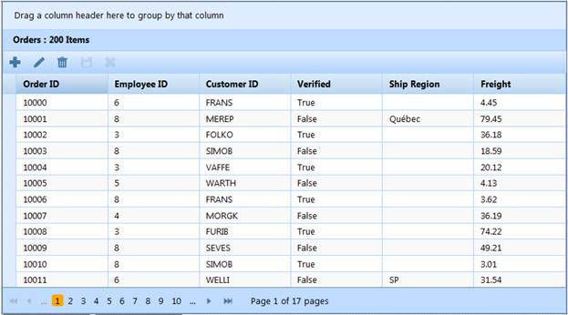
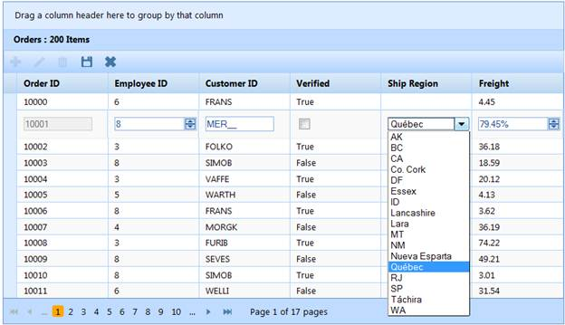
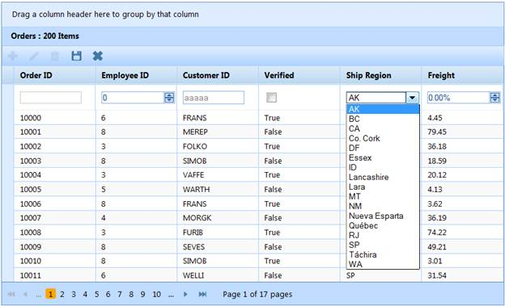

::: {style="DISPLAY: none"}
{#d2h_url_template}{#d2h_package_url style="WIDTH: 0px; DISPLAY: none; HEIGHT: 0px"}
:::

:::: {.d2h_secondary_topic style="PADDING-BOTTOM: 10pt; MARGIN: 0pt; PADDING-LEFT: 0pt; PADDING-RIGHT: 0pt; PADDING-TOP: 0pt"}
##### Through GridBuilder {#through-gridbuilder style="tab-stops: 0pt"}

 

The steps to configure the **CellEditType** features using **GridBuilder** are:

1.   Add the **MicrosoftMvcValidation.debug.js** file in the master page.

 

+-------------------------------------------------------------------------------------------------------------------------------------------------------------------------------------------------------------------------------------------------------------------------------------------------------------------------------------------------------------------------------------------------------------------------------------------------------------------------------------------------------------------------------+
| **[\[Site.Master\]]{style="FONT-FAMILY: 'Courier New'"}**                                                                                                                                                                                                                                                                                                                                                                                                                                                                     |
|                                                                                                                                                                                                                                                                                                                                                                                                                                                                                                                               |
| [\<]{style="FONT-FAMILY: 'Courier New'; COLOR: blue"}[head]{style="FONT-FAMILY: 'Courier New'; COLOR: maroon"}[ [runat]{style="COLOR: red"}[=\"server\"\>]{style="COLOR: blue"}]{style="FONT-FAMILY: 'Courier New'"}                                                                                                                                                                                                                                                                                                          |
|                                                                                                                                                                                                                                                                                                                                                                                                                                                                                                                               |
| [    [\<]{style="COLOR: blue"}[title]{style="COLOR: maroon"}[\>\<]{style="COLOR: blue"}[asp]{style="COLOR: maroon"}[:]{style="COLOR: blue"}[ContentPlaceHolder]{style="COLOR: maroon"} [ID]{style="COLOR: red"}[=\"TitleContent\"]{style="COLOR: blue"} [runat]{style="COLOR: red"}[=\"server\"]{style="COLOR: blue"} [/\>\</]{style="COLOR: blue"}[title]{style="COLOR: maroon"}[\>]{style="COLOR: blue"}]{style="FONT-FAMILY: 'Courier New'"}                                                                               |
|                                                                                                                                                                                                                                                                                                                                                                                                                                                                                                                               |
| [.........]{style="FONT-FAMILY: 'Courier New'; COLOR: blue"}[]{style="FONT-FAMILY: 'Courier New'"}                                                                                                                                                                                                                                                                                                                                                                                                                            |
|                                                                                                                                                                                                                                                                                                                                                                                                                                                                                                                               |
| [\<]{style="FONT-FAMILY: 'Courier New'; COLOR: blue"}[script]{style="FONT-FAMILY: 'Courier New'; COLOR: maroon"}[ [src]{style="COLOR: red"}[=\"]{style="COLOR: blue"}[\<%]{style="BACKGROUND: yellow"}[=]{style="COLOR: blue"} Url.Content(\"\~/Scripts/MicrosoftMvcValidation.debug.js\") [%\>]{style="BACKGROUND: yellow"}[\"]{style="COLOR: blue"} [type]{style="COLOR: red"}[=\"text/javascript\"\>\</]{style="COLOR: blue"}[script]{style="COLOR: maroon"}[\>]{style="COLOR: blue"}]{style="FONT-FAMILY: 'Courier New'"} |
|                                                                                                                                                                                                                                                                                                                                                                                                                                                                                                                               |
| [        [\</]{style="COLOR: blue"}[head]{style="COLOR: maroon"}[\>]{style="COLOR: blue"}]{style="FONT-FAMILY: 'Courier New'"}                                                                                                                                                                                                                                                                                                                                                                                                |
+-------------------------------------------------------------------------------------------------------------------------------------------------------------------------------------------------------------------------------------------------------------------------------------------------------------------------------------------------------------------------------------------------------------------------------------------------------------------------------------------------------------------------------+

 

+-------------------------------------------------------------------------------------------------------------------------------------------------------------------------------------------------------------------------------------------------------------------------------------------------------------------------------------------------------------------------------------------------------------------------------------------------------------------------------------------------------------------------------------------------------------------------------------------------------------------------------------------------------------------------------------------------------------------------------------------------------------------------+
| **[\[\_Layout.cshtml\]]{style="FONT-FAMILY: 'Courier New'"}**                                                                                                                                                                                                                                                                                                                                                                                                                                                                                                                                                                                                                                                                                                           |
|                                                                                                                                                                                                                                                                                                                                                                                                                                                                                                                                                                                                                                                                                                                                                                         |
| []{style="FONT-FAMILY: 'Courier New'; COLOR: blue"}                                                                                                                                                                                                                                                                                                                                                                                                                                                                                                                                                                                                                                                                                                                     |
|                                                                                                                                                                                                                                                                                                                                                                                                                                                                                                                                                                                                                                                                                                                                                                         |
| [\<]{style="FONT-FAMILY: 'Courier New'; COLOR: blue"}[head]{style="FONT-FAMILY: 'Courier New'; COLOR: maroon"}[ [runat]{style="COLOR: red"}[=\"server\"\>]{style="COLOR: blue"}]{style="FONT-FAMILY: 'Courier New'"}                                                                                                                                                                                                                                                                                                                                                                                                                                                                                                                                                    |
|                                                                                                                                                                                                                                                                                                                                                                                                                                                                                                                                                                                                                                                                                                                                                                         |
| [    [\<]{style="COLOR: blue"}[title]{style="COLOR: maroon"}[\>\<]{style="COLOR: blue"}[asp]{style="COLOR: maroon"}[:]{style="COLOR: blue"}[ContentPlaceHolder]{style="COLOR: maroon"} [ID]{style="COLOR: red"}[=\"TitleContent\"]{style="COLOR: blue"} [runat]{style="COLOR: red"}[=\"server\"]{style="COLOR: blue"} [/\>\</]{style="COLOR: blue"}[title]{style="COLOR: maroon"}[\>]{style="COLOR: blue"}]{style="FONT-FAMILY: 'Courier New'"}                                                                                                                                                                                                                                                                                                                         |
|                                                                                                                                                                                                                                                                                                                                                                                                                                                                                                                                                                                                                                                                                                                                                                         |
| [.........]{style="FONT-FAMILY: 'Courier New'; COLOR: blue"}[]{style="FONT-FAMILY: 'Courier New'"}                                                                                                                                                                                                                                                                                                                                                                                                                                                                                                                                                                                                                                                                      |
|                                                                                                                                                                                                                                                                                                                                                                                                                                                                                                                                                                                                                                                                                                                                                                         |
| []{style="FONT-FAMILY: 'Courier New'; COLOR: blue"}                                                                                                                                                                                                                                                                                                                                                                                                                                                                                                                                                                                                                                                                                                                     |
|                                                                                                                                                                                                                                                                                                                                                                                                                                                                                                                                                                                                                                                                                                                                                                         |
| [         \<]{style="FONT-FAMILY: Consolas; COLOR: blue; FONT-SIZE: 9.5pt"}[script]{style="FONT-FAMILY: Consolas; COLOR: maroon; FONT-SIZE: 9.5pt"}[ [src]{style="COLOR: red"}[=\"]{style="COLOR: blue"}[@]{style="BACKGROUND: yellow"}[Url.Content(]{style="COLOR: blue"}[\"\~/Scripts/]{style="COLOR: #c0504d"}]{style="FONT-FAMILY: Consolas; FONT-SIZE: 9.5pt"}[MicrosoftMvcValidation.debug.js \"]{style="FONT-FAMILY: 'Courier New'; COLOR: #c0504d"}[)\"]{style="FONT-FAMILY: Consolas; COLOR: blue; FONT-SIZE: 9.5pt"}[ [type]{style="COLOR: red"}[=\"text/javascript\"\>\</]{style="COLOR: blue"}[script]{style="COLOR: maroon"}[\>]{style="COLOR: blue"}]{style="FONT-FAMILY: Consolas; FONT-SIZE: 9.5pt"}[]{style="FONT-FAMILY: 'Courier New'; COLOR: blue"} |
|                                                                                                                                                                                                                                                                                                                                                                                                                                                                                                                                                                                                                                                                                                                                                                         |
| []{style="FONT-FAMILY: 'Courier New'; COLOR: blue"}                                                                                                                                                                                                                                                                                                                                                                                                                                                                                                                                                                                                                                                                                                                     |
|                                                                                                                                                                                                                                                                                                                                                                                                                                                                                                                                                                                                                                                                                                                                                                         |
| [  \</]{style="FONT-FAMILY: 'Courier New'; COLOR: blue"}[head]{style="FONT-FAMILY: 'Courier New'; COLOR: maroon"}[\>]{style="FONT-FAMILY: 'Courier New'; COLOR: blue"}[]{style="FONT-FAMILY: 'Courier New'"}                                                                                                                                                                                                                                                                                                                                                                                                                                                                                                                                                            |
+-------------------------------------------------------------------------------------------------------------------------------------------------------------------------------------------------------------------------------------------------------------------------------------------------------------------------------------------------------------------------------------------------------------------------------------------------------------------------------------------------------------------------------------------------------------------------------------------------------------------------------------------------------------------------------------------------------------------------------------------------------------------------+

 

 

2.   Create a model in the application. Refer to  [Getting Started\>Adding a Model to the Application]{.UGHyperlink}[[ ]{style="COLOR: windowtext; TEXT-DECORATION: none; text-underline: none"}]{.UGHyperlink}and [Editing\>EditableOrder Class]{.UGHyperlink}.

3.   Create a strongly typed view. Refer to [How to\>Strongly Typed View]{.UGHyperlink}.

4.   In the view, use the **Model** property in the **Datasource()** to bind the data source.

5.   Enable editing by using the **Editing** method and configure the editing properties such as **AllowNew**, **AllowEdit**, and **AllowDelete**.

6.   Essenital Grid allows adding new records through grid toolbar items. Refer to Concepts and Features\>Editing[[.]{style="COLOR: windowtext; TEXT-DECORATION: none; text-underline: none"}]{.UGHyperlink}

7.   Specify the primary property which uniquely identifies the grid record. Specify the **GridEditing** mode using the **EditMode()** method. Refer to Concepts and Features\>Editing[[.]{style="COLOR: windowtext; TEXT-DECORATION: none; text-underline: none"}]{.UGHyperlink}

 

+-------------------------------------------------------------------------------------------------------------------------------------------------------------------------------------------------------------------------------------------------------------------------------------------------------------------------------------------------------------+
| **[View \[ASPX\]]{style="FONT-FAMILY: 'Courier New'"}**                                                                                                                                                                                                                                                                                                     |
|                                                                                                                                                                                                                                                                                                                                                             |
| [\<%]{style="FONT-FAMILY: 'Courier New'; BACKGROUND: yellow"}[=]{style="FONT-FAMILY: 'Courier New'; COLOR: blue"}[Html.Syncfusion().Grid\<EditableOrder\>(\"Grid1\")]{style="FONT-FAMILY: 'Courier New'"}                                                                                                                                                   |
|                                                                                                                                                                                                                                                                                                                                                             |
| **[                         .Datasource(Model)]{style="FONT-FAMILY: 'Courier New'"}**                                                                                                                                                                                                                                                                       |
|                                                                                                                                                                                                                                                                                                                                                             |
| [                         .Caption(\"Orders\")]{style="FONT-FAMILY: 'Courier New'"}                                                                                                                                                                                                                                                                         |
|                                                                                                                                                                                                                                                                                                                                                             |
| [                         ]{style="FONT-FAMILY: 'Courier New'"}[.Column(column =\>]{style="FONT-FAMILY: 'Courier New'"}                                                                                                                                                                                                                                     |
|                                                                                                                                                                                                                                                                                                                                                             |
| [                               {]{style="FONT-FAMILY: 'Courier New'"}                                                                                                                                                                                                                                                                                      |
|                                                                                                                                                                                                                                                                                                                                                             |
| [                                   column.Add(p =\> p.OrderID).HeaderText([\"Order ID\"]{style="COLOR: #a31515"});]{style="FONT-FAMILY: 'Courier New'"}                                                                                                                                                                                                    |
|                                                                                                                                                                                                                                                                                                                                                             |
| [                             ]{style="FONT-FAMILY: 'Courier New'"}                                                                                                                                                                                                                                                                                         |
|                                                                                                                                                                                                                                                                                                                                                             |
| [                                   column.Add(p =\> p.EmployeeID).HeaderText([\"Employee ID**\"**]{style="COLOR: #a31515"}**).NumericEditParams(n=\>n.MinValue(0).MaxValue(9));**]{style="FONT-FAMILY: 'Courier New'"}                                                                                                                                     |
|                                                                                                                                                                                                                                                                                                                                                             |
| []{style="FONT-FAMILY: 'Courier New'"}                                                                                                                                                                                                                                                                                                                      |
|                                                                                                                                                                                                                                                                                                                                                             |
| [                                     column.Add(p =\> p.CustomerID).HeaderText([\"Customer ID**\"**]{style="COLOR: #a31515"}**).CellEditType([CellEditType]{style="COLOR: #2b91af"}.MaskEdit).MaskEditParams(m =\> m.Mask([\"aaaaa\"]{style="COLOR: #a31515"}).WaterMarkText([\"aaaaa\"]{style="COLOR: #a31515"}));**]{style="FONT-FAMILY: 'Courier New'"} |
|                                                                                                                                                                                                                                                                                                                                                             |
| []{style="FONT-FAMILY: 'Courier New'"}                                                                                                                                                                                                                                                                                                                      |
|                                                                                                                                                                                                                                                                                                                                                             |
| [                                   column.Add(p =\> p.Verified).HeaderText([\"Verified\"]{style="COLOR: #a31515"});]{style="FONT-FAMILY: 'Courier New'"}                                                                                                                                                                                                   |
|                                                                                                                                                                                                                                                                                                                                                             |
| [                                     column.Add(p =\> p.ShipRegion).HeaderText([\"Ship Region**\"**]{style="COLOR: #a31515"}**).CellEditType([CellEditType]{style="COLOR: #2b91af"}.DropdownEdit);    ** ]{style="FONT-FAMILY: 'Courier New'"}                                                                                                             |
|                                                                                                                                                                                                                                                                                                                                                             |
| **[]{style="FONT-FAMILY: 'Courier New'"}**                                                                                                                                                                                                                                                                                                                  |
|                                                                                                                                                                                                                                                                                                                                                             |
| [                                   column.Add(p =\> p.Freight).HeaderText([\"Freight**\"**]{style="COLOR: #a31515"}**).CellEditType([CellEditType]{style="COLOR: #2b91af"}.PercentEdit).PercentEditParams(p=\>p.MaxValue(100).MinValue(0));** ]{style="FONT-FAMILY: 'Courier New'"}                                                                        |
|                                                                                                                                                                                                                                                                                                                                                             |
| [                                  ]{style="FONT-FAMILY: 'Courier New'"}                                                                                                                                                                                                                                                                                    |
|                                                                                                                                                                                                                                                                                                                                                             |
| [                               })]{style="FONT-FAMILY: 'Courier New'"}[ ]{style="FONT-FAMILY: 'Courier New'"}                                                                                                                                                                                                                                              |
|                                                                                                                                                                                                                                                                                                                                                             |
| [                        .EnablePaging()]{style="FONT-FAMILY: 'Courier New'"}                                                                                                                                                                                                                                                                               |
|                                                                                                                                                                                                                                                                                                                                                             |
| [                        .EnableSorting()]{style="FONT-FAMILY: 'Courier New'"}                                                                                                                                                                                                                                                                              |
|                                                                                                                                                                                                                                                                                                                                                             |
| [                        .EnableGrouping()                      ]{style="FONT-FAMILY: 'Courier New'"}                                                                                                                                                                                                                                                       |
|                                                                                                                                                                                                                                                                                                                                                             |
| []{style="FONT-FAMILY: 'Courier New'"}                                                                                                                                                                                                                                                                                                                      |
|                                                                                                                                                                                                                                                                                                                                                             |
| [    [%\>]{style="BACKGROUND: yellow"}]{style="FONT-FAMILY: 'Courier New'"}                                                                                                                                                                                                                                                                                 |
+-------------------------------------------------------------------------------------------------------------------------------------------------------------------------------------------------------------------------------------------------------------------------------------------------------------------------------------------------------------+

[]{style="FONT-FAMILY: Consolas; BACKGROUND: yellow; FONT-SIZE: 8pt"} 

 

+-------------------------------------------------------------------------------------------------------------------------------------------------------------------------------------------------------------------------------------------------------------------------------------------------------------------------------------------------------------+
| **[View \[cshtml\]]{style="FONT-FAMILY: 'Courier New'"}**                                                                                                                                                                                                                                                                                                   |
|                                                                                                                                                                                                                                                                                                                                                             |
| [\@{]{style="FONT-FAMILY: 'Courier New'; BACKGROUND: yellow"}[ ]{style="FONT-FAMILY: 'Courier New'; COLOR: blue"}[Html.Syncfusion().Grid\<EditableOrder\>(\"Grid1\")]{style="FONT-FAMILY: 'Courier New'"}                                                                                                                                                   |
|                                                                                                                                                                                                                                                                                                                                                             |
| **[                         .Datasource(Model)]{style="FONT-FAMILY: 'Courier New'"}**                                                                                                                                                                                                                                                                       |
|                                                                                                                                                                                                                                                                                                                                                             |
| [                         .Caption(\"Orders\")]{style="FONT-FAMILY: 'Courier New'"}                                                                                                                                                                                                                                                                         |
|                                                                                                                                                                                                                                                                                                                                                             |
| [                         ]{style="FONT-FAMILY: 'Courier New'"}[.Column(column =\>]{style="FONT-FAMILY: 'Courier New'"}                                                                                                                                                                                                                                     |
|                                                                                                                                                                                                                                                                                                                                                             |
| [                               {]{style="FONT-FAMILY: 'Courier New'"}                                                                                                                                                                                                                                                                                      |
|                                                                                                                                                                                                                                                                                                                                                             |
| [                                   column.Add(p =\> p.OrderID).HeaderText([\"Order ID\"]{style="COLOR: #a31515"});]{style="FONT-FAMILY: 'Courier New'"}                                                                                                                                                                                                    |
|                                                                                                                                                                                                                                                                                                                                                             |
| [                             ]{style="FONT-FAMILY: 'Courier New'"}                                                                                                                                                                                                                                                                                         |
|                                                                                                                                                                                                                                                                                                                                                             |
| [                                   column.Add(p =\> p.EmployeeID).HeaderText([\"Employee ID**\"**]{style="COLOR: #a31515"}**).NumericEditParams(n=\>n.MinValue(0).MaxValue(9));**]{style="FONT-FAMILY: 'Courier New'"}                                                                                                                                     |
|                                                                                                                                                                                                                                                                                                                                                             |
| []{style="FONT-FAMILY: 'Courier New'"}                                                                                                                                                                                                                                                                                                                      |
|                                                                                                                                                                                                                                                                                                                                                             |
| [                                     column.Add(p =\> p.CustomerID).HeaderText([\"Customer ID**\"**]{style="COLOR: #a31515"}**).CellEditType([CellEditType]{style="COLOR: #2b91af"}.MaskEdit).MaskEditParams(m =\> m.Mask([\"aaaaa\"]{style="COLOR: #a31515"}).WaterMarkText([\"aaaaa\"]{style="COLOR: #a31515"}));**]{style="FONT-FAMILY: 'Courier New'"} |
|                                                                                                                                                                                                                                                                                                                                                             |
| []{style="FONT-FAMILY: 'Courier New'"}                                                                                                                                                                                                                                                                                                                      |
|                                                                                                                                                                                                                                                                                                                                                             |
| [                                   column.Add(p =\> p.Verified).HeaderText([\"Verified\"]{style="COLOR: #a31515"});]{style="FONT-FAMILY: 'Courier New'"}                                                                                                                                                                                                   |
|                                                                                                                                                                                                                                                                                                                                                             |
| [                                     column.Add(p =\> p.ShipRegion).HeaderText([\"Ship Region**\"**]{style="COLOR: #a31515"}**).CellEditType([CellEditType]{style="COLOR: #2b91af"}.DropdownEdit);    ** ]{style="FONT-FAMILY: 'Courier New'"}                                                                                                             |
|                                                                                                                                                                                                                                                                                                                                                             |
| **[]{style="FONT-FAMILY: 'Courier New'"}**                                                                                                                                                                                                                                                                                                                  |
|                                                                                                                                                                                                                                                                                                                                                             |
| [                                   column.Add(p =\> p.Freight).HeaderText([\"Freight**\"**]{style="COLOR: #a31515"}**).CellEditType([CellEditType]{style="COLOR: #2b91af"}.PercentEdit).PercentEditParams(p=\>p.MaxValue(100).MinValue(0));** ]{style="FONT-FAMILY: 'Courier New'"}                                                                        |
|                                                                                                                                                                                                                                                                                                                                                             |
| [                                  ]{style="FONT-FAMILY: 'Courier New'"}                                                                                                                                                                                                                                                                                    |
|                                                                                                                                                                                                                                                                                                                                                             |
| [                               })]{style="FONT-FAMILY: 'Courier New'"}[ ]{style="FONT-FAMILY: 'Courier New'"}                                                                                                                                                                                                                                              |
|                                                                                                                                                                                                                                                                                                                                                             |
| [                        .EnablePaging()]{style="FONT-FAMILY: 'Courier New'"}                                                                                                                                                                                                                                                                               |
|                                                                                                                                                                                                                                                                                                                                                             |
| [                        .EnableSorting()]{style="FONT-FAMILY: 'Courier New'"}                                                                                                                                                                                                                                                                              |
|                                                                                                                                                                                                                                                                                                                                                             |
| [                        .EnableGrouping()                      ]{style="FONT-FAMILY: 'Courier New'"}                                                                                                                                                                                                                                                       |
|                                                                                                                                                                                                                                                                                                                                                             |
| [                        .Render();]{style="FONT-FAMILY: 'Courier New'"}                                                                                                                                                                                                                                                                                    |
|                                                                                                                                                                                                                                                                                                                                                             |
| [    [}]{style="BACKGROUND: yellow"}]{style="FONT-FAMILY: 'Courier New'"}                                                                                                                                                                                                                                                                                   |
+-------------------------------------------------------------------------------------------------------------------------------------------------------------------------------------------------------------------------------------------------------------------------------------------------------------------------------------------------------------+

[]{style="FONT-FAMILY: Consolas; BACKGROUND: yellow; FONT-SIZE: 8pt"} 

8.   In the controller, create a method to add new records to the grid as shown in the following code. In this example, the repository method **Add()** is being created to insert records in the database. Refer to the repository action method given below.

[]{style="FONT-FAMILY: 'Calibri','sans-serif'"} 

+--------------------------------------------------------------------------------------------------------------------------------------------------------------------------------------+
| **[Controller]{style="FONT-FAMILY: 'Courier New'"}[]{style="FONT-FAMILY: 'Courier New'"}**                                                                                           |
|                                                                                                                                                                                      |
| [        \[[AcceptVerbs]{style="COLOR: #2b91af"}([HttpVerbs]{style="COLOR: #2b91af"}.Post)\]]{style="FONT-FAMILY: 'Courier New'"}                                                    |
|                                                                                                                                                                                      |
| [        [public]{style="COLOR: blue"} [ActionResult]{style="COLOR: #2b91af"} AddOrder([EditableOrder]{style="COLOR: #2b91af"} ord)]{style="FONT-FAMILY: 'Courier New'"}             |
|                                                                                                                                                                                      |
| [        {]{style="FONT-FAMILY: 'Courier New'"}                                                                                                                                      |
|                                                                                                                                                                                      |
| [         //Repository action method Add used for perform inserting records into datasource]{style="FONT-FAMILY: 'Courier New'; COLOR: green"}[]{style="FONT-FAMILY: 'Courier New'"} |
|                                                                                                                                                                                      |
| [            [OrderRepository]{style="COLOR: #2b91af"}.Add(ord);]{style="FONT-FAMILY: 'Courier New'"}                                                                                |
|                                                                                                                                                                                      |
| []{style="FONT-FAMILY: 'Courier New'"}                                                                                                                                               |
|                                                                                                                                                                                      |
| [            [//After adding the record into database refresh the Grid]{style="COLOR: green"}]{style="FONT-FAMILY: 'Courier New'"}                                                   |
|                                                                                                                                                                                      |
| [            [var]{style="COLOR: blue"} data = [OrderRepository]{style="COLOR: #2b91af"}.GetAllRecords();]{style="FONT-FAMILY: 'Courier New'"}                                       |
|                                                                                                                                                                                      |
| [            [return]{style="COLOR: blue"} data.GridActions\<[EditableOrder]{style="COLOR: #2b91af"}\>();]{style="FONT-FAMILY: 'Courier New'"}                                       |
|                                                                                                                                                                                      |
| [        }]{style="FONT-FAMILY: 'Courier New'"}                                                                                                                                      |
+--------------------------------------------------------------------------------------------------------------------------------------------------------------------------------------+

[]{style="FONT-FAMILY: 'Calibri','sans-serif'"} 

***[]{style="LAYOUT-GRID-MODE: line; FONT-SIZE: 9pt"}*** 

::: {style="BORDER-BOTTOM: windowtext 1pt solid; BORDER-LEFT: medium none; PADDING-BOTTOM: 1pt; MARGIN-TOP: 9pt; PADDING-LEFT: 0pt; PADDING-RIGHT: 0pt; MARGIN-BOTTOM: 9pt; BORDER-TOP: windowtext 1pt solid; BORDER-RIGHT: medium none; PADDING-TOP: 1pt"}
{border="0"}Note: Refer to the repository action codes from [Editing\>OrderRepository Class]{.UGHyperlink}[[.]{style="COLOR: windowtext; TEXT-DECORATION: none; text-underline: none"}]{.UGHyperlink}
:::

[]{style="FONT-FAMILY: 'Calibri','sans-serif'; COLOR: black"} 

9.   [In the]{.NumberedListChar} controller, create a method to save changes as shown in the following code sample. In this example, the repository method **Update()** is used to update records to the data source.

[]{style="FONT-FAMILY: 'Calibri','sans-serif'; COLOR: black"} 

+---------------------------------------------------------------------------------------------------------------------------------------------------------------------------+
| **[Controller]{style="FONT-FAMILY: 'Courier New'"}[]{style="FONT-FAMILY: 'Courier New'"}**                                                                                |
|                                                                                                                                                                           |
| [        \[[AcceptVerbs]{style="COLOR: #2b91af"}([HttpVerbs]{style="COLOR: #2b91af"}.Post)\]]{style="FONT-FAMILY: 'Courier New'"}                                         |
|                                                                                                                                                                           |
| [        [public]{style="COLOR: blue"} [ActionResult]{style="COLOR: #2b91af"} OrderSave([EditableOrder]{style="COLOR: #2b91af"} ord)]{style="FONT-FAMILY: 'Courier New'"} |
|                                                                                                                                                                           |
| [        {]{style="FONT-FAMILY: 'Courier New'"}                                                                                                                           |
|                                                                                                                                                                           |
| [            [//Repository action method Update used for perform update the records into datasource]{style="COLOR: green"}]{style="FONT-FAMILY: 'Courier New'"}           |
|                                                                                                                                                                           |
| [            [OrderRepository]{style="COLOR: #2b91af"}.Update(ord);]{style="FONT-FAMILY: 'Courier New'"}                                                                  |
|                                                                                                                                                                           |
| []{style="FONT-FAMILY: 'Courier New'"}                                                                                                                                    |
|                                                                                                                                                                           |
| [            [//After save the records into datasource refresh the Grid]{style="COLOR: green"}]{style="FONT-FAMILY: 'Courier New'"}                                       |
|                                                                                                                                                                           |
| [            [var]{style="COLOR: blue"} data = [OrderRepository]{style="COLOR: #2b91af"}.GetAllRecords();]{style="FONT-FAMILY: 'Courier New'"}                            |
|                                                                                                                                                                           |
| [            [return]{style="COLOR: blue"} data.GridActions\<[EditableOrder]{style="COLOR: #2b91af"}\>();]{style="FONT-FAMILY: 'Courier New'"}                            |
|                                                                                                                                                                           |
| [        }]{style="FONT-FAMILY: 'Courier New'"}                                                                                                                           |
|                                                                                                                                                                           |
|                                                                                                                                                                           |
+---------------------------------------------------------------------------------------------------------------------------------------------------------------------------+

[]{style="FONT-FAMILY: 'Calibri','sans-serif'; COLOR: black"} 

[]{style="FONT-FAMILY: Consolas; FONT-SIZE: 8pt"} 

10.  Run the application. The grid will appear as shown below.

[]{style="FONT-FAMILY: 'Calibri','sans-serif'"} 

{border="0"}

Figure 171: Grid with Toolbar Options for Editing, Inserting, and Deleting

 

The following screenshot shows default editor-type controls such as NumericTextBox for integer types (namely "Employee ID"), NumericTextbox for decimal types (namely "Freight"), and CheckBox for Boolean types (namely "Verified" column).

[]{style="FONT-FAMILY: 'Calibri','sans-serif'"} 

{border="0"}

Figure 172: Grid with Inline Row Editing

[]{style="COLOR: black"} 

{border="0"}

Figure 173: Grid with Inline Row Inserting

**[]{style="FONT-FAMILY: 'Myriad Pro','sans-serif'"}** 

[]{#related-topics}
::::
